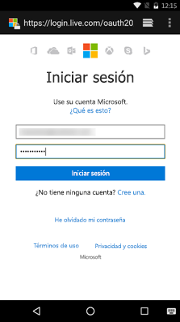

# <a name="get-started-with-microsoft-graph-in-an-android-app"></a><span data-ttu-id="70f87-101">Introducción a Microsoft Graph en una aplicación de Android</span><span class="sxs-lookup"><span data-stu-id="70f87-101">Get started with Microsoft Graph in an Android app</span></span>

> <span data-ttu-id="70f87-p101">**¿Desea compilar aplicaciones para clientes empresariales?** Es posible que la aplicación no funcione si su cliente empresarial activa características de seguridad de movilidad empresarial como el <a href="https://azure.microsoft.com/en-us/documentation/articles/active-directory-conditional-access-device-policies/" target="_newtab">acceso condicional al dispositivo</a>. En casos así, es posible que no tenga constancia de esta activación y que sus clientes obtengan errores.</span><span class="sxs-lookup"><span data-stu-id="70f87-p101">**Building apps for enterprise customers?** Your app may not work if your enterprise customer turns on enterprise mobility security features like <a href="https://azure.microsoft.com/en-us/documentation/articles/active-directory-conditional-access-device-policies/" target="_newtab">conditional device access</a>. In this case, you may not know and your customers may experience errors.</span></span> 

> <span data-ttu-id="70f87-p102">Para admitir **todos los clientes empresariales** en **todos los escenarios de empresa**, deberá usar el punto de conexión de Azure AD y administrar las aplicaciones mediante el [Portal de administración de Azure](https://aka.ms/aadapplist). Para obtener más información, consulte [Decidir entre los puntos de conexión de Azure AD y Azure AD v2.0 ](../concepts/auth_overview.md#deciding-between-the-azure-ad-and-azure-ad-v20-endpoints).</span><span class="sxs-lookup"><span data-stu-id="70f87-p102">To support **all enterprise customers** across **all enterprise scenarios**, you must use the Azure AD endpoint and manage your apps using the [Azure Management Portal](https://aka.ms/aadapplist). For more information, see [Deciding between the Azure AD and Azure AD v2.0 endpoints](../concepts/auth_overview.md#deciding-between-the-azure-ad-and-azure-ad-v20-endpoints).</span></span>

<span data-ttu-id="70f87-p103">En este artículo, se describen las tareas necesarias para obtener un token de acceso desde el punto de conexión v2.0 de Azure AD y llamar a Microsoft Graph. Le muestra los pasos para la creación del [Ejemplo Connect de Android](https://github.com/microsoftgraph/android-java-connect-sample) y explica los conceptos principales que implementará para usar Microsoft Graph en la aplicación de Android. En el artículo, también se describe cómo obtener acceso a Microsoft Graph usando el [SDK de Microsoft Graph para Android](https://github.com/microsoftgraph/msgraph-sdk-android) o llamadas de REST sin procesar.</span><span class="sxs-lookup"><span data-stu-id="70f87-p103">This article describes the tasks required to get an access token from the Azure AD v2.0 endpoint and call Microsoft Graph. It walks you through building the [Connect Sample for Android](https://github.com/microsoftgraph/android-java-connect-sample) and explains the main concepts that you implement to use Microsoft Graph in your app for Android. The article also describes how to access Microsoft Graph by using either the [Microsoft Graph SDK for Android](https://github.com/microsoftgraph/msgraph-sdk-android) or raw REST calls.</span></span>

<span data-ttu-id="70f87-110">Para utilizar Microsoft Graph en su aplicación para Android, debe mostrar la página de inicio de sesión de Microsoft a los usuarios, como se ve en la siguiente captura de pantalla.</span><span class="sxs-lookup"><span data-stu-id="70f87-110">To use Microsoft Graph in your app for Android, you need to show the Microsoft sign in page to your users, as shown in the following screenshot.</span></span>



<span data-ttu-id="70f87-p104">**¿No desea compilar una aplicación?** Puede ponerse a trabajar rápidamente si descarga el [Ejemplo Connect de Android](https://github.com/microsoftgraph/android-java-connect-sample) en el que se basa este artículo.</span><span class="sxs-lookup"><span data-stu-id="70f87-p104">**Don't feel like building an app?** Get up and running fast by downloading the [Connect Sample for Android](https://github.com/microsoftgraph/android-java-connect-sample) that this article is based on.</span></span>


## <a name="prerequisites"></a><span data-ttu-id="70f87-114">Requisitos previos</span><span class="sxs-lookup"><span data-stu-id="70f87-114">Prerequisites</span></span>

<span data-ttu-id="70f87-115">Para comenzar, necesitará:</span><span class="sxs-lookup"><span data-stu-id="70f87-115">To get started, you'll need:</span></span> 

- <span data-ttu-id="70f87-116">Una [cuenta Microsoft](https://www.outlook.com/) o una [cuenta profesional o educativa](http://dev.office.com/devprogram)</span><span class="sxs-lookup"><span data-stu-id="70f87-116">A [Microsoft account](https://www.outlook.com/) or a [work or school account](http://dev.office.com/devprogram)</span></span>
- <span data-ttu-id="70f87-117">Android Studio 2.0 o una versión más reciente</span><span class="sxs-lookup"><span data-stu-id="70f87-117">Android Studio 2.0 or newer version</span></span>


## <a name="configure-a-new-project"></a><span data-ttu-id="70f87-118">Configurar un proyecto nuevo</span><span class="sxs-lookup"><span data-stu-id="70f87-118">Configure a new project</span></span>

<span data-ttu-id="70f87-119">Si descargó el [Ejemplo de conexión para Android](https://github.com/microsoftgraph/android-java-connect-sample), omita este paso.</span><span class="sxs-lookup"><span data-stu-id="70f87-119">If you have downloaded the [Connect Sample for Android](https://github.com/microsoftgraph/android-java-connect-sample), skip this step.</span></span> 

<span data-ttu-id="70f87-p105">Inicie un nuevo proyecto en Android Studio. Puede dejar los valores predeterminados para la mayoría del proceso del asistente, pero asegúrese de elegir las siguientes opciones:</span><span class="sxs-lookup"><span data-stu-id="70f87-p105">Start a new project in Android Studio. You can leave the default values for most of the wizard, just make sure to choose the following options:</span></span>

* <span data-ttu-id="70f87-122">Dispositivos Android de destino: **teléfonos y tabletas**</span><span class="sxs-lookup"><span data-stu-id="70f87-122">Target Android Devices - **Phone and Tablet**</span></span>
    * <span data-ttu-id="70f87-123">Minimum SDK - **API 16: Android 4.1 (Jelly Bean)** (SDK mínimo: API 16: Android 4.1 (Jelly Bean))</span><span class="sxs-lookup"><span data-stu-id="70f87-123">Minimum SDK - **API 16: Android 4.1 (Jelly Bean)**</span></span>
* <span data-ttu-id="70f87-124">Add an Activity to Mobile - **Basic Activity** (Agregar una actividad al dispositivo móvil: actividad básica)</span><span class="sxs-lookup"><span data-stu-id="70f87-124">Add an Activity to Mobile - **Basic Activity**</span></span>
 
<span data-ttu-id="70f87-125">Esto le proporciona un proyecto de Android con una actividad y un botón que puede usar para autenticar al usuario.</span><span class="sxs-lookup"><span data-stu-id="70f87-125">This provides you with an Android project with an activity and a button that you can use to authenticate the user.</span></span>


## <a name="register-the-application"></a><span data-ttu-id="70f87-126">Registrar la aplicación</span><span class="sxs-lookup"><span data-stu-id="70f87-126">Register the application</span></span>

<span data-ttu-id="70f87-127">Necesita registrar la aplicación en el [Portal de registro de aplicaciones de Microsoft](https://apps.dev.microsoft.com/), independientemente de si descargó el ejemplo de conexión o si creó un proyecto nuevo.</span><span class="sxs-lookup"><span data-stu-id="70f87-127">You need to register your app on the [Microsoft App Registration Portal](https://apps.dev.microsoft.com/) whether you've downloaded the connect sample or created a new project.</span></span>

<span data-ttu-id="70f87-p106">Registre una aplicación en el portal de registro de aplicaciones de Microsoft. Este proceso generará el id. de aplicación y la contraseña que usará para configurar la aplicación.</span><span class="sxs-lookup"><span data-stu-id="70f87-p106">Register an app on the Microsoft App Registration Portal. This generates the app ID that you'll use to configure the app.</span></span>

1. <span data-ttu-id="70f87-130">Inicie sesión en el [Portal de registro de aplicaciones de Microsoft](https://apps.dev.microsoft.com/) mediante su cuenta personal, profesional o educativa.</span><span class="sxs-lookup"><span data-stu-id="70f87-130">Sign into the [Microsoft App Registration Portal](https://apps.dev.microsoft.com/) using either your personal or work or school account.</span></span>

2. <span data-ttu-id="70f87-131">Seleccione **Agregar una aplicación**.</span><span class="sxs-lookup"><span data-stu-id="70f87-131">Choose **Add an app**.</span></span>

><span data-ttu-id="70f87-132">Sugerencia: Si descargó el [Ejemplo de conexión para Android](https://github.com/microsoftgraph/android-java-connect-sample) y simplemente está creando un registro para este, desactive la casilla **Configuración guiada** antes de hacer clic en el botón **Crear**.</span><span class="sxs-lookup"><span data-stu-id="70f87-132">Tip: If you have downloaded the [Connect Sample for Android](https://github.com/microsoftgraph/android-java-connect-sample) and are just creating a registration for it, uncheck **Guided Setup** before chosing the **Create** button.</span></span>

3. <span data-ttu-id="70f87-133">Escriba un nombre para la aplicación y seleccione **Crear**.</span><span class="sxs-lookup"><span data-stu-id="70f87-133">Enter a name for the app, and choose **Create**.</span></span> 
    
    <span data-ttu-id="70f87-134">Para el flujo de **Configuración guiada**:</span><span class="sxs-lookup"><span data-stu-id="70f87-134">For the  **Guided Setup** flow:</span></span>
 
    <span data-ttu-id="70f87-p107">a. Seleccione la opción **Aplicación de escritorio y móvil** para definir el tipo de aplicación que quiera crear.</span><span class="sxs-lookup"><span data-stu-id="70f87-p107">a. Choose **Mobile and Desktop App** to define the kind of app you are creating.</span></span>

    <span data-ttu-id="70f87-p108">b. Seleccione **Android** para definir la tecnología móvil que usa.</span><span class="sxs-lookup"><span data-stu-id="70f87-p108">b. Choose **Android** to define the mobile technology you are using.</span></span>

    <span data-ttu-id="70f87-p109">c. Revise el tema de introducción y, cuando termine, haga clic en el botón **Configuración** al final de la página.</span><span class="sxs-lookup"><span data-stu-id="70f87-p109">c. Review the introductory topic and when finished, click the **Setup** button at the end of the page.</span></span>

    <span data-ttu-id="70f87-p110">d. Siga las instrucciones en el paso **Configuración** para agregar la biblioteca de MSAL al build.gradle de la aplicación.</span><span class="sxs-lookup"><span data-stu-id="70f87-p110">d. Follow the instructions on the **Setup** step to add the MSAL library to your app build.gradle.</span></span>

    <span data-ttu-id="70f87-p111">e. Siga las indicaciones en el paso **Uso** para agregar la lógica de MSAL al nuevo proyecto.</span><span class="sxs-lookup"><span data-stu-id="70f87-p111">e. Follow the directions on the **Use** step to add MSAL logic to your new project</span></span>

    <span data-ttu-id="70f87-p112">f. En la página **Configurar**, el portal creó automáticamente un id. de aplicación único. Úselo para configurar la aplicación.</span><span class="sxs-lookup"><span data-stu-id="70f87-p112">f. On the **Configure** page, the portal has created a unique application ID for you. Use it to configure your app.</span></span>

    <span data-ttu-id="70f87-148">Para el flujo no guiado:</span><span class="sxs-lookup"><span data-stu-id="70f87-148">For the unguided flow:</span></span>

    <span data-ttu-id="70f87-149">Se muestra la página de registro, indicando las propiedades de la aplicación.</span><span class="sxs-lookup"><span data-stu-id="70f87-149">The registration page displays, listing the properties of your app.</span></span>

    <span data-ttu-id="70f87-p113">a. Copie el id. de aplicación. Es el identificador único de la aplicación.</span><span class="sxs-lookup"><span data-stu-id="70f87-p113">a. Copy the application ID. This is the unique identifier for your app.</span></span> 

    <span data-ttu-id="70f87-p114">b. Seleccione **Agregar plataforma** y **Aplicación nativa**.</span><span class="sxs-lookup"><span data-stu-id="70f87-p114">b. Choose **Add Platform** and **Native Application**.</span></span>

    > <span data-ttu-id="70f87-p115">**Nota**: El Portal de registro de aplicaciones proporciona un URI de redireccionamiento con el valor *msal<SU NUEVO ID. DE APLICACIÓN>://auth*. No use los URI de redireccionamiento integrados. El [Ejemplo de conexión para Android](https://github.com/microsoftgraph/android-java-connect-sample) implementa la biblioteca de autenticación de MSAL, que necesita el URI de redireccionamiento. Si usa una [biblioteca de terceros compatible](https://docs.microsoft.com/en-us/azure/active-directory/develop/active-directory-v2-libraries#compatible-client-libraries) o la biblioteca de **ADAL**, necesita usar los URI de redireccionamiento integrados.</span><span class="sxs-lookup"><span data-stu-id="70f87-p115">**Note:** The Application Registration Portal provides a Redirect URI with a value of *msalYOUR NEW APP ID://auth*. Do not use the built-in redirect URIs. The [Connect Sample for Android](https://github.com/microsoftgraph/android-java-connect-sample) implements the MSAL authentication library which requires this redirect URI. If using a [supported third party library](https://docs.microsoft.com/en-us/azure/active-directory/develop/active-directory-v2-libraries#compatible-client-libraries) or the **ADAL** library then you must use the built-in redirect URIs.</span></span>

    <span data-ttu-id="70f87-158">Para un flujo de configuración guiada y un flujo no guiado</span><span class="sxs-lookup"><span data-stu-id="70f87-158">For Guided Setup flow and unguided flow</span></span>

    <span data-ttu-id="70f87-p116">a. Agregue los permisos delegados. Necesitará **profile**, **Mail.ReadWrite**, **Mail.Send**, **Files.ReadWrite** y **User.ReadBasic.All**.</span><span class="sxs-lookup"><span data-stu-id="70f87-p116">a. Add delegated permissions. You'll need **profile**, **Mail.ReadWrite**, **Mail.Send**, **Files.ReadWrite**, and **User.ReadBasic.All**.</span></span> 
   
    <span data-ttu-id="70f87-p117">b. Seleccione **Guardar**.</span><span class="sxs-lookup"><span data-stu-id="70f87-p117">b. Choose **Save**.</span></span>


## <a name="authenticate-the-user-and-get-an-access-token"></a><span data-ttu-id="70f87-164">Autenticar al usuario y obtener un token de acceso</span><span class="sxs-lookup"><span data-stu-id="70f87-164">Authenticate the user and get an access token</span></span>

> <span data-ttu-id="70f87-p118">**Nota**: Si siguió las instrucciones en el flujo de **Configuración guiada** desde el portal de registro de aplicaciones para crear una aplicación, puede omitir estos pasos. Para obtener más información sobre la API de Graph, vea [Llamar a Microsoft Graph con el SDK de Microsoft Graph](#call-microsoft-graph-using-the-microsoft-graph-sdk).</span><span class="sxs-lookup"><span data-stu-id="70f87-p118">**Note:** If you followed the instructions in the **Guided Setup** flow from the application registration portal to create a new application, you can skip these steps. Go to [Call Microsoft Graph using the Microsoft Graph SDK](#call-microsoft-graph-using-the-microsoft-graph-sdk) to learn more about the Graph API.</span></span>

<span data-ttu-id="70f87-167">Veamos los pasos del [Ejemplo de conexión para Android](https://github.com/microsoftgraph/android-java-connect-sample) para obtener más información sobre MSAL y el código de Microsoft Graph que agregamos.</span><span class="sxs-lookup"><span data-stu-id="70f87-167">Let's walk through the [Connect Sample for Android](https://github.com/microsoftgraph/android-java-connect-sample) to learn about the MSAL and Microsoft Graph code we've added.</span></span>

### <a name="add-the-dependency-to-appbuildgradle"></a><span data-ttu-id="70f87-168">Agregar la dependencia a app/build.gradle</span><span class="sxs-lookup"><span data-stu-id="70f87-168">Add the dependency to app/build.gradle</span></span>

<span data-ttu-id="70f87-169">Abra el archivo `build.gradle` en el módulo de la aplicación e incluya la dependencia siguiente:</span><span class="sxs-lookup"><span data-stu-id="70f87-169">Open the `build.gradle` file in the app module and find the following dependency:</span></span>

```gradle
    compile ('com.microsoft.identity.client:msal:0.1.+') {
        exclude group: 'com.android.support', module: 'appcompat-v7'
    }
    compile 'com.android.volley:volley:1.0.0'

```

### <a name="start-the-authentication-flow"></a><span data-ttu-id="70f87-170">Iniciar el flujo de autenticación</span><span class="sxs-lookup"><span data-stu-id="70f87-170">Start the authentication flow</span></span>

1. <span data-ttu-id="70f87-171">Abra el archivo **AuthenticationManager**, busque la declaración de objeto **PublicClientApplication** y, después, agregue la instancia del método **getInstance**.</span><span class="sxs-lookup"><span data-stu-id="70f87-171">Open the **AuthenticationManager** file and find the **PublicClientApplication** object declaration and then the instation in the **getInstance** method.</span></span>

   ```java
    private static PublicClientApplication mPublicClientApplication;
    ....

    public static synchronized AuthenticationManager getInstance() {
        if (INSTANCE == null) {
            INSTANCE = new AuthenticationManager();
            if (mPublicClientApplication == null) {
                mPublicClientApplication = new PublicClientApplication(Connect.getInstance());
            }
        }
        return INSTANCE;
    }

   ```


2. <span data-ttu-id="70f87-p119">En la clase**ConnectActivity**, busque el controlador de eventos del evento de clic de **mConnectButton**. Busque el método **onClick** y revise el código relevante.</span><span class="sxs-lookup"><span data-stu-id="70f87-p119">In the **ConnectActivity** class, locate the event handler for the click event of the **mConnectButton**. Find the **onClick** method and review relevant code.</span></span>
  
    <span data-ttu-id="70f87-p120">El método **connect** permite registrar información de identificación personal (DCP), obtiene una instancia de la clase auxiliar de ejemplo **AuthenticationManager** y obtiene la colección de usuarios de objeto de la plataforma de MSAL. Si no hay usuarios, el nuevo usuario será dirigido al flujo de autenticación y autorización de Azure AD. De lo contrario, se obtendrá un token de autenticación en modo silencioso.</span><span class="sxs-lookup"><span data-stu-id="70f87-p120">The **connect** method enables personally identifyable information (PII) logging, gets an instance of the sample helper class **AuthenticationManager**, and gets the MSAL platform object users collection. If there are no users, the new user is taken to the Azure AD authentication and authorization flow. Otherwise, an authentication token is obtained silently.</span></span>

   ```java
    @Override
    public void onClick(View view) {
        ....
        connect();
    }

        private void connect() {

        if (mEnablePiiLogging) {
            Logger.getInstance().setEnablePII(true);
        } else {
            Logger.getInstance().setEnablePII(false);
        }

        AuthenticationManager mgr = AuthenticationManager.getInstance();

        List<User> users = null;

        try {
            users = mgr.getPublicClient().getUsers();

            if (users != null && users.size() == 1) {
                mUser = users.get(0);
                mgr.callAcquireTokenSilent(mUser, true, this);
            } else {
                mgr.callAcquireToken(
                        this,
                        this);
            }
        } catch (MsalClientException e) {
            Log.d(TAG, "MSAL Exception Generated while getting users: " + e.toString());

        } catch (IndexOutOfBoundsException e) {
            Log.d(TAG, "User at this position does not exist: " + e.toString());
        }
    }

   ```
3. <span data-ttu-id="70f87-p121">Busque el controlador de eventos que procesa la respuesta de redireccionamiento generada por Azure AD cuando el usuario cierra el cuadro de diálogo de autenticación. Este controlador está en la clase **ConnectActivity**.</span><span class="sxs-lookup"><span data-stu-id="70f87-p121">Find the event handler that processes the Azure AD redirect response generated by Azure AD when the user closes the authintication dialog. This handler is in the **ConnectActivity** class.</span></span>

   ```java
       /**
     * Handles redirect response from https://login.microsoftonline.com/common and
     * notifies the MSAL library that the user has completed the authentication
     * dialog
     * @param requestCode
     * @param resultCode
     * @param data
     */
    @Override
    protected void onActivityResult(int requestCode, int resultCode, Intent data) {
        super.onActivityResult(requestCode, resultCode, data);
        if (AuthenticationManager
                .getInstance()
                .getPublicClient() != null) {
            AuthenticationManager
                    .getInstance()
                    .getPublicClient()
                    .handleInteractiveRequestRedirect(requestCode, resultCode, data);
        }
    }

   ```    
3. <span data-ttu-id="70f87-179">Busque el método de devolución de llamada de autenticación que almacena en la memoria caché el token de autenticación usado en las llamadas API de Graph.</span><span class="sxs-lookup"><span data-stu-id="70f87-179">Find the authentication callback method that caches the authentication token that is used in Graph API calls.</span></span>

 

```java
    /* Callback used for interactive request.  If succeeds we use the access
         * token to call the Microsoft Graph. Does not check cache
         */
    private AuthenticationCallback getAuthInteractiveCallback() {
        return new AuthenticationCallback() {
            @Override
            public void onSuccess(AuthenticationResult authenticationResult) {
            /* Successfully got a token, call graph now */
                Log.d(TAG, "Successfully authenticated");
                Log.d(TAG, "ID Token: " + authenticationResult.getIdToken());

            /* Store the auth result */
                mAuthResult = authenticationResult;
                if (mActivityCallback != null)
                    mActivityCallback.onSuccess(mAuthResult);
            }

            @Override
            public void onError(MsalException exception) {
            /* Failed to acquireToken */
                Log.d(TAG, "Authentication failed: " + exception.toString());
                if (mActivityCallback != null)
                    mActivityCallback.onError(exception);
            }

            @Override
            public void onCancel() {
            /* User canceled the authentication */
                Log.d(TAG, "User cancelled login.");
            }
        };
    }

```
    
<span data-ttu-id="70f87-p122">La aplicación de ejemplo de conexión tiene el botón **Conectar** en la actividad principal. Si pulsa el botón en el primer uso, la aplicación mostrará una página de autenticación en el explorador del dispositivo. El paso siguiente es controlar el código que envía el servidor de autorización al URI de redireccionamiento y cambiarlo por un token de acceso.</span><span class="sxs-lookup"><span data-stu-id="70f87-p122">The connect sample app has a **Connect** button on the main activity. If you press the button, on first use, the app presents an authentication page using the device's browser. The next step is to handle the code that the authorization server sends to the redirect URI and exchange it for an access token.</span></span>

### <a name="exchange-the-authorization-code-for-an-access-token"></a><span data-ttu-id="70f87-183">Cambiar el código de autorización por un token de acceso</span><span class="sxs-lookup"><span data-stu-id="70f87-183">Exchange the authorization code for an access token</span></span>

<span data-ttu-id="70f87-184">Es necesario que prepare la aplicación para controlar la respuesta del servidor de autorización, que contiene un código que se puede intercambiar por un token de acceso.</span><span class="sxs-lookup"><span data-stu-id="70f87-184">You need to make your app ready to handle the authorization server response, which contains a code that you can exchange for an access token.</span></span>

1. <span data-ttu-id="70f87-p123">Necesitamos indicarle al sistema Android que la aplicación de conexión admite solicitudes a la URL de redireccionamiento configurada en el registro de la aplicación. Para hacerlo, abra el archivo **AndroidManifest** y agregue los siguientes elementos secundarios al elemento **\<application/\>** del proyecto.</span><span class="sxs-lookup"><span data-stu-id="70f87-p123">We need to tell the Android system that Connect app can handle requests to the redirect URL configured in the application registration. To do this open the **AndroidManifest** file and add the following children to the projects  **\<application/\>** element.</span></span>
    ```xml
        <uses-sdk tools:overrideLibrary="com.microsoft.identity.msal" />
        <application ...>
            ...
            <activity
                android:name="com.microsoft.identity.client.BrowserTabActivity">
                <intent-filter>
                    <action android:name="android.intent.action.VIEW" />
                    <category android:name="android.intent.category.DEFAULT" />
                    <category android:name="android.intent.category.BROWSABLE" />
                    <data android:scheme="msalENTER_YOUR_CLIENT_ID"
                        android:host="auth" />
                </intent-filter>
            </activity>
            <meta-data
                android:name="https://login.microsoftonline.com/common"
                android:value="authority string"/>
            <meta-data
                android:name="com.microsoft.identity.client.ClientId"
                android:value="ENTER_YOUR_CLIENT_ID"/>
        </application>
    ```
2. <span data-ttu-id="70f87-p124">La biblioteca de **MSAL** necesita obtener acceso al id. de aplicación asignado por el portal de registro. **La biblioteca de MSAL hace referencia al id. de aplicación como “id. de cliente”**. Obtiene el id. de aplicación (id. de cliente) del contexto de la aplicación que pase en el constructor de la biblioteca.</span><span class="sxs-lookup"><span data-stu-id="70f87-p124">The **MSAL** library needs access to the application Id assigned by the registration portal. **The MSAL library refers to the application Id as the "Client Id"**. It gets the application Id (Client Id) from the application context that you pass in the library constructor.</span></span> 

   ><span data-ttu-id="70f87-190">Nota: También puede proporcionar el id. de cliente en el tiempo de ejecución si pasa un parámetro de cadena al constructor.</span><span class="sxs-lookup"><span data-stu-id="70f87-190">Note: You can also provide the client Id at run-time by passing a string parameter to the constructor.</span></span> 

3. <span data-ttu-id="70f87-p125">La actividad se invoca cuando el servidor de autorización envía una respuesta. Puede solicitar un token de acceso con la respuesta del servidor de autorización. Vaya al **AuthenticationManager** y busque el código siguiente en la clase.</span><span class="sxs-lookup"><span data-stu-id="70f87-p125">The activity is invoked when the authorization server sends a response. Request an access token with the response from the authorization server. Go to your **AuthenticationManager** and find the following code in the class.</span></span>

   ```java
    /**
     * Authenticates the user and lets the user authorize the app for the requested permissions.
     * An authentication token is returned via the getAuthInteractiveCalback method
     * @param activity
     * @param authenticationCallback
     */
    public void connect(Activity activity, final MSALAuthenticationCallback authenticationCallback){
        mActivityCallback = authenticationCallback;
        mPublicClientApplication.acquireToken(
                activity, Constants.SCOPES, getAuthInteractiveCallback());
    }


     /* Callback used for interactive request.  If succeeds we use the access
         * token to call the Microsoft Graph. Does not check cache
         */
    private AuthenticationCallback getAuthInteractiveCallback() {
        return new AuthenticationCallback() {
            @Override
            public void onSuccess(AuthenticationResult authenticationResult) {
            /* Successfully got a token, call graph now */
                Log.d(TAG, "Successfully authenticated");
                Log.d(TAG, "ID Token: " + authenticationResult.getIdToken());

            /* Store the auth result */
                mAuthResult = authenticationResult;
                if (mActivityCallback != null)
                    mActivityCallback.onSuccess(mAuthResult);
            }

            @Override
            public void onError(MsalException exception) {
            /* Failed to acquireToken */
                Log.d(TAG, "Authentication failed: " + exception.toString());
                if (mActivityCallback != null)
                    mActivityCallback.onError(exception);
            }

            @Override
            public void onCancel() {
            /* User canceled the authentication */
                Log.d(TAG, "User cancelled login.");
            }
        };
    }

     /**
     * Returns the access token obtained in authentication
     *
     * @return mAccessToken
     */
    public String getAccessToken() throws AuthenticatorException, IOException, OperationCanceledException {
        return  mAuthResult.getAccessToken();
    }

   ```


## <a name="call-microsoft-graph"></a><span data-ttu-id="70f87-194">Llamar a Microsoft Graph</span><span class="sxs-lookup"><span data-stu-id="70f87-194">Call Microsoft Graph</span></span>
<span data-ttu-id="70f87-195">Puede [utilizar el SDK de Microsoft Graph](#call-microsoft-graph-using-the-microsoft-graph-sdk) o la [API de REST de Microsoft Graph](#call-microsoft-graph-using-the-microsoft-graph-rest-api) para llamar a Microsoft Graph.</span><span class="sxs-lookup"><span data-stu-id="70f87-195">You can [use the Microsoft Graph SDK](#call-microsoft-graph-using-the-microsoft-graph-sdk) or the [Microsoft Graph REST API](#call-microsoft-graph-using-the-microsoft-graph-rest-api) to call Microsoft Graph.</span></span>

### <a name="call-microsoft-graph-using-the-microsoft-graph-sdk"></a><span data-ttu-id="70f87-196">Llame a Microsoft Graph mediante el SDK de Microsoft Graph</span><span class="sxs-lookup"><span data-stu-id="70f87-196">Call Microsoft Graph using the Microsoft Graph SDK</span></span>
<span data-ttu-id="70f87-p126">El [SDK de Microsoft Graph para Android](https://github.com/microsoftgraph/msgraph-sdk-android) proporciona clases que generan solicitudes y procesan los resultados de Microsoft Graph. Siga estos pasos para utilizar el SDK de Microsoft Graph.</span><span class="sxs-lookup"><span data-stu-id="70f87-p126">The [Microsoft Graph SDK for Android](https://github.com/microsoftgraph/msgraph-sdk-android) provides classes that build requests and process results from Microsoft Graph. Follow these steps to use the Microsoft Graph SDK.</span></span>

1. <span data-ttu-id="70f87-p127">Conceda permisos de Internet a la aplicación. Abra el archivo **AndroidManifest** y agregue el siguiente elemento secundario al elemento de manifiesto.</span><span class="sxs-lookup"><span data-stu-id="70f87-p127">Add Internet permissions to your app. Open the **AndroidManifest** file and add the following child to the manifest element.</span></span>
    ```xml
    <uses-permission android:name="android.permission.INTERNET" />
    <uses-permission android:name="android.permission.ACCESS_NETWORK_STATE" />
    <uses-permission android:name="android.permission.READ_EXTERNAL_STORAGE" />
    <uses-permission android:name="android.permission.WRITE_EXTERNAL_STORAGE" />

    ```

2. <span data-ttu-id="70f87-201">Agregue dependencias al SDK de Microsoft Graph y GSON.</span><span class="sxs-lookup"><span data-stu-id="70f87-201">Add dependencies to the Microsoft Graph SDK and GSON.</span></span>
   ```gradle
    compile 'com.microsoft.graph:msgraph-sdk-android:1.3.2'
    compile 'com.google.code.gson:gson:2.7'
   ```


3. <span data-ttu-id="70f87-p128">Agregue un token de autenticación a las nuevas solicitudes con el método auxiliar **AuthenticateRequest**. Este método implementa el mismo método de la interfaz **IAuthenticationProvider** de Microsoft Graph Authentication.</span><span class="sxs-lookup"><span data-stu-id="70f87-p128">Add authentication token to new requests using the **uthenticateRequest** helper method. This method implements the same method from the Microsoft Graph Authentication **IAuthenticationProvider** interface</span></span>
    
   ```java
    /**
     * Appends an access token obtained from the {@link AuthenticationManager} class to the
     * Authorization header of the request.
     * @param request
     */
    @Override
    public void authenticateRequest(IHttpRequest request)  {
        try {
            request.addHeader("Authorization", "Bearer "
                    + AuthenticationManager.getInstance()
                    .getAccessToken());
            // This header has been added to identify this sample in the Microsoft Graph service.
            // If you're using this code for your project please remove the following line.
            request.addHeader("SampleID", "android-java-connect-sample");
        } catch (AuthenticatorException e) {
            e.printStackTrace();
        } catch (IOException e) {
            e.printStackTrace();
        }  catch (OperationCanceledException e) {
            e.printStackTrace();
        } catch (NullPointerException e) {
            e.printStackTrace();
        }
    }
   ```

4. <span data-ttu-id="70f87-204">Cree un borrador de correo electrónico y envíelo con los siguientes métodos auxiliares desde la clase auxiliar **GraphServiceController**.</span><span class="sxs-lookup"><span data-stu-id="70f87-204">Create a draft email and send it using the following helper methods from the **GraphServiceController** helper class.</span></span>

   ```java
    /**
     * Creates a draft email message using the Microsoft Graph API on Office 365. The mail is sent
     * from the address of the signed in user.
     *
     * @param senderPreferredName The mail senders principal user name (email addr)
     * @param emailAddress        The recipient email address.
     * @param subject             The subject to use in the mail message.
     * @param body                The body of the message.
     * @param callback            The callback method to invoke on completion of the POST request
     */
    public void createDraftMail(
            final String senderPreferredName,
            final String emailAddress,
            final String subject,
            final String body,
            ICallback<Message> callback
    ) {
        try {
            // create the email message
            Message message = createMessage(subject, body, emailAddress);
            mGraphServiceClient
                    .getMe()
                    .getMessages()
                    .buildRequest()
                    .post(message, callback);

        } catch (Exception ex) {
            showException(ex, "exception on send mail","Send mail failed", "The send mail method failed");
        }
    }

        /**
     * Creates a new Message object 
     */
    Message createMessage(
            String subject,
            String body,
            String address) {

        if (address == null || address.isEmpty()) {
            throw new IllegalArgumentException("The address parameter can't be null or empty.");
        } else {
            // perform a simple validation of the email address
            String addressParts[] = address.split("@");
            if (addressParts.length != 2 || addressParts[0].length() == 0 || addressParts[1].indexOf('.') == -1) {
                throw new IllegalArgumentException(
                        String.format("The address parameter must be a valid email address {0}", address)
                );
            }
        }
        Message message = new Message();
        EmailAddress emailAddress = new EmailAddress();
        emailAddress.address = address;
        Recipient recipient = new Recipient();
        recipient.emailAddress = emailAddress;
        message.toRecipients = Collections.singletonList(recipient);
        ItemBody itemBody = new ItemBody();
        itemBody.content = body;
        itemBody.contentType = BodyType.html;
        message.body = itemBody;
        message.subject = subject;
        return message;
    }
    /**
     * Sends a draft message to the specified recipients
     *
     * @param messageId String. The id of the message to send
     * @param callback
     */
    public void sendDraftMessage(String messageId,
                                 ICallback<Void> callback) {
        try {

            mGraphServiceClient
                    .getMe()
                    .getMessages(messageId)
                    .getSend()
                    .buildRequest()
                    .post(callback);

        } catch (Exception ex) {
            showException(ex, "exception on send draft message ","Send draft mail failed", "The send draft mail method failed");
        }
    }

   ```
### <a name="call-microsoft-graph-using-the-microsoft-graph-rest-api"></a><span data-ttu-id="70f87-205">Llamar a Microsoft Graph con la API de REST de Microsoft Graph</span><span class="sxs-lookup"><span data-stu-id="70f87-205">Call Microsoft Graph using the Microsoft Graph REST API</span></span>
<span data-ttu-id="70f87-p129">La [API de REST de Microsoft Graph](http://developer.microsoft.com/en-us/graph/docs) expone varias API de servicios de nube de Microsoft a través de un único punto de conexión de la API de REST. Siga estos pasos para utilizar la API de REST.</span><span class="sxs-lookup"><span data-stu-id="70f87-p129">The [Microsoft Graph REST API](http://developer.microsoft.com/en-us/graph/docs) exposes multiple APIs from Microsoft cloud services through a single REST API endpoint. Follow these steps to use the REST API.</span></span>

1. <span data-ttu-id="70f87-p130">Conceda permisos de Internet a la aplicación. Abra el archivo **AndroidManifest** y agregue el siguiente elemento secundario al elemento de manifiesto.</span><span class="sxs-lookup"><span data-stu-id="70f87-p130">Add Internet permissions to your app. Open the **AndroidManifest** file and add the following child to the manifest element.</span></span>
    ```xml
    <uses-permission android:name="android.permission.INTERNET" />
    ```

2. <span data-ttu-id="70f87-210">Agregue una dependencia a la biblioteca HTTP Volley.</span><span class="sxs-lookup"><span data-stu-id="70f87-210">Add a dependency to the Volley HTTP library.</span></span>

    ```gradle
    compile 'com.android.volley:volley:1.0.0'
    ```
   
3. <span data-ttu-id="70f87-p131">Reemplace la línea `String accessToken = tokenResponse.accessToken;` por el siguiente código. Escriba su dirección de correo electrónico en el marcador de posición marcado como **\<YOUR_EMAIL_ADDRESS\>**.</span><span class="sxs-lookup"><span data-stu-id="70f87-p131">Replace the line `String accessToken = tokenResponse.accessToken;` with the following code. Insert your email address in the placeholder marked with **\<YOUR_EMAIL_ADDRESS\>**.</span></span>
   ```java
    final String accessToken = tokenResponse.accessToken;

    final RequestQueue queue = Volley.newRequestQueue(getApplicationContext());
    String url ="https://graph.microsoft.com/v1.0/me/sendMail";
    final String body = "{" +
        "  Message: {" +
        "    subject: 'Sent using the Microsoft Graph REST API'," +
        "    body: {" +
        "      contentType: 'text'," +
        "      content: 'This is the email body'" +
        "    }," +
        "    toRecipients: [" +
        "      {" +
        "        emailAddress: {" +
        "          address: '<YOUR_EMAIL_ADDRESS>'" +
        "        }" +
        "      }" +
        "    ]}" +
        "}";

    final StringRequest stringRequest = new StringRequest(Request.Method.POST, url,
        new Response.Listener<String>() {
            @Override
            public void onResponse(String response) {
                Log.d("Response", response);
            }
        },
        new Response.ErrorListener() {
            @Override
            public void onErrorResponse(VolleyError error) {
                Log.d("ERROR","error => " + error.getMessage());
            }
        }
    ) {
        @Override
        public Map<String, String> getHeaders() throws AuthFailureError {
            Map<String,String> params = new HashMap<>();
            params.put("Authorization", "Bearer " + accessToken);
            params.put("Content-Length", String.valueOf(body.getBytes().length));
            return params;
        }
        @Override
        public String getBodyContentType() {
            return "application/json";
        }
        @Override
        public byte[] getBody() throws AuthFailureError {
            return body.getBytes();
        }
    };

    AsyncTask.execute(new Runnable() {
        @Override
        public void run() {
            queue.add(stringRequest);
        }
    });
   ```

## <a name="run-the-app"></a><span data-ttu-id="70f87-213">Ejecutar la aplicación</span><span class="sxs-lookup"><span data-stu-id="70f87-213">Run the app</span></span>
<span data-ttu-id="70f87-214">Está preparado para probar la aplicación de Android.</span><span class="sxs-lookup"><span data-stu-id="70f87-214">You're ready to try your Android app.</span></span>

1. <span data-ttu-id="70f87-215">Inicie el emulador de Android o conecte el dispositivo físico a su equipo.</span><span class="sxs-lookup"><span data-stu-id="70f87-215">Start your Android emulator or connect your physical device to your computer.</span></span>
2. <span data-ttu-id="70f87-216">En Android Studio, presione Mayús + F10 para ejecutar la aplicación.</span><span class="sxs-lookup"><span data-stu-id="70f87-216">In Android Studio, press Shift + F10 to run your app.</span></span>
3. <span data-ttu-id="70f87-217">Elija el emulador de  Android o el dispositivo en el cuadro de diálogo de implementación.</span><span class="sxs-lookup"><span data-stu-id="70f87-217">Choose your Android emulator or device from the deployment dialog box.</span></span>
4. <span data-ttu-id="70f87-218">Pulse el botón de acción flotante en la actividad principal.</span><span class="sxs-lookup"><span data-stu-id="70f87-218">Tap the Floating Action Button on the main activity.</span></span>
5. <span data-ttu-id="70f87-219">Inicie sesión con su cuenta personal, profesional o educativa y conceda los permisos solicitados.</span><span class="sxs-lookup"><span data-stu-id="70f87-219">Sign in with your personal or work or school account and grant the requested permissions.</span></span>
6. <span data-ttu-id="70f87-220">En el cuadro de diálogo de selección de la aplicación, pulse en la aplicación para continuar.</span><span class="sxs-lookup"><span data-stu-id="70f87-220">In the app selection dialog, tap your app to continue.</span></span>

<span data-ttu-id="70f87-p132">Compruebe la Bandeja de entrada de la dirección de correo electrónico que configuró en [Llamar a Microsoft Graph](#call-microsoft-graph). Debe tener un correo electrónico de la cuenta que utilizó para iniciar sesión en la aplicación.</span><span class="sxs-lookup"><span data-stu-id="70f87-p132">Check the inbox of the email address that you configured in [Call Microsoft Graph](#call-microsoft-graph). You should have an email from the account that you used to sign in to the app.</span></span>

## <a name="next-steps"></a><span data-ttu-id="70f87-223">Pasos siguientes</span><span class="sxs-lookup"><span data-stu-id="70f87-223">Next steps</span></span>
- <span data-ttu-id="70f87-224">Pruebe el [Probador de Microsoft Graph](https://developer.microsoft.com/graph/graph-explorer).</span><span class="sxs-lookup"><span data-stu-id="70f87-224">Try out the [Microsoft Graph explorer](https://developer.microsoft.com/graph/graph-explorer).</span></span>
- <span data-ttu-id="70f87-225">Encuentre ejemplos de operaciones comunes en [Fragmentos de código de ejemplo para Android](https://github.com/microsoftgraph/android-java-snippets-sample) o explore nuestros otros [Ejemplos de Android](https://github.com/microsoftgraph?utf8=%E2%9C%93&query=android) en GitHub.</span><span class="sxs-lookup"><span data-stu-id="70f87-225">Find examples of common operations in the [Snippets Sample for Android](https://github.com/microsoftgraph/android-java-snippets-sample), or explore our other [Android samples](https://github.com/microsoftgraph?utf8=%E2%9C%93&query=android) on GitHub.</span></span>


## <a name="see-also"></a><span data-ttu-id="70f87-226">Recursos adicionales</span><span class="sxs-lookup"><span data-stu-id="70f87-226">See also</span></span>
- [<span data-ttu-id="70f87-227">SDK de Microsoft Graph para Android</span><span class="sxs-lookup"><span data-stu-id="70f87-227">Microsoft Graph SDK for Android</span></span>](https://github.com/microsoftgraph/msgraph-sdk-android) 
- [<span data-ttu-id="70f87-228">Obtener tokens de acceso para llamar a Microsoft Graph</span><span class="sxs-lookup"><span data-stu-id="70f87-228">Get access tokens to call Microsoft Graph</span></span>](https://developer.microsoft.com/en-us/graph/docs/concepts/auth_overview)
- [<span data-ttu-id="70f87-229">Obtener acceso en nombre de un usuario</span><span class="sxs-lookup"><span data-stu-id="70f87-229">Get access on behalf of a user</span></span>](https://developer.microsoft.com/en-us/graph/docs/concepts/auth_v2_user)
- [<span data-ttu-id="70f87-230">Obtener acceso sin un usuario</span><span class="sxs-lookup"><span data-stu-id="70f87-230">Get access without a user</span></span>](https://developer.microsoft.com/en-us/graph/docs/concepts/auth_v2_service)
