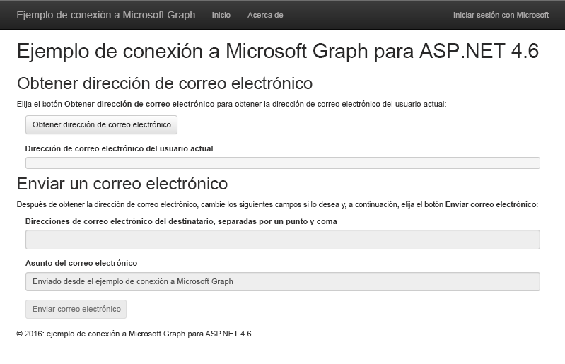

# Introducción a Microsoft Graph en una aplicación de ASP.NET 4.6 MVCGet started with Microsoft Graph in an ASP.NET 4.6 MVC app

En este artículo, se describen las tareas necesarias para obtener un token de acceso desde el punto de conexión v2.0 de Azure AD y llamar a Microsoft Graph. Le muestra los pasos para la compilación del [Ejemplo Connect de Microsoft Graph para ASP.NET 4.6](https://github.com/microsoftgraph/aspnet-connect-sample) y describe los conceptos principales que implementará para usar Microsoft Graph.This article describes the tasks required to get an access token from the Azure AD v2.0 endpoint and call Microsoft Graph. It walks you through building the [Microsoft Graph Connect Sample for ASP.NET 4.6](https://github.com/microsoftgraph/aspnet-connect-sample) and explains the main concepts that you implement to use Microsoft Graph.

En la imagen siguiente, se muestra la aplicación que va a crear.The following image shows the app you'll create. 

El [punto de conexión v2.0 de Azure AD](https://azure.microsoft.com/en-us/documentation/articles/active-directory-appmodel-v2-overview) permite a los usuarios iniciar sesión con una cuenta Microsoft (MSA) o con una cuenta profesional o educativa. La aplicación usa el [middleware de OWIN de OpenID Connect ASP.Net](https://www.nuget.org/packages/Microsoft.Owin.Security.OpenIdConnect/) y la [Biblioteca de autenticación de Microsoft (MSAL) para .NET](https://www.nuget.org/packages/Microsoft.Identity.Client) para el inicio de sesión y la administración de tokens.The [Azure AD v2.0 endpoint](https://azure.microsoft.com/en-us/documentation/articles/active-directory-appmodel-v2-overview) lets users sign in with a Microsoft account (MSA) or a work or school account. The app uses the [ASP.Net OpenID Connect OWIN middleware](https://www.nuget.org/packages/Microsoft.Owin.Security.OpenIdConnect/) and the [Microsoft Authentication Library (MSAL) for .NET](https://www.nuget.org/packages/Microsoft.Identity.Client) for sign in and token management.

**¿No desea compilar una aplicación?** Use el [inicio rápido de Microsoft Graph](https://developer.microsoft.com/en-us/graph/quick-start) para ponerlo todo en funcionamiento de manera rápida. Tenga en cuenta también que tenemos una [versión de REST de esta muestra](https://github.com/microsoftgraph/aspnet-connect-rest-sample).**Don't feel like building an app?** Use the [Microsoft Graph quick start](https://developer.microsoft.com/en-us/graph/quick-start) to get up and running fast. Also note that we have a [REST version of this sample](https://github.com/microsoftgraph/aspnet-connect-rest-sample).

## Requisitos previosPrerequisites

Para comenzar, necesitará:To get started, you'll need: 

- Una [cuenta Microsoft](https://www.outlook.com/) o una [cuenta profesional o educativa](http://dev.office.com/devprogram)A [Microsoft account](https://www.outlook.com/) or a [work or school account](http://dev.office.com/devprogram)
- Visual Studio 2015Visual Studio 2015 
- [Ejemplo de Connect de Microsoft Graph para ASP.NET 4.6](https://github.com/microsoftgraph/aspnet-connect-sample). Usará la carpeta **starter-project** en los archivos de ejemplo.The [Microsoft Graph Connect Sample for ASP.NET 4.6](https://github.com/microsoftgraph/aspnet-connect-sample). You'll use the **starter-project** folder in the sample files.

## Registrar la aplicaciónRegister the application

En este paso, registrará una aplicación en el Portal de registro de aplicaciones de Microsoft. Esta acción generará el identificador de la aplicación y la contraseña que usará para configurar la aplicación en Visual Studio.In this step, you'll register an app on the Microsoft App Registration Portal. This generates the app ID and password that you'll use to configure the app in Visual Studio.

1. Inicie sesión en el [Portal de registro de aplicaciones de Microsoft](https://apps.dev.microsoft.com/) mediante su cuenta personal, profesional o educativa.Sign into the [Microsoft App Registration Portal](https://apps.dev.microsoft.com/) using either your personal or work or school account.

2. Seleccione **Agregar una aplicación**.Choose **Add an app**.

3. Escriba un nombre para la aplicación y seleccione **Crear aplicación**.Enter a name for the app, and choose **Create application**. 
    
    Se muestra la página de registro, indicando las propiedades de la aplicación.The registration page displays, listing the properties of your app.

4. Copie el identificador de la aplicación. Se trata del identificador único para su aplicación.Copy the application ID. This is the unique identifier for your app. 

5. En **Secretos de aplicación**, seleccione **Generar nueva contraseña**. Copie la contraseña del cuadro de diálogo **Nueva contraseña generada**.Under **Application Secrets**, choose **Generate New Password**. Copy the password from the **New password generated** dialog.

    Deberá usar el Id. y el secreto de aplicación para configurar la aplicación.You'll use the application ID and password to configure the app. 

6. En **Plataformas**, elija **Agregar plataforma** > **Web**.Under **Platforms**, choose **Add platform** > **Web**.

7. Asegúrese de que la casilla **Permitir flujo implícito** esté seleccionada y escriba *http://localhost:55065/* como URI de redireccionamiento.Make sure the **Allow Implicit Flow** check box is selected, and enter *http://localhost:55065/* as the Redirect URI. 

    La opción **Permitir flujo implícito**habilita el flujo híbrido de OpenID Connect. Durante la autenticación, esto permite que la aplicación reciba tanto la información de inicio de sesión (el **id_token**) como los artefactos (en este caso, un código de autorización) que la aplicación usa para obtener un token de acceso.The **Allow Implicit Flow** option enables the OpenID Connect hybrid flow. During authentication, this enables the app to receive both sign-in info (the **id_token**) and artifacts (in this case, an authorization code) that the app uses to obtain an access token.

8. Elija **Guardar**.Choose **Save**.

### Configurar el proyectoConfigure the project

1. Abra el archivo de la solución para el proyecto inicial en Visual Studio.Open the solution file for the starter project in Visual Studio.

2. Abra el archivo Web.config del proyecto.Open the project's Web.config file.

3. Busque las claves de configuración de la aplicación en el elemento **appSettings**. Reemplace los valores de los marcadores de posición ENTER_YOUR_CLIENT_ID y ENTER_YOUR_SECRET por los valores que acaba de copiar.Locate the app configuration keys in the **appSettings** element. Replace the ENTER_YOUR_CLIENT_ID and ENTER_YOUR_SECRET placeholder values with the values you just copied.

El URI de redireccionamiento es la URL del proyecto que ha registrado. Los [ámbitos de permisos](https://developer.microsoft.com/en-us/graph/docs/concepts/permission_scopes) solicitados permiten a la aplicación obtener la información del perfil de usuario y enviar un correo electrónico.The redirect URI is the URL of the project that you registered. The requested [permission scopes](https://developer.microsoft.com/en-us/graph/docs/concepts/permission_scopes) allow the app to get user profile information and send an email.

## Llamar a Microsoft GraphCall Microsoft Graph

En este paso deberá centrarse en las clases **SDKHelper**, **GraphService** y **HomeController**.In this step, you'll focus on the **SDKHelper**, **GraphService**, and **HomeController** classes. 

 - **SDKHelper** inicializa una instancia de **GraphServiceClient** desde la biblioteca antes de cada llamada a Microsoft Graph. Este es el momento en el que el token de acceso se agrega a la solicitud.**SDKHelper** intializes an instance of the **GraphServiceClient** from the library before each call to the Microsoft Graph. This is when the access token is added to the request. 
 - **GraphService** compila las solicitudes HTTP y las envía a Microsoft Graph mediante la biblioteca y procesa las respuestas.**GraphService** builds and sends requests to the Microsoft Graph using the library, and processes the responses.
 - **HomeController** contiene las acciones que inician las llamadas a la biblioteca en respuesta a los eventos de interfaz de usuario.**HomeController** contains actions that initiate the calls to the library in response to UI events.

El proyecto inicial ya declara una dependencia para el paquete de NuGet de la Biblioteca cliente .NET de Microsoft Graph:  *Microsoft.Graph*.The starter project already declares a dependency for the Microsoft Graph .NET Client Library NuGet package:  *Microsoft.Graph*.

1. Haga clic con el botón derecho en la carpeta **Helpers** y elija **Agregar** > **Clase**.Right-click the **Helpers** folder and choose **Add** > **Class**. 

1. Asigne a la nueva clase el nombre *SDKHelper* y elija **Agregar**.Name the new class *SDKHelper* and choose **Add**.

1. Reemplace el contenido por el siguiente código.Replace the contents with the following code.

        using System.Net.Http.Headers;
        using Microsoft.Graph;

        namespace Microsoft_Graph_SDK_ASPNET_Connect.Helpers
        {
            public class SDKHelper
            {   
                private static GraphServiceClient graphClient = null;

                // Get an authenticated Microsoft Graph Service client.
                public static GraphServiceClient GetAuthenticatedClient()
                {
                    GraphServiceClient graphClient = new GraphServiceClient(
                        new DelegateAuthenticationProvider(
                            async (requestMessage) =>
                            {
                                string accessToken = await SampleAuthProvider.Instance.GetUserAccessTokenAsync();

                                // Append the access token to the request.
                                requestMessage.Headers.Authorization = new AuthenticationHeaderValue("bearer", accessToken);
                            }));
                    return graphClient;
                }

                public static void SignOutClient()
                {
                    graphClient = null;
                }
            }
        }

  Fíjese en la llamada a **SampleAuthProvider** para obtener el token cuando se inicialice el cliente.Note the call to **SampleAuthProvider** to get the token when the client is initialized.

1. En la carpeta **Modelos** abra el archivo GraphService.cs. El servicio usa la biblioteca para interactuar con Microsoft Graph.In the **Models** folder, open GraphService.cs. The service uses the library to interact with the Microsoft Graph.

1. Agregue la siguiente instrucción **Using**.Add the following **using** statement.

        using Microsoft.Graph;

1. Reemplace *// GetMyEmailAddress* por el siguiente método. Esta acción obtiene la dirección de correo electrónico del usuario actual.Replace *// GetMyEmailAddress* with the following method. This gets the current user's email address. 

        // Get the current user's email address from their profile.
        public async Task<string> GetMyEmailAddress(GraphServiceClient graphClient)
        {

            // Get the current user. 
            // The app only needs the user's email address, so select the mail and userPrincipalName properties.
            // If the mail property isn't defined, userPrincipalName should map to the email for all account types. 
            User me = await graphClient.Me.Request().Select("mail,userPrincipalName").GetAsync();
            return me.Mail ?? me.UserPrincipalName;
        }

  Fíjese en el segmento **Select**, que solo solicita que se devuelvan los elementos **mail** y **userPrinicipalName**. Puede usar los segmentos **Select** y **Filter** para reducir el tamaño de la carga de datos de respuesta.Note the **Select** segment, which requests only the **mail** and **userPrinicipalName** to be returned. You can use **Select** and **Filter** to reduce the size of the response data payload.

1. Reemplace *// SendEmail* por los siguientes métodos para crear y enviar el correo electrónico.Replace *// SendEmail* with the following methods to build and send the email.

        // Send an email message from the current user.
        public async Task SendEmail(GraphServiceClient graphClient, Message message)
        {
            await graphClient.Me.SendMail(message, true).Request().PostAsync();
        }

        public async Task<Message> BuildEmailMessage(GraphServiceClient graphClient, string recipients, string subject)
        {

            // Get current user photo
            Stream photoStream = await GetCurrentUserPhotoStreamAsync(graphClient);

            // If the user doesn't have a photo, or if the user account is MSA, we use a default photo

            if ( photoStream == null)
            {
                photoStream = System.IO.File.OpenRead(System.Web.Hosting.HostingEnvironment.MapPath("/Content/test.jpg"));
            }

            MemoryStream photoStreamMS = new MemoryStream();
            // Copy stream to MemoryStream object so that it can be converted to byte array.
            photoStream.CopyTo(photoStreamMS);

            DriveItem photoFile = await UploadFileToOneDrive(graphClient, photoStreamMS.ToArray());

            MessageAttachmentsCollectionPage attachments = new MessageAttachmentsCollectionPage();
            attachments.Add(new FileAttachment
            {
                ODataType = "#microsoft.graph.fileAttachment",
                ContentBytes = photoStreamMS.ToArray(),
                ContentType = "image/png",
                Name = "me.png"
            });

            Permission sharingLink = await GetSharingLinkAsync(graphClient, photoFile.Id);

            // Add the sharing link to the email body.
            string bodyContent = string.Format(Resource.Graph_SendMail_Body_Content, sharingLink.Link.WebUrl);

            // Prepare the recipient list.
            string[] splitter = { ";" };
            string[] splitRecipientsString = recipients.Split(splitter, StringSplitOptions.RemoveEmptyEntries);
            List<Recipient> recipientList = new List<Recipient>();
            foreach (string recipient in splitRecipientsString)
            {
                recipientList.Add(new Recipient
                {
                    EmailAddress = new EmailAddress
                    {
                        Address = recipient.Trim()
                    }
                });
            }

            // Build the email message.
            Message email = new Message
            {
                Body = new ItemBody
                {
                    Content = bodyContent,
                    ContentType = BodyType.Html,
                },
                Subject = subject,
                ToRecipients = recipientList,
                Attachments = attachments
            };
            return email;
        }

        // Gets the stream content of the signed-in user's photo. 
        // This snippet doesn't work with consumer accounts.
        public async Task<Stream> GetCurrentUserPhotoStreamAsync(GraphServiceClient graphClient)
        {
            Stream currentUserPhotoStream = null;

            try
            {
                currentUserPhotoStream = await graphClient.Me.Photo.Content.Request().GetAsync();

            }

            // If the user account is MSA (not work or school), the service will throw an exception.
            catch (ServiceException)
            {
                return null;
            }

            return currentUserPhotoStream;

        }

        // Uploads the specified file to the user's root OneDrive directory.
        public async Task<DriveItem> UploadFileToOneDrive(GraphServiceClient graphClient, byte[] file)
        {
            DriveItem uploadedFile = null;

            try
            {
                MemoryStream fileStream = new MemoryStream(file);
                uploadedFile = await graphClient.Me.Drive.Root.ItemWithPath("me.png").Content.Request().PutAsync<DriveItem>(fileStream);

            }

            catch (ServiceException)
            {
                return null;
            }

            return uploadedFile;
        }

        public static async Task<Permission> GetSharingLinkAsync(GraphServiceClient graphClient, string Id)
        {
            Permission permission = null;

            try
            {
                permission = await graphClient.Me.Drive.Items[Id].CreateLink("view").Request().PostAsync();
            }

            catch (ServiceException)
            {
                return null;
            }

            return permission;
        }

1. En la carpeta **Controllers**, abra el archivo HomeController.cs.In the **Controllers** folder, open HomeController.cs.

1. Agregue la siguiente instrucción **Using**.Add the following **using** statement.

        using Microsoft.Graph;
  
1. Reemplace *// Controller actions* por las siguientes acciones.Replace *// Controller actions* with the following actions.

        [Authorize]
        // Get the current user's email address from their profile.
        public async Task<ActionResult> GetMyEmailAddress()
        {
            try
            {

                // Initialize the GraphServiceClient.
                GraphServiceClient graphClient = SDKHelper.GetAuthenticatedClient();

                // Get the current user's email address. 
                ViewBag.Email = await graphService.GetMyEmailAddress(graphClient);
                return View("Graph");
            }
            catch (ServiceException se)
            {
                if (se.Error.Message == Resource.Error_AuthChallengeNeeded) return new EmptyResult();
                return RedirectToAction("Index", "Error", new { message = Resource.Error_Message + Request.RawUrl + ": " + se.Error.Message });
            }
        }

        [Authorize]
        // Send mail on behalf of the current user.
        public async Task<ActionResult> SendEmail()
        {
            if (string.IsNullOrEmpty(Request.Form["email-address"]))
            {
                ViewBag.Message = Resource.Graph_SendMail_Message_GetEmailFirst;
                return View("Graph");
            }

            try
            {

                // Initialize the GraphServiceClient.
                GraphServiceClient graphClient = SDKHelper.GetAuthenticatedClient();

                // Build the email message.
                Message message = await graphService.BuildEmailMessage(graphClient, Request.Form["recipients"], Request.Form["subject"]);

                // Send the email.
                await graphService.SendEmail(graphClient, message);

                // Reset the current user's email address and the status to display when the page reloads.
                ViewBag.Email = Request.Form["email-address"];
                ViewBag.Message = Resource.Graph_SendMail_Success_Result;
                return View("Graph");
            }
            catch (ServiceException se)
            {
                if (se.Error.Code == Resource.Error_AuthChallengeNeeded) return new EmptyResult();
                return RedirectToAction("Index", "Error", new { message = Resource.Error_Message + Request.RawUrl + ": " + se.Error.Message });
            }
        }

Ahora ya puede [ejecutar la aplicación](#run-the-app).Now you're ready to [run the app](#run-the-app).

## Ejecutar la aplicaciónRun the app
1. Pulse F5 para compilar y ejecutar la aplicación.Press F5 to build and run the app. 

2. Inicie sesión con su cuenta personal, profesional o educativa y conceda los permisos solicitados.Sign in with your personal or work or school account and grant the requested permissions.

3. Seleccione el botón **Obtener la dirección de correo electrónico**. Cuando finaliza la operación, la dirección de correo electrónico del usuario con sesión iniciada se muestra en la página.Choose the **Get email address** button. When the operation completes, the email address of the signed-in user is displayed on the page.

4. De forma opcional, modifique la lista de destinatarios y el asunto del correo electrónico y, después, seleccione el botón **Enviar correo electrónico**. Cuando se envía el correo, se muestra un mensaje de Operación correcta debajo del botón.Optionally edit the recipient list and email subject, and then choose the **Send email** button. When the mail is sent, a Success message is displayed below the button.

## Pasos siguientesNext steps
- Pruebe la API de REST mediante el [Probador de Graph](https://developer.microsoft.com/graph/graph-explorer).Try out the REST API using the [Graph explorer](https://developer.microsoft.com/graph/graph-explorer).
- Busque ejemplos de operaciones comunes en [Fragmentos de código de ejemplo para ASP.NET 4.6](https://github.com/microsoftgraph/aspnet-snippets-sample) o explore nuestros otros [ejemplos para ASP.NET](http://aka.ms/aspnetgraphsamples) en GitHub.Find examples of common operations in the [Microsoft Graph Snippets Sample for ASP.NET 4.6](https://github.com/microsoftgraph/aspnet-snippets-sample), or explore our other [ASP.NET samples](http://aka.ms/aspnetgraphsamples) on GitHub.

## Recursos adicionalesSee also
- [Biblioteca cliente .NET de Microsoft GraphMicrosoft Graph .NET Client Library](https://github.com/microsoftgraph/msgraph-sdk-dotnet)
- [Aplicación web para el escenario de autenticación de la API webWeb application to web API authentication scenario](https://azure.microsoft.com/en-us/documentation/articles/active-directory-authentication-scenarios/#web-application-to-web-api)
- [Integrar la identidad de Microsoft y Microsoft Graph en una aplicación web usando OpenID ConnectIntegrate Microsoft identity and the Microsoft Graph into a web application using OpenID Connect](https://azure.microsoft.com/en-us/documentation/samples/active-directory-dotnet-webapp-openidconnect-v2/)
- [Protocolos de Azure AD v2.0Azure AD v2.0 protocols](https://azure.microsoft.com/en-us/documentation/articles/active-directory-v2-protocols/)
- [Tokens de Azure AD v2.0Azure AD v2.0 tokens](https://azure.microsoft.com/en-us/documentation/articles/active-directory-v2-tokens/)
