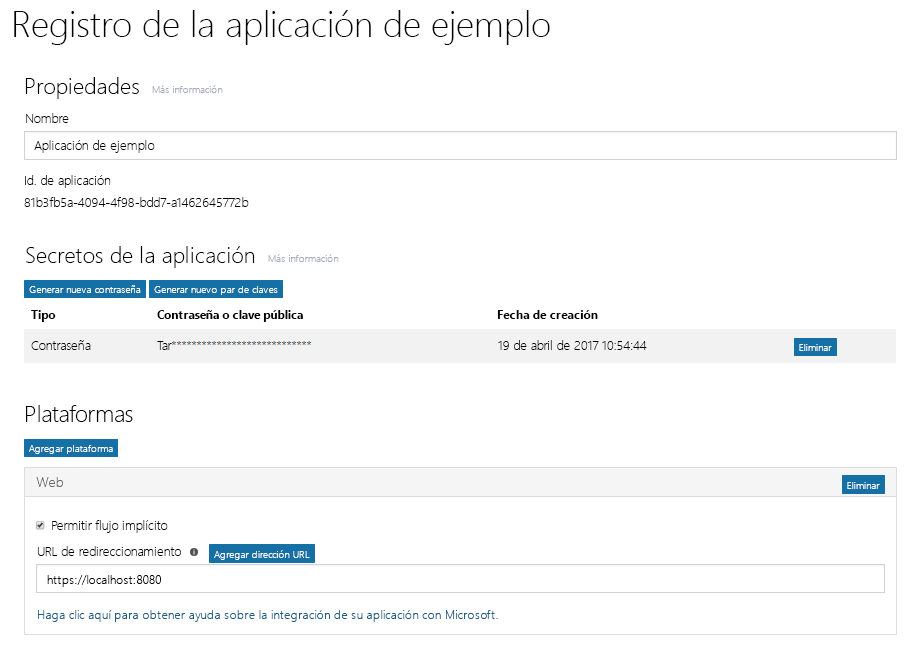

# Registrar una aplicación con el punto de conexión v2.0 de Azure AD

La aplicación debe estar registrada en Azure AD. Registrar la aplicación establece un identificador de aplicación único y otros valores que la aplicación utiliza para autenticarse con Azure AD y obtener tokens. En el caso del punto de conexión v2.0 de Azure AD, registre su aplicación con el [Portal de registro de aplicaciones de Microsoft](https://apps.dev.microsoft.com). Puede usar una cuenta de Microsoft o una cuenta profesional o educativa para registrar la aplicación. Dependiendo del tipo de aplicación que esté desarrollando, debe copiar una o varias propiedades durante el registro para utilizarlas al configurar la autenticación y autorización para la aplicación. 

> **Nota:** Este artículo trata principalmente sobre cómo registrar aplicaciones con el punto de conexión v.2.0 de Azure AD. Para obtener información acerca de cómo registrar la aplicación con el punto de conexión de Azure AD, consulte las [consideraciones del punto de conexión de Azure AD](#azure-ad-endpoint-considerations).
> 
> Además, tenga en cuenta que si ya ha registrado aplicaciones en Microsoft Azure Portal, esas aplicaciones no aparecerán en el Portal de registro de aplicaciones. Administre esas aplicaciones en Azure Portal. 

La captura de pantalla siguiente muestra un registro de la aplicación web de ejemplo que se ha configurado con una contraseña y un flujo implícito. .

Para registrar la aplicación, siga estos pasos y asegúrese de copiar los valores indicados para usarlos al configurar la autorización de la aplicación:

1. Inicie sesión en el [Portal de registro de aplicaciones de Microsoft](https://apps.dev.microsoft.com/).
   
    Puede iniciar sesión con una cuenta de Microsoft o con una cuenta profesional o educativa. 

2. Seleccione **Agregar una aplicación**.
    > Nota: Si inició la sesión con una cuenta profesional o educativa, seleccione el botón **Agregar una aplicación** para **Aplicaciones convergidas**. 

3. Escriba un nombre para la aplicación y seleccione **Crear aplicación**.

    Se muestra la página de registro, indicando las propiedades de la aplicación.

4. Copie el identificador de la aplicación. Se trata del identificador único para su aplicación.

    Deberá usar el identificador de la aplicación para configurar la aplicación.

5. En **Plataformas**, elija **Agregar plataforma** y seleccione la plataforma adecuada para su aplicación:
    
    **Para aplicaciones móviles o nativas**:

    1. Seleccione **Aplicación nativa**.

    2. Copie el valor **URI de redireccionamiento integrado**. Tendrá que configurar la aplicación.

        El URI de redireccionamiento es un URI único que se proporciona para cada aplicación con el fin de garantizar que los mensajes enviados a ese URI solo se envían a esa aplicación. 

    **Para aplicaciones web**:

    1. Seleccione **Web**.

    2. Según el tipo de flujo de autenticación que use, puede que necesite comprobar que esté activada la casilla **Permitir flujo implícito**. 
        
        La opción **Permitir flujo implícito** habilita el OpenID Connect híbrido y los flujos implícitos. El flujo híbrido permite que la aplicación reciba tanto la información de inicio de sesión (el token de id.) como los artefactos (en este caso, un código de autorización) que la aplicación usa para obtener un token de acceso. El flujo híbrido es el flujo predeterminado utilizado por el software intermedio OpenID Connect de OWIN. Para aplicaciones de página única (SPA), el flujo implícito permite a la aplicación recibir información de inicio de sesión y el token de acceso. 

    3. Especifique una URL de redireccionamiento.
        
        La URL de redireccionamiento es la ubicación de la aplicación a la que el punto de conexión v2.0 de Azure AD llama una vez que ha procesado la solicitud de autenticación.

    4. En **Secretos de aplicación**, seleccione **Generar nueva contraseña**. Copie el secreto de aplicación del cuadro de diálogo **Nueva contraseña generada**.
        > **Importante** Debe copiar el secreto de la aplicación antes de cerrar el cuadro de diálogo **Nueva contraseña generada**. Después de cerrar el cuadro de diálogo, no se puede recuperar el secreto. 
            
6. Elija **Guardar**.

La tabla siguiente muestra las propiedades que necesita para configurar y copiar con distintos tipos de aplicaciones. _Asignado_ significa que debe usar el valor asignado por Azure AD.

| Tipo de aplicación | Plataforma | Id. de aplicación | Secreto de aplicación | URI o URL de redireccionamiento | Flujo implícito 
| --- | --- | --- | --- | --- | --- |
| Nativas o móviles | Nativas | Asignado  | No | Asignado | No |
| Aplicación web | Web | Asignado | Sí | Sí | Opcional  El software intermedio Open ID Connect utiliza el flujo híbrido predeterminado (Sí) | 
| Aplicación de página única (SPA) | Web | Asignado | Sí | Sí | Sí   Los SPA usan el flujo implícito de Open ID Connect |
| Servicio o demonio | Web | Asignado | Sí | Sí | No |

Las aplicaciones que proporcionan una experiencia de consentimiento del administrador podrían necesitar una dirección URL de redireccionamiento adicional para que Azure AD devuelva la respuesta.

Para obtener más información sobre el Portal de registro de la aplicación y las propiedades que puede configurar para su aplicación, consulte [Referencia del registro de aplicaciones](https://docs.microsoft.com/es-ES/azure/active-directory/develop/active-directory-v2-registration-portal).  

## Consideraciones sobre el punto de conexión de Azure AD

[Azure Portal](https://aka.ms/aadapplist) se usa para registrar la aplicación para el punto de conexión de Azure AD. Se configuran las mismas propiedades básicas que con el punto de conexión de v2.0 (como el id. de aplicación, el secreto de aplicación y el URI o la URL de redireccionamiento), aunque existen algunas diferencias importantes que necesita tener en cuenta: 

- Solo se puede usar una cuenta profesional o educativa para registrar una aplicación.
- La aplicación necesitará un id. de aplicación distinto para cada plataforma.
- Si la aplicación es multiinquilino, tiene que configurarla de forma explícita para que sea multiinquilino en el portal.
- Debe configurar previamente todos los permisos (incluidos los permisos de Microsoft Graph) que su aplicación necesita en el portal. 

Para obtener instrucciones sobre cómo usar Azure Portal para agregar una aplicación, consulte [Integración de aplicaciones con Azure Active Directory: Agregar una aplicación](https://docs.microsoft.com/azure/active-directory/develop/active-directory-integrating-applications#adding-an-application).
