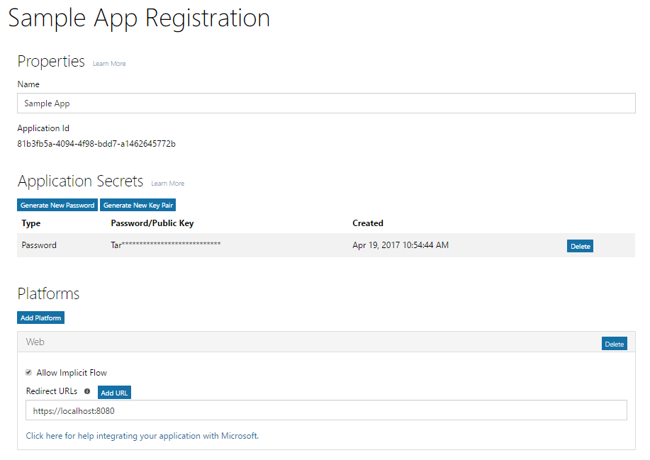

# Registrar una aplicación con el punto de conexión v2.0 de Azure ADRegister your app with the Azure AD v2.0 endpoint

La aplicación debe estar registrada en Azure AD. Registrar la aplicación establece un identificador de aplicación único y otros valores que la aplicación utiliza para autenticarse con Azure AD y obtener tokens. En el caso del punto de conexión v2.0 de Azure AD, registre su aplicación con el [Portal de registro de aplicaciones de Microsoft](https://apps.dev.microsoft.com). Puede usar una cuenta de Microsoft o una cuenta profesional o educativa para registrar la aplicación. Dependiendo del tipo de aplicación que esté desarrollando, debe copiar una o varias propiedades durante el registro para utilizarlas al configurar la autenticación y autorización para la aplicación.Your app must be registered with Azure AD. Registering your app establishes a unique application ID and other values that your app uses to authenticate with Azure AD and get tokens. For the Azure AD v2.0 endpoint, you register your app with the [Microsoft App Registration Portal](https://apps.dev.microsoft.com). You can use either a Microsoft account or a work or school account to register your app. Depending on the type of app you are developing, you will need to copy one or more properties during registration to use when you configure authentication and authorization for your app. 

> **Nota:** Este artículo trata principalmente sobre cómo registrar aplicaciones con el punto de conexión v.2.0 de Azure AD. Para obtener información acerca de cómo registrar la aplicación con el punto de conexión de Azure AD, consulte las [consideraciones del punto de conexión de Azure AD](#azure-ad-endpoint-considerations).**Note:** This article primarily covers registering apps with the Azure AD v2.0 endpoint. For information about registering your app with the Azure AD endpoint, see [Azure AD endpoint considerations](#azure-ad-endpoint-considerations) below.
> 
> Además, tenga en cuenta que si ya ha registrado aplicaciones en Microsoft Azure Portal, esas aplicaciones no aparecerán en el Portal de registro de aplicaciones.Also, be aware that if you've previously registered apps in the Microsoft Azure portal, those apps will not be listed in the App Registration Portal. Administre esas aplicaciones en Azure Portal.Manage those apps in the Azure portal. 

La captura de pantalla siguiente muestra un registro de la aplicación web de ejemplo que se ha configurado con una contraseña y un flujo implícito. .The following screenshot shows an example web app registration that has been configured with a password and implicit flow. 

Para registrar la aplicación, siga estos pasos y asegúrese de copiar los valores indicados para usarlos al configurar la autorización de la aplicación:To register your app, follow these steps; be sure to copy the indicated values to use when configuring authorization for your app:

1. Inicie sesión en el [Portal de registro de aplicaciones de Microsoft](https://apps.dev.microsoft.com/).Sign into the [Microsoft App Registration Portal](https://apps.dev.microsoft.com/).
   
    Puede iniciar sesión con una cuenta de Microsoft o con una cuenta profesional o educativa.You can sign in with either a Microsoft account or a work or school account. 

2. Seleccione **Agregar una aplicación**.Choose **Add an app**.
    > Nota: Si inició la sesión con una cuenta profesional o educativa, seleccione el botón **Agregar una aplicación** para **Aplicaciones convergidas**.Note: If you signed in with a work or school account, select the **Add an app** button for **Converged applications**. 

3. Escriba un nombre para la aplicación y seleccione **Crear aplicación**.Enter a name for the app and choose **Create application**.

    Se muestra la página de registro, indicando las propiedades de la aplicación.The registration page displays, listing the properties of your app.

4. Copie el identificador de la aplicación. Se trata del identificador único para su aplicación.Copy the application ID. This is the unique identifier for your app.

    Deberá usar el identificador de la aplicación para configurar la aplicación.You'll use the application ID to configure the app.

5. En **Plataformas**, elija **Agregar plataforma** y seleccione la plataforma adecuada para su aplicación:Under **Platforms**, choose **Add Platform**, and select the appropriate platform for your app:
    
    **Para aplicaciones móviles o nativas**:**For native or mobile apps**:

    1. Seleccione **Aplicación nativa**.Select **Native Application**.

    2. Copie el valor **URI de redireccionamiento integrado**. Tendrá que configurar la aplicación.Copy the **Built-in redirect URI** value. You'll need this to configure your app.

        El URI de redireccionamiento es un URI único que se proporciona para cada aplicación con el fin de garantizar que los mensajes enviados a ese URI solo se envían a esa aplicación.The redirect URI is a unique URI provided for your application to ensure that messages sent to that URI are only sent to that application. 

    **Para aplicaciones web**:**For web apps**:

    1. Seleccione **Web**.Select **Web**.

    2. Según el tipo de flujo de autenticación que use, puede que necesite comprobar que esté activada la casilla **Permitir flujo implícito**.Depending on the type of authentication flow you're using, you may have to make sure the **Allow Implicit Flow** check box is selected. 
        
        La opción **Permitir flujo implícito** habilita el OpenID Connect híbrido y los flujos implícitos. El flujo híbrido permite que la aplicación reciba tanto la información de inicio de sesión (el token de id.) como los artefactos (en este caso, un código de autorización) que la aplicación usa para obtener un token de acceso. El flujo híbrido es el flujo predeterminado utilizado por el software intermedio OpenID Connect de OWIN. Para aplicaciones de página única (SPA), el flujo implícito permite a la aplicación recibir información de inicio de sesión y el token de acceso.The **Allow Implicit Flow** option enables the OpenID Connect hybrid and implicit flows. The hybrid flow enables the app to receive both sign-in info (the id token) and artifacts (in this case, an authorization code) that the app uses to obtain an access token. The hybrid flow is the default flow used by the OWIN OpenID Connect middleware. For single page apps (SPA), the implicit flow enables the app to receive sign-in info and the access token. 

    3. Especifique una URL de redireccionamiento.Specify a Redirect URL.
        
        La URL de redireccionamiento es la ubicación de la aplicación a la que el punto de conexión v2.0 de Azure AD llama una vez que ha procesado la solicitud de autenticación.The redirect URL is the location in your app that the Azure AD v2.0 endpoint calls when it has processed the authentication request.

    4. En **Secretos de aplicación**, seleccione **Generar nueva contraseña**. Copie el secreto de aplicación del cuadro de diálogo **Nueva contraseña generada**.Under **Application Secrets**, choose **Generate New Password**. Copy the app secret from the **New password generated** dialog box.
        > **Importante** Debe copiar el secreto de la aplicación antes de cerrar el cuadro de diálogo **Nueva contraseña generada**. Después de cerrar el cuadro de diálogo, no se puede recuperar el secreto.**Important** You must copy the app secret before you close the **New password generated** dialog. After you close the dialog, you cannot retrieve the secret. 
            
6. Elija **Guardar**.Choose **Save**.

La tabla siguiente muestra las propiedades que necesita para configurar y copiar con distintos tipos de aplicaciones. _Asignado_ significa que debe usar el valor asignado por Azure AD.The following table shows the properties that you need to configure and copy for different kinds of apps. _Assigned_ means that you should use the value assigned by Azure AD.

| Tipo de aplicaciónApp type | PlataformaPlatform | Id. de aplicaciónApplication ID | Secreto de aplicaciónApplication Secret | URI o URL de redireccionamientoRedirect URI/URL | Flujo implícitoImplicit Flow 
| --- | --- | --- | --- | --- | --- |
| Nativas o móvilesNative/Mobile | NativasNative | AsignadoAssigned  | NoNo | AsignadoAssigned | NoNo |
| Aplicación webWeb App | WebWeb | AsignadoAssigned | SíYes | SíYes | OpcionalOptional  El software intermedio Open ID Connect utiliza el flujo híbrido predeterminado (Sí)Open ID Connect middleware uses hybrid flow by default (Yes) | 
| Aplicación de página única (SPA)Single Page App (SPA) | WebWeb | AsignadoAssigned | SíYes | SíYes | SíYes   Los SPA usan el flujo implícito de Open ID ConnectSPAs use Open ID Connect implicit Flow |
| Servicio o demonioService/Daemon | WebWeb | AsignadoAssigned | SíYes | SíYes | NoNo |

Las aplicaciones que proporcionan una experiencia de consentimiento del administrador podrían necesitar una dirección URL de redireccionamiento adicional para que Azure AD devuelva la respuesta.Apps that provide an administrator consent experience may need an additional Redirect URL for Azure AD to return the response to.

Para obtener más información sobre el Portal de registro de la aplicación y las propiedades que puede configurar para su aplicación, consulte [Referencia del registro de aplicaciones](https://docs.microsoft.com/es-ES/azure/active-directory/develop/active-directory-v2-registration-portal).For more detail about the App Registration Portal and the properties you can configure for your App, see [App registration reference](https://docs.microsoft.com/es-ES/azure/active-directory/develop/active-directory-v2-registration-portal).  

## Consideraciones sobre el punto de conexión de Azure ADAzure AD endpoint considerations

[Azure Portal](https://aka.ms/aadapplist) se usa para registrar la aplicación para el punto de conexión de Azure AD. Se configuran las mismas propiedades básicas que con el punto de conexión de v2.0 (como el id. de aplicación, el secreto de aplicación y el URI o la URL de redireccionamiento), aunque existen algunas diferencias importantes que necesita tener en cuenta:You use the [Azure portal](https://aka.ms/aadapplist) to register your app for the Azure AD endpoint. You configure the same basic properties like Application ID, Application Secret, and Redirect URI/URL, as you would for the v2.0 endpoint; however, there are some important differences to be aware of: 

- Solo se puede usar una cuenta profesional o educativa para registrar una aplicación.You can only use a work or school account to register an app.
- La aplicación necesitará un id. de aplicación distinto para cada plataforma.Your app will require a different Application ID for each platform.
- Si la aplicación es multiinquilino, tiene que configurarla de forma explícita para que sea multiinquilino en el portal.If your app is a multi-tenant app, you must explicitly configure it to be multi-tenant at the portal.
- Debe configurar previamente todos los permisos (incluidos los permisos de Microsoft Graph) que su aplicación necesita en el portal.You must pre-configure all the permissions (including Microsoft Graph permissions) that your app needs at the portal. 

Para obtener instrucciones sobre cómo usar Azure Portal para agregar una aplicación, consulte [Integración de aplicaciones con Azure Active Directory: Agregar una aplicación](https://docs.microsoft.com/azure/active-directory/develop/active-directory-integrating-applications#adding-an-application).For guidance on using the Azure portal to add an app, see [Integrating applications with Azure Active Directory: Adding an application](https://docs.microsoft.com/azure/active-directory/develop/active-directory-integrating-applications#adding-an-application).
