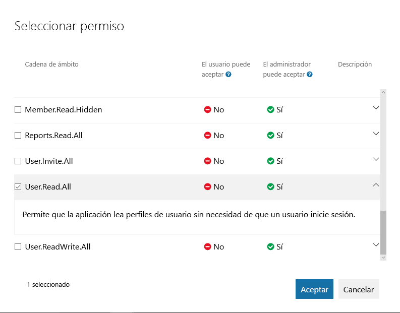
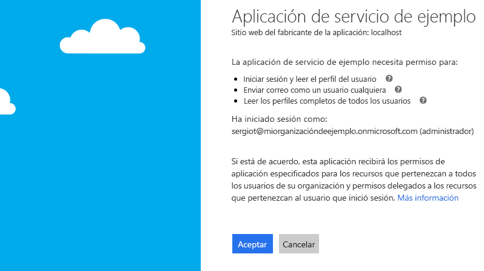

# <a name="get-access-without-a-user"></a>Obtener acceso sin un usuario

Algunas aplicaciones realizan llamadas a Microsoft Graph con su propia identidad, en lugar de hacerlo en nombre de un usuario. En muchos casos, son servicios en segundo plano o demonios que se ejecutan en un servidor sin que un usuario iniciara la sesión. Un ejemplo de una aplicación de este tipo podría ser un servicio de archivado de correo electrónico que se activa y se ejecuta de noche. En algunos casos, puede que las aplicaciones de servidores donde un usuario inicie la sesión necesiten realizar llamadas a Microsoft Graph con su propia identidad. Por ejemplo, puede que una aplicación tenga que usar una función que necesite privilegios más elevados en una organización que los asignados al usuario que inició la sesión.  

Las aplicaciones que realizan llamadas a Microsoft Graph con su propia identidad usan el flujo de concesión de credenciales de cliente de OAuth 2.0 para obtener tokens de acceso de Azure AD. En este tema, le indicaremos los pasos básicos para configurar un servicio y usar el flujo de concesión de credenciales de cliente de OAuth para obtener un token de acceso. 

## <a name="authentication-and-authorization-steps"></a>Pasos de autenticación y autorización

Estos son los pasos básicos necesarios para configurar un servicio y obtener un token desde el punto de conexión de Azure AD v2.0 que el servicio puede usar para realizar una llamada a Microsoft Graph con su propia identidad:

1. Registrar la aplicación.
2. Configurar los permisos de Microsoft Graph en la aplicación.
3. Obtener el consentimiento del administrador.
4. Obtener un token de acceso.
5. Usar el token de acceso para llamar a Microsoft Graph.

## <a name="1-register-your-app"></a>1. Registrar la aplicación

Para autenticarse con el punto de conexión de Azure v2.0, primero debe registrar la aplicación en el [Portal de registro de aplicaciones de Microsoft](https://apps.dev.microsoft.com/). Puede usar una cuenta de Microsoft o una cuenta profesional o educativa para registrar la aplicación. 

En la captura de pantalla siguiente se muestra el registro de una aplicación web que se ha configurado para un servicio en segundo plano. 

Para un servicio que llamará a Microsoft Graph con su propia identidad, necesita registrar la aplicación en la plataforma web y copiar los valores siguientes:

- El id. de aplicación asignado por el portal de registro de aplicaciones.
- Un secreto de aplicación, ya sea una contraseña o un par de claves pública y privada (certificado).
- Una dirección URL de redireccionamiento para que el servicio reciba respuestas de token de Azure AD.
- Una dirección URL de redireccionamiento para que el servicio reciba respuestas de consentimiento del administrador si la aplicación implementa la funcionalidad para solicitar el consentimiento del administrador.  

Para conocer los pasos necesarios para configurar una aplicación con el Portal de registro de aplicaciones de Microsoft, vea [Registrar una aplicación](./auth-register-app-v2.md).

Con el flujo de concesión de credenciales de cliente de OAuth 2.0, la aplicación se autentica directamente en el punto de conexión `/token` de Azure AD v2.0 con el id. de aplicación asignado por Azure AD y el secreto de aplicación que creó en el portal. 

## <a name="2-configure-permissions-for-microsoft-graph"></a>2. Configurar los permisos de Microsoft Graph

Para las aplicaciones que realizan llamadas a Microsoft Graph con su propia identidad, Microsoft Graph expone los permisos de la aplicación. (Microsoft Graph también expone los permisos delegados de las aplicaciones que realizan llamadas en nombre de un usuario). Necesita preconfigurar los permisos de la aplicación necesarios al registrar la aplicación. Los permisos de la aplicación siempre requieren el consentimiento del administrador. Los administradores pueden dar su consentimiento a estos permisos mediante [Azure Portal](https://portal.azure.com) cuando la aplicación se instala en la organización o mediante la experiencia de registro en la aplicación que usted proporcione para que los administradores acepten los permisos que haya configurado. Una vez que Azure AD registra el consentimiento del administrador, la aplicación puede solicitar tokens sin tener que volver a solicitar su consentimiento. Para obtener más información sobre los permisos disponibles con Microsoft Graph, vea la [Referencia de permisos](./permissions-reference.md).

Para configurar los permisos de la aplicación en el [Portal de registro de aplicaciones de Microsoft](https://apps.dev.microsoft.com/): en **Microsoft Graph**, seleccione **Agregar** junto a **Permisos de la aplicación** y, después, seleccione los permisos que requiere la aplicación en el cuadro de diálogo **Seleccionar permisos**.

En la siguiente captura de pantalla se muestra el cuadro de diálogo **Seleccionar permisos** para los permisos de aplicación de Microsoft Graph. 



> **Nota**: Se recomienda configurar el conjunto de permisos con los privilegios mínimos que requiere la aplicación. Esto proporciona una experiencia mucho más cómoda para los administradores que tener que dar su consentimiento a una larga lista de permisos.

## <a name="3-get-administrator-consent"></a>3. Obtener el consentimiento del administrador

Puede confiar en que un administrador conceda los permisos que la aplicación necesita en [Azure Portal](https://portal.azure.com), pero generalmente es mejor proporcionar una experiencia de registro para los administradores mediante el punto de conexión `/adminconsent` de Azure AD v2.0. 

> **Importante**: Siempre que realice un cambio en los permisos configurados, también debe repetir el proceso de consentimiento del administrador. Los cambios realizados en el portal de registro de la aplicación no se reflejarán hasta que el administrador del inquilino haya vuelto a aplicar el consentimiento.

### <a name="request"></a>Solicitud

```
// Line breaks are for legibility only.

GET https://login.microsoftonline.com/{tenant}/adminconsent
?client_id=6731de76-14a6-49ae-97bc-6eba6914391e
&state=12345
&redirect_uri=https://localhost/myapp/permissions
```

| Parámetro     | Condición   | Descripción 
|:--------------|:------------|:------------
| tenant        | Obligatorio    | Inquilino de directorio al que quiere solicitar permiso. Puede estar en formato GUID o de nombre descriptivo. Si no sabe a qué inquilino pertenece el usuario y quiere permitir que inicie sesión con cualquier inquilino, use `common`. 
| client_id     | Obligatorio    | Identificador de aplicación que el [portal de registro de aplicaciones](https://apps.dev.microsoft.com/) ha asignado a la aplicación. 
| redirect_uri  | Obligatorio    | URI de redireccionamiento adonde quiere que se envíe la respuesta para que la aplicación la controle. Debe coincidir exactamente con uno de los URI de redireccionamiento que ha registrado en el portal, pero con codificación URL, y puede tener segmentos de ruta de acceso adicionales. 
| state         | Recomendado | Valor incluido en la solicitud que también se devuelve en la respuesta de token. Puede ser una cadena con cualquier contenido que quiera. El estado se usa para codificar la información sobre el estado del usuario en la aplicación antes de que se produjese la solicitud de autenticación, como la página o la visualización en la que estaba. 

### <a name="administrator-consent-experience"></a>Experiencia de consentimiento del administrador

Con solicitudes al punto de conexión de `/adminconsent`, Azure AD exige que solo un administrador de inquilinos pueda iniciar sesión para completar la solicitud. Se pedirá al administrador que apruebe todos los permisos de aplicación que solicitó para la aplicación en el portal de registro de aplicaciones. 

A continuación se incluye un ejemplo del cuadro de diálogo de consentimiento que Azure AD muestra al administrador:



### <a name="response"></a>Respuesta

Si el administrador aprueba los permisos de la aplicación, la respuesta correcta tiene un aspecto similar al siguiente:

```
// Line breaks are for legibility only.

GET https://localhost/myapp/permissions
?tenant=a8990e1f-ff32-408a-9f8e-78d3b9139b95&state=12345
&admin_consent=True
```

| Parámetro     | Descripción 
|:--------------|:------------
| tenant        | Inquilino de directorio que ha concedido a la aplicación los permisos que ha solicitado, en formato GUID. 
| state         | Valor incluido en la solicitud que también se devuelve en la respuesta de token. Puede ser una cadena con cualquier contenido que quiera. El estado se usa para codificar la información sobre el estado del usuario en la aplicación antes de que se produjese la solicitud de autenticación, como la página o la visualización en la que estaba. 
| admin_consent | Establecido en **true**. 


> **Probar**: puede probarlo usted mismo si pega la solicitud siguiente en un explorador. Si inicia sesión como administrador global para un inquilino de Azure AD, le aparecerá el cuadro de diálogo de consentimiento de administrador para la aplicación. (Será una aplicación diferente de la que se mostró anteriormente en la captura de pantalla con el cuadro de diálogo de consentimiento).
> 
> https://login.microsoftonline.com/common/adminconsent?client_id=6731de76-14a6-49ae-97bc-6eba6914391e&state=12345&redirect_uri=https://localhost/myapp/permissions 

## <a name="4-get-an-access-token"></a>4. Obtener un token de acceso

En el flujo de concesión de credenciales de cliente de OAuth 2.0 se usan los valores del id. de aplicación y el secreto de aplicación que se guardaron al registrar la aplicación para solicitar un token de acceso directamente desde el punto de conexión `/token` de Azure AD v2.0.

Para especificar los permisos configurados previamente, se pasa `https://graph.microsoft.com/.default` como valor del parámetro `scope` en la solicitud de token. Vea la descripción del parámetro `scope` en la solicitud de token siguiente para obtener más información.

### <a name="token-request"></a>Solicitud de token

Se envía una solicitud POST al punto de conexión `/token` de v2.0 para adquirir un token de acceso:

```
// Line breaks are for legibility only.

POST /{tenant}/oauth2/v2.0/token HTTP/1.1
Host: login.microsoftonline.com
Content-Type: application/x-www-form-urlencoded

client_id=535fb089-9ff3-47b6-9bfb-4f1264799865
&scope=https%3A%2F%2Fgraph.microsoft.com%2F.default
&client_secret=qWgdYAmab0YSkuL1qKv5bPX
&grant_type=client_credentials
```

| Parámetro     | Condición | Descripción 
|:--------------|:----------|:------------
| tenant        | Obligatorio  | Inquilino de directorio al que quiere solicitar permiso. Puede estar en formato GUID o de nombre descriptivo. 
| client_id     | Obligatorio  | Identificador de aplicación que el [portal de registro de aplicaciones de Microsoft](https://apps.dev.microsoft.com) ha asignado al registrar la aplicación. 
| scope         | Necesario  | El valor pasado para el parámetro `scope` en esta solicitud debe ser el identificador de recurso (URI del identificador de aplicación) del recurso que le interesa, con el sufijo `.default` anexado. Para Microsoft Graph, el valor es `https://graph.microsoft.com/.default`. Este valor le indica al punto de conexión de v2.0 que, de todos los permisos de aplicación que se han configurado para la aplicación, debe emitir un token para los que están asociados al recurso que quiere usar. 
| client_secret | Obligatorio  | Secreto de la aplicación generado para la aplicación en el portal de registro de aplicaciones. 
| grant_type    | Obligatorio  | Debe ser `client_credentials`. 

#### <a name="token-response"></a>Respuesta de token

Una respuesta correcta tiene un aspecto similar al siguiente:

```json
{
  "token_type": "Bearer",
  "expires_in": 3599,
  "access_token": "eyJ0eXAiOiJKV1QiLCJhbGciOiJSUzI1NiIsIng1dCI6Ik1uQ19WWmNBVGZNNXBP..."
}
```

| Parámetro     | Descripción 
|:--------------|:------------
| access_token  | Token de acceso solicitado. La aplicación puede usar este token en las llamadas a Microsoft Graph. 
| token_type    | Indica el valor de tipo del token. El único tipo que Azure AD admite es `bearer`. 
| expires_in    | Período de validez del token de acceso (en segundos). 

## <a name="5-use-the-access-token-to-call-microsoft-graph"></a>5. Usar el token de acceso para llamar a Microsoft Graph

Una vez que tenga un token de acceso, puede usarlo para llamar a Microsoft Graph. Para ello, inclúyalo en el encabezado `Authorization` de una solicitud. Mediante la solicitud siguiente se obtiene el perfil de un usuario específico. La aplicación debe tener el permiso _User.Read.All_ para llamar a esta API.

```
GET https://graph.microsoft.com/v1.0/users/12345678-73a6-4952-a53a-e9916737ff7f 
Authorization: Bearer eyJ0eXAiO ... 0X2tnSQLEANnSPHY0gKcgw
Host: graph.microsoft.com
```
Una respuesta correcta tendrá un aspecto similar al siguiente (se han quitado algunos encabezados de respuesta):

```http
HTTP/1.1 200 OK
Content-Type: application/json;odata.metadata=minimal;odata.streaming=true;IEEE754Compatible=false;charset=utf-8
request-id: f45d08c0-6901-473a-90f5-7867287de97f
client-request-id: f45d08c0-6901-473a-90f5-7867287de97f
OData-Version: 4.0
Duration: 309.0273
Date: Wed, 26 Apr 2017 19:53:49 GMT
Content-Length: 407
```

```json
{
    "@odata.context":"https://graph.microsoft.com/v1.0/$metadata#users/$entity",
    "id":"12345678-73a6-4952-a53a-e9916737ff7f",
    "businessPhones":[
        "+1 555555555"
    ],
    "displayName":"Chris Green",
    "givenName":"Chris",
    "jobTitle":"Software Engineer",
    "mail":null,
    "mobilePhone":"+1 5555555555",
    "officeLocation":"Seattle Office",
    "preferredLanguage":null,
    "surname":"Green",
    "userPrincipalName":"ChrisG@contoso.onmicrosoft.com"
}
```

## <a name="supported-app-scenarios-and-resources"></a>Escenarios de aplicación admitidos y recursos

Las aplicaciones que realizan llamadas a Microsoft Graph con su propia identidad están en una de las dos categorías siguientes:

- Servicios en segundo plano (demonios) que se ejecutan en un servidor sin que un usuario iniciara la sesión.
- Aplicaciones en las que un usuario inició la sesión, pero que realizan llamadas a Microsoft Graph con su propia identidad (por ejemplo, para usar funciones que necesitan privilegios más elevados que los del usuario).

Las aplicaciones que realizan llamadas a Microsoft Graph con su propia identidad usan la concesión de credenciales de cliente de OAuth 2.0 para autenticarse con Azure AD y obtener un token. Para el punto de conexión de v2.0, puede explorar en detalle este escenario con los recursos siguientes:

- Para consultar un tratamiento más completo del flujo de concesión de credenciales de cliente que también incluye las respuestas de error, vea [Azure Active Directory v2.0 y el flujo de credenciales de cliente de OAuth 2.0](https://docs.microsoft.com/azure/active-directory/develop/active-directory-v2-protocols-oauth-client-creds). 
- Para obtener un ejemplo que llama a Microsoft Graph desde un servicio, vea el [ejemplo de demonio de v2.0](https://github.com/Azure-Samples/active-directory-dotnet-daemon-v2) en GitHub.
- Para obtener más información sobre las bibliotecas de autenticación de Microsoft y de terceros recomendadas para Azure AD v2.0, vea [Bibliotecas de autenticación de Azure Active Directory v2.0](https://docs.microsoft.com/azure/active-directory/develop/active-directory-v2-libraries).

## <a name="azure-ad-endpoint-considerations"></a>Consideraciones sobre el punto de conexión de Azure AD

Si usa el punto de conexión de Azure AD, existen algunas diferencias en la forma en que se configura la aplicación y la forma en que se inicia sesión en Azure AD:

- Para configurar la aplicación, se usa [Azure Portal](https://portal.azure.com). Para obtener más información sobre cómo configurar aplicaciones con Azure Portal, vea [Integración de aplicaciones con Azure Active Directory: Agregar una aplicación](https://docs.microsoft.com/azure/active-directory/develop/active-directory-integrating-applications#adding-an-application).
- Si la aplicación es multiinquilino, debe configurarla explícitamente para que sea multiinquilino en [Azure Portal](https://portal.azure.com).
- No hay ningún punto de conexión de consentimiento del administrador (`/adminconsent`). En su lugar, la aplicación puede solicitar el consentimiento del administrador en tiempo de ejecución mediante la adición del parámetro `prompt=admin_consent` a una solicitud de autorización. Para obtener más información, vea **Desencadenamiento del marco de consentimiento de Azure AD en tiempo de ejecución** en [Integración de aplicaciones con Azure Active Directory](https://docs.microsoft.com/azure/active-directory/develop/active-directory-integrating-applications).
- Los parámetros de las solicitudes de autorización y de token son diferentes. Por ejemplo, no hay ningún parámetro `scope` en las solicitudes del punto de conexión de Azure AD. En su lugar, se usa el parámetro `resource` para especificar el URI del recurso (`resource=https://graph.microsoft.com`) para el que se solicita autorización (para el consentimiento del administrador) o un token.

En el caso del punto de conexión de Azure AD, puede explorar en profundidad este escenario con los recursos siguientes:

- Para obtener vínculos rápidos a información general, ejemplos y un tratamiento detallado del flujo de concesión de credenciales de cliente, vea **Service-to-Service** en la sección **Introducción** de [Azure Active Directory para desarrolladores](https://docs.microsoft.com/azure/active-directory/develop/active-directory-developers-guide).
- En el caso del punto de conexión de Azure AD, puede usar la Biblioteca de autenticación de Azure Active Directory (ADAL) para obtener los tokens de Azure AD. ADAL está disponible para varias plataformas, entre las que se incluyen .NET, iOS, Android, JavaScript, Java y Node.js. Para obtener más información sobre ADAL y otras bibliotecas de autenticación de Microsoft para el punto de conexión de Azure AD, vea [Bibliotecas de autenticación de Azure Active Directory](https://docs.microsoft.com/azure/active-directory/develop/active-directory-authentication-libraries). 

 
