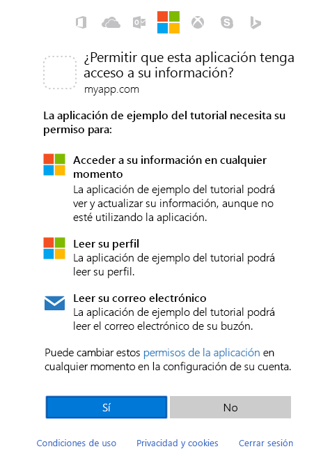

# <a name="get-access-on-behalf-of-a-user"></a>Obtener acceso en nombre de un usuario
Para usar Microsoft Graph para leer y escribir recursos en nombre de un usuario, la aplicación debe obtener un token de acceso de Azure AD y adjuntarlo a las solicitudes que envía a Microsoft Graph. El flujo de autenticación exacto que se use para obtener tokens de acceso dependerá de la clase de aplicación que se esté desarrollando y de si se quiere usar OpenID Connect para iniciar la sesión del usuario en la aplicación. Un flujo habitual que usan las aplicaciones nativas y móviles y también algunas aplicaciones web es el flujo de concesión del código de autorización de OAuth 2.0. En este tema, veremos un ejemplo del uso de este flujo. 

## <a name="authentication-and-authorization-steps"></a>Pasos de autenticación y autorización

Los pasos básicos necesarios para usar el flujo de concesión del código de autorización de OAuth 2.0 para obtener un token de acceso del punto de conexión de Azure AD v2.0 son los siguientes:

1. Registrar la aplicación con Azure AD. 
2. Obtener autorización. 
3. Obtener un token de acceso.
4. Llamar a Microsoft Graph con el token de acceso.
5. Usar un token de actualización para obtener un nuevo token de acceso.

## <a name="1-register-your-app"></a>1. Registrar la aplicación
Para usar el punto de conexión de Azure v2.0, debe registrar la aplicación en el [Portal de registro de aplicaciones de Microsoft](https://apps.dev.microsoft.com/). Puede usar una cuenta de Microsoft o una cuenta profesional o educativa para registrar una aplicación. 

En la captura de pantalla siguiente se muestra un ejemplo del registro de una aplicación web. 

Para configurar una aplicación para que use el flujo de concesión del código de autorización de OAuth 2.0, debe guardar los valores siguientes al registrar la aplicación:

- El id. de aplicación asignado por el portal de registro de aplicaciones.
- Un secreto de la aplicación, ya sea una contraseña o un par de claves pública y privada (certificado). Esto no es necesario para las aplicaciones nativas. 
- Una dirección URL de redireccionamiento para que la aplicación reciba respuestas de Azure AD.

Para conocer los pasos necesarios para configurar una aplicación con el Portal de registro de aplicaciones de Microsoft, vea [Registrar una aplicación](./auth-register-app-v2.md).

## <a name="2-get-authorization"></a>2. Obtener la autorización
El primer paso para obtener un token de acceso para varios flujos de OpenID Connect y OAuth 2.0 consiste en redirigir al usuario al punto de conexión `/authorize` de Azure AD v2.0. Azure AD iniciará la sesión del usuario y obtendrá su consentimiento para los permisos que solicite la aplicación. En el flujo de concesión del código de autorización, después de obtener el consentimiento, Azure AD devolverá un código de autorización a la aplicación que puede canjear en el punto de conexión `/token` de Azure AD v2.0 por un token de acceso.

### <a name="authorization-request"></a>Solicitud de autorización 
A continuación se muestra un ejemplo de solicitud al punto de conexión `/authorize`. 

Con el punto de conexión de Azure AD v2.0, los permisos se solicitan mediante el parámetro `scope`. En este ejemplo, los permisos solicitados de Microsoft Graph son para _User.Read_ y _Mail.Read_, que permitirán que la aplicación lea el perfil y el correo del usuario que ha iniciado sesión. Se solicita el permiso _offline\_access_ para que la aplicación pueda obtener un token de actualización, que puede usar para obtener un nuevo token de acceso cuando expire el actual. 

```
// Line breaks for legibility only

https://login.microsoftonline.com/{tenant}/oauth2/v2.0/authorize?
client_id=6731de76-14a6-49ae-97bc-6eba6914391e
&response_type=code
&redirect_uri=http%3A%2F%2Flocalhost%2Fmyapp%2F
&response_mode=query
&scope=offline_access%20user.read%20mail.read
&state=12345
```
| Parámetro |  | Descripción |
| --- | --- | --- |
| tenant |necesario |Se puede usar el valor `{tenant}` de la ruta de acceso de la solicitud para controlar quién puede iniciar sesión en la aplicación.  Los valores permitidos son `common` para cuentas de Microsoft y cuentas profesionales o educativas, `organizations` solo para cuentas profesionales o educativas, `consumers` solo para cuentas de Microsoft, e identificadores de inquilino como el ID de inquilino o el nombre de dominio.  Para obtener más información, vea los [conceptos básicos de protocolo](https://docs.microsoft.com/azure/active-directory/develop/active-directory-v2-protocols#endpoints). |
| client_id |necesario |El id. de aplicación que el portal de registro ([apps.dev.microsoft.com](https://apps.dev.microsoft.com/?referrer=https://azure.microsoft.com/documentation/articles&deeplink=/appList)) asignó a la aplicación. |
| response_type |necesario |Debe incluir `code` para el flujo del código de autorización. |
| redirect_uri |recomendado |URI de redireccionamiento de la aplicación, donde la aplicación puede enviar y recibir respuestas de autenticación.  Debe coincidir exactamente con uno de los URI de redireccionamiento que ha registrado en el portal de registro de la aplicación, pero con codificación URL.  En el caso de las aplicaciones nativas y móviles, debe usar el valor predeterminado de `https://login.microsoftonline.com/common/oauth2/nativeclient`. |
| ámbito |necesario |Lista separada por espacios de los permisos de Microsoft Graph para los que quiere que el usuario dé su consentimiento. También se pueden incluir ámbitos de OpenID. |
| response_mode |recomendado |Especifica el método que se debe usar para enviar el token resultante de vuelta a la aplicación.  Puede ser `query` o `form_post`. |
| estado |recomendado |Valor incluido en la solicitud que también se devolverá en la respuesta de token.  Puede ser una cadena con cualquier contenido que quiera.  Normalmente se usa un valor único generado de forma aleatoria para [impedir los ataques de falsificación de solicitud entre sitios](https://tools.ietf.org/html/rfc6749#section-10.12).  El estado también se usa para codificar la información sobre el estado del usuario en la aplicación antes de que se produjese la solicitud de autenticación, como la página o la visualización en la que estaba. |

> **Importante**: Microsoft Graph expone dos tipos de permisos: de aplicación y delegados. En el caso de las aplicaciones que se ejecutan con un usuario que ha iniciado sesión, los permisos delegados se solicitan en el parámetro `scope`. Estos permisos delegan en la aplicación los privilegios del usuario que ha iniciado sesión, lo que permite que la aplicación actúe como dicho usuario al hacer llamadas a Microsoft Graph. Para obtener más información sobre los permisos disponibles mediante Microsoft Graph, vea la [Referencia de permisos](./permissions-reference.md).
 
### <a name="consent-experience"></a>Experiencia de consentimiento

En este punto, se pedirá al usuario que escriba sus credenciales para autenticarse con Azure AD. El punto de conexión de v2.0 también se asegurará de que el usuario haya aceptado los permisos indicados en el parámetro de consulta `scope`.  Si el usuario no ha aceptado alguno de estos permisos y si un administrador no ha dado su consentimiento en nombre de todos los usuarios de la organización, Azure AD le pedirá al usuario que dé su consentimiento a los permisos necesarios.  

A continuación se muestra un ejemplo del cuadro de diálogo de consentimiento que aparece en una cuenta de Microsoft:



> **Probar** Si tiene una cuenta de Microsoft o una cuenta profesional o educativa de Azure AD, puede probarlo usted mismo si hace clic en el vínculo siguiente. Después de iniciar sesión, el explorador debería redirigirse a `https://localhost/myapp/` con un `code` en la barra de direcciones.
> 
> <a href="https://login.microsoftonline.com/common/oauth2/v2.0/authorize?client_id=6731de76-14a6-49ae-97bc-6eba6914391e&response_type=code&redirect_uri=http%3A%2F%2Flocalhost%2Fmyapp%2F&response_mode=query&scope=offline_access%20user.read%20mail.read&state=12345" target="_blank">https://login.microsoftonline.com/common/oauth2/v2.0/authorize...</a>

### <a name="authorization-response"></a>Respuesta de autorización
Si el usuario acepta los permisos que ha solicitado la aplicación, la respuesta contendrá el código de autorización en el parámetro `code`. A continuación se muestra un ejemplo de una respuesta correcta a la solicitud anterior. Dado que el parámetro `response_mode` de la solicitud estaba establecido en `query`, la respuesta se devuelve en la cadena de consulta de la dirección URL de redireccionamiento.

```
GET https://localhost/myapp/?
code=M0ab92efe-b6fd-df08-87dc-2c6500a7f84d
&state=12345
```
| Parámetro | Descripción |
| --- | --- |
| código |Código de autorización solicitado por la aplicación. La aplicación puede usar el código de autorización para solicitar un token de acceso para el recurso de destino.  Los códigos de autorización duran muy poco. Por lo general, expiran al cabo de 10 minutos. |
| estado |Si se incluye un parámetro de estado en la solicitud, debe aparecer el mismo valor en la respuesta. La aplicación debe comprobar que los valores de estado de la solicitud y la respuesta son idénticos. |

## <a name="3-get-a-token"></a>3. Obtener un token
La aplicación usa la autorización `code` recibida en el paso anterior para solicitar un token de acceso mediante el envío de una solicitud `POST` al punto de conexión `/token`.

### <a name="token-request"></a>Solicitud de token
```
// Line breaks for legibility only

POST /common/oauth2/v2.0/token HTTP/1.1
Host: https://login.microsoftonline.com
Content-Type: application/x-www-form-urlencoded

client_id=6731de76-14a6-49ae-97bc-6eba6914391e
&scope=user.read%20mail.read
&code=OAAABAAAAiL9Kn2Z27UubvWFPbm0gLWQJVzCTE9UkP3pSx1aXxUjq3n8b2JRLk4OxVXr...
&redirect_uri=http%3A%2F%2Flocalhost%2Fmyapp%2F
&grant_type=authorization_code
&client_secret=JqQX2PNo9bpM0uEihUPzyrh    // NOTE: Only required for web apps
```

| Parámetro |  | Descripción |
| --- | --- | --- |
| tenant |necesario |Se puede usar el valor `{tenant}` de la ruta de acceso de la solicitud para controlar quién puede iniciar sesión en la aplicación.  Los valores permitidos son `common` para cuentas de Microsoft y cuentas profesionales o educativas, `organizations` solo para cuentas profesionales o educativas, `consumers` solo para cuentas de Microsoft, e identificadores de inquilino como el ID de inquilino o el nombre de dominio.  Para obtener más información, vea los [conceptos básicos de protocolo](https://docs.microsoft.com/azure/active-directory/develop/active-directory-v2-protocols#endpoints). |
| client_id |necesario |El id. de aplicación que el portal de registro ([apps.dev.microsoft.com](https://apps.dev.microsoft.com/?referrer=https://azure.microsoft.com/documentation/articles&deeplink=/appList)) asignó a la aplicación. |
| grant_type |necesario |Debe ser `authorization_code` para el flujo del código de autorización. |
| scope |necesario |Lista de ámbitos separados por espacios.  Los ámbitos solicitados en esta sección deben ser equivalentes a los ámbitos solicitados en la primera sección (autorización) o deben ser un subconjunto de estos.  Si los ámbitos especificados en esta solicitud abarcan varios servidores de recursos, el punto de conexión de v2.0 devolverá un token para el recurso especificado en el primer ámbito. |
| código |necesario |Código de autorización adquirido en la primera sección del flujo. |
| redirect_uri |necesario |Mismo valor del URI de redireccionamiento que se usó para adquirir el código de autorización. |
| client_secret |necesario para aplicaciones web |Secreto de la aplicación creado en el portal de registro de la aplicación.  No se debe usar en una aplicación nativa, ya que los secretos de cliente no se pueden almacenar de forma confiable en los dispositivos.  Es necesario para aplicaciones web y API web, que pueden almacenar de forma segura el secreto de cliente en el lado servidor. |

### <a name="token-response"></a>Respuesta de token
Aunque el token de acceso es opaco para la aplicación, la respuesta contiene una lista de los permisos para los que el token de acceso es válido en el parámetro `scope`. 

```
{
    "token_type": "Bearer",
    "scope": "user.read%20Fmail.read",
    "expires_in": 3600,
    "access_token": "eyJ0eXAiOiJKV1QiLCJhbGciOiJSUzI1NiIsIng1dCI6Ik5HVEZ2ZEstZnl0aEV1Q...",
    "refresh_token": "AwABAAAAvPM1KaPlrEqdFSBzjqfTGAMxZGUTdM0t4B4..."
}
```
| Parámetro | Descripción |
| --- | --- |
| token_type |Indica el valor de tipo del token. El único tipo que Azure AD admite es Bearer. |
| ámbito |Lista separada por espacios de los permisos de Microsoft Graph para los que es válido el token de acceso. |
| expires_in |Período de validez del token de acceso (en segundos). |
| access_token |Token de acceso solicitado. La aplicación puede usar este token para llamar a Microsoft Graph. |
| refresh_token |Un token de actualización de OAuth 2.0. Cuando expire el token de acceso actual, la aplicación puede usar este token para obtener otros tokens de acceso.  Los tokens de actualización son de larga duración y se pueden usar para mantener el acceso a los recursos durante períodos prolongados.  Para obtener más información, vea la [Referencia de tokens v2.0](https://docs.microsoft.com/azure/active-directory/develop/active-directory-v2-tokens). |

## <a name="4-use-the-access-token-to-call-microsoft-graph"></a>4. Usar el token de acceso para llamar a Microsoft Graph

Una vez que tenga un token de acceso, puede usarlo para llamar a Microsoft Graph. Para ello, inclúyalo en el encabezado `Authorization` de una solicitud. Mediante la solicitud siguiente se obtiene el perfil del usuario que ha iniciado sesión.

```
GET https://graph.microsoft.com/v1.0/me 
Authorization: Bearer eyJ0eXAiO ... 0X2tnSQLEANnSPHY0gKcgw
Host: graph.microsoft.com

```
Una respuesta correcta tendrá un aspecto similar al siguiente (se han quitado algunos encabezados de respuesta):

```
HTTP/1.1 200 OK
Content-Type: application/json;odata.metadata=minimal;odata.streaming=true;IEEE754Compatible=false;charset=utf-8
request-id: f45d08c0-6901-473a-90f5-7867287de97f
client-request-id: f45d08c0-6901-473a-90f5-7867287de97f
OData-Version: 4.0
Duration: 727.0022
Date: Thu, 20 Apr 2017 05:21:18 GMT
Content-Length: 407

{
    "@odata.context":"https://graph.microsoft.com/v1.0/$metadata#users/$entity",
    "id":"12345678-73a6-4952-a53a-e9916737ff7f",
    "businessPhones":[
        "+1 555555555"
    ],
    "displayName":"Chris Green",
    "givenName":"Chris",
    "jobTitle":"Software Engineer",
    "mail":null,
    "mobilePhone":"+1 5555555555",
    "officeLocation":"Seattle Office",
    "preferredLanguage":null,
    "surname":"Green",
    "userPrincipalName":"ChrisG@contoso.onmicrosoft.com"
}
```

## <a name="5-use-the-refresh-token-to-get-a-new-access-token"></a>5. Usar el token de actualización para obtener un nuevo token de acceso

Los tokens de acceso tienen una duración breve y deberá actualizarlos una vez que hayan expirado para seguir teniendo acceso a los recursos.  Para ello, envíe otra solicitud `POST` al punto de conexión `/token`, pero esta vez proporcione el `refresh_token` en lugar del `code`.

### <a name="request"></a>Solicitud
```
// Line breaks for legibility only

POST /common/oauth2/v2.0/token HTTP/1.1
Host: https://login.microsoftonline.com
Content-Type: application/x-www-form-urlencoded

client_id=6731de76-14a6-49ae-97bc-6eba6914391e
&scope=user.read%20mail.read
&refresh_token=OAAABAAAAiL9Kn2Z27UubvWFPbm0gLWQJVzCTE9UkP3pSx1aXxUjq...
&redirect_uri=http%3A%2F%2Flocalhost%2Fmyapp%2F
&grant_type=refresh_token
&client_secret=JqQX2PNo9bpM0uEihUPzyrh      // NOTE: Only required for web apps
```

| Parámetro |  | Descripción |
| --- | --- | --- |
| client_id |necesario |El id. de aplicación que el portal de registro ([apps.dev.microsoft.com](https://apps.dev.microsoft.com/?referrer=https://azure.microsoft.com/documentation/articles&deeplink=/appList)) asignó a la aplicación. |
| grant_type |necesario |Debe ser `refresh_token`. |
| scope |necesario |Lista de permisos (ámbitos) separados por espacios.  Los permisos solicitados deben ser equivalente a los permisos solicitados en la solicitud del código de autorización original o deben ser un subconjunto de estos. |
| refresh_token |necesario |Token de actualización adquirido durante la solicitud de token. |
| redirect_uri |necesario |Mismo valor del URI de redireccionamiento que se usó para adquirir el código de autorización. |
| client_secret |necesario para aplicaciones web |Secreto de la aplicación creado en el portal de registro de la aplicación.  No se debe usar en una aplicación nativa, ya que los secretos de cliente no se pueden almacenar de forma confiable en los dispositivos.  Es necesario para aplicaciones web y API web, que pueden almacenar de forma segura el secreto de cliente en el lado servidor. |

### <a name="response"></a>Respuesta
Una respuesta de token correcta tendrá un aspecto similar al siguiente.

```
{
    "access_token": "eyJ0eXAiOiJKV1QiLCJhbGciOiJSUzI1NiIsIng1dCI6Ik5HVEZ2ZEstZnl0aEV1Q...",
    "token_type": "Bearer",
    "expires_in": 3599,
    "scope": "user.read%20mail.read",
    "refresh_token": "AwABAAAAvPM1KaPlrEqdFSBzjqfTGAMxZGUTdM0t4B4...",
}
```
| Parámetro | Descripción |
| --- | --- |
| access_token |Token de acceso solicitado. La aplicación puede usar este token en las llamadas a Microsoft Graph. |
| token_type |Indica el valor de tipo del token. El único tipo que Azure AD admite es Bearer. |
| expires_in |Período de validez del token de acceso (en segundos). |
| scope |Permisos (ámbitos) para los que es válido el token de acceso. |
| refresh_token |Nuevo token de actualización de OAuth 2.0. Debe reemplazar el token de actualización antiguo por este token de actualización recién adquirido para asegurarse de que los tokens de actualización sigan siendo válidos durante todo el tiempo posible. |

## <a name="supported-app-scenarios-and-additional-resources"></a>Escenarios de aplicación admitidos y recursos adicionales
Puede llamar a Microsoft Graph en nombre de un usuario desde los siguientes tipos de aplicaciones: 

- Aplicaciones nativas/móviles 
- Aplicaciones web
- Aplicaciones de página única (SPA)
- API web back-end: por ejemplo, en escenarios en los que una aplicación cliente, como una aplicación nativa, implementa una función en el back-end de una API web. Con el punto de conexión de Azure AD v2.0, la aplicación cliente y el back-end de la API web necesitan tener el mismo id. de aplicación. 

Para obtener más información sobre los tipos de aplicaciones compatibles con el punto de conexión de Azure AD v2.0, vea [Tipos de aplicaciones](https://docs.microsoft.com/azure/active-directory/develop/active-directory-v2-flows).

> **Nota**: Actualmente, el punto de conexión de Azure AD v2.0 no permite llamar a Microsoft Graph desde una [API web independiente](https://docs.microsoft.com/azure/active-directory/develop/active-directory-v2-limitations#restrictions-on-app-types). En este caso, debe usar el punto de conexión de Azure AD.

Para obtener más información sobre cómo obtener acceso a Microsoft Graph en nombre de un usuario desde el punto de conexión de Azure AD v2.0:

- Para obtener vínculos a documentación de protocolos y a artículos de introducción a los distintos tipos de aplicaciones, vea la [documentación del punto de conexión de Azure AD v2.0](https://docs.microsoft.com/azure/active-directory/develop/active-directory-appmodel-v2-overview). 
- Para obtener una explicación detallada de los flujos de autenticación, vea [Protocolos de v2.0](https://docs.microsoft.com/azure/active-directory/develop/active-directory-v2-protocols).
- Para obtener más información sobre el software intermedio de servidor y las bibliotecas de autenticación de Microsoft y de terceros recomendadas para Azure AD v2.0, vea [Bibliotecas de autenticación de Azure Active Directory v2.0](https://docs.microsoft.com/azure/active-directory/develop/active-directory-v2-libraries).

## <a name="azure-ad-endpoint-considerations"></a>Consideraciones sobre el punto de conexión de Azure AD
Existen varias diferencias entre usar el punto de conexión de Azure AD y el punto de conexión de Azure AD v2.0. Por ejemplo:

- Para configurar la aplicación, se usa [Azure Portal](https://portal.azure.com). Para obtener más información sobre cómo configurar aplicaciones con Azure Portal, vea [Integración de aplicaciones con Azure Active Directory: Agregar una aplicación](https://docs.microsoft.com/azure/active-directory/develop/active-directory-integrating-applications#adding-an-application).
- La aplicación necesitará un id. de aplicación distinto (id. de cliente) para cada plataforma.
- Si la aplicación es multiinquilino, necesita configurarla de forma explícita para que sea multiinquilino en [Azure Portal](https://portal.azure.com).
- Con el punto de conexión de Azure AD, todos los permisos que necesita la aplicación debe configurarlos el desarrollador. El punto de conexión de Azure AD no admite el consentimiento dinámico (incremental).
- El punto de conexión de Azure AD usa un parámetro `resource` en las solicitudes de autorización y de token para especificar el recurso, como Microsoft Graph, para el que quiere los permisos. El punto de conexión no admite el parámetro `scope`. 
- El punto de conexión de Azure AD no expone un punto de conexión específico para el consentimiento del administrador. En su lugar, las aplicaciones usan el parámetro `prompt=admin_consent` en la solicitud de autorización para obtener el consentimiento del administrador para una organización. Para obtener más información, vea **Desencadenamiento del marco de consentimiento de Azure AD en tiempo de ejecución** en [Integración de aplicaciones con Azure Active Directory](https://docs.microsoft.com/azure/active-directory/develop/active-directory-integrating-applications).

Para obtener más información sobre cómo obtener acceso a Microsoft Graph en nombre de un usuario desde el punto de conexión de Azure AD:

- Para obtener información sobre cómo usar el punto de conexión de Azure AD con diferentes tipos de aplicaciones, vea los vínculos de **introducción** de la guía de [Azure Active Directory para desarrolladores](https://docs.microsoft.com/azure/active-directory/develop/active-directory-developers-guide). La guía contiene vínculos a temas con información general, tutoriales de código y documentación de protocolos para distintos tipos de aplicaciones admitidas por el punto de conexión de Azure AD.
- Para obtener información sobre la Biblioteca de autenticación de Active Directory (ADAL) y el software intermedio de servidor disponible para su uso con el punto de conexión de Azure AD, vea [Bibliotecas de autenticación de Azure Active Directory](https://docs.microsoft.com/azure/active-directory/develop/active-directory-authentication-libraries).

