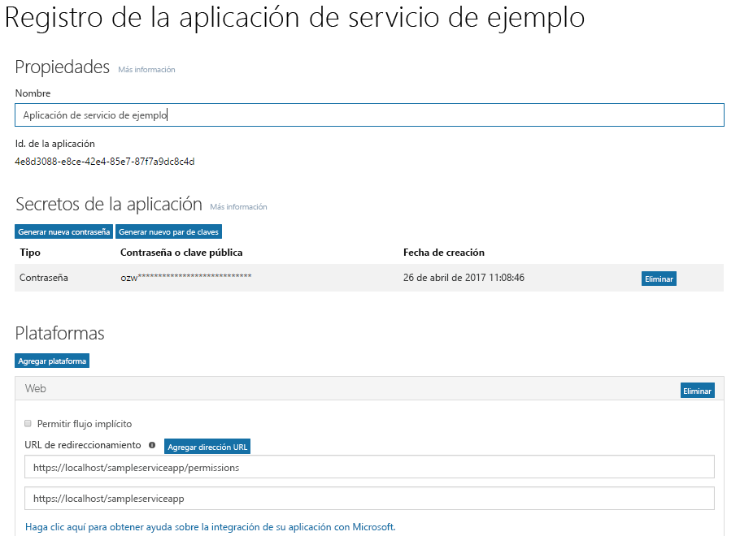

# <a name="get-access-without-a-user"></a><span data-ttu-id="3e1ef-101">Obtener acceso sin un usuario</span><span class="sxs-lookup"><span data-stu-id="3e1ef-101">Get access without a user</span></span>

<span data-ttu-id="3e1ef-p101">Algunas aplicaciones realizan llamadas a Microsoft Graph con su propia identidad, en lugar de hacerlo en nombre de un usuario. En muchos casos, son servicios en segundo plano o demonios que se ejecutan en un servidor sin que un usuario iniciara la sesión. Un ejemplo de una aplicación de este tipo podría ser un servicio de archivado de correo electrónico que se activa y se ejecuta de noche. En algunos casos, puede que las aplicaciones de servidores donde un usuario inicie la sesión necesiten realizar llamadas a Microsoft Graph con su propia identidad. Por ejemplo, puede que una aplicación tenga que usar una función que necesite privilegios más elevados en una organización que los asignados al usuario que inició la sesión.</span><span class="sxs-lookup"><span data-stu-id="3e1ef-p101">Some apps call Microsoft Graph with their own identity and not on behalf of a user. In many cases, these are background services or daemons that run on a server without the presence of a signed-in user. An example of such an app might be an email archival service that wakes up and runs overnight. In some cases, apps that have a signed-in user present may also need to call Microsoft Graph under their own identity. For example, an app may need to use functionality that requires more elevated privileges in an organization than those carried by the signed-in user.</span></span>  

<span data-ttu-id="3e1ef-p102">Las aplicaciones que realizan llamadas a Microsoft Graph con su propia identidad usan el flujo de concesión de credenciales de cliente de OAuth 2.0 para obtener tokens de acceso de Azure AD. En este tema, le indicaremos los pasos básicos para configurar un servicio y usar el flujo de concesión de credenciales de cliente de OAuth para obtener un token de acceso.</span><span class="sxs-lookup"><span data-stu-id="3e1ef-p102">Apps that call Microsoft Graph with their own identity use the OAuth 2.0 client credentials grant flow to get access tokens from Azure AD. In this topic, we will walk through the basic steps to configure a service and use the OAuth client credentials grant flow to get an access token.</span></span> 

## <a name="authentication-and-authorization-steps"></a><span data-ttu-id="3e1ef-109">Pasos de autenticación y autorización</span><span class="sxs-lookup"><span data-stu-id="3e1ef-109">Authentication and authorization steps</span></span>

<span data-ttu-id="3e1ef-110">Estos son los pasos básicos necesarios para configurar un servicio y obtener un token desde el punto de conexión de Azure AD v2.0 que el servicio puede usar para realizar una llamada a Microsoft Graph con su propia identidad:</span><span class="sxs-lookup"><span data-stu-id="3e1ef-110">The basic steps required to configure a service and get a token from the Azure AD v2.0 endpoint that your service can use to call Microsoft Graph under its own identity are:</span></span>

1. <span data-ttu-id="3e1ef-111">Registrar la aplicación.</span><span class="sxs-lookup"><span data-stu-id="3e1ef-111">Register your app.</span></span>
2. <span data-ttu-id="3e1ef-112">Configurar los permisos de Microsoft Graph en la aplicación.</span><span class="sxs-lookup"><span data-stu-id="3e1ef-112">Configure permissions for Microsoft Graph on your app.</span></span>
3. <span data-ttu-id="3e1ef-113">Obtener el consentimiento del administrador.</span><span class="sxs-lookup"><span data-stu-id="3e1ef-113">Get administrator consent.</span></span>
4. <span data-ttu-id="3e1ef-114">Obtener un token de acceso.</span><span class="sxs-lookup"><span data-stu-id="3e1ef-114">Get an access token.</span></span>
5. <span data-ttu-id="3e1ef-115">Usar el token de acceso para llamar a Microsoft Graph.</span><span class="sxs-lookup"><span data-stu-id="3e1ef-115">Use the access token to call Microsoft Graph.</span></span>

## <a name="1-register-your-app"></a><span data-ttu-id="3e1ef-116">1. Registrar la aplicación</span><span class="sxs-lookup"><span data-stu-id="3e1ef-116">1. Register your app</span></span>

<span data-ttu-id="3e1ef-p103">Para autenticarse con el punto de conexión de Azure v2.0, primero debe registrar la aplicación en el [Portal de registro de aplicaciones de Microsoft](https://apps.dev.microsoft.com/). Puede usar una cuenta de Microsoft o una cuenta profesional o educativa para registrar la aplicación.</span><span class="sxs-lookup"><span data-stu-id="3e1ef-p103">To authenticate with the Azure v2.0 endpoint, you must first register your app at the [Microsoft App Registration Portal](https://apps.dev.microsoft.com/). You can use either a Microsoft account or a work or school account to register your app.</span></span> 

<span data-ttu-id="3e1ef-p104">En la captura de pantalla siguiente se muestra el registro de una aplicación web que se ha configurado para un servicio en segundo plano. </span><span class="sxs-lookup"><span data-stu-id="3e1ef-p104">The following screenshot shows a web app registration that has been configured for a background service. </span></span>

<span data-ttu-id="3e1ef-121">Para un servicio que llamará a Microsoft Graph con su propia identidad, necesita registrar la aplicación en la plataforma web y copiar los valores siguientes:</span><span class="sxs-lookup"><span data-stu-id="3e1ef-121">For a service that will call Microsoft Graph under its own identity, you need to register your app for the Web platform and copy the following values:</span></span>

- <span data-ttu-id="3e1ef-122">El id. de aplicación asignado por el portal de registro de aplicaciones.</span><span class="sxs-lookup"><span data-stu-id="3e1ef-122">The Application ID assigned by the app registration portal.</span></span>
- <span data-ttu-id="3e1ef-123">Un secreto de aplicación, ya sea una contraseña o un par de claves pública y privada (certificado).</span><span class="sxs-lookup"><span data-stu-id="3e1ef-123">An Application Secret, either a password or a public/private key pair (certificate).</span></span>
- <span data-ttu-id="3e1ef-124">Una dirección URL de redireccionamiento para que el servicio reciba respuestas de token de Azure AD.</span><span class="sxs-lookup"><span data-stu-id="3e1ef-124">A Redirect URL for your service to receive token responses from Azure AD.</span></span>
- <span data-ttu-id="3e1ef-125">Una dirección URL de redireccionamiento para que el servicio reciba respuestas de consentimiento del administrador si la aplicación implementa la funcionalidad para solicitar el consentimiento del administrador.</span><span class="sxs-lookup"><span data-stu-id="3e1ef-125">A Redirect URL for your service to receive admin consent responses if your app implements functionality to request administrator consent.</span></span>  

<span data-ttu-id="3e1ef-126">Para conocer los pasos necesarios para configurar una aplicación con el Portal de registro de aplicaciones de Microsoft, vea [Registrar una aplicación](./auth_register_app_v2.md).</span><span class="sxs-lookup"><span data-stu-id="3e1ef-126">For steps on how to configure an app using the Microsoft App Registration Portal, see [Register your app](./auth_register_app_v2.md).</span></span>

<span data-ttu-id="3e1ef-127">Con el flujo de concesión de credenciales de cliente de OAuth 2.0, la aplicación se autentica directamente en el punto de conexión `/token` de Azure AD v2.0 con el id. de aplicación asignado por Azure AD y el secreto de aplicación que creó en el portal.</span><span class="sxs-lookup"><span data-stu-id="3e1ef-127">With the OAuth 2.0 client credentials grant flow, your app authenticates directly at the Azure AD v2.0 `/token` endpoint using the Application ID assigned by Azure AD and the Application Secret that you create using the portal.</span></span> 

## <a name="2-configure-permissions-for-microsoft-graph"></a><span data-ttu-id="3e1ef-128">2. Configurar los permisos de Microsoft Graph</span><span class="sxs-lookup"><span data-stu-id="3e1ef-128">2. Configure permissions for Microsoft Graph</span></span>

<span data-ttu-id="3e1ef-p105">Para las aplicaciones que realizan llamadas a Microsoft Graph con su propia identidad, Microsoft Graph expone los permisos de la aplicación. (Microsoft Graph también expone los permisos delegados de las aplicaciones que realizan llamadas en nombre de un usuario). Necesita preconfigurar los permisos de la aplicación necesarios al registrar la aplicación. Los permisos de la aplicación siempre requieren el consentimiento del administrador. Los administradores pueden dar su consentimiento a estos permisos mediante [Azure Portal](https://portal.azure.com) cuando la aplicación se instala en la organización o mediante la experiencia de registro en la aplicación que usted proporcione para que los administradores acepten los permisos que haya configurado. Una vez que Azure AD registra el consentimiento del administrador, la aplicación puede solicitar tokens sin tener que volver a solicitar su consentimiento. Para obtener más información sobre los permisos disponibles con Microsoft Graph, vea la [Referencia de permisos](./permissions_reference.md).</span><span class="sxs-lookup"><span data-stu-id="3e1ef-p105">For apps that call Microsoft Graph under their own identity, Microsoft Graph exposes application permissions. (Microsoft Graph also exposes delegated permissions for apps that call Microsoft Graph on behalf of a user.) You pre-configure the application permissions your app needs when you register your app. Application permissions always require administrator consent. An administrator can either consent to these permissions using the [Azure portal](https://portal.azure.com) when your app is installed in their organization, or you can provide a sign-up experience in your app through which administrators can consent to the permissions you configured. Once administrator consent is recorded by Azure AD, your app can request tokens without having to request consent again. For more detailed information about the permissions available with Microsoft Graph, see the [Permissions reference](./permissions_reference.md)</span></span>

<span data-ttu-id="3e1ef-135">Para configurar los permisos de la aplicación en el [Portal de registro de aplicaciones de Microsoft](https://apps.dev.microsoft.com/): en **Microsoft Graph**, seleccione **Agregar** junto a **Permisos de la aplicación** y, después, seleccione los permisos que requiere la aplicación en el cuadro de diálogo **Seleccionar permisos**.</span><span class="sxs-lookup"><span data-stu-id="3e1ef-135">To configure application permissions for your app in the [Microsoft App Registration Portal](https://apps.dev.microsoft.com/): under **Microsoft Graph**, choose **Add** next to **Application Permissions** and then select the permissions your app requires in the **Select Permissions** dialog.</span></span>

<span data-ttu-id="3e1ef-136">En la siguiente captura de pantalla se muestra el cuadro de diálogo **Seleccionar permisos** para los permisos de aplicación de Microsoft Graph.</span><span class="sxs-lookup"><span data-stu-id="3e1ef-136">The following screenshot shows the **Select Permissions** dialog for Microsoft Graph application permissions.</span></span> 


> <span data-ttu-id="3e1ef-p106">**Nota**: Se recomienda configurar el conjunto de permisos con los privilegios mínimos que requiere la aplicación. Esto proporciona una experiencia mucho más cómoda para los administradores que tener que dar su consentimiento a una larga lista de permisos.</span><span class="sxs-lookup"><span data-stu-id="3e1ef-p106">**Important**: We recommend configuring the least privileged set of permissions required by your app. This provides a much more comfortable experience for administrators than having to consent to a long list of permissions.</span></span>

## <a name="3-get-administrator-consent"></a><span data-ttu-id="3e1ef-140">3. Obtener el consentimiento del administrador</span><span class="sxs-lookup"><span data-stu-id="3e1ef-140">3. Get administrator consent</span></span>

<span data-ttu-id="3e1ef-141">Puede confiar en que un administrador conceda los permisos que la aplicación necesita en [Azure Portal](https://portal.azure.com), pero generalmente es mejor proporcionar una experiencia de registro para los administradores mediante el punto de conexión `/adminconsent` de Azure AD v2.0.</span><span class="sxs-lookup"><span data-stu-id="3e1ef-141">You can rely on an administrator to grant the permissions your app needs at the [Azure portal](https://portal.azure.com); however, often, a better option is to provide a sign-up experience for administrators by using the Azure AD v2.0 `/adminconsent` endpoint.</span></span> 

> <span data-ttu-id="3e1ef-142">**Importante**: Siempre que realice un cambio en los permisos configurados, también debe repetir el proceso de consentimiento del administrador.</span><span class="sxs-lookup"><span data-stu-id="3e1ef-142">**Important**: Any time you make a change to the configured permissions, you must also repeat the Admin Consent process.</span></span> <span data-ttu-id="3e1ef-143">Los cambios realizados en el portal de registro de la aplicación no se reflejarán hasta que el administrador del inquilino haya vuelto a aplicar el consentimiento.</span><span class="sxs-lookup"><span data-stu-id="3e1ef-143">Changes made in the app registration portal will not be reflected until consent has been reapplied by the tenant's administrator.</span></span>

### <a name="request"></a><span data-ttu-id="3e1ef-144">Solicitud</span><span class="sxs-lookup"><span data-stu-id="3e1ef-144">Request</span></span>

```
// Line breaks are for legibility only.

GET https://login.microsoftonline.com/{tenant}/adminconsent
?client_id=6731de76-14a6-49ae-97bc-6eba6914391e
&state=12345
&redirect_uri=http://localhost/myapp/permissions
```

| <span data-ttu-id="3e1ef-145">Parámetro</span><span class="sxs-lookup"><span data-stu-id="3e1ef-145">Parameter</span></span>     | <span data-ttu-id="3e1ef-146">Condición</span><span class="sxs-lookup"><span data-stu-id="3e1ef-146">Condition</span></span>   | <span data-ttu-id="3e1ef-147">Descripción</span><span class="sxs-lookup"><span data-stu-id="3e1ef-147">Description</span></span> 
|:--------------|:------------|:------------
| <span data-ttu-id="3e1ef-148">tenant</span><span class="sxs-lookup"><span data-stu-id="3e1ef-148">tenant</span></span>        | <span data-ttu-id="3e1ef-149">Obligatorio</span><span class="sxs-lookup"><span data-stu-id="3e1ef-149">Required</span></span>    | <span data-ttu-id="3e1ef-p108">Inquilino de directorio al que quiere solicitar permiso. Puede estar en formato GUID o de nombre descriptivo. Si no sabe a qué inquilino pertenece el usuario y quiere permitir que inicie sesión con cualquier inquilino, use `common`.</span><span class="sxs-lookup"><span data-stu-id="3e1ef-p108">The directory tenant that you want to request permission from. This can be in GUID or friendly name format. If you don't know which tenant the user belongs to and you want to let them sign in with any tenant, use `common`.</span></span> 
| <span data-ttu-id="3e1ef-153">client_id</span><span class="sxs-lookup"><span data-stu-id="3e1ef-153">client_id</span></span>     | <span data-ttu-id="3e1ef-154">Obligatorio</span><span class="sxs-lookup"><span data-stu-id="3e1ef-154">Required</span></span>    | <span data-ttu-id="3e1ef-155">Identificador de aplicación que el [portal de registro de aplicaciones](https://apps.dev.microsoft.com/) ha asignado a la aplicación.</span><span class="sxs-lookup"><span data-stu-id="3e1ef-155">The Application ID that the [Application Registration Portal](https://apps.dev.microsoft.com/) assigned to your app.</span></span> 
| <span data-ttu-id="3e1ef-156">redirect_uri</span><span class="sxs-lookup"><span data-stu-id="3e1ef-156">redirect_uri</span></span>  | <span data-ttu-id="3e1ef-157">Obligatorio</span><span class="sxs-lookup"><span data-stu-id="3e1ef-157">Required</span></span>    | <span data-ttu-id="3e1ef-p109">URI de redireccionamiento adonde quiere que se envíe la respuesta para que la aplicación la controle. Debe coincidir exactamente con uno de los URI de redireccionamiento que ha registrado en el portal, pero con codificación URL, y puede tener segmentos de ruta de acceso adicionales.</span><span class="sxs-lookup"><span data-stu-id="3e1ef-p109">The redirect URI where you want the response to be sent for your app to handle. It must exactly match one of the redirect URIs that you registered in the portal, except that it must be URL encoded, and it can have additional path segments.</span></span> 
| <span data-ttu-id="3e1ef-160">state</span><span class="sxs-lookup"><span data-stu-id="3e1ef-160">state</span></span>         | <span data-ttu-id="3e1ef-161">Recomendado</span><span class="sxs-lookup"><span data-stu-id="3e1ef-161">Recommended</span></span> | <span data-ttu-id="3e1ef-p110">Valor incluido en la solicitud que también se devuelve en la respuesta de token. Puede ser una cadena con cualquier contenido que quiera. El estado se usa para codificar la información sobre el estado del usuario en la aplicación antes de que se produjese la solicitud de autenticación, como la página o la visualización en la que estaba.</span><span class="sxs-lookup"><span data-stu-id="3e1ef-p110">A value that is included in the request that also is returned in the token response. It can be a string of any content that you want. The state is used to encode information about the user's state in the app before the authentication request occurred, such as the page or view they were on.</span></span> 

### <a name="administrator-consent-experience"></a><span data-ttu-id="3e1ef-165">Experiencia de consentimiento del administrador</span><span class="sxs-lookup"><span data-stu-id="3e1ef-165">Administrator consent experience</span></span>

<span data-ttu-id="3e1ef-p111">Con solicitudes al punto de conexión de `/adminconsent`, Azure AD exige que solo un administrador de inquilinos pueda iniciar sesión para completar la solicitud. Se pedirá al administrador que apruebe todos los permisos de aplicación que solicitó para la aplicación en el portal de registro de aplicaciones.</span><span class="sxs-lookup"><span data-stu-id="3e1ef-p111">With requests to the `/adminconsent` endpoint, Azure AD enforces that only a tenant administrator can sign in to complete the request. The administrator will be asked to approve all the application permissions that you have requested for your app in the app registration portal. The following is an example of the consent dialog that Azure AD presents to the administrator:</span></span> 

<span data-ttu-id="3e1ef-168">A continuación se incluye un ejemplo del cuadro de diálogo de consentimiento que Azure AD muestra al administrador:</span><span class="sxs-lookup"><span data-stu-id="3e1ef-168">The following is an example of the consent dialog that Azure AD presents to the administrator:</span></span>


### <a name="response"></a><span data-ttu-id="3e1ef-170">Respuesta</span><span class="sxs-lookup"><span data-stu-id="3e1ef-170">Response</span></span>

<span data-ttu-id="3e1ef-171">Si el administrador aprueba los permisos de la aplicación, la respuesta correcta tiene un aspecto similar al siguiente:</span><span class="sxs-lookup"><span data-stu-id="3e1ef-171">If the administrator approves the permissions for your application, the successful response looks like this:</span></span>

```
// Line breaks are for legibility only.

GET http://localhost/myapp/permissions
?tenant=a8990e1f-ff32-408a-9f8e-78d3b9139b95&state=state=12345
&admin_consent=True
```

| <span data-ttu-id="3e1ef-172">Parámetro</span><span class="sxs-lookup"><span data-stu-id="3e1ef-172">Parameter</span></span>     | <span data-ttu-id="3e1ef-173">Descripción</span><span class="sxs-lookup"><span data-stu-id="3e1ef-173">Description</span></span> 
|:--------------|:------------
| <span data-ttu-id="3e1ef-174">tenant</span><span class="sxs-lookup"><span data-stu-id="3e1ef-174">tenant</span></span>        | <span data-ttu-id="3e1ef-175">Inquilino de directorio que ha concedido a la aplicación los permisos que ha solicitado, en formato GUID.</span><span class="sxs-lookup"><span data-stu-id="3e1ef-175">The directory tenant that granted your application the permissions that it requested, in GUID format.</span></span> 
| <span data-ttu-id="3e1ef-176">state</span><span class="sxs-lookup"><span data-stu-id="3e1ef-176">state</span></span>         | <span data-ttu-id="3e1ef-p112">Valor incluido en la solicitud que también se devuelve en la respuesta de token. Puede ser una cadena con cualquier contenido que quiera. El estado se usa para codificar la información sobre el estado del usuario en la aplicación antes de que se produjese la solicitud de autenticación, como la página o la visualización en la que estaba.</span><span class="sxs-lookup"><span data-stu-id="3e1ef-p112">A value that is included in the request that also is returned in the token response. It can be a string of any content that you want. The state is used to encode information about the user's state in the app before the authentication request occurred, such as the page or view they were on.</span></span> 
| <span data-ttu-id="3e1ef-180">admin_consent</span><span class="sxs-lookup"><span data-stu-id="3e1ef-180">admin_consent</span></span> | <span data-ttu-id="3e1ef-181">Establecido en **true**.</span><span class="sxs-lookup"><span data-stu-id="3e1ef-181">Set to **true**.</span></span> 


> <span data-ttu-id="3e1ef-p113">**Probar**: puede probarlo usted mismo si pega la solicitud siguiente en un explorador. Si inicia sesión como administrador global para un inquilino de Azure AD, le aparecerá el cuadro de diálogo de consentimiento de administrador para la aplicación. (Será una aplicación diferente de la que se mostró anteriormente en la captura de pantalla con el cuadro de diálogo de consentimiento).</span><span class="sxs-lookup"><span data-stu-id="3e1ef-p113">**Try** You can try this for yourself by pasting the request below in a browser. If you sign in as a Global administrator for an Azure AD tenant, you will be presented with the administrator consent dialog for the app. (This will be a different app than that in the consent dialog screenshot shown above.)</span></span>
> 
> <span data-ttu-id="3e1ef-185">https://login.microsoftonline.com/common/adminconsent?client_id=6731de76-14a6-49ae-97bc-6eba6914391e&state=12345&redirect_uri=http://localhost/myapp/permissions</span><span class="sxs-lookup"><span data-stu-id="3e1ef-185">https://login.microsoftonline.com/common/adminconsent?client_id=6731de76-14a6-49ae-97bc-6eba6914391e&state=12345&redirect_uri=http://localhost/myapp/permissions</span></span> 

## <a name="4-get-an-access-token"></a><span data-ttu-id="3e1ef-186">4. Obtener un token de acceso</span><span class="sxs-lookup"><span data-stu-id="3e1ef-186">4. Get an access token</span></span>

<span data-ttu-id="3e1ef-187">En el flujo de concesión de credenciales de cliente de OAuth 2.0 se usan los valores del id. de aplicación y el secreto de aplicación que se guardaron al registrar la aplicación para solicitar un token de acceso directamente desde el punto de conexión `/token` de Azure AD v2.0.</span><span class="sxs-lookup"><span data-stu-id="3e1ef-187">In the OAuth 2.0 client credentials grant flow, you use the Application ID and Application Secret values that you saved when you registered your app to request an access token directly from the Azure AD v2.0 `/token` endpoint.</span></span>

<span data-ttu-id="3e1ef-p114">Para especificar los permisos configurados previamente, se pasa `https://graph.microsoft.com/.default` como valor del parámetro `scope` en la solicitud de token. Vea la descripción del parámetro `scope` en la solicitud de token siguiente para obtener más información.</span><span class="sxs-lookup"><span data-stu-id="3e1ef-p114">You specify the pre-configured permissions by passing `https://graph.microsoft.com/.default` as the value for the `scope` parameter in the token request. See the `scope` parameter description in the token request below for details.</span></span>

### <a name="token-request"></a><span data-ttu-id="3e1ef-190">Solicitud de token</span><span class="sxs-lookup"><span data-stu-id="3e1ef-190">Token request</span></span>

<span data-ttu-id="3e1ef-191">Se envía una solicitud POST al punto de conexión `/token` de v2.0 para adquirir un token de acceso:</span><span class="sxs-lookup"><span data-stu-id="3e1ef-191">You send a POST request to the `/token` v2.0 endpoint to acquire an access token:</span></span>

```
// Line breaks are for legibility only.

POST /{tenant}/oauth2/v2.0/token HTTP/1.1
Host: login.microsoftonline.com
Content-Type: application/x-www-form-urlencoded

client_id=535fb089-9ff3-47b6-9bfb-4f1264799865
&scope=https%3A%2F%2Fgraph.microsoft.com%2F.default
&client_secret=qWgdYAmab0YSkuL1qKv5bPX
&grant_type=client_credentials
```

| <span data-ttu-id="3e1ef-192">Parámetro</span><span class="sxs-lookup"><span data-stu-id="3e1ef-192">Parameter</span></span>     | <span data-ttu-id="3e1ef-193">Condición</span><span class="sxs-lookup"><span data-stu-id="3e1ef-193">Condition</span></span> | <span data-ttu-id="3e1ef-194">Descripción</span><span class="sxs-lookup"><span data-stu-id="3e1ef-194">Description</span></span> 
|:--------------|:----------|:------------
| <span data-ttu-id="3e1ef-195">tenant</span><span class="sxs-lookup"><span data-stu-id="3e1ef-195">tenant</span></span>        | <span data-ttu-id="3e1ef-196">Obligatorio</span><span class="sxs-lookup"><span data-stu-id="3e1ef-196">Required</span></span>  | <span data-ttu-id="3e1ef-p115">Inquilino de directorio al que quiere solicitar permiso. Puede estar en formato GUID o de nombre descriptivo.</span><span class="sxs-lookup"><span data-stu-id="3e1ef-p115">The directory tenant that you want to request permission from. This can be in GUID or friendly name format.</span></span> 
| <span data-ttu-id="3e1ef-199">client_id</span><span class="sxs-lookup"><span data-stu-id="3e1ef-199">client_id</span></span>     | <span data-ttu-id="3e1ef-200">Obligatorio</span><span class="sxs-lookup"><span data-stu-id="3e1ef-200">Required</span></span>  | <span data-ttu-id="3e1ef-201">Identificador de aplicación que el [portal de registro de aplicaciones de Microsoft](https://apps.dev.microsoft.com) ha asignado al registrar la aplicación.</span><span class="sxs-lookup"><span data-stu-id="3e1ef-201">The Application ID that the [Microsoft App Registration Portal](https://apps.dev.microsoft.com) assigned when you registered your app.</span></span> 
| <span data-ttu-id="3e1ef-202">scope</span><span class="sxs-lookup"><span data-stu-id="3e1ef-202">scope</span></span>         | <span data-ttu-id="3e1ef-203">Necesario</span><span class="sxs-lookup"><span data-stu-id="3e1ef-203">Required</span></span>  | <span data-ttu-id="3e1ef-p116">El valor pasado para el parámetro `scope` en esta solicitud debe ser el identificador de recurso (URI del identificador de aplicación) del recurso que le interesa, con el sufijo `.default` anexado. Para Microsoft Graph, el valor es `https://graph.microsoft.com/.default`. Este valor le indica al punto de conexión de v2.0 que, de todos los permisos de aplicación que se han configurado para la aplicación, debe emitir un token para los que están asociados al recurso que quiere usar.</span><span class="sxs-lookup"><span data-stu-id="3e1ef-p116">The value passed for the `scope` parameter in this request should be the resource identifier (Application ID URI) of the resource you want, affixed with the `.default` suffix. For Microsoft Graph, the value is `https://graph.microsoft.com/.default`. This value informs the v2.0 endpoint that of all the application permissions you have configured for your app, it should issue a token for the ones associated with the resource you want to use.</span></span> 
| <span data-ttu-id="3e1ef-207">client_secret</span><span class="sxs-lookup"><span data-stu-id="3e1ef-207">client_secret</span></span> | <span data-ttu-id="3e1ef-208">Obligatorio</span><span class="sxs-lookup"><span data-stu-id="3e1ef-208">Required</span></span>  | <span data-ttu-id="3e1ef-209">Secreto de la aplicación generado para la aplicación en el portal de registro de aplicaciones.</span><span class="sxs-lookup"><span data-stu-id="3e1ef-209">The Application Secret that you generated for your app in the app registration portal.</span></span> 
| <span data-ttu-id="3e1ef-210">grant_type</span><span class="sxs-lookup"><span data-stu-id="3e1ef-210">grant_type</span></span>    | <span data-ttu-id="3e1ef-211">Obligatorio</span><span class="sxs-lookup"><span data-stu-id="3e1ef-211">Required</span></span>  | <span data-ttu-id="3e1ef-212">Debe ser `client_credentials`.</span><span class="sxs-lookup"><span data-stu-id="3e1ef-212">Must be `client_credentials`.</span></span> 

#### <a name="token-response"></a><span data-ttu-id="3e1ef-213">Respuesta de token</span><span class="sxs-lookup"><span data-stu-id="3e1ef-213">Token response</span></span>

<span data-ttu-id="3e1ef-214">Una respuesta correcta tiene un aspecto similar al siguiente:</span><span class="sxs-lookup"><span data-stu-id="3e1ef-214">A successful response looks like this:</span></span>

```json
{
  "token_type": "Bearer",
  "expires_in": 3599,
  "access_token": "eyJ0eXAiOiJKV1QiLCJhbGciOiJSUzI1NiIsIng1dCI6Ik1uQ19WWmNBVGZNNXBP..."
}
```

| <span data-ttu-id="3e1ef-215">Parámetro</span><span class="sxs-lookup"><span data-stu-id="3e1ef-215">Parameter</span></span>     | <span data-ttu-id="3e1ef-216">Descripción</span><span class="sxs-lookup"><span data-stu-id="3e1ef-216">Description</span></span> 
|:--------------|:------------
| <span data-ttu-id="3e1ef-217">access_token</span><span class="sxs-lookup"><span data-stu-id="3e1ef-217">access_token</span></span>  | <span data-ttu-id="3e1ef-p117">Token de acceso solicitado. La aplicación puede usar este token en las llamadas a Microsoft Graph.</span><span class="sxs-lookup"><span data-stu-id="3e1ef-p117">The requested access token. Your app can use this token in calls to Microsoft Graph.</span></span> 
| <span data-ttu-id="3e1ef-220">token_type</span><span class="sxs-lookup"><span data-stu-id="3e1ef-220">token_type</span></span>    | <span data-ttu-id="3e1ef-p118">Indica el valor de tipo del token. El único tipo que Azure AD admite es `bearer`.</span><span class="sxs-lookup"><span data-stu-id="3e1ef-p118">Indicates the token type value. The only type that Azure AD supports is `bearer`.</span></span> 
| <span data-ttu-id="3e1ef-223">expires_in</span><span class="sxs-lookup"><span data-stu-id="3e1ef-223">expires_in</span></span>    | <span data-ttu-id="3e1ef-224">Período de validez del token de acceso (en segundos).</span><span class="sxs-lookup"><span data-stu-id="3e1ef-224">How long the access token is valid (in seconds).</span></span> 

## <a name="5-use-the-access-token-to-call-microsoft-graph"></a><span data-ttu-id="3e1ef-225">5. Usar el token de acceso para llamar a Microsoft Graph</span><span class="sxs-lookup"><span data-stu-id="3e1ef-225">5. Use the access token to call Microsoft Graph</span></span>

<span data-ttu-id="3e1ef-p119">Una vez que tenga un token de acceso, puede usarlo para llamar a Microsoft Graph. Para ello, inclúyalo en el encabezado `Authorization` de una solicitud. Mediante la solicitud siguiente se obtiene el perfil de un usuario específico. La aplicación debe tener el permiso _User.Read.All_ para llamar a esta API.</span><span class="sxs-lookup"><span data-stu-id="3e1ef-p119">Once you have an access token, you can use it to call Microsoft Graph by including it in the `Authorization` header of a request. The following request gets the profile of a specific user. Your app must have the _User.Read.All_ permission to call this API.</span></span>

```
GET https://graph.microsoft.com/v1.0/user/12345678-73a6-4952-a53a-e9916737ff7f 
Authorization: Bearer eyJ0eXAiO ... 0X2tnSQLEANnSPHY0gKcgw
Host: graph.microsoft.com
```
<span data-ttu-id="3e1ef-229">Una respuesta correcta tendrá un aspecto similar al siguiente (se han quitado algunos encabezados de respuesta):</span><span class="sxs-lookup"><span data-stu-id="3e1ef-229">A successful response will look similar to this (some response headers have been removed):</span></span>

```http
HTTP/1.1 200 OK
Content-Type: application/json;odata.metadata=minimal;odata.streaming=true;IEEE754Compatible=false;charset=utf-8
request-id: f45d08c0-6901-473a-90f5-7867287de97f
client-request-id: f45d08c0-6901-473a-90f5-7867287de97f
OData-Version: 4.0
Duration: 309.0273
Date: Wed, 26 Apr 2017 19:53:49 GMT
Content-Length: 407
```

```json
{
    "@odata.context":"https://graph.microsoft.com/v1.0/$metadata#users/$entity",
    "id":"12345678-73a6-4952-a53a-e9916737ff7f",
    "businessPhones":[
        "+1 555555555"
    ],
    "displayName":"Chris Green",
    "givenName":"Chris",
    "jobTitle":"Software Engineer",
    "mail":null,
    "mobilePhone":"+1 5555555555",
    "officeLocation":"Seattle Office",
    "preferredLanguage":null,
    "surname":"Green",
    "userPrincipalName":"ChrisG@contoso.onmicrosoft.com"
}
```

## <a name="supported-app-scenarios-and-resources"></a><span data-ttu-id="3e1ef-230">Escenarios de aplicación admitidos y recursos</span><span class="sxs-lookup"><span data-stu-id="3e1ef-230">Supported app scenarios and resources</span></span>

<span data-ttu-id="3e1ef-231">Las aplicaciones que realizan llamadas a Microsoft Graph con su propia identidad están en una de las dos categorías siguientes:</span><span class="sxs-lookup"><span data-stu-id="3e1ef-231">Apps that call Microsoft Graph under their own identity fall into one of two categories:</span></span>

- <span data-ttu-id="3e1ef-232">Servicios en segundo plano (demonios) que se ejecutan en un servidor sin que un usuario iniciara la sesión.</span><span class="sxs-lookup"><span data-stu-id="3e1ef-232">Background services (daemons) that run on a server without a signed-in user.</span></span>
- <span data-ttu-id="3e1ef-233">Aplicaciones en las que un usuario inició la sesión, pero que realizan llamadas a Microsoft Graph con su propia identidad (por ejemplo, para usar funciones que necesitan privilegios más elevados que los del usuario).</span><span class="sxs-lookup"><span data-stu-id="3e1ef-233">Apps that have a signed-in user but also call Microsoft Graph with their own identity; for example, to use functionality that requires more elevated privileges than those of the user.</span></span>

<span data-ttu-id="3e1ef-p120">Las aplicaciones que realizan llamadas a Microsoft Graph con su propia identidad usan la concesión de credenciales de cliente de OAuth 2.0 para autenticarse con Azure AD y obtener un token. Para el punto de conexión de v2.0, puede explorar en detalle este escenario con los recursos siguientes:</span><span class="sxs-lookup"><span data-stu-id="3e1ef-p120">Apps that call Microsoft Graph with their own identity use the OAuth 2.0 client credentials grant to authenticate with Azure AD and get a token. For the v2.0 endpoint, you can explore this scenario further with the following resources:</span></span>

- <span data-ttu-id="3e1ef-236">Para consultar un tratamiento más completo del flujo de concesión de credenciales de cliente que también incluye las respuestas de error, vea [Azure Active Directory v2.0 y el flujo de credenciales de cliente de OAuth 2.0](https://docs.microsoft.com/azure/active-directory/develop/active-directory-v2-protocols-oauth-client-creds).</span><span class="sxs-lookup"><span data-stu-id="3e1ef-236">For a more complete treatment of the client credentials grant flow that also includes error responses, see [Azure Active Directory v2.0 and the OAuth 2.0 client credentials flow](https://docs.microsoft.com/azure/active-directory/develop/active-directory-v2-protocols-oauth-client-creds).</span></span> 
- <span data-ttu-id="3e1ef-237">Para obtener un ejemplo que llama a Microsoft Graph desde un servicio, vea el [ejemplo de demonio de v2.0](https://github.com/Azure-Samples/active-directory-dotnet-daemon-v2) en GitHub.</span><span class="sxs-lookup"><span data-stu-id="3e1ef-237">For a sample that calls Microsoft Graph from a service, see the [v2.0 daemon sample](https://github.com/Azure-Samples/active-directory-dotnet-daemon-v2) on GitHub.</span></span>
- <span data-ttu-id="3e1ef-238">Para obtener más información sobre las bibliotecas de autenticación de Microsoft y de terceros recomendadas para Azure AD v2.0, vea [Bibliotecas de autenticación de Azure Active Directory v2.0](https://docs.microsoft.com/azure/active-directory/develop/active-directory-v2-libraries).</span><span class="sxs-lookup"><span data-stu-id="3e1ef-238">For more information about recommended Microsoft and third-party authentication libraries for Azure AD v2.0, see [Azure Active Directory v2.0 authentication libraries](https://docs.microsoft.com/azure/active-directory/develop/active-directory-v2-libraries).</span></span>

## <a name="azure-ad-endpoint-considerations"></a><span data-ttu-id="3e1ef-239">Consideraciones sobre el punto de conexión de Azure AD</span><span class="sxs-lookup"><span data-stu-id="3e1ef-239">Azure AD endpoint considerations</span></span>

<span data-ttu-id="3e1ef-240">Si usa el punto de conexión de Azure AD, existen algunas diferencias en la forma en que se configura la aplicación y la forma en que se inicia sesión en Azure AD:</span><span class="sxs-lookup"><span data-stu-id="3e1ef-240">If you are using the Azure AD endpoint, there are some differences in the way that you configure your app and the way that it signs in to Azure AD:</span></span>

- <span data-ttu-id="3e1ef-p121">Para configurar la aplicación, se usa [Azure Portal](https://portal.azure.com). Para obtener más información sobre cómo configurar aplicaciones con Azure Portal, vea [Integración de aplicaciones con Azure Active Directory: Agregar una aplicación](https://docs.microsoft.com/azure/active-directory/develop/active-directory-integrating-applications#adding-an-application).</span><span class="sxs-lookup"><span data-stu-id="3e1ef-p121">You use the [Azure portal](https://portal.azure.com) to configure your app. For more information about configuring apps with the Azure portal, see [Integrating applications with Azure Active Directory: Adding an application](https://docs.microsoft.com/azure/active-directory/develop/active-directory-integrating-applications#adding-an-application)</span></span>
- <span data-ttu-id="3e1ef-243">Si la aplicación es multiinquilino, debe configurarla explícitamente para que sea multiinquilino en [Azure Portal](https://portal.azure.com).</span><span class="sxs-lookup"><span data-stu-id="3e1ef-243">If your app is a multi-tenant app, you must explicitly configure it to be multi-tenant at the [Azure portal](https://portal.azure.com).</span></span>
- <span data-ttu-id="3e1ef-p122">No hay ningún punto de conexión de consentimiento del administrador (`/adminconsent`). En su lugar, la aplicación puede solicitar el consentimiento del administrador en tiempo de ejecución mediante la adición del parámetro `prompt=admin_consent` a una solicitud de autorización. Para obtener más información, vea **Desencadenamiento del marco de consentimiento de Azure AD en tiempo de ejecución** en [Integración de aplicaciones con Azure Active Directory](https://docs.microsoft.com/azure/active-directory/develop/active-directory-integrating-applications).</span><span class="sxs-lookup"><span data-stu-id="3e1ef-p122">There is no admin consent endpoint (`/adminconsent`), instead, your app can request administrator consent during runtime by adding the `prompt=admin_consent` parameter to an authorization request. For more information, see **Triggering the Azure AD consent framework at runtime** in [Integrating applications with Azure Active Directory](https://docs.microsoft.com/azure/active-directory/develop/active-directory-integrating-applications).</span></span>
- <span data-ttu-id="3e1ef-p123">Los parámetros de las solicitudes de autorización y de token son diferentes. Por ejemplo, no hay ningún parámetro `scope` en las solicitudes del punto de conexión de Azure AD. En su lugar, se usa el parámetro `resource` para especificar el URI del recurso (`resource=https://graph.microsoft.com`) para el que se solicita autorización (para el consentimiento del administrador) o un token.</span><span class="sxs-lookup"><span data-stu-id="3e1ef-p123">The parameters in authorization and token requests are different. For example, there is no `scope` parameter in Azure AD endpoint requests; instead, the `resource` parameter is used to specify the URI of the resource (`resource=https://graph.microsoft.com`) that authorization (for administrator consent) or a token is being requested for.</span></span>

<span data-ttu-id="3e1ef-248">En el caso del punto de conexión de Azure AD, puede explorar en profundidad este escenario con los recursos siguientes:</span><span class="sxs-lookup"><span data-stu-id="3e1ef-248">For the Azure AD endpoint, you can explore this scenario further with the following resources:</span></span>

- <span data-ttu-id="3e1ef-249">Para obtener vínculos rápidos a información general, ejemplos y un tratamiento detallado del flujo de concesión de credenciales de cliente, vea **Service-to-Service** en la sección **Introducción** de [Azure Active Directory para desarrolladores](https://docs.microsoft.com/azure/active-directory/develop/active-directory-developers-guide).</span><span class="sxs-lookup"><span data-stu-id="3e1ef-249">For quick links to an overview, samples, and a detailed treatment of the client credentials grant flow, see **Service-to-Service** in the **Getting Started section** in [Azure Active Directory for Developers](https://docs.microsoft.com/azure/active-directory/develop/active-directory-developers-guide).</span></span>
- <span data-ttu-id="3e1ef-p124">En el caso del punto de conexión de Azure AD, puede usar la Biblioteca de autenticación de Azure Active Directory (ADAL) para obtener los tokens de Azure AD. ADAL está disponible para varias plataformas, entre las que se incluyen .NET, iOS, Android, JavaScript, Java y Node.js. Para obtener más información sobre ADAL y otras bibliotecas de autenticación de Microsoft para el punto de conexión de Azure AD, vea [Bibliotecas de autenticación de Azure Active Directory](https://docs.microsoft.com/azure/active-directory/develop/active-directory-authentication-libraries).</span><span class="sxs-lookup"><span data-stu-id="3e1ef-p124">For the Azure AD endpoint, you can use the Azure Active Directory Authentication Library (ADAL) to get tokens from Azure AD. ADAL is available for several platforms including .NET, iOS, Android, JavaScript, Java, and Node.js. For more information about ADAL and other Microsoft authentication libraries for the Azure AD endpoint, see [Azure Active Directory Authentication Libraries](https://docs.microsoft.com/azure/active-directory/develop/active-directory-authentication-libraries).</span></span> 

 
