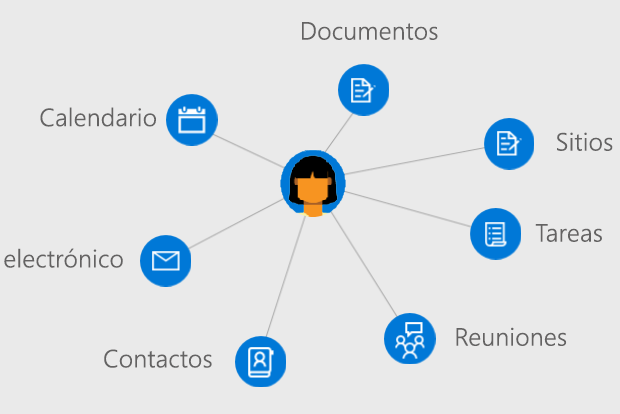

# Información general sobre los usuarios en Microsoft Graph

Los usuarios son la representación de una cuenta de usuario profesional o educativa de Azure Active Directory (Azure AD) o una cuenta Microsoft en Microsoft Graph. El recurso **user** en Microsoft Graph es un centro desde donde puede obtener acceso a las relaciones y recursos que son relevantes para los usuarios.

## Desarrollar aplicaciones centradas en el usuario

Puede usar Microsoft Graph para obtener acceso a las relaciones, documentos, contactos y preferencias que son relevantes contextualmente para el usuario que inició la sesión. El recurso **user** ofrece una forma sencilla de obtener acceso y manipular recursos de usuario sin tener que realizar llamadas adicionales, buscar información de autenticación específica y enviar directamente las consultas a otros recursos de Microsoft Graph.

Para obtener acceso a la información y los datos de un usuario, necesitará [obtener acceso en su nombre](auth-v2-user.md). Al autenticar su aplicación con el [consentimiento del administrador](permissions-reference.md), podrá trabajar con más entidades asociadas a un usuario, así como actualizarlas.

### Administración de su organización

Cree usuarios en la organización, o actualice los recursos y las relaciones de los usuarios existentes. Puede usar Microsoft Graph para realizar las siguientes tareas de administración de usuarios: 

- Crear o eliminar usuarios en la organización de Azure AD.
- Mostrar una lista de pertenencias a grupos de un usuario y determinar si es miembro de un grupo.
- Mostrar una lista de los usuarios subordinados de otro usuario y asignar responsables a un usuario.
- Cargar o recuperar una foto para el usuario.

### Trabajar con calendarios y tareas

Puede ver, consultar y actualizar el calendario de un usuario y los grupos de calendarios asociados con un usuario; por ejemplo, puede:

- Mostrar una lista y crear eventos en el calendario de un usuario.
- Ver las tareas asignadas a un usuario.
- Encontrar horas para reuniones libres para un conjunto de usuarios.
- Obtener una lista de avisos establecidos en el calendario de un usuario.

### Administrar correos y contactos

Puede configurar las opciones de correo de un usuario y las listas de contactos, así como enviar correo en nombre de un usuario; por ejemplo, puede:

- Mostrar una lista de mensajes de correo y enviar nuevos correos.
- Crear y mostrar listas de contactos del usuario, y organizar los contactos en carpetas.
- Recuperar y actualizar opciones de configuración y carpetas de buzones.

### Enriquecer la aplicación con información del usuario

Maximice la relevancia en la aplicación al promocionar los documentos y contactos con más actividad, o bien usados recientemente, que estén asociados a un usuario. Puede usar Microsoft Graph para:

- Devolver documentos vistos o modificados recientemente por un usuario.
- Devolver los documentos y sitios con más actividad de un usuario.
- Mostrar una lista de documentos compartidos con un usuario por correo electrónico o con OneDrive para la Empresa.

## Referencia de la API
¿Busca la referencia de la API para este servicio?

- [API de usuarios en Microsoft Graph v1.0](/graph/api/resources/users?view=graph-rest-1.0)
- [API de usuarios en Microsoft Graph beta](/graph/api/resources/users?view=graph-rest-beta)

## Pasos siguientes

- Obtenga más información sobre cómo [trabajar con usuarios](/graph/api/resources/users?view=graph-rest-1.0).
- Explore sus propios datos desde el recurso **user** en el [Probador de Graph](https://developer.microsoft.com/graph/graph-explorer).
- Autentíquese con Microsoft Graph [en nombre de un usuario](auth-v2-user.md), o bien [como un demonio o servicio con el consentimiento de un administrador](auth-v2-service.md).
- Establezca directivas y control de acceso para usuarios con la [API de Azure AD](/graph/api/resources/azure-ad-overview?view=graph-rest-1.0).
- Revise los [permisos](permissions-reference.md) de la aplicación necesarios para obtener acceso a datos de usuarios. 
<!-- This isn't really a next step; let's remove to keep the list of links concise.>
- Stay up to date with Microsoft Graph [changelog](changelog.md).
-->
