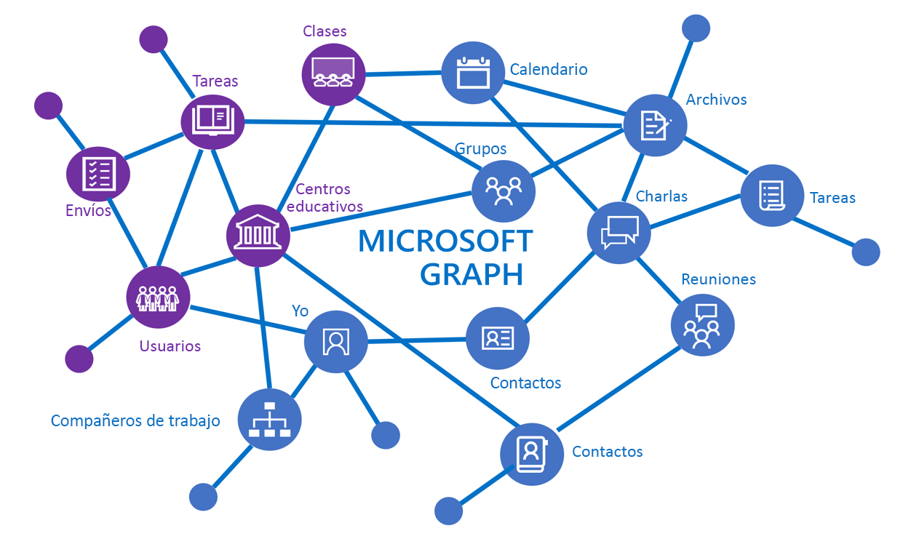

# Información general sobre la API de educación

La API de educación de Microsoft Graph mejora los recursos de Office 365 con información relevante para escenarios del ámbito educativo, como información sobre centros educativos, clases, usuarios (alumnos y profesores), tareas y envíos. Esto le permite crear fácilmente soluciones que se integren con recursos educativos para distintos escenarios de clase y centros educativos.

La API de educación de Microsoft Graph permite obtener acceso a clases, centros educativos, usuarios, tareas, envíos y más.

## ¿Por qué integrar con escenarios del ámbito educativo?

### Crear aplicaciones que conozcan la lista de clase

La mayoría de los desarrolladores de software educativo pronto se dan cuenta de que la lista de clase es uno de los datos fundamentales que necesitan para ejecutar su aplicación, y suele estar bloqueada dentro de un sistema de información de estudiantes (SIS) del centro educativo. Cada vez que los profesores llevan una nueva aplicación a clase, dedican tiempo a importar de forma manual los datos de listas de clase en la aplicación. Muchos ISV solucionan este problema al conectar con un SIS para importar los datos de listas de clase. Con cientos de sistemas de información de estudiantes con formatos privativos, esto puede resultar complicado. [Microsoft School Data Sync](https://sds.microsoft.com/), en combinación con API de lista, soluciona este problema para los centros educativos y los desarrolladores de aplicaciones.

Estos son algunos de los escenarios que facilitan las API de lista:

- [Obtener todas las clases de un centro educativo](https://developer.microsoft.com/en-us/graph/docs/api-reference/v1.0/api/educationschool_list_classes)
- [Obtener todos los usuarios de una clase](https://developer.microsoft.com/en-us/graph/docs/api-reference/v1.0/api/educationclass_list_members)
- [Obtener todas las clases en las que enseño](https://developer.microsoft.com/en-us/graph/docs/api-reference/v1.0/api/educationuser_list_classes)

### Usar Microsoft Teams para crear tareas de clase en una pestaña de tareas

Puede usar la API de tareas para crear una aplicación web que administre tareas de clase y que, después, integre su aplicación en Microsoft Teams en una nueva pestaña personalizada.  

Microsoft Teams en Office 365 es un centro digital que reúne conversaciones, contenido y aplicaciones en un mismo lugar para las clases. Microsoft Teams ofrece una [amplia variedad de puntos de extensibilidad](https://docs.microsoft.com/en-us/microsoftteams/platform/concepts/apps/apps-overview), como la creación de pestañas, conectores y bots. Estos puntos de extensibilidad pueden realizar llamadas a las API para el ámbito educativo de Microsoft Graph para trabajar con tareas y envíos. Cree una experiencia más completa al integrar su punto de extensión con cualquier otra API de Microsoft Graph, además de usar las API de tareas y envíos.

Para el ámbito educativo, las aplicaciones de pestaña personalizadas de Microsoft Teams se abren en un contexto de clase educativa (un equipo), donde tiene sentido administrar el flujo de tareas integral, desde la creación y la distribución hasta las calificaciones y los comentarios. Este es solo un ejemplo de cómo Microsoft Teams ahorra tiempo y simplifica la logística cotidiana, dejando a los formadores libres para dedicarse a sus alumnos.

En la imagen siguiente, se muestra una aplicación web para administrar tareas es una pestaña personalizada de tareas de una clase de **Ciencia: Biología 1**.

Con la API de tareas, la aplicación puede interactuar con el servicio de tareas fuera de Microsoft Teams. Microsoft Teams se encargará de la distribución, las fechas de entrega y las calificaciones, a la vez que su sistema puede ofrecer una experiencia de aprendizaje enriquecida a los alumnos.
Estos son algunos ejemplos de escenarios habilitados por la API de tareas:

- [Agregar una tarea que vincula a su aplicación](https://developer.microsoft.com/en-us/graph/docs/api-reference/beta/api/educationclass_post_assignments) 
- [Asignar calificaciones a alumnos individuales para las tareas vinculadas a la aplicación](https://developer.microsoft.com/en-us/graph/docs/api-reference/beta/api/educationsubmission_update)
- [Crear un panel de alumnos para mostrar las tareas pendientes por fecha](https://developer.microsoft.com/en-us/graph/docs/api-reference/beta/api/educationclass_list_assignments)

### Permitir a los administradores de centros educativos administrar las identidades y sincronizar la lista con la administración de School Data Sync (vista preliminar)

[School Data Sync](https://sds.microsoft.com/) permite automatizar el proceso de importar y sincronizar identidades de alumnos y datos de listas de clase de sistemas de información de estudiantes con Azure Active Directory (Azure AD) y Office 365. Después de sincronizar la información, puede usar las API de lista para leer la información de la lista desde las aplicaciones. Si es un integrador de sistemas que configura la integración de un sistema de información de estudiantes de un centro educativo con School Data Sync, puede usar las [API de administración de SDS](https://developer.microsoft.com/en-us/graph/docs/api-reference/beta/resources/educationsynchronizationprofile) en Microsoft Graph para configurar la sincronización desde un archivo CSV o un conector de API de un SIS admitido.

Las API de administración de School Data Sync admiten escenarios integrales para administrar la sincronización; por ejemplo:

- [Crear un perfil de sincronización que inicia automáticamente una sincronización](https://developer.microsoft.com/en-us/graph/docs/api-reference/beta/api/educationsynchronizationprofile_post)
- Administrar el ciclo de vida de sincronización con operaciones de [pausar](https://developer.microsoft.com/en-us/graph/docs/api-reference/beta/api/educationsynchronizationprofile_pause), [reanudar](https://developer.microsoft.com/en-us/graph/docs/api-reference/beta/api/educationsynchronizationprofile_resume) y [restablecer](https://developer.microsoft.com/en-us/graph/docs/api-reference/beta/api/educationsynchronizationprofile_reset)

## Pasos siguientes

- Para empezar a usar las API para el ámbito educativo, vea:
    - [Usar las API de lista](https://developer.microsoft.com/en-us/graph/docs/api-reference/v1.0/resources/education-overview)
    - [Usar las API de tareas](https://developer.microsoft.com/en-us/graph/docs/api-reference/beta/resources/educationassignment)
    - [Usar las API de administración de SDS](https://developer.microsoft.com/en-us/graph/docs/api-reference/beta/resources/educationsynchronizationprofile)
- Pruebe las API para el ámbito educativo en el [Probador de Graph](https://developer.microsoft.com/en-us/graph/graph-explorer).
- Explore los siguientes ejemplos relacionados con la educación:
    - [Ejemplo de .NET para SSO y listas de clase](https://github.com/OfficeDev/O365-EDU-AspNetMVC-Samples)
    - [Ejemplo de Angular Node para SSO y listas de clase](https://github.com/OfficeDev/O365-EDU-AngularNodeJS-Samples)   
    - [Ejemplo de Python para SSO y listas de clase](https://github.com/OfficeDev/O365-EDU-Python-Samples)
    - [Ejemplo de PHP para SSO y listas de clase](https://github.com/OfficeDev/O365-EDU-PHP-Samples)
    - [Ejemplos de las API de administración de perfiles](https://github.com/OfficeDev/O365-EDU-SDS-AspNetMVC-Samples) 

 

