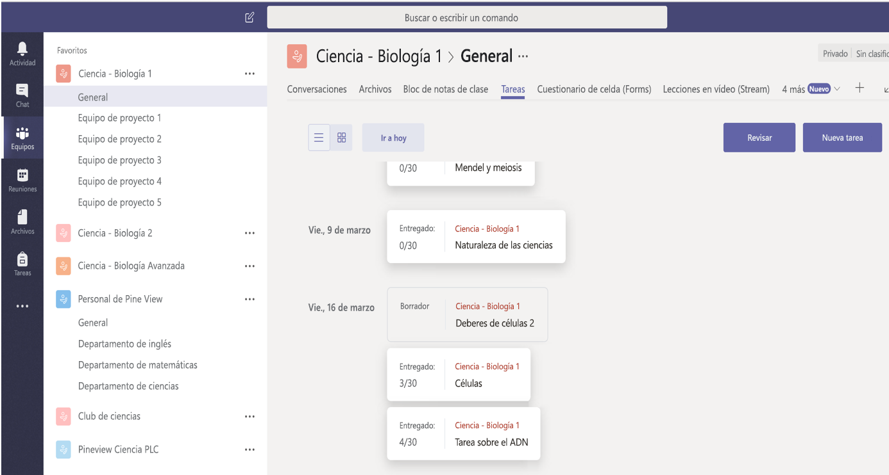

# Información general sobre la API de educaciónEducation API overview

La API de educación de Microsoft Graph mejora los recursos de Office 365 con información relevante para escenarios del ámbito educativo, como información sobre centros educativos, clases, usuarios (alumnos y profesores), tareas y envíos.The education API in Microsoft Graph enhances Office 365 resources with information that is relevant for education scenarios, including information about schools, classes, users (students and teachers), assignments, and submissions. Esto le permite crear fácilmente soluciones que se integren con recursos educativos para distintos escenarios de clase y centros educativos.This makes it easy for you to build solutions that integrate with educational resources for various school and classroom scenarios.

La API de educación de Microsoft Graph permite obtener acceso a clases, centros educativos, usuarios, tareas, envíos y más.The education API in Microsoft Graph provides access to classes, schools, users, assignments, submissions and more.

## ¿Por qué integrar con escenarios del ámbito educativo?Why integrate with education scenarios?

### Crear aplicaciones que conozcan la lista de claseBuild applications that are aware of class roster

La mayoría de los desarrolladores de software educativo pronto se dan cuenta de que la lista de clase es uno de los datos fundamentales que necesitan para ejecutar su aplicación, y suele estar bloqueada dentro de un sistema de información de estudiantes (SIS) del centro educativo.Most education software developers learn early on that class roster is one of the key pieces of information they need to run their application, and it's typically locked away inside a school Student Information System (SIS). Cada vez que los profesores llevan una nueva aplicación a clase, dedican tiempo a importar de forma manual los datos de listas de clase en la aplicación.Any time teachers bring a new application into their classroom, they spend time manually importing roster data into the app. Muchos ISV solucionan este problema al conectar con un SIS para importar los datos de listas de clase.Many ISVs address this by connecting with a SIS to import roster data. Con cientos de sistemas de información de estudiantes con formatos privativos, esto puede resultar complicado.With hundreds of Student Information Systems with proprietary formats, this can become a challenge. [Microsoft School Data Sync](https://sds.microsoft.com/), en combinación con API de lista, soluciona este problema para los centros educativos y los desarrolladores de aplicaciones.[Microsoft School Data Sync](https://sds.microsoft.com/), combined with roster APIs, addresses this challenge for application developers and schools.

Estos son algunos de los escenarios que facilitan las API de lista:The following are some of the scenarios that the roster APIs enable:

- [Obtener todas las clases de un centro educativoGet all classes in a school](https://developer.microsoft.com/en-us/graph/docs/api-reference/v1.0/api/educationschool_list_classes)
- [Obtener todos los usuarios de una claseGet all users in a class](https://developer.microsoft.com/en-us/graph/docs/api-reference/v1.0/api/educationclass_list_members)
- [Obtener todas las clases en las que enseñoGet all the classes I teach](https://developer.microsoft.com/en-us/graph/docs/api-reference/v1.0/api/educationuser_list_classes)

### Usar Microsoft Teams para crear tareas de clase en una pestaña de tareasUse Microsoft Teams to create class assignments in an assignments tab

Puede usar la API de tareas para crear una aplicación web que administre tareas de clase y que, después, integre su aplicación en Microsoft Teams en una nueva pestaña personalizada.You can use the assignments API to create a web app that manages class assignments and then integrate your app into Microsoft Teams on a new custom tab.  

Microsoft Teams en Office 365 es un centro digital que reúne conversaciones, contenido y aplicaciones en un mismo lugar para las clases.Microsoft Teams in Office 365 is a digital hub that brings conversations, content, and apps together in one place for classrooms. Microsoft Teams ofrece una [amplia variedad de puntos de extensibilidad](https://docs.microsoft.com/en-us/microsoftteams/platform/concepts/apps/apps-overview), como la creación de pestañas, conectores y bots.Microsoft Teams provides a [rich set of extensibility points](https://docs.microsoft.com/en-us/microsoftteams/platform/concepts/apps/apps-overview), including creating Tabs, Connectors, and Bots. Estos puntos de extensibilidad pueden realizar llamadas a las API para el ámbito educativo de Microsoft Graph para trabajar con tareas y envíos.These extensibility points can call education APIs in Microsoft Graph to work with assignments and submissions. Cree una experiencia más completa al integrar su punto de extensión con cualquier otra API de Microsoft Graph, además de usar las API de tareas y envíos.Build a more comprehensive experience by enabling your extension point with any other Microsoft Graph API along with assignment and submission APIs.

Para el ámbito educativo, las aplicaciones de pestaña personalizadas de Microsoft Teams se abren en un contexto de clase educativa (un equipo), donde tiene sentido administrar el flujo de tareas integral, desde la creación y la distribución hasta las calificaciones y los comentarios.For education, Microsoft Teams custom tab apps are opened in an education class (a team) context, where it makes sense to manage the end-to-end assignment flow, from creation and distribution to grading and feedback. Este es solo un ejemplo de cómo Microsoft Teams ahorra tiempo y simplifica la logística cotidiana, dejando a los formadores libres para dedicarse a sus alumnos.This is just one example of how Microsoft Teams saves time and simplifies everyday logistics, leaving educators free to dedicate themselves to their students.

En la imagen siguiente, se muestra una aplicación web para administrar tareas es una pestaña personalizada de tareas de una clase de **Ciencia: Biología 1**.The following image shows a web app for managing assignments in an Assignments custom Tab for a **Science - Biology 1** class.

Con la API de tareas, la aplicación puede interactuar con el servicio de tareas fuera de Microsoft Teams.With the assignment API, your app can interact with the assignment service outside of Microsoft Teams. Microsoft Teams se encargará de la distribución, las fechas de entrega y las calificaciones, a la vez que su sistema puede ofrecer una experiencia de aprendizaje enriquecida a los alumnos.Microsoft Teams will handle distribution, due dates, and grading while your system can provide a rich learning experience to students.
Estos son algunos ejemplos de escenarios habilitados por la API de tareas:The following are examples of a few scenarios enabled by the assignments API:

- [Agregar una tarea que vincula a su aplicaciónAdd an assignment that links to your application](https://developer.microsoft.com/en-us/graph/docs/api-reference/beta/api/educationclass_post_assignments) 
- [Asignar calificaciones a alumnos individuales para las tareas vinculadas a la aplicaciónAssign grades to individual students for assignments linked to your application](https://developer.microsoft.com/en-us/graph/docs/api-reference/beta/api/educationsubmission_update)
- [Crear un panel de alumnos para mostrar las tareas pendientes por fechaCreate a student dashboard to show which assignments are due by when](https://developer.microsoft.com/en-us/graph/docs/api-reference/beta/api/educationclass_list_assignments)

### Permitir a los administradores de centros educativos administrar las identidades y sincronizar la lista con la administración de School Data Sync (vista preliminar)Enable school admins to manage identity and roster sync using School Data Sync Management (preview)

[School Data Sync](https://sds.microsoft.com/) permite automatizar el proceso de importar y sincronizar identidades de alumnos y datos de listas de clase de sistemas de información de estudiantes con Azure Active Directory (Azure AD) y Office 365.[School Data Sync](https://sds.microsoft.com/) helps to automate the process of importing and synchronizing student identity and roster data from student information systems with Azure Active Directory (Azure AD) and Office 365. Después de sincronizar la información, puede usar las API de lista para leer la información de la lista desde las aplicaciones.When the information is synchronized, you can use the roster APIs to read the roster information into the applications. Si es un integrador de sistemas que configura la integración de un sistema de información de estudiantes de un centro educativo con School Data Sync, puede usar las [API de administración de SDS](https://developer.microsoft.com/en-us/graph/docs/api-reference/beta/resources/educationsynchronizationprofile) en Microsoft Graph para configurar la sincronización desde un archivo CSV o un conector de API de un SIS admitido.If you're a system integrator setting up integration of a school's Student Information System with School Data Sync, you can use the [SDS management APIs](https://developer.microsoft.com/en-us/graph/docs/api-reference/beta/resources/educationsynchronizationprofile) in Microsoft Graph to set up synchronization from either a CSV file or a supported SIS API connector.

Las API de administración de School Data Sync admiten escenarios integrales para administrar la sincronización; por ejemplo:School Data Sync management APIs support end-to-end scenarios for managing sync; for example:

- [Crear un perfil de sincronización que inicia automáticamente una sincronizaciónCreate a synchronization profile that automatically starts a sync](https://developer.microsoft.com/en-us/graph/docs/api-reference/beta/api/educationsynchronizationprofile_post)
- Administrar el ciclo de vida de sincronización con operaciones de [pausar](https://developer.microsoft.com/en-us/graph/docs/api-reference/beta/api/educationsynchronizationprofile_pause), [reanudar](https://developer.microsoft.com/en-us/graph/docs/api-reference/beta/api/educationsynchronizationprofile_resume) y [restablecer](https://developer.microsoft.com/en-us/graph/docs/api-reference/beta/api/educationsynchronizationprofile_reset)Manage sync lifecycle with [pause](https://developer.microsoft.com/en-us/graph/docs/api-reference/beta/api/educationsynchronizationprofile_pause), [resume](https://developer.microsoft.com/en-us/graph/docs/api-reference/beta/api/educationsynchronizationprofile_resume) and [reset](https://developer.microsoft.com/en-us/graph/docs/api-reference/beta/api/educationsynchronizationprofile_reset) operations

## Pasos siguientesNext Steps

- Para empezar a usar las API para el ámbito educativo, vea:To start using the education APIs, see:
    - [Usar las API de listaUse the roster APIs](https://developer.microsoft.com/en-us/graph/docs/api-reference/v1.0/resources/education-overview)
    - [Usar las API de tareasUse the assignment APIs](https://developer.microsoft.com/en-us/graph/docs/api-reference/beta/resources/educationassignment)
    - [Usar las API de administración de SDSUse the SDS management APIs](https://developer.microsoft.com/en-us/graph/docs/api-reference/beta/resources/educationsynchronizationprofile)
- Pruebe las API para el ámbito educativo en el [Probador de Graph](https://developer.microsoft.com/en-us/graph/graph-explorer).Try the education APIs in [Graph Explorer](https://developer.microsoft.com/en-us/graph/graph-explorer).
- Explore los siguientes ejemplos relacionados con la educación:Explore the following education-related samples:
    - [Ejemplo de .NET para SSO y listas de clase.NET sample for SSO & Rostering](https://github.com/OfficeDev/O365-EDU-AspNetMVC-Samples)
    - [Ejemplo de Angular Node para SSO y listas de claseAngular Node sample for SSO & Rostering](https://github.com/OfficeDev/O365-EDU-AngularNodeJS-Samples)   
    - [Ejemplo de Python para SSO y listas de clasePython sample for SSO & Rostering](https://github.com/OfficeDev/O365-EDU-Python-Samples)
    - [Ejemplo de PHP para SSO y listas de clasePHP sample for for SSO & Rostering](https://github.com/OfficeDev/O365-EDU-PHP-Samples)
    - [Ejemplos de las API de administración de perfilesSample for profile management APIs](https://github.com/OfficeDev/O365-EDU-SDS-AspNetMVC-Samples) 

 

