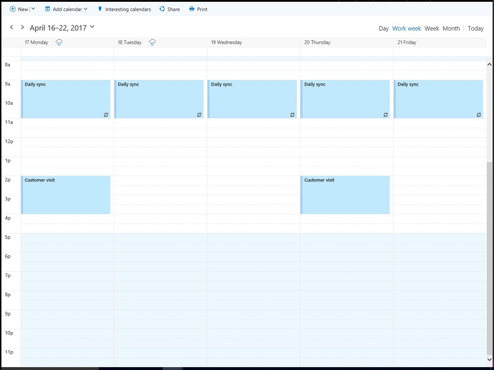
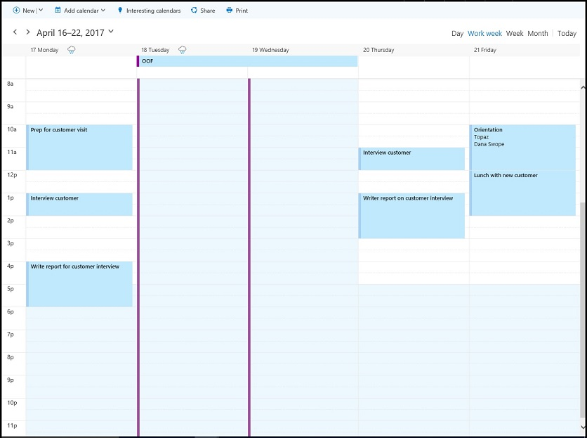

# <a name="find-possible-meeting-times-on-the-outlook-calendar"></a>Buscar horas posibles para una reunión en el Calendario de Outlook

Buscar un horario y un lugar comunes para reunirse en un área profesional o académica a menudo conlleva sobrecargas. Las aplicaciones de Microsoft Graph pueden utilizar [findMeetingTimes](/graph/api/user-findmeetingtimes?view=graph-rest-1.0) para identificar cualquier hora posible para una reunión que cumpla con los horarios, la ubicación y otras restricciones.   

La acción **findMeetingTimes** permite especificar condiciones como el rango de fechas o el intervalo horario para una reunión, así como la duración, los asistentes opcionales y necesarios, y la naturaleza de la actividad (**activityDomain**). La acción tiene en cuenta la disponibilidad y la programación profesional habitual de los asistentes y organizadores, y sugiere los horarios que son adecuados para los participantes y el tipo de actividad. Por ejemplo, las sugerencias para una actividad de trabajo siempre se producen durante las horas de trabajo del organizador y los asistentes, y las sugerencias donde los asistentes necesarios están disponibles se ordenan en la parte de arriba de la lista de sugerencias.

En Office 365, las horas de trabajo y las zonas horarias se pueden configurar en cada buzón. La acción **findMeetingTimes** controla las variaciones entre las zonas horarias del organizador y los asistentes. De manera predeterminada, **findMeetingTimes** devuelve sugerencias en UTC. Puede utilizar el siguiente encabezado de la solicitud para que **findMeetingTimes** devuelva sugerencias expresadas en una zona horaria específica.
```
Prefer: outlook.timezone="{time-zone-string}}"
```

Es posible especificar un porcentaje (**minimumAttendeePercentage**) para un cuórum y hacer que **findMeetingTimes** devuelva sugerencias solo si está disponible un número mínimo de asistentes, lo que es especialmente útil para reuniones de mayor tamaño.

Si **findMeetingTimes** no puede sugerir un horario de reunión, indica un motivo específico (**emptySuggestionsReason**), como que el organizador o un asistente necesario no están disponibles. Basándose en este valor, se pueden ajustar mejor los parámetros y llamar otra vez a **findMeetingTimes**.

>**Nota** La acción **findMeetingTimes** en este momento está disponible para buzones profesionales o educativos de Office 365, pero no para los personales, ni los buzones de correo de outlook.com.

## <a name="example"></a>Ejemplo

En el siguiente ejemplo, se muestra cómo utilizar **findMeetingTimes** para devolver las horas posibles para que dos usuarios se reúnan durante un par de horas, teniendo en cuenta la programación profesional y la disponibilidad de los usuarios, y que los asistentes estarán ausentes durante una parte del tiempo. Como solo hay dos usuarios para esta reunión, las sugerencias requieren la asistencia del 100 %. A continuación, se muestra la disponibilidad de los usuarios.

### <a name="organizers-calendar"></a>Calendario del organizador



### <a name="attendees-calendar"></a>Calendario de los asistentes



El ejemplo realiza dos llamadas a **findMeetingTimes**:

1. La primera llamada se busca dentro del intervalo de fechas del 18 al 20 de abril. Cuando el asistente se encuentra fuera de la oficina el 18 o 19 de abril y no hay ningún horario habitual disponible el 20 de abril, la primera llamada no devuelve ninguna sugerencia con el motivo (**emptySuggestionsReason**) de que los asistentes no están disponibles.
2. La segunda llamada busca la disponibilidad el 21 de abril y devuelve una sugerencia de las 14 a las 16 horas.

Las dos llamadas a **findMeetingTimes** incluyen los siguientes parámetros. Todos los [parámetros](/graph/api/user-findmeetingtimes?view=graph-rest-1.0#request-body) de **findMeetingTimes** son opcionales.

- **asistentes**: uno de los asistentes, Naiara Padilla, se establece como `required` de la propiedad **type**
- **locationConstraint**: no se requiere ninguna sugerencia de ubicación
- **timeConstraint**: la primera llamada se busca en el rango de fechas o intervalo horario del 18 de abril a las 9 horas al 20 de abril a las 17 horas; después de que la primera llamada falla al sugerir horarios, la segunda llamada considera el 21 de abril de 9 a 17 horas
- **meetingDuration**: dos horas
- **returnSuggestionReasons**: en este ejemplo se requiere un motivo para cada sugerencia
- **minimumAttendeePercentage**: 100 %, dado que el asistente debe poder asistir en cualquier horario sugerido

### <a name="first-request"></a>Primera solicitud

Busque un intervalo de tiempo libre de dos horas para ambos usuarios entre el 18 y el 20 de abril.

<!-- {
  "blockType": "ignored",
  "name": "findmeetingtimes_example_first"
}-->
```http
POST https://graph.microsoft.com/v1.0/me/findMeetingTimes
Prefer: outlook.timezone="Pacific Standard Time"
Content-type: application/json

{ 
  "attendees": [ 
    { 
      "type": "required",  
      "emailAddress": { 
        "name": "Samantha Booth",
        "address": "samanthab@contoso.onmicrosoft.com" 
      } 
    }
  ],  
  "locationConstraint": { 
    "isRequired": false,  
    "suggestLocation": false,  
    "locations": [ 
      { 
        "resolveAvailability": false,
        "displayName": "Conf room Hood" 
      } 
    ] 
  },  
  "timeConstraint": {
    "activityDomain":"work", 
    "timeslots": [ 
      { 
        "start": { 
          "dateTime": "2017-04-18T09:00:00",  
          "timeZone": "Pacific Standard Time" 
        },  
        "end": { 
          "dateTime": "2017-04-20T17:00:00",  
          "timeZone": "Pacific Standard Time" 
        } 
      } 
    ] 
  },  
  "meetingDuration": "PT2H",
  "returnSuggestionReasons": true,
  "minimumAttendeePercentage": 100
}
```

### <a name="first-response"></a>Primera respuesta
No hay ningún intervalo de tiempo de dos horas en el horario laboral del 18 al 20 de abril en el que ambos usuarios estén disponibles.
<!-- {
  "blockType": "ignored",
  "truncated": true,
  "@odata.type": "microsoft.graph.meetingTimeSuggestionsResult",
  "isCollection": false
} -->
```http
HTTP/1.1 200 OK
Content-type: application/json
Preference-Applied: outlook.timezone="Pacific Standard Time"
Content-Length: 184

{
    "@odata.context":"https://graph.microsoft.com/v1.0/$metadata#microsoft.graph.meetingTimeSuggestionsResult",
    "emptySuggestionsReason":"AttendeesUnavailable",
    "meetingTimeSuggestions":[

    ]
}
```

### <a name="second-request"></a>Segunda solicitud
Busque un intervalo de tiempo de dos horas el 21 de abril.
<!-- {
  "blockType": "ignored",
  "name": "findmeetingtimes_example_second"
}-->
```http
POST https://graph.microsoft.com/v1.0/me/findMeetingTimes
Prefer: outlook.timezone="Pacific Standard Time"
Content-type: application/json

{ 
  "attendees": [ 
    { 
      "type": "required",  
      "emailAddress": { 
        "name": "Samantha Booth",
        "address": "samanthab@contoso.onmicrosoft.com" 
      } 
    }
  ],  
  "locationConstraint": { 
    "isRequired": false,  
    "suggestLocation": false,  
    "locations": [ 
      { 
        "resolveAvailability": false,
        "displayName": "Conf room Hood" 
      } 
    ] 
  },  
  "timeConstraint": {
    "activityDomain":"work", 
    "timeslots": [ 
      { 
        "start": { 
          "dateTime": "2017-04-21T09:00:00",  
          "timeZone": "Pacific Standard Time" 
        },  
        "end": { 
          "dateTime": "2017-04-21T17:00:00",  
          "timeZone": "Pacific Standard Time" 
        } 
      } 
    ] 
  },  
  "meetingDuration": "PT2H",
  "returnSuggestionReasons": true,
  "minimumAttendeePercentage": 100
}
```

### <a name="second-response"></a>Segunda respuesta
La segunda solicitud **findMeetingTimes** sugiere el 21 de abril de las 14 a las 16 horas para que ambos usuarios se reúnan.
<!-- {
  "blockType": "ignored",
  "truncated": true,
  "@odata.type": "microsoft.graph.meetingTimeSuggestionsResult",
  "isCollection": false
} -->
```http
HTTP/1.1 200 OK
Content-type: application/json
Preference-Applied: outlook.timezone="Pacific Standard Time"
Content-Length: 714

{
    "@odata.context":"https://graph.microsoft.com/v1.0/$metadata#microsoft.graph.meetingTimeSuggestionsResult",
    "emptySuggestionsReason":"",
    "meetingTimeSuggestions":[
        {
            "confidence":100.0,
            "organizerAvailability":"free",
            "suggestionReason":"Suggested because it is one of the nearest times when all attendees are available.",
            "meetingTimeSlot":{
                "start":{
                    "dateTime":"2017-04-21T14:00:00.0000000",
                    "timeZone":"Pacific Standard Time"
                },
                "end":{
                    "dateTime":"2017-04-21T16:00:00.0000000",
                    "timeZone":"Pacific Standard Time"
                }
            },
            "attendeeAvailability":[
                {
                    "availability":"free",
                    "attendee":{
                        "type":"required",
                        "emailAddress":{
                            "address":"samanthab@contoso.onmicrosoft.com"
                        }
                    }
                }
            ],
            "locations":[
                {
                    "displayName":"Conf room Hood"
                }
            ]
        }
    ]
}
```


## <a name="next-steps"></a>Siguientes pasos

Hay ocasiones en las que no todos los asistentes pueden asistir a una reunión. Puede hacer que **findMeetingTimes** sugiera una hora si la _seguridad_ de asistencia alcanza un determinado porcentaje al especificar el parámetro opcional **minimumAttendeePercentage**. Obtenga más información acerca de la [seguridad de una sugerencia de reunión](/graph/api/user-findmeetingtimes?view=graph-rest-1.0#the-confidence-of-a-meeting-suggestion) y otros [parámetros](/graph/api/user-findmeetingtimes?view=graph-rest-1.0#request-body) y cómo aplicarlos según corresponda para las reuniones de mayor tamaño.

Después de obtener sugerencias para horas de reunión, le recomendamos que:

1. [Cree un evento y lo envíe como una convocatoria de reunión](/graph/api/user-post-events?view=graph-rest-1.0).
2. [Agregue datos adjuntos](/graph/api/event-post-attachments?view=graph-rest-1.0) al evento.

Obtenga más información sobre la [integración con el Calendario de Outlook](outlook-calendar-concept-overview.md).
