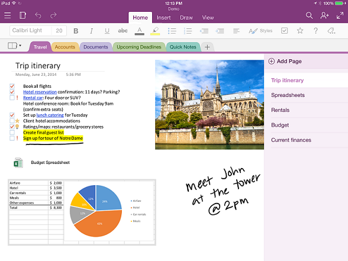

# Información general sobre la API de OneNoteOneNote API overview

OneNote es un bloc de notas digital que permite a los clientes realizar un seguimiento de ideas y notas para el hogar, trabajo o escuela por voz, esbozando o escribiendo en la web, teléfonos, tabletas o el escritorio.OneNote is a digital notebook that lets customers track ideas and notes for home, school, or work, by typing, sketching, or voice, on the web, phone, tablet, or desktop. Pueden organizar notas libremente, cambiar de dispositivo y retomar el trabajo donde lo dejaron, así como colaborar en las notas con otras personas en tiempo real.They can freely organize notes, switch devices and pick up where they leave off, and collaborate on notes with others in real time.

## ¿Por qué debería realizar la integración con OneNote?Why integrate with OneNote?

Al integrar sus aplicaciones con OneNote, puede crear experiencias enriquecedoras en varias plataformas que llegan a millones de usuarios en todo el mundo.By integrating your apps with OneNote, you can create empowering experiences across multiple platforms that reach millions of users worldwide. Puede usar Microsoft Graph para tener acceso a los blocs de notas, secciones y páginas de OneNote para crear soluciones que ayuden a los usuarios a planear y organizar las ideas y la información.
You can use Microsoft Graph to access notebooks, sections, and pages in OneNote to create solutions that help your users plan and organize ideas and information.

### Recopilar y organizar notas e ideasCollect and organize notes and ideas  

Use OneNote como un lienzo donde los usuarios pueden agregar y organizar su contenido.Use OneNote as a canvas where users can add and arrange their content. Microsoft Graph facilita la escritura de aplicaciones que permiten a los alumnos tomar notas e investigar, a las familias compartir planes e ideas, y a los compradores compartir imágenes.
Microsoft Graph makes it easy to write apps that enable students to take notes and do research, families to share plans and ideas, or shoppers to share pictures. Su aplicación puede obtener la información que la gente quiere, enviarla a OneNote y luego ayudarles a organizarla.Your app can grab the information people want, send it to OneNote, and then help them organize it.

### Capturar la información en varios formatosCapture information in many formats

Captura de HTML, imágenes insertadas (originadas localmente o en una dirección URL pública), vídeo, audio, mensajes de correo electrónico y otros tipos de archivo comunes.Capture HTML, embed images (sourced locally or at a public URL), video, audio, email messages, and other common file types. OneNote puede incluso presentar páginas web y archivos PDF como instantáneas.OneNote can even render webpages and PDF files as snapshots. Microsoft Graph admite un conjunto HTML y CSS estándar para el diseño de página de OneNote, así que puede usar tablas, imágenes incorporadas y formato básico para conseguir el aspecto que quiera.Microsoft Graph supports a set of standard HTML and CSS for OneNote page layout, so you can use tables, inline images, and basic formatting to get the look you want. 

### Usar el ecosistema de OneNote para mejorar los escenarios básicosUse the OneNote ecosystem to enhance your core scenarios

Aproveche otras poderosas características de OneNote.
Tap into other powerful OneNote features. Las API de OneNote en Microsoft Graph ejecutan OCR en imágenes, son compatibles con la búsqueda de texto completo, sincronizan los clientes automáticamente, procesan imágenes y extraen capturas de tarjetas de presentación y descripciones de productos y recetas en línea.The OneNote APIs in Microsoft Graph run OCR on images, support full-text search, auto-syncs clients, process images, and extract business card captures and online product and recipe listings. Use OneNote como almacén de memoria digital en la nube para notas y elementos multimedia ligeros, o como fuente de datos para datos específicos de dominio.Use OneNote as your digital memory store in the cloud for notes and lightweight media, or as a data feed for domain-specific data. 

### Llegar a millones de usuarios de OneNote en todas las plataformas principalesReach millions of OneNote users on all major platforms

Use OneNote para aumentar el uso de la aplicación.Use OneNote to increase your app usage. OneNote está preinstalado en los nuevos dispositivos de Windows y está disponible para la mayoría de las plataformas, en línea y como parte de Office 365.OneNote is preinstalled on new Windows devices, and is available for most platforms, online, and as part of Office 365. Al publicar aplicaciones que usan el entorno completo de OneNote, tendrá acceso al amplio potencial de mercado multiplataforma.When you publish apps that use the feature-rich OneNote environment, you have access to broad cross-platform market potential.

<!-- Might be good to show a few examples of Microsoft Graph API calls here, similar to what we have in the featured scenarios topic: https://developer.microsoft.com/en-us/graph/docs/concepts/featured_scenarios. You could have an H2 section called "What can I do with OneNote APIs in Microsoft Graph?"-->

## ¿Qué puedo hacer con las API de OneNote en Microsoft Graph?What can I do with OneNote APIs in Microsoft Graph?

A continuación se enumeran algunas de las solicitudes más populares para trabajar con los recursos de OneNote.The following are some of the most popular requests for working with OneNote resources.

|OperaciónOperation|URLURL|
|:--------|:--|
|OBTENER mis blocs de notasGET my notebooks|[https://graph.microsoft.com/v1.0/me/onenote/notebooks](https://developer.microsoft.com/en-us/graph/graph-explorer?request=me/onenote/notebooks&version=1.0)|
|OBTENER mis seccionesGET my sections|[https://graph.microsoft.com/v1.0/me/onenote/sections](https://developer.microsoft.com/en-us/graph/graph-explorer?request=me/onenote/sections&version=1.0)|
|OBTENER mis páginasGET my pages|[https://graph.microsoft.com/v1.0/me/onenote/pages](https://developer.microsoft.com/en-us/graph/graph-explorer?request=me/onenote/pages&version=1.0)|

## Más información sobre las API de OneNoteLearn more about OneNote APIs

Realice un análisis exhaustivo de las API de Microsoft Graph para obtener información sobre las capacidades de actualización de contenido de OneNote.Take an in-depth look at Microsoft Graph APIs to learn about the OneNote content updating capabilities. Los temas de la siguiente lista muestran cómo crear nuevas páginas de OneNote y actualizar páginas existentes con nuevo contenido.The topics in the following list show you how to create new OneNote pages and update existing pages with new content. También obtendrá información sobre procedimientos recomendados para usar Microsoft Graph para actualizar los blocs de notas de OneNote.You'll also learn about best practices in using Microsoft Graph to update OneNote notebooks. 

### Trabajar con OneNoteWork with OneNote

* [Usar la API de REST de OneNoteUse the OneNote REST API](../api-reference/v1.0/resources/onenote-api-overview.md)
* [Procedimientos recomendadosBest practices](onenote_best_practices.md)
* [Instrucciones de personalización de marcasBranding guidelines](onenote-branding.md)
* [Abrir el cliente de OneNoteOpen the OneNote client](open_onenote_client.md)
* [Usar etiquetas en páginas de OneNoteUse note tags in OneNote pages](onenote-note-tags.md)
* [Códigos de error de las API de OneNote en Microsoft GraphError codes for OneNote APIs in Microsoft Graph](onenote_error_codes.md)

### Trabajar con páginas de OneNoteWork with OneNote pages

* [HTML de entrada y salida en páginas de OneNoteInput and output HTML in OneNote pages](onenote_input_output_html.md)
* [Obtener el contenido y la estructura de OneNote con Microsoft GraphGet OneNote content and structure with Microsoft Graph](onenote-get-content.md)
* [Crear páginas de OneNoteCreate OneNote pages](onenote-create-page.md)
* [Actualizar el contenido de la página de OneNoteUpdate OneNote page content](onenote_update_page.md)

### Trabajar con el contenido de la página de OneNoteWork with OneNote page content

* [Crear elementos con posición absoluta en páginas de OneNoteCreate absolute positioned elements in OneNote pages](onenote-abs-pos.md)
* [Agregar imágenes, vídeos y archivos a páginas de OneNoteAdd images, videos, and files to OneNote pages](onenote_images_files.md)
* [Usar las etiquetas div de la API de OneNote para extraer datos de capturasUse OneNote API div tags to extract data from captures](onenote-extract-data.md)

## Explorar las API de OneNoteExplore the OneNote APIs

Use el [Probador de Microsoft Graph](https://developer.microsoft.com/es-ES/graph/graph-explorer) para probar las API de OneNote con sus propios blocs de notas de OneNote.Use the [Microsoft Graph Explorer](https://developer.microsoft.com/es-ES/graph/graph-explorer) to try out the OneNote APIs with your own OneNote notebooks.

Para realizar llamadas a la API de OneNote desde el Probador de Graph, seleccione **Mostrar más ejemplos** en la columna de la izquierda.To make OneNote API calls from the Graph Explorer, choose **Show more samples** in the column on the left. Use el menú para **activar** OneNote.Use the menu to toggle OneNote **On**. También tendrá que habilitar los permisos adecuados.You will also need to enable the appropriate permissions. Bajo el nombre de cuenta en el menú de la izquierda, elija **Modificar permisos**.Under your account name in the menu on the left, choose **modify permissions**. Para obtener más información sobre los permisos de OneNote, consulte [Permisos de notas](permissions_reference.md#notes-permissions).For more information about OneNote permissions, see [Notes permissions](permissions_reference.md#notes-permissions).

Para comenzar con las API de OneNote en Microsoft Graph, vea el [contenido de referencia de OneNote](../api-reference/v1.0/resources/onenote-api-overview.md).To get started with OneNote APIs in Microsoft Graph, see the [OneNote reference content](../api-reference/v1.0/resources/onenote-api-overview.md).

## Vea tambiénSee also

- [Desarrollo de OneNoteOneNote development](https://docs.microsoft.com/es-ES/previous-versions/office/office-365-api/how-to/onenote-landing)
- [Trabajar con blocs de notas de claseWork with class notebooks](https://docs.microsoft.com/es-ES/previous-versions/office/office-365-api/how-to/onenote-classnotebook)
- [Trabajar con blocs de notas de clase asincrónicosWork with class notebooks](https://docs.microsoft.com/es-ES/previous-versions/office/office-365-api/how-to/onenote-classnotebook-asynchronous)
- [Trabajar con blocs de notas para docentesWork with staff notebooks](https://docs.microsoft.com/es-ES/previous-versions/office/office-365-api/how-to/onenote-staffnotebook)
- [Copiar blocs de notas, secciones y páginasCopy notebooks, sections, and pages](https://docs.microsoft.com/es-ES/previous-versions/office/office-365-api/how-to/onenote-copy)
- [Administrar los permisos de las entidades de OneNoteManage permissions on OneNote entities](https://docs.microsoft.com/es-ES/previous-versions/office/office-365-api/how-to/onenote-manage-perms)
- [Usar el cuadro de diálogo de guardar de OneNote en sus páginas webUse the OneNote save dialog on your web pages](https://docs.microsoft.com/es-ES/previous-versions/office/office-365-api/how-to/onenote-save-dialog)
- [Suscribirse a webhooksSubscribe to webhooks](https://docs.microsoft.com/es-ES/previous-versions/office/office-365-api/how-to/onenote-sync)
