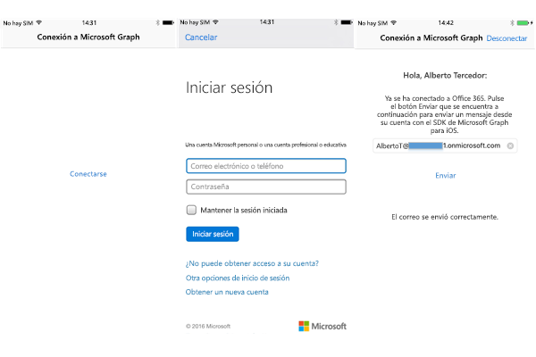

# <a name="get-started-with-microsoft-graph-in-a-swift-ios-app"></a><span data-ttu-id="3047d-101">Introducción a Microsoft Graph en una aplicación de iOS con Swift</span><span class="sxs-lookup"><span data-stu-id="3047d-101">Get started with Microsoft Graph in a Swift iOS App</span></span>

> <span data-ttu-id="3047d-p101">**¿Desea compilar aplicaciones para clientes empresariales?** Es posible que la aplicación no funcione si su cliente empresarial activa características de seguridad de movilidad empresarial como el <a href="https://azure.microsoft.com/en-us/documentation/articles/active-directory-conditional-access-device-policies/" target="_newtab">acceso condicional al dispositivo</a>. En casos así, es posible que no tenga constancia de esta activación y que sus clientes obtengan errores.</span><span class="sxs-lookup"><span data-stu-id="3047d-p101">**Building apps for enterprise customers?** Your app may not work if your enterprise customer turns on enterprise mobility security features like <a href="https://azure.microsoft.com/en-us/documentation/articles/active-directory-conditional-access-device-policies/" target="_newtab">conditional device access</a>. In this case, you may not know and your customers may experience errors.</span></span> 

> <span data-ttu-id="3047d-p102">Para ser compatible con **todos los clientes empresariales** en **todos los escenarios de empresa**, tiene que usar el punto de conexión de AD de Azure y administrar las aplicaciones mediante [Azure Portal](https://aka.ms/aadapplist). Para más información, vea [Decidir entre los puntos de conexión de Azure AD y Azure AD v2.0](../concepts/auth_overview.md#deciding-between-the-azure-ad-and-azure-ad-v20-endpoints).</span><span class="sxs-lookup"><span data-stu-id="3047d-p102">To support **all enterprise customers** across **all enterprise scenarios**, you must use the Azure AD endpoint and manage your apps using the [Azure portal](https://aka.ms/aadapplist). For more information, see [Deciding between the Azure AD and Azure AD v2.0 endpoints](../concepts/auth_overview.md#deciding-between-the-azure-ad-and-azure-ad-v20-endpoints).</span></span>

<span data-ttu-id="3047d-p103">En este artículo se describen las tareas necesarias para obtener un token de acceso desde el punto de conexión de [Azure AD v2.0](https://developer.microsoft.com/es-ES/graph/docs/concepts/converged_auth) y llamar a Microsoft Graph. Le guiará por el código del [Ejemplo Connect de Office 365 para iOS (SDK)](https://github.com/microsoftgraph/ios-swift-connect-sample) para explicar los conceptos principales que se deben implementar en una aplicación que use Microsoft Graph. Describe cómo obtener acceso a Microsoft Graph mediante el [SDK de Microsoft Graph para iOS](https://github.com/microsoftgraph/msgraph-sdk-ios).</span><span class="sxs-lookup"><span data-stu-id="3047d-p103">This article describes the tasks required to get an access token from the [Azure AD v2.0 endpoint](https://developer.microsoft.com/es-ES/graph/docs/concepts/converged_auth) and call Microsoft Graph. It walks you through the code inside the [Office 365 Connect Sample for iOS (SDK)](https://github.com/microsoftgraph/ios-swift-connect-sample) to explain the main concepts that you have to implement in an app that uses Microsoft Graph. It describes how to access Microsoft Graph by using the [Microsoft Graph SDK for iOS](https://github.com/microsoftgraph/msgraph-sdk-ios).</span></span>

<span data-ttu-id="3047d-110">Puede descargar la versión de la aplicación que creará desde este repositorio de GitHub:</span><span class="sxs-lookup"><span data-stu-id="3047d-110">You can download the version of the app that you'll create from this GitHub repo:</span></span>

* [<span data-ttu-id="3047d-111">Ejemplo Connect de Office 365 para iOS con el SDK de Microsoft Graph</span><span class="sxs-lookup"><span data-stu-id="3047d-111">Office 365 Connect Sample for iOS Using the Microsoft Graph SDK</span></span>](https://github.com/microsoftgraph/ios-swift-connect-sample)

<span data-ttu-id="3047d-112">En la imagen siguiente, se muestra la aplicación que va a crear.</span><span class="sxs-lookup"><span data-stu-id="3047d-112">The following image shows the app you'll create.</span></span>




<span data-ttu-id="3047d-114">El flujo de trabajo será conectarse o autenticarse en Microsoft Graph, iniciar sesión con su cuenta personal o profesional y, por último, enviar un correo a un destinatario.</span><span class="sxs-lookup"><span data-stu-id="3047d-114">The workflow will be to connect/authenticate to Microsoft Graph, sign in with your work or personal account, and finally send a mail to a recipient.</span></span>

<span data-ttu-id="3047d-p104">**¿No desea compilar una aplicación?** Use el [inicio rápido de Microsoft Graph](https://graph.microsoft.io/es-ES/getting-started) para ponerlo todo en funcionamiento de manera rápida.</span><span class="sxs-lookup"><span data-stu-id="3047d-p104">**Don't feel like building an app?** Use the [Microsoft Graph quick start](https://graph.microsoft.io/es-ES/getting-started) to get up and running fast.</span></span>

## <a name="prerequisites"></a><span data-ttu-id="3047d-117">Requisitos previos</span><span class="sxs-lookup"><span data-stu-id="3047d-117">Prerequisites</span></span>

<span data-ttu-id="3047d-118">Para comenzar, necesitará:</span><span class="sxs-lookup"><span data-stu-id="3047d-118">To get started, you'll need:</span></span> 

* <span data-ttu-id="3047d-119">[Xcode](https://developer.apple.com/xcode/downloads/) de Apple</span><span class="sxs-lookup"><span data-stu-id="3047d-119">[Xcode](https://developer.apple.com/xcode/downloads/) from Apple</span></span>
* <span data-ttu-id="3047d-120">La instalación de [CocoaPods](https://guides.cocoapods.org/using/using-cocoapods.html) como administrador de dependencias.</span><span class="sxs-lookup"><span data-stu-id="3047d-120">Installation of [CocoaPods](https://guides.cocoapods.org/using/using-cocoapods.html) as a dependency manager</span></span>
* <span data-ttu-id="3047d-121">Una [cuenta Microsoft](https://www.outlook.com/) o una [cuenta profesional o educativa](http://dev.office.com/devprogram)</span><span class="sxs-lookup"><span data-stu-id="3047d-121">A [Microsoft account](https://www.outlook.com/) or a [work or school account](http://dev.office.com/devprogram)</span></span>
* <span data-ttu-id="3047d-122">[Proyecto inicial de Microsoft Graph para iOS](https://github.com/microsoftgraph/ios-objectivec-connect-sample).</span><span class="sxs-lookup"><span data-stu-id="3047d-122">The [Microsoft Graph Starter Project for iOS](https://github.com/microsoftgraph/ios-objectivec-connect-sample).</span></span> <span data-ttu-id="3047d-123">Esta plantilla contiene clases a las que agregará código.</span><span class="sxs-lookup"><span data-stu-id="3047d-123">This template contains classes that you'll add code to.</span></span> <span data-ttu-id="3047d-124">Para obtener este proyecto, clone o descargue el proyecto de ejemplo desde esta ubicación y trabajará con el área de trabajo de la carpeta **starter-project** (**ios-objectivec-connect-sample.xcworkspace**).</span><span class="sxs-lookup"><span data-stu-id="3047d-124">To get this project, clone or download the sample project from this location, and you'll work with the workspace inside the **starter-project** folder (**ios-objectivec-connect-sample.xcworkspace**).</span></span>

## <a name="register-the-app"></a><span data-ttu-id="3047d-125">Registrar la aplicación</span><span class="sxs-lookup"><span data-stu-id="3047d-125">Register the app</span></span>
 
1. <span data-ttu-id="3047d-126">Inicie sesión en el [Portal de registro de aplicaciones](https://apps.dev.microsoft.com/) mediante su cuenta personal, profesional o educativa.</span><span class="sxs-lookup"><span data-stu-id="3047d-126">Sign into the [App Registration Portal](https://apps.dev.microsoft.com/) using either your personal or work or school account.</span></span>
2. <span data-ttu-id="3047d-127">Seleccione **Agregar una aplicación**.</span><span class="sxs-lookup"><span data-stu-id="3047d-127">Select **Add an app**.</span></span>
3. <span data-ttu-id="3047d-128">Escriba un nombre para la aplicación y seleccione **Crear aplicación**.</span><span class="sxs-lookup"><span data-stu-id="3047d-128">Enter a name for the app, and select **Create application**.</span></span>
    
    <span data-ttu-id="3047d-129">Se muestra la página de registro, indicando las propiedades de la aplicación.</span><span class="sxs-lookup"><span data-stu-id="3047d-129">The registration page displays, listing the properties of your app.</span></span>
 
4. <span data-ttu-id="3047d-130">En **Plataformas**, seleccione **Agregar plataforma**.</span><span class="sxs-lookup"><span data-stu-id="3047d-130">Under **Platforms**, select **Add platform**.</span></span>
5. <span data-ttu-id="3047d-131">Seleccione **Plataforma nativa**.</span><span class="sxs-lookup"><span data-stu-id="3047d-131">Select **Native platform**.</span></span>
6. <span data-ttu-id="3047d-p106">Copie el identificador de cliente en el Portapapeles. Deberá escribir este valor en la aplicación de ejemplo.</span><span class="sxs-lookup"><span data-stu-id="3047d-p106">Copy the Client Id to the clipboard. You'll need to enter this value into the sample app.</span></span>

    <span data-ttu-id="3047d-134">El id. de la aplicación es un identificador único para su aplicación.</span><span class="sxs-lookup"><span data-stu-id="3047d-134">The app id is a unique identifier for your app.</span></span> 

7. <span data-ttu-id="3047d-135">Seleccione **Guardar**.</span><span class="sxs-lookup"><span data-stu-id="3047d-135">Select **Save**.</span></span>

## <a name="importing-the-project-dependencies"></a><span data-ttu-id="3047d-136">Importar las dependencias del proyecto</span><span class="sxs-lookup"><span data-stu-id="3047d-136">Importing the project dependencies</span></span>

1. <span data-ttu-id="3047d-137">Clone este repositorio ([Ejemplo Connect de Office 365 para iOS con el SDK de Microsoft Graph](https://github.com/microsoftgraph/ios-objectivec-connect-sample)).</span><span class="sxs-lookup"><span data-stu-id="3047d-137">Clone this repository, [Office 365 Connect Sample for iOS Using the Microsoft Graph SDK](https://github.com/microsoftgraph/ios-objectivec-connect-sample).</span></span> 
><span data-ttu-id="3047d-138">IMPORTANTE: use el ejemplo de la carpeta starter-project y no el ejemplo de la raíz del proyecto.</span><span class="sxs-lookup"><span data-stu-id="3047d-138">IMPORTANT: Use the sample in the starter-project folder and not the sample at the root of the project.</span></span>

2. <span data-ttu-id="3047d-p107">Use CocoaPods para importar el SDK de Microsoft Graph y las dependencias de autenticación. Esta aplicación de ejemplo ya contiene un podfile que recibirá los pods en el proyecto. Vaya a la carpeta **starter-project** de la aplicación **Terminal** y, desde **Terminal**, ejecute lo siguiente:</span><span class="sxs-lookup"><span data-stu-id="3047d-p107">Use CocoaPods to import the Microsoft Graph SDK and authentication dependencies. This sample app already contains a podfile that will get the pods into the project. Navigate to the folder **starter-project** in the **Terminal** app, and from **Terminal** run:</span></span>

        pod install

   <span data-ttu-id="3047d-p108">Recibirá la confirmación de la importación de los pods al proyecto. Para obtener más información, consulte [CocoaPods](https://guides.cocoapods.org/using/using-cocoapods.html).</span><span class="sxs-lookup"><span data-stu-id="3047d-p108">You will receive confirmation that the pods have been imported into the project. For more information, see [CocoaPods](https://guides.cocoapods.org/using/using-cocoapods.html)</span></span>


## <a name="enable-keychain-sharing"></a><span data-ttu-id="3047d-144">Habilitar el uso compartido de cadenas de claves</span><span class="sxs-lookup"><span data-stu-id="3047d-144">Enable keychain sharing</span></span>
 
<span data-ttu-id="3047d-p109">Para Xcode 8, deberá agregar el grupo de cadenas de claves o la aplicación no podrá obtener acceso a la cadena de claves. Para agregar el grupo de cadenas de claves:</span><span class="sxs-lookup"><span data-stu-id="3047d-p109">For Xcode8, you need to add the keychain group or your app will fail to access keychain. To add the keychain group:</span></span>
 
1. <span data-ttu-id="3047d-p110">Seleccione el proyecto en el panel de administración de proyectos de Xcode. (⌘ + 1).</span><span class="sxs-lookup"><span data-stu-id="3047d-p110">Select the project on the project manager panel in Xcode. (⌘ + 1).</span></span>
 
2. <span data-ttu-id="3047d-149">Seleccione **iOS-ObjectiveC-Connect-Sample**.</span><span class="sxs-lookup"><span data-stu-id="3047d-149">Select **iOS-ObjectiveC-Connect-Sample**.</span></span>
 
3. <span data-ttu-id="3047d-150">En la pestaña Funcionalidad, habilite **Uso compartido de cadenas de claves**.</span><span class="sxs-lookup"><span data-stu-id="3047d-150">On the Capabilities tab, enable **Keychain Sharing**.</span></span>
 
4. <span data-ttu-id="3047d-151">Agregue **com.microsoft.ios-objectivec-connect-sample** a los grupos de llaves.</span><span class="sxs-lookup"><span data-stu-id="3047d-151">Add **com.microsoft.ios-objectivec-connect-sample** to the Keychain Groups.</span></span>

## <a name="authenticating-with-microsoft-graph"></a><span data-ttu-id="3047d-152">Autenticación con Microsoft Graph</span><span class="sxs-lookup"><span data-stu-id="3047d-152">Authenticating with Microsoft Graph</span></span>

<span data-ttu-id="3047d-153">Para volver a visitar el flujo de trabajo de la interfaz de usuario, la aplicación va a solicitar al usuario que se autentique y, a continuación, este podrá enviar un correo al usuario especificado.</span><span class="sxs-lookup"><span data-stu-id="3047d-153">To revisit the UI workflow, the app is going to have the user authenticate, and then they'll have the ability to send a mail to a specified user.</span></span> <span data-ttu-id="3047d-154">Para realizar solicitudes en el servicio Microsoft Graph, se debe proporcionar un proveedor de autenticación que sea capaz de autenticar solicitudes HTTPS con un token de portador OAuth 2.0 adecuado.</span><span class="sxs-lookup"><span data-stu-id="3047d-154">To make requests against the Microsoft Graph service, an authentication provider must be supplied which is capable of authenticating HTTPS requests with an appropriate OAuth 2.0 bearer token.</span></span> <span data-ttu-id="3047d-155">En el proyecto de ejemplo, hay una estructura de autenticación que ya tiene código auxiliar que se llama **Authentication.swift**.</span><span class="sxs-lookup"><span data-stu-id="3047d-155">In the sample project there's an authentication structure already stubbed out called **Authentication.swift.**</span></span> <span data-ttu-id="3047d-156">Agregaremos una función para solicitar (y adquirir) un token de acceso para llamar a la API de Microsoft Graph.</span><span class="sxs-lookup"><span data-stu-id="3047d-156">We will add a function to request, and acquire, an access token for calling the Microsoft Graph API.</span></span> 

1. <span data-ttu-id="3047d-157">Abra el área de trabajo del proyecto de Xcode (**Graph-iOS-Swift-Connect.xcworkspace**) y abra el archivo de extensión de la estructura **Authentication.swift**. Busque el siguiente código en esa extensión.</span><span class="sxs-lookup"><span data-stu-id="3047d-157">Open the Xcode project workspace (**Graph-iOS-Swift-Connect.xcworkspace**), and open the structure extension file **Authentication.swift** Find the following code in that extension.</span></span>


  ```swift
     /**
     Authenticates to Microsoft Graph. 
     If a user has previously signed in before and not disconnected, silent log in
     will take place. 
     If not, authentication will ask for credentials
     */
    func connectToGraph(withClientId clientId: String,
                                     scopes: [String],
                                     completion:@escaping (_ error: MSGraphError?) -> Void) {
    
        // Set client ID
        NXOAuth2AuthenticationProvider.setClientId(clientId, scopes: scopes)
        
        // Try silent log in. This will attempt to sign in if there is a previous successful
        // sign in user information.
        if NXOAuth2AuthenticationProvider.sharedAuth().loginSilent() == true {
            completion(nil)
        }
        // Otherwise, present log in controller.
        else {
            NXOAuth2AuthenticationProvider.sharedAuth()
                .login(with: nil) { (error: Error?) in
                    
                    if let nserror = error {
                        completion(MSGraphError.nsErrorType(error: nserror as NSError))
                    }
                    else {
                        completion(nil)
                    }
            }
        }
    }
  ```


2. <span data-ttu-id="3047d-158">Llamaremos a este método desde **ConnectViewController.swift**.</span><span class="sxs-lookup"><span data-stu-id="3047d-158">We'll call this method from **ConnectViewController.swift**.</span></span> <span data-ttu-id="3047d-159">Este controlador es la vista predeterminada que carga la aplicación y hay un único botón denominado **Conectar** que el usuario pulsará para iniciar el proceso de autenticación.</span><span class="sxs-lookup"><span data-stu-id="3047d-159">This controller is the default view that the app loads, and there is a single button named **Connect** that the user will tap that will initiate the authentication process.</span></span> <span data-ttu-id="3047d-160">Este método toma un parámetro, el **scopes**, a continuación analizaremos los ámbitos más detalladamente.</span><span class="sxs-lookup"><span data-stu-id="3047d-160">This method takes in one parameter, the **scopes**, we'll discuss scopes in more detail below.</span></span> <span data-ttu-id="3047d-161">Agregue la siguiente acción a **ConnectViewController.swift**.</span><span class="sxs-lookup"><span data-stu-id="3047d-161">Add the following action to **ConnectViewController.swift**.</span></span>

  ```swift
  // MARK: Authentication
  private extension ConnectViewController {
    func authenticate() {
        loadingUI(show: true)
        
        let clientId = ApplicationConstants.clientId
        let scopes = ApplicationConstants.scopes
        
        authentication.connectToGraph(withClientId: clientId, scopes: scopes) {
            (error) in
            
            defer {self.loadingUI(show: false)}
            
            if let graphError = error {
                switch graphError {
                case .nsErrorType(let nsError):
                    print(NSLocalizedString("ERROR", comment: ""), nsError.localizedDescription)
                    self.showError(message: NSLocalizedString("CHECK_LOG_ERROR", comment: ""))
                }
            }
            else {
                self.performSegue(withIdentifier: "showSendMail", sender: nil)
            }
        }
    }
  }

  ```

## <a name="send-an-email-with-microsoft-graph"></a><span data-ttu-id="3047d-162">Enviar un correo electrónico con Microsoft Graph</span><span class="sxs-lookup"><span data-stu-id="3047d-162">Send an email with Microsoft Graph</span></span>

<span data-ttu-id="3047d-163">Después de configurar el proyecto para poder autenticar, las siguientes tareas obtienen la dirección de correo electrónico, el nombre para mostrar y la foto de perfil del usuario autenticado.</span><span class="sxs-lookup"><span data-stu-id="3047d-163">After configuring the project to be able to authenticate, the next tasks are getting the authenticated user's email address, display name, and profile photo.</span></span> <span data-ttu-id="3047d-164">Después de que el ejemplo obtenga dichos valores, carga la foto de perfil en OneDrive y obtiene la dirección URL para compartir de la imagen.</span><span class="sxs-lookup"><span data-stu-id="3047d-164">After the sample gets these values it uploads the profile picture to OneDrive and gets the sharing Url of the picture.</span></span> <span data-ttu-id="3047d-165">Por último, envía un correo a un usuario mediante la API de Microsoft Graph.</span><span class="sxs-lookup"><span data-stu-id="3047d-165">Finally, it sends a mail to a user using the Microsoft Graph API.</span></span> 

<span data-ttu-id="3047d-166">De forma predeterminada, el usuario que inició sesión será el destinatario, pero tiene la posibilidad de cambiarlo a cualquier otro destinatario.</span><span class="sxs-lookup"><span data-stu-id="3047d-166">By default the logged in user will be the recipient, but you have the ability to change it to any other recipient.</span></span> <span data-ttu-id="3047d-167">El código con el que trabajaremos aquí está en la clase **SendMailViewController.swift.**</span><span class="sxs-lookup"><span data-stu-id="3047d-167">The code we'll work with here is in the class **SendMailViewController.swift.**</span></span> <span data-ttu-id="3047d-168">Verá que aquí hay otro código representado para la interfaz de usuario y un método auxiliar para recuperar la información del perfil del usuario desde el servicio Microsoft Graph.</span><span class="sxs-lookup"><span data-stu-id="3047d-168">You'll see that there is other code represented here for the UI, and a helper method to retrieve user profile information from the Microsoft Graph service.</span></span> <span data-ttu-id="3047d-169">Nos concentraremos en los métodos para crear un mensaje de correo y enviarlo.</span><span class="sxs-lookup"><span data-stu-id="3047d-169">We'll concentrate on the methods for creating a mail message and sending that message.</span></span>

1. <span data-ttu-id="3047d-170">Abra **SendMailViewController.swift.**</span><span class="sxs-lookup"><span data-stu-id="3047d-170">Open **SendMailViewController.swift.**</span></span>  <span data-ttu-id="3047d-171">y busque el método auxiliar de creación del cuerpo de correo en la clase:</span><span class="sxs-lookup"><span data-stu-id="3047d-171">and find the mail body creating helper method in the class:</span></span>

  ```swift
    /**
     Creates sample email message
     
     - parameter emailAddress: recipient email address
     
     - returns: MSGraphMessage object with given recipient. The body is created from EmailBody.html
     */
    func createSampleMessage(to emailAddress: String, picLink pictureUrl: String) -> MSGraphMessage? {
        let message = MSGraphMessage()
        
        // set recipients
        
        let _ = self.userPicture
        let toRecipient = MSGraphRecipient()
        let msEmailAddress = MSGraphEmailAddress()
        msEmailAddress.address = emailAddress
        toRecipient.emailAddress = msEmailAddress
        let toRecipientList = [toRecipient]
        message.toRecipients = toRecipientList
        message.subject = NSLocalizedString("MAIL_SUBJECT", comment: "")
        let messageBody = MSGraphItemBody()
        messageBody.contentType = MSGraphBodyType.html()
        guard let emailBodyFilePath = Bundle.main.path(forResource: "EmailBody", ofType: "html") else {return nil}
        messageBody.content = try! String(contentsOfFile: emailBodyFilePath, encoding: String.Encoding.utf8)
        messageBody.content = messageBody.content.replacingOccurrences(of: "a href=%s", with: ("a href=" + pictureUrl))
        message.body = messageBody

        if let unwrappedImage = self.userPicture {
            let fileAttachment = MSGraphFileAttachment()
            let data = UIImageJPEGRepresentation(unwrappedImage, 1.0)
            fileAttachment.contentType = "image/png"
            fileAttachment.oDataType = "#microsoft.graph.fileAttachment"
            fileAttachment.contentBytes = data?.base64EncodedString()
            fileAttachment.name = "me.png"
            message.attachments.append(fileAttachment)
        }
        return message
    }

  ```
2. <span data-ttu-id="3047d-172">Encuentre los siguientes métodos auxiliares para obtener información del usuario, obtener una fotografía de perfil y cargar la fotografía en OneDrive:</span><span class="sxs-lookup"><span data-stu-id="3047d-172">find the following helper methods for getting user information, getting a profile photograph, and uploading the photograph to OneDrive:</span></span>

  ```swift
      /**
     Fetches user information such as mail and display name
     */
    func getUserInfo() {
        self.sendButton.isEnabled = false
        self.statusTextView.text = NSLocalizedString("LOADING_USER_INFO", comment: "")
        
        self.graphClient.me().request().getWithCompletion {
            (user: MSGraphUser?, error: Error?) in
            if let graphError = error {
                print(NSLocalizedString("ERROR", comment: ""), graphError)
                DispatchQueue.main.async(execute: {
                    self.statusTextView.text = NSLocalizedString("GRAPH_ERROR", comment: "")
                })
            }
            else {
                guard let userInfo = user else {
                    DispatchQueue.main.async(execute: {
                        self.statusTextView.text = NSLocalizedString("USER_INFO_LOAD_FAILURE", comment: "")
                    })
                    return
                }
                DispatchQueue.main.async(execute: {
                    self.emailTextField.text = userInfo.mail
                    
                    if let displayName = userInfo.displayName {
                        self.headerLabel.text = "Hi " + displayName
                    }
                    else {
                        self.headerLabel.text = NSString(format: NSLocalizedString("HI_USER", comment: "") as NSString, "") as String
                    }
                    
                    self.statusTextView.text = NSLocalizedString("USER_INFO_LOAD_SUCCESS", comment: "")
                    self.sendButton.isEnabled = true
                })
            }
        }
    }
    
    /**
     Uploads the user's profile picture (obtained via the Graph API) to the user's OneDrive drive. The OneDrive sharing url is
     returned in the completion handler.
    */
    func uploadPictureToOneDrive(uploadFile image: UIImage?, with completion: @escaping (_ result: GraphResult<String, NSError>) ->Void) {
        
        var webUrl: String = ""
        guard let unwrappedImage = image else {
            return
        }
        let data = UIImageJPEGRepresentation(unwrappedImage, 1.0)
        self.graphClient
            .me()
            .drive()
            .root()
            .children()
            .driveItem("me.png")
            .contentRequest()
            .upload(from: data, completion: {
                (driveItem: MSGraphDriveItem?, error: Error?) in
                if let nsError = error {
                    print(NSLocalizedString("ERROR", comment: ""), nsError.localizedDescription)
                    DispatchQueue.main.async(execute: {
                        self.statusTextView.text = NSLocalizedString("UPLOAD_PICTURE_FAILURE", comment: nsError.localizedDescription)
                    })
                    return

                } else {
                    webUrl = (driveItem?.webUrl)!
                    completion(.success(webUrl))
                }
            })
    }


    /**
     Gets the user's profile picture. Returns the picture as a UIImage via completion handler
    */
    func getUserPicture(forUser upn: String, with completion: @escaping (_ result: GraphResult<UIImage, NSError>) -> Void) {
        
        //Asynchronous Graph call. Closure is invoked after getUserPicture completes. Requires @escaping attribute
        self.graphClient.me().photoValue().download {
            (url: URL?, response: URLResponse?, error: Error?) in
            
                if let nsError = error {
                    print(NSLocalizedString("ERROR", comment: ""), nsError.localizedDescription)
                    DispatchQueue.main.async(execute: {
                        self.statusTextView.text = NSLocalizedString("GET_PICTURE_FAILURE", comment: nsError.localizedDescription)
                    })
                    return
                }
                guard let picUrl = url else {
                    DispatchQueue.main.async(execute: {
                        self.statusTextView.text = NSLocalizedString("GET_PICTURE_FAILURE", comment: "User profile picture is nil")
                    })
                    return
                }
                print(picUrl)
            
                let picData = NSData(contentsOf: picUrl)
                let picImage = UIImage(data: picData! as Data)
            
                if let validPic = picImage {
                    completion(.success(validPic))
                }
                else {
                    DispatchQueue.main.async(execute: {
                        self.statusTextView.text = NSLocalizedString("GET_PICTURE_FAILURE", comment: "Picture data is invalid")
                    })
                }
            }
    }

  ```

3. <span data-ttu-id="3047d-173">Encuentre el siguiente método para enviar correo en la clase.</span><span class="sxs-lookup"><span data-stu-id="3047d-173">Find the following send mail method in the class.</span></span>  

  ```swift
    @IBAction func sendMail(_ sender: AnyObject) {
        guard let toEmail = self.emailTextField.text else {return}
        guard let picUrl = self.userPictureUrl else {return}
        if let message = self.createSampleMessage(to: toEmail, picLink: picUrl) {
            
            let requestBuilder = graphClient.me().sendMail(with: message, saveToSentItems: false)
            let mailRequest = requestBuilder?.request()
            
            _ = mailRequest?.execute(completion: {
                (response: [AnyHashable: Any]?, error: Error?) in
                if let nsError = error {
                    print(NSLocalizedString("ERROR", comment: ""), nsError.localizedDescription)
                    DispatchQueue.main.async(execute: {
                        self.statusTextView.text = NSLocalizedString("SEND_FAILURE", comment: "")
                    })
                }
                else {
                    DispatchQueue.main.async(execute: {
                        self.descriptionLabel.text = "Check your inbox. You have a new message :)"
                        self.statusTextView.text = NSLocalizedString("SEND_SUCCESS", comment: "")
                    })
                }
            })
        }
    }

  ```


## <a name="run-the-app"></a><span data-ttu-id="3047d-174">Ejecutar la aplicación</span><span class="sxs-lookup"><span data-stu-id="3047d-174">Run the app</span></span>
1. <span data-ttu-id="3047d-175">Antes de ejecutar el ejemplo, deberá proporcionar el identificador de cliente que recibió del proceso de registro en la sección **Registrar la aplicación.**</span><span class="sxs-lookup"><span data-stu-id="3047d-175">Before running the sample you'll need to supply the client ID you received from the registration process in the section **Register the app.**</span></span> <span data-ttu-id="3047d-176">Abra **ApplicationConstants.swift**.</span><span class="sxs-lookup"><span data-stu-id="3047d-176">Open **ApplicationConstants.swift** .</span></span> <span data-ttu-id="3047d-177">Verá que el ClientID del proceso de registro se puede agregar a la parte superior del archivo:</span><span class="sxs-lookup"><span data-stu-id="3047d-177">You'll see that the ClientID from the registration process can be added to the top of the file.:</span></span>  

  ```swift
struct ApplicationConstants {
    static let clientId = "Enter_Client_Id_Here"
    static let scopes   = ["openid", "profile", "Mail.ReadWrite","mail.send","Files.ReadWrite","User.ReadBasic.All"]
}


  ```

> <span data-ttu-id="3047d-p117">Nota: Observará que se han configurado los siguientes ámbitos de permiso para este proyecto: **"https://graph.microsoft.com/Mail.Send", "https://graph.microsoft.com/User.Read", "offline_access"**. Las llamadas de servicio usadas en este proyecto, el envío de un correo a su cuenta de correo y la recuperación de parte de la información de perfil (nombre para mostrar, dirección de correo electrónico) requieren estos permisos para que la aplicación se ejecute correctamente.</span><span class="sxs-lookup"><span data-stu-id="3047d-p117">Note: You'll notice that the following permission scopes have been configured for this project: "https://graph.microsoft.com/Mail.Send", "https://graph.microsoft.com/User.Read", "offline_access". The service calls used in this project, sending a mail to your mail account and retrieving some profile information (Display Name, Email Address) require these permissions for the app to run properly.</span></span>

2. <span data-ttu-id="3047d-180">Ejecute el ejemplo, pulse **Conectar**, inicie sesión con su cuenta personal, profesional o educativa y conceda los permisos solicitados.</span><span class="sxs-lookup"><span data-stu-id="3047d-180">Run the sample, tap **Connect,** sign in with your personal or work or school account, and grant the requested permissions.</span></span>

3. <span data-ttu-id="3047d-p118">Elija el botón **Enviar correo electrónico**. Cuando se envíe el correo, se mostrará un mensaje de operación correcta debajo del botón.</span><span class="sxs-lookup"><span data-stu-id="3047d-p118">Choose the **Send email** button. When the mail is sent, a success message is displayed below the button.</span></span>

## <a name="next-steps"></a><span data-ttu-id="3047d-183">Pasos siguientes</span><span class="sxs-lookup"><span data-stu-id="3047d-183">Next steps</span></span>
- <span data-ttu-id="3047d-184">Pruebe la API de REST mediante el [Probador de Graph](https://graph.microsoft.io/graph-explorer).</span><span class="sxs-lookup"><span data-stu-id="3047d-184">Try out the REST API using the [Graph explorer](https://graph.microsoft.io/graph-explorer).</span></span>
- <span data-ttu-id="3047d-185">Busque ejemplos de operaciones comunes tanto para REST como para SDK en el [Ejemplo de fragmentos de código de Objective C para Microsoft Graph para iOS](https://github.com/microsoftgraph/ios-objectiveC-snippets-sample). </span><span class="sxs-lookup"><span data-stu-id="3047d-185">Find examples of common operations for both REST and SDK operations in the [Microsoft Graph iOS Objective C Snippets Sample](https://github.com/microsoftgraph/ios-objectiveC-snippets-sample).</span></span>

## <a name="see-also"></a><span data-ttu-id="3047d-186">Ver también</span><span class="sxs-lookup"><span data-stu-id="3047d-186">See also</span></span>
- [<span data-ttu-id="3047d-187">Protocolos de Azure AD v2.0</span><span class="sxs-lookup"><span data-stu-id="3047d-187">Azure AD v2.0 protocols</span></span>](https://azure.microsoft.com/es-ES/documentation/articles/active-directory-v2-protocols/)
- [<span data-ttu-id="3047d-188">Tokens de Azure AD v2.0</span><span class="sxs-lookup"><span data-stu-id="3047d-188">Azure AD v2.0 tokens</span></span>](https://azure.microsoft.com/es-ES/documentation/articles/active-directory-v2-tokens/)
