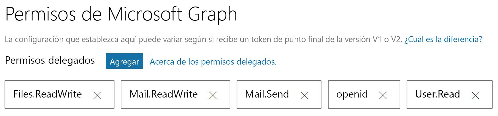

# <a name="get-started-with-microsoft-graph-in-a-java-app"></a><span data-ttu-id="0f14a-101">Introducción a Microsoft Graph en una aplicación Java</span><span class="sxs-lookup"><span data-stu-id="0f14a-101">Get started with Microsoft Graph in a PHP app</span></span>

<span data-ttu-id="0f14a-102">Este artículo usa la [console-java-connect-sample](https://github.com/microsoftgraph/console-java-connect-sample) para guiarle por el proceso de enviar correo a través de Microsoft Graph desde una aplicación de consola Java.</span><span class="sxs-lookup"><span data-stu-id="0f14a-102">This article uses the [console-java-connect-sample](https://github.com/microsoftgraph/console-java-connect-sample) to walk through sending mail via Microsoft Graph from a Java console application.</span></span> <span data-ttu-id="0f14a-103">El artículo le muestra el código que necesita agregar a la aplicación Java, por lo que puede usar la API de Microsoft Graph.</span><span class="sxs-lookup"><span data-stu-id="0f14a-103">The article shows you the code that you need to add to your Java app so that you can use the Microsoft Graph API.</span></span> <span data-ttu-id="0f14a-104">La aplicación accede a Microsoft Graph mediante el [SDK de Microsoft Graph para Java](https://github.com/microsoftgraph/msgraph-sdk-java).</span><span class="sxs-lookup"><span data-stu-id="0f14a-104">The app accesses Microsoft Graph by using the [Microsoft Graph SDK for Java](https://github.com/microsoftgraph/msgraph-sdk-java).</span></span>

## <a name="choose-an-authentication-library"></a><span data-ttu-id="0f14a-105">Seleccionar una biblioteca de autenticación</span><span class="sxs-lookup"><span data-stu-id="0f14a-105">Choosing an authentication library</span></span>

<span data-ttu-id="0f14a-106">Microsoft Graph adoptó los estándares de OAuth 2.0 y Open ID Connect, lo que le permite elegir entre muchas bibliotecas de Java de OAuth 2 de código abierto disponibles.</span><span class="sxs-lookup"><span data-stu-id="0f14a-106">Microsoft Graph adopted the OAuth 2.0 and Open ID Connect standards, which lets you choose from many available open source OAuth 2 Java libraries.</span></span> <span data-ttu-id="0f14a-107">El equipo de Azure AD recomienda usar [ScribeJava](https://github.com/scribejava/scribejava), una biblioteca de OAuth2 simple de Java.</span><span class="sxs-lookup"><span data-stu-id="0f14a-107">The Azure AD team recommends using [ScribeJava](https://github.com/scribejava/scribejava), a simple OAuth2 library for Java.</span></span>

<span data-ttu-id="0f14a-108">La muestra implementa el flujo de concesión de código de autorización que es la opción adecuada para un escenario de autorización de cliente, un usuario y un extremo OAuth2 habilitado.</span><span class="sxs-lookup"><span data-stu-id="0f14a-108">The sample implements the Authorization Code Grant flow which is the right choice for a client authorization scenario, a user, and an OAuth 2-enabled endpoint.</span></span> <span data-ttu-id="0f14a-109">En las aplicaciones de Java de servidor a servidor de producción, se usa el flujo de autorización de credenciales de cliente.</span><span class="sxs-lookup"><span data-stu-id="0f14a-109">In production server-to-server Java applications, the Client Credentials authorization flow is used.</span></span> <span data-ttu-id="0f14a-110">**ScribeJava** controlado estos flujos de autorización.</span><span class="sxs-lookup"><span data-stu-id="0f14a-110">**ScribeJava** handles both of these authorization flows.</span></span> <span data-ttu-id="0f14a-111">Para hacer que este ejemplo sea fácil de registrar, autenticar y ejecutar, se muestra el flujo más sencillo.</span><span class="sxs-lookup"><span data-stu-id="0f14a-111">To make this sample easy to register, authenticate, and run, we demonstrate the simplest flow.</span></span>

<span data-ttu-id="0f14a-112">Antes de que la aplicación pueda realizar llamadas en Microsoft Graph, la aplicación debe obtener un token de acceso de Azure Active Directory (Azure AD).</span><span class="sxs-lookup"><span data-stu-id="0f14a-112">Before your app can make calls on Microsoft Graph, the app must get an access token from Azure Active Directory (Azure AD).</span></span> <span data-ttu-id="0f14a-113">Este token debe estar presente en un encabezado de autenticación HTTP con cada llamada a Microsoft Graph.</span><span class="sxs-lookup"><span data-stu-id="0f14a-113">This token must be present in an HTTP authentication header with each call to Microsoft Graph.</span></span> <span data-ttu-id="0f14a-114">El **SDK de Microsoft Graph** se encarga de insertar el encabezado y agregar el token para cada llamada al implementar [IAuthenticationProvider](https://github.com/microsoftgraph/msgraph-sdk-java/blob/dev/src/main/java/com/microsoft/graph/authentication/IAuthenticationProvider.java).</span><span class="sxs-lookup"><span data-stu-id="0f14a-114">The **Microsoft Graph SDK** takes care of inserting the header and adding the token for each call when you implement [IAuthenticationProvider](https://github.com/microsoftgraph/msgraph-sdk-java/blob/dev/src/main/java/com/microsoft/graph/authentication/IAuthenticationProvider.java).</span></span> <span data-ttu-id="0f14a-115">**ScribeJava** controla la autenticación y obtención de un token de acceso.</span><span class="sxs-lookup"><span data-stu-id="0f14a-115">**ScribeJava** handles authentication and getting an access token.</span></span> <span data-ttu-id="0f14a-116">La aplicación proporciona el token de acceso al SDK de Microsoft Graph mediante la interfaz de **IAuthenticationProvider**.</span><span class="sxs-lookup"><span data-stu-id="0f14a-116">Your app provides the access token to the Microsoft Graph SDK via the **IAuthenticationProvider** interface.</span></span>

## <a name="install-and-run-the-sample"></a><span data-ttu-id="0f14a-117">Instalar y ejecutar la muestra</span><span class="sxs-lookup"><span data-stu-id="0f14a-117">Install and run the solution</span></span>

<span data-ttu-id="0f14a-118">Para instalar y configurar la aplicación de muestra, siga las instrucciones del documento [LÉAME](https://github.com/microsoftgraph/console-java-connect-sample/blob/master/README.md) en el repositorio **console-java-connect-sample** de GitHub.</span><span class="sxs-lookup"><span data-stu-id="0f14a-118">To install and configure the sample app, follow the instructions in the [README](https://github.com/microsoftgraph/console-java-connect-sample/blob/master/README.md) document in the **console-java-connect-sample** repository on GitHub.</span></span> <span data-ttu-id="0f14a-119">Puede clonar la muestra y recorrer el código en su IDE de Java favorito con este comando para clonar el repositorio:</span><span class="sxs-lookup"><span data-stu-id="0f14a-119">You can clone the sample and walk through the code in your favorite Java IDE by using this command to clone the repository:</span></span>

```
git@github.com:microsoftgraph/console-java-connect-sample.git
```

<span data-ttu-id="0f14a-120">Cuando [registre la aplicación de conexión Java de consola](https://github.com/microsoftgraph/console-java-connect-sample/blob/master/README.md#register-your-app), asigne ámbitos delegados (permisos) a la muestra.</span><span class="sxs-lookup"><span data-stu-id="0f14a-120">When you [register the Console Java Connect app](https://github.com/microsoftgraph/console-java-connect-sample/blob/master/README.md#register-your-app), assign delegated scopes (permissions) to the sample.</span></span> <span data-ttu-id="0f14a-121">Asegúrese de asignar ámbitos como se muestra en la siguiente imagen:</span><span class="sxs-lookup"><span data-stu-id="0f14a-121">Be sure to scopes as shown in the following image:</span></span>



<span data-ttu-id="0f14a-123">Después de registrar la aplicación y [configurar la muestra](https://github.com/microsoftgraph/console-java-connect-sample/blob/master/README.md#configure-your-app) para el **Id. de aplicación** que obtiene del registro de la aplicación, puede crear y ejecutar el ejemplo.</span><span class="sxs-lookup"><span data-stu-id="0f14a-123">After you register the application and [configure the sample](https://github.com/microsoftgraph/console-java-connect-sample/blob/master/README.md#configure-your-app) for the **Application Id** you get from the application registration, you can build and run the sample.</span></span>

## <a name="console-java-connect-code"></a><span data-ttu-id="0f14a-124">Código de Console-Java-Connect</span><span class="sxs-lookup"><span data-stu-id="0f14a-124">Console-Java-Connect code</span></span> 

<span data-ttu-id="0f14a-125">Antes de examinar el flujo de lógica de ejemplo, dedique unos minutos para obtener información sobre la [estructura del proyecto de muestra](#sample-project-structure).</span><span class="sxs-lookup"><span data-stu-id="0f14a-125">Before you look at the sample logic flow, take a few minutes to learn about the [sample project's structure](#sample-project-structure).</span></span> <span data-ttu-id="0f14a-126">Cuando tenga todo listo, examine la lógica del ejemplo:</span><span class="sxs-lookup"><span data-stu-id="0f14a-126">When you're ready, lets step through the logic in the sample:</span></span>


   
### <a name="walk-through-the-code"></a><span data-ttu-id="0f14a-127">Recorra el código</span><span class="sxs-lookup"><span data-stu-id="0f14a-127">Walk through the code</span></span>
<span data-ttu-id="0f14a-128">Observaremos el código de ejemplo en un nivel superior y, después, profundizaremos en los detalles sobre cómo crear un mensaje de correo electrónico y enviarlo.</span><span class="sxs-lookup"><span data-stu-id="0f14a-128">We'll look at the sample code at a high level and then dive into the details of creating an email message and sending it.</span></span>

#### <a name="the-user-experience"></a><span data-ttu-id="0f14a-129">La experiencia de usuario</span><span class="sxs-lookup"><span data-stu-id="0f14a-129">The user experience</span></span>

<span data-ttu-id="0f14a-130">Esta sección echa un vistazo a la lógica que inicia la aplicación y, después, le muestra el resultado de ejemplo que ve el usuario al ejecutar la muestra.</span><span class="sxs-lookup"><span data-stu-id="0f14a-130">This section takes a look at the logic that starts up the application and then shows you the sample output that the user sees when they run the sample.</span></span>

<span data-ttu-id="0f14a-131">El método estático **principal** [PublicClient](https://github.com/microsoftgraph/console-java-connect-sample/blob/master/src/main/java/com/microsoft/graphsample/PublicClient.java) crea una instancia de **PublicClient** y, después, inicia los procesos de cierre la sesión y de autenticación.</span><span class="sxs-lookup"><span data-stu-id="0f14a-131">The [PublicClient](https://github.com/microsoftgraph/console-java-connect-sample/blob/master/src/main/java/com/microsoft/graphsample/PublicClient.java) **main** static method creates an instance of **PublicClient** and then kicks off the sign in and authentication process.</span></span>  

<span data-ttu-id="0f14a-132">[AuthenticationManager](https://github.com/microsoftgraph/console-java-connect-sample/blob/master/src/main/java/com/microsoft/graphsample/connect/AuthenticationManager) proporciona una instancia singleton que se usa para conectar el usuario a Microsoft Graph.</span><span class="sxs-lookup"><span data-stu-id="0f14a-132">[AuthenticationManager](https://github.com/microsoftgraph/console-java-connect-sample/blob/master/src/main/java/com/microsoft/graphsample/connect/AuthenticationManager) provides a singleton instance which is used to connect the user to Microsoft Graph.</span></span> <span data-ttu-id="0f14a-133">**AuthenticationManager** expone un **token de acceso** como una propiedad de cadena.</span><span class="sxs-lookup"><span data-stu-id="0f14a-133">**AuthenticationManager** exposes an **access token** as a string property.</span></span> <span data-ttu-id="0f14a-134">**Azure AD** devuelve el token de acceso cuando el usuario se autentica y proporciona a la muestra permiso para acceder a los recursos de Microsoft Graph solicitados.</span><span class="sxs-lookup"><span data-stu-id="0f14a-134">The access token is returned by **Azure AD** when the user is authenticated and gives the sample permission to access requested Microsoft Graph resources.</span></span> 

<span data-ttu-id="0f14a-135">El método **PublicClient.startSendMail** realiza los siguientes pasos:</span><span class="sxs-lookup"><span data-stu-id="0f14a-135">The **PublicClient.startSendMail** method performs the following steps:</span></span>

- <span data-ttu-id="0f14a-136">Crea una nueva instancia en la clase [GraphSendMail](https://github.com/microsoftgraph/console-java-connect-sample/blob/master/src/main/java/com/microsoft/graphsample/msgraph/GraphSendMail.java).</span><span class="sxs-lookup"><span data-stu-id="0f14a-136">Creates a new instance of the  [InputComponentSubmission](https://github.com/microsoftgraph/console-java-connect-sample/blob/master/src/main/java/com/microsoft/graphsample/msgraph/GraphSendMail.java) class.</span></span> 
- <span data-ttu-id="0f14a-137">Llama a **GraphSendMail.getMeUser()** para que devuelva el perfil de **Azure AD** del usuario actual para que el objeto de consola de muestra pueda personalizar los mensajes que muestra al usuario.</span><span class="sxs-lookup"><span data-stu-id="0f14a-137">Calls **GraphSendMail.getMeUser()** to return the **Azure AD** profile of the current user so that the sample console object can personalize the prompts that it displays to the user.</span></span> 
- <span data-ttu-id="0f14a-138">La consola muestra:</span><span class="sxs-lookup"><span data-stu-id="0f14a-138">The console displays:</span></span>

   `Hello, Laura Steele. Would you like to send an email to yourself or someone else?`

   `Enter the address to which you'd like to send a message. If you enter nothing, the message will go to your address`

- <span data-ttu-id="0f14a-139">Llamadas al método **GraphSendMail.sendMail** que toman la entrada del usuario.</span><span class="sxs-lookup"><span data-stu-id="0f14a-139">Calls the **GraphSendMail.sendMail** method which takes the user's input.</span></span> <span data-ttu-id="0f14a-140">Si se proporciona una dirección de correo electrónico, **sendMail** envía un mensaje a esa dirección.</span><span class="sxs-lookup"><span data-stu-id="0f14a-140">If an email address is provided, **sendMail** sends a message to that address.</span></span> <span data-ttu-id="0f14a-141">En caso contrario, se envía el mensaje para el usuario actual.</span><span class="sxs-lookup"><span data-stu-id="0f14a-141">Otherwise, the message is sent to the current user.</span></span> 

- <span data-ttu-id="0f14a-142">Solicita al usuario que envíe otro correo electrónico o cierre la aplicación de consola.</span><span class="sxs-lookup"><span data-stu-id="0f14a-142">Prompts the user to send another email or quit the console app.</span></span>

   `Email sent!`

   `Want to send another message? Type 'y' for yes and any other key to exit.`

#### <a name="the-send-mail-logic"></a><span data-ttu-id="0f14a-143">La lógica de envío de correos</span><span class="sxs-lookup"><span data-stu-id="0f14a-143">The send mail logic</span></span>

<span data-ttu-id="0f14a-144">La lógica de envío de correos tiene los siguientes pasos:</span><span class="sxs-lookup"><span data-stu-id="0f14a-144">The mail sending logic takes the following steps:</span></span>


1. <span data-ttu-id="0f14a-145">**Obtener la imagen de perfil**:</span><span class="sxs-lookup"><span data-stu-id="0f14a-145">**Get profile picture**:</span></span><br/> <span data-ttu-id="0f14a-146">Llama a **GraphServiceController.getUserProfilePicture()** para obtener una matriz de bytes que representa la imagen de perfil del usuario de **Azure AD** que ha iniciado sesión en la muestra.</span><span class="sxs-lookup"><span data-stu-id="0f14a-146">Calls **GraphServiceController.getUserProfilePicture()** to get an array of bytes representing the profile picture of the **Azure AD** user who signed into the sample.</span></span>

   <span data-ttu-id="0f14a-147">**La llamada de API**</span><span class="sxs-lookup"><span data-stu-id="0f14a-147">**The API call**</span></span>

```java
            photoStream = mGraphServiceClient
                    .me()
                    .photo()
                    .content()
                    .buildRequest()
                    .get();

```
2. <span data-ttu-id="0f14a-148">**Cargar imagen en OneDrive**:</span><span class="sxs-lookup"><span data-stu-id="0f14a-148">**Upload picture to OneDrive**:</span></span>
<br/><span data-ttu-id="0f14a-149">Llama a **GraphServiceController.uploadPictureToOneDrive(bytes)** para guardar la imagen de perfil en la carpeta raíz de OneDrive del usuario.</span><span class="sxs-lookup"><span data-stu-id="0f14a-149">Calls **GraphServiceController.uploadPictureToOneDrive(bytes)** to POST the profile picture in the user's OneDrive root folder.</span></span> <span data-ttu-id="0f14a-150">Se devuelve un objeto **DriveItem** de SDK de Microsoft Graph.</span><span class="sxs-lookup"><span data-stu-id="0f14a-150">A Microsoft Graph SDK **DriveItem** object is returned.</span></span> 

   <span data-ttu-id="0f14a-151">**La llamada de API**</span><span class="sxs-lookup"><span data-stu-id="0f14a-151">**The API call**</span></span>
```java
            driveItem = mGraphServiceClient
                    .me()
                    .drive()
                    .root()
                    .itemWithPath("me2.png")
                    .content()
                    .buildRequest()
                    .put(picture);

```
3. <span data-ttu-id="0f14a-152">**Obtener el vínculo de uso compartido de OneDrive de la imagen**:</span><span class="sxs-lookup"><span data-stu-id="0f14a-152">**Get the OneDrive sharing link for the picture**:</span></span><br/><span data-ttu-id="0f14a-153">Llama a **GraphServiceController.getPermissionSharingLink** para crear un nuevo vínculo de uso compartido.</span><span class="sxs-lookup"><span data-stu-id="0f14a-153">Calls **GraphServiceController.getPermissionSharingLink** to create a new sharing link.</span></span> <span data-ttu-id="0f14a-154">Se devuelve un objeto **Permission** de SDK de Microsoft Graph.</span><span class="sxs-lookup"><span data-stu-id="0f14a-154">A Microsoft Graph SDK **Permission** object is returned.</span></span>

   <span data-ttu-id="0f14a-155">**La llamada de API**</span><span class="sxs-lookup"><span data-stu-id="0f14a-155">**The API call**</span></span>
```java
            permission = mGraphServiceClient
                    .me()
                    .drive()
                    .items(id)
                    .createLink("view", "organization")
                    .buildRequest()
                    .post();

```
4. <span data-ttu-id="0f14a-156">**Reemplazar el contenido de la etiqueta de anclaje de la plantilla HTML** con la **dirección URL web** para el vínculo de uso compartido del paso anterior.</span><span class="sxs-lookup"><span data-stu-id="0f14a-156">**Replace the contents of the HTML template anchor tag** with the **webUrl** for the sharing link in the previous step.</span></span> 
> <span data-ttu-id="0f14a-157">**Nota:** El cuerpo del mensaje enviado por la aplicación se origina como una plantilla HTML que se almacena en [Constants.java](https://github.com/microsoftgraph/console-java-connect-sample/blob/master/src/main/java/com/microsoft/graphsample/connect/Constants.java) como una cadena estática.</span><span class="sxs-lookup"><span data-stu-id="0f14a-157">**Note:** The body of the message sent by the application originates as an HTML template stored in [Constants.java](https://github.com/microsoftgraph/console-java-connect-sample/blob/master/src/main/java/com/microsoft/graphsample/connect/Constants.java) as a static string.</span></span> <span data-ttu-id="0f14a-158">Cuando se envía, el cuerpo del mensaje contiene un hipervínculo de uso compartido público a una imagen que la muestra en la carpeta raíz de OneDrive del usuario.</span><span class="sxs-lookup"><span data-stu-id="0f14a-158">When sent, the body of the message contains a public sharing hyperlink to a picture that the sample uploads to the user's OneDrive root folder.</span></span> 
5. <span data-ttu-id="0f14a-159">**Crear un borrador**:</span><span class="sxs-lookup"><span data-stu-id="0f14a-159">**Create** a draft of a new message.</span></span> <br/><span data-ttu-id="0f14a-160">Llama a **GraphServiceController.createDraftMail**, pasando la dirección de correo electrónico del destinatario, el texto del asunto y la plantilla HTML actualizada.</span><span class="sxs-lookup"><span data-stu-id="0f14a-160">Calls **GraphServiceController.createDraftMail**, passing the recipient email address, subject text, and the updated HTML template.</span></span> <span data-ttu-id="0f14a-161">Se crea un borrador y se guarda en la carpeta de borradores del usuario.</span><span class="sxs-lookup"><span data-stu-id="0f14a-161">A draft message is created and POSTed to the user's draft message folder.</span></span>

   <span data-ttu-id="0f14a-162">**La llamada de API**</span><span class="sxs-lookup"><span data-stu-id="0f14a-162">**The API call**</span></span>
```java
            message = mGraphServiceClient
                    .me()
                    .messages()
                    .buildRequest()
                    .post(message);

```
6. <span data-ttu-id="0f14a-163">**Adjuntar la imagen al borrador**:</span><span class="sxs-lookup"><span data-stu-id="0f14a-163">**Attach picture to draft message**:</span></span> <br/><span data-ttu-id="0f14a-164">Llama a **GraphServiceController.addPictureToDraftMessage** para obtener el borrador y agregar la imagen al mensaje como datos adjuntos.</span><span class="sxs-lookup"><span data-stu-id="0f14a-164">Calls **GraphServiceController.addPictureToDraftMessage** to get the draft message and add the picture to the message as an object attachment.</span></span>

   <span data-ttu-id="0f14a-165">**La llamada de API**</span><span class="sxs-lookup"><span data-stu-id="0f14a-165">**The API call**</span></span>
```java
            FileAttachment fileAttachment = new FileAttachment();
            fileAttachment.oDataType = "#microsoft.graph.fileAttachment";
            fileAttachment.contentBytes = attachementBytes;
            fileAttachment.name = "me.png";
            fileAttachment.size = attachementBytes.length;
            fileAttachment.isInline = false;
            fileAttachment.id = "my profile picture";

            attachment = mGraphServiceClient
                    .me()
                    .messages(messageId)
                    .attachments()
                    .buildRequest()
                    .post(fileAttachment);

```
7. <span data-ttu-id="0f14a-166">**Enviar el borrador**:</span><span class="sxs-lookup"><span data-stu-id="0f14a-166">**Send the draft message**:</span></span><br/><span data-ttu-id="0f14a-167">Llama a **GraphServiceController.sendDraftMessage** para enviar el borrador actualizado al usuario de destino.</span><span class="sxs-lookup"><span data-stu-id="0f14a-167">Calls **GraphServiceController.sendDraftMessage** to send the updated draft message to the intended user.</span></span>

   <span data-ttu-id="0f14a-168">**La llamada de API**</span><span class="sxs-lookup"><span data-stu-id="0f14a-168">**The API call**</span></span>
```java
            mGraphServiceClient
                    .me()
                    .mailFolders("Drafts")
                    .messages(messageId)
                    .send()
                    .buildRequest()
                    .post();

```


### <a name="sample-project-structure"></a><span data-ttu-id="0f14a-169">Estructura de proyecto de muestra</span><span class="sxs-lookup"><span data-stu-id="0f14a-169">Sample project structure</span></span>

### <a name="connect-package"></a><span data-ttu-id="0f14a-170">Paquete connect</span><span class="sxs-lookup"><span data-stu-id="0f14a-170">connect package</span></span>
<span data-ttu-id="0f14a-171">Este paquete contiene la lógica de flujo de autenticación OAuth2 y la configuración que actualizará.</span><span class="sxs-lookup"><span data-stu-id="0f14a-171">This package contains the OAuth2 authentication flow logic and the configuration that you'll be updating.</span></span>

- <span data-ttu-id="0f14a-172">[AuthenticationManager.java](https://github.com/microsoftgraph/console-java-connect-sample/blob/master/src/main/java/com/microsoft/graphsample/connect/AuthenticationManager.java): esta clase importa los objetos **ScribeJava** utilizados para el flujo de concesión de código de autorización.</span><span class="sxs-lookup"><span data-stu-id="0f14a-172">[AuthenticationManager.java](https://github.com/microsoftgraph/console-java-connect-sample/blob/master/src/main/java/com/microsoft/graphsample/connect/AuthenticationManager.java):  This class imports the  **ScribeJava** objects used for the Authorization Code Grant flow.</span></span>
- <span data-ttu-id="0f14a-173">[Constants.Java](https://github.com/microsoftgraph/console-java-connect-sample/blob/master/src/main/java/com/microsoft/graphsample/connect/Constants.java): contiene cadenas estáticas públicas para proporcionar el registro de la aplicación relacionado con los valores y la plantilla para el mensaje de correo electrónico que la aplicación envíe.</span><span class="sxs-lookup"><span data-stu-id="0f14a-173">[Constants.java](https://github.com/microsoftgraph/console-java-connect-sample/blob/master/src/main/java/com/microsoft/graphsample/connect/Constants.java): Holds public static strings for providing app registration related values and the template for the email message that the application sends.</span></span>
- <span data-ttu-id="0f14a-174">[Debug.Java](https://github.com/microsoftgraph/console-java-connect-sample/blob/master/src/main/java/com/microsoft/graphsample/connect/Debug.java): etiqueta de nivel de depuración público.</span><span class="sxs-lookup"><span data-stu-id="0f14a-174">[Debug.java](https://github.com/microsoftgraph/console-java-connect-sample/blob/master/src/main/java/com/microsoft/graphsample/connect/Debug.java): Public debug level flag.</span></span> <span data-ttu-id="0f14a-175">Establezca su valor para cambiar el comportamiento del registro de la aplicación de muestra.</span><span class="sxs-lookup"><span data-stu-id="0f14a-175">Set it's value to change the logging behavior of the sample app.</span></span>
- <span data-ttu-id="0f14a-176">[DebugLogger.java](https://github.com/microsoftgraph/console-java-connect-sample/blob/master/src/main/java/com/microsoft/graphsample/connect/DebugLogger.java): utilidad de registro que escribe información en la consola según el nivel de depuración establecido.</span><span class="sxs-lookup"><span data-stu-id="0f14a-176">[DebugLogger.java](https://github.com/microsoftgraph/console-java-connect-sample/blob/master/src/main/java/com/microsoft/graphsample/connect/DebugLogger.java): Logging utility that writes information to the console according to the debug level set.</span></span>
- <span data-ttu-id="0f14a-177">[IConnectCallback](https://github.com/microsoftgraph/console-java-connect-sample/blob/master/src/main/java/com/microsoft/graphsample/connect/IConnectCallback.java): define el método que se usa si se llama a la sobrecarga asincrónica del método **ScribeJava.getAccessToken**.</span><span class="sxs-lookup"><span data-stu-id="0f14a-177">[IConnectCallback](https://github.com/microsoftgraph/console-java-connect-sample/blob/master/src/main/java/com/microsoft/graphsample/connect/IConnectCallback.java): Defines the callback method that you'd use if you call the asynchronous overload of the **ScribeJava.getAccessToken** method.</span></span>
- <span data-ttu-id="0f14a-178">[SendMailException](https://github.com/microsoftgraph/console-java-connect-sample/blob/master/src/main/java/com/microsoft/graphsample/msgraph/SendMailException.java): una clase que se deriva de **Exception** y encapsula la información de excepción específica de Microsoft Graph.</span><span class="sxs-lookup"><span data-stu-id="0f14a-178">[SendMailException](https://github.com/microsoftgraph/console-java-connect-sample/blob/master/src/main/java/com/microsoft/graphsample/msgraph/SendMailException.java): A class that is derived from **Exception** and encapsulates Microsoft Graph-specific exception information.</span></span> <span data-ttu-id="0f14a-179">Las clases en el paquete **GraphSendMail** pueden producir este tipo de excepción.</span><span class="sxs-lookup"><span data-stu-id="0f14a-179">Classes in the **GraphSendMail** package can throw this type of exception.</span></span>

### <a name="msgraph-package"></a><span data-ttu-id="0f14a-180">Paquete msgraph</span><span class="sxs-lookup"><span data-stu-id="0f14a-180">msgraph package</span></span>

<span data-ttu-id="0f14a-181">Este paquete contiene la lógica que realice llamadas en Microsoft Graph.</span><span class="sxs-lookup"><span data-stu-id="0f14a-181">This package contains all of the logic that makes calls on Microsoft Graph.</span></span>

- <span data-ttu-id="0f14a-182">[GraphSendMail](https://github.com/microsoftgraph/console-java-connect-sample/blob/master/src/main/java/com/microsoft/graphsample/msgraph/GraphSendMail.java): une llamadas en **GraphServiceController** (una clase auxiliar de muestra de la API de Microsoft Graph) para crear y enviar un mensaje de correo electrónico con una imagen adjunta.</span><span class="sxs-lookup"><span data-stu-id="0f14a-182">[GraphSendMail](https://github.com/microsoftgraph/console-java-connect-sample/blob/master/src/main/java/com/microsoft/graphsample/msgraph/GraphSendMail.java): Chains together calls into **GraphServiceController** (a Microsoft Graph API sample helper class) to create and send an email message with a picture attachment.</span></span>
- <span data-ttu-id="0f14a-183">[GraphServiceClientManager.java](https://github.com/microsoftgraph/console-java-connect-sample/blob/master/src/main/java/com/microsoft/graphsample/msgraph/GraphServiceClientManager.java): crea una instancia del SDK de Microsoft Graph [GraphServiceClient](https://github.com/microsoftgraph/msgraph-sdk-java/blob/dev/src/main/java/com/microsoft/graph/requests/extensions/GraphServiceClient.java) y agrega un token de acceso a todas las llamadas de la API salientes en el extremo de Microsoft Graph.</span><span class="sxs-lookup"><span data-stu-id="0f14a-183">[GraphServiceClientManager.java](https://github.com/microsoftgraph/console-java-connect-sample/blob/master/src/main/java/com/microsoft/graphsample/msgraph/GraphServiceClientManager.java): Instantiates the Microsoft Graph SDK [GraphServiceClient](https://github.com/microsoftgraph/msgraph-sdk-java/blob/dev/src/main/java/com/microsoft/graph/requests/extensions/GraphServiceClient.java) and adds an access token to all outgoing API calls on the Microsoft Graph endpoint.</span></span>

- <span data-ttu-id="0f14a-184">[GraphServiceController.java](https://github.com/microsoftgraph/console-java-connect-sample/blob/master/src/main/java/com/microsoft/graphsample/msgraph/GraphServiceController.java): usa el SDK Microsoft Graph para realizar todas las llamadas en la **GraphServiceClient**.</span><span class="sxs-lookup"><span data-stu-id="0f14a-184">[GraphServiceController.java](https://github.com/microsoftgraph/console-java-connect-sample/blob/master/src/main/java/com/microsoft/graphsample/msgraph/GraphServiceController.java): Uses the Microsoft Graph SDK to make all of the calls on the **GraphServiceClient**.</span></span> <span data-ttu-id="0f14a-185">Las llamadas incluyen:</span><span class="sxs-lookup"><span data-stu-id="0f14a-185">Calls include:</span></span>

   - <span data-ttu-id="0f14a-186">**createDraftMail**: crea un borrador de correo electrónico y lo guarda en la carpeta de borradores.</span><span class="sxs-lookup"><span data-stu-id="0f14a-186">**createDraftMail**: creates a draft email message and saves it in your draft messages folder.</span></span>
   - <span data-ttu-id="0f14a-187">**sendNewMessageAsync**: crea y envía un mensaje de correo electrónico.</span><span class="sxs-lookup"><span data-stu-id="0f14a-187">**sendNewMessageAsync**: Creates and sends an email message.</span></span>
   - <span data-ttu-id="0f14a-188">**addPictureToDraftMessage**: incluye un archivo adjunto en un borrador por identificador de mensaje</span><span class="sxs-lookup"><span data-stu-id="0f14a-188">**addPictureToDraftMessage**: Posts a file attachment in a draft message by message Id</span></span>
   - <span data-ttu-id="0f14a-189">**addAttachmentToDraftAsync**: agrega datos adjuntos a un borrador</span><span class="sxs-lookup"><span data-stu-id="0f14a-189">**addAttachmentToDraftAsync**: Adds an attachment to a draft message.</span></span>
   - <span data-ttu-id="0f14a-190">**sendDraftMessage**: envía un mensaje de la carpeta Borradores.</span><span class="sxs-lookup"><span data-stu-id="0f14a-190">**sendDraftMessage**: Sends a message from the drafts folder.</span></span>
   - <span data-ttu-id="0f14a-191">**getDraftMessage**: obtiene un mensaje de la colección de mensajes del usuario por identificador de mensaje.</span><span class="sxs-lookup"><span data-stu-id="0f14a-191">**getDraftMessage**: Gets a message from the user' message collection by message id.</span></span>
   - <span data-ttu-id="0f14a-192">**getUser**: obtiene el usuario local que se ha autenticado con el extremo de la API de Microsoft Graph.</span><span class="sxs-lookup"><span data-stu-id="0f14a-192">**getUser**: Gets the local user who is authenticated with the Microsoft Graph API endpoint.</span></span>
   - <span data-ttu-id="0f14a-193">**getUserProfilePicture**: obtiene la imagen de perfil del usuario que ha iniciado sesión de Microsoft Graph.</span><span class="sxs-lookup"><span data-stu-id="0f14a-193">**getUserProfilePicture**: Gets the signed in user's profile picture from the Microsoft Graph.</span></span>
   - <span data-ttu-id="0f14a-194">**uploadPictureToOneDrive**: carga una imagen como una matriz de bytes en la carpeta raíz de OneDrive del usuario.</span><span class="sxs-lookup"><span data-stu-id="0f14a-194">**uploadPictureToOneDrive**: Uploads a picture as byte array to the user's OneDrive root folder.</span></span>
   - <span data-ttu-id="0f14a-195">**getPermissionSharingLink**: solicita a OneDrive que cree un vínculo de uso compartido público a una imagen almacenada en OneDrive.</span><span class="sxs-lookup"><span data-stu-id="0f14a-195">**getPermissionSharingLink**: Requests OneDrive to create a public sharing link to a picture stored in OneDrive.</span></span>

## <a name="other-microsoft-graph-samples"></a><span data-ttu-id="0f14a-196">Otros ejemplos de código de Microsoft Graph</span><span class="sxs-lookup"><span data-stu-id="0f14a-196">Other Microsoft Graph Snippets samples</span></span>

<span data-ttu-id="0f14a-197">Si hay un ejemplo concreto que quiera ver, háganoslo saber [enviando un problema](https://github.com/microsoftgraph/console-java-connect-sample/issues).</span><span class="sxs-lookup"><span data-stu-id="0f14a-197">If there's a particular sample you'd like to see, please let us know by [submitting an issue](https://github.com/microsoftgraph/console-java-connect-sample/issues).</span></span> <span data-ttu-id="0f14a-198">Estamos muy interesados en sus comentarios sobre cualquier escenario de Microsoft Graph que desee compilar en Java.</span><span class="sxs-lookup"><span data-stu-id="0f14a-198">We're very interested in your feedback on any Microsoft Graph scenario you'd like to build in Python!</span></span>

<span data-ttu-id="0f14a-199">La API de Microsoft Graph es una interfaz unificadora y muy avanzada que permite trabajar con todos los tipos de datos de Microsoft.</span><span class="sxs-lookup"><span data-stu-id="0f14a-199">The Microsoft Graph API is a very powerful, unifiying API that can be used to interact with all kinds of Microsoft data.</span></span> <span data-ttu-id="0f14a-200">Consulte la [documentación de desarrollador](https://developer.microsoft.com/es-ES/graph/docs/concepts/overview) o el [Probador de Graph](https://developer.microsoft.com/es-ES/graph/graph-explorer) para explorar qué más puede realizar con Microsoft Graph.</span><span class="sxs-lookup"><span data-stu-id="0f14a-200">Check out the [developer documentation](https://developer.microsoft.com/es-ES/graph/docs/concepts/overview) or the [Graph Explorer](https://developer.microsoft.com/es-ES/graph/graph-explorer) to explore what else you can accomplish with Microsoft Graph.</span></span>
