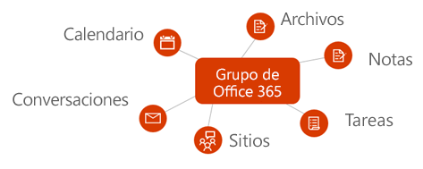
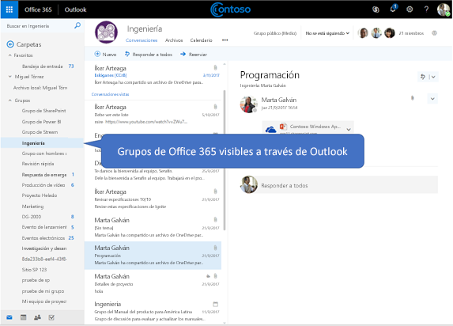

# Información general sobre los grupos de Office 365 en Microsoft GraphOverview of Office 365 groups in Microsoft Graph

Los grupos de Office 365 proporcionan el servicio de suscripción fundamental para que los usuarios puedan compartir conversaciones, archivos, notas, calendarios, planes y muchos otros activos.Office 365 groups provide the foundational membership service for users to share conversations, files, notes, calendars, plans, and many other assets. 

## ¿Por qué debería integrar con grupos de Office 365?Why integrate with Office 365 groups?   

Los grupos forman la base que permite la colaboración de usuario y la integración en todos los servicios para permitir escenarios enriquecidos de planificación de tareas, trabajo en equipo, educación y más.Groups form the foundation that enables user collaboration and integration across services to support rich scenarios in task planning, teamwork, education, and more. Cuando se integra con grupos de Office 365, la aplicación puede admitir millones de usuarios, mientras pasan entre las diferentes experiencias en el conjunto de aplicaciones de Office 365 y más allá.When you integrate with Office 365 groups, your application can support millions of users as they transition across various experiences in the Office 365 suite and beyond.  
 
### Crear grupos para facilitar el trabajo en equipo a través de serviciosCreate groups to facilitate teamwork across services 
 
Puede usar la API de Microsoft Graph para crear, administrar y eliminar grupos en todo el ciclo de vida de la colaboración.You can use the Microsoft Graph API to create, manage, or delete groups throughout the lifecycle of collaboration. Por ejemplo, puede hacer lo siguiente:For example, you can specify the following:  
 
- Use la API [Crear grupo](../api-reference/v1.0/api/group_post_groups.md) para aprovisionar un nuevo grupo.Use the [Create group](../api-reference/v1.0/api/group_post_groups.md) API to provision a new group. El grupo pasa a estar disponible en una amplia variedad de aplicaciones, como Outlook, SharePoint, Microsoft Teams, Planner e incluso Microsoft Stream.The group is then made available in a range of applications, such as Outlook, SharePoint, Microsoft Teams, Planner, and even Microsoft Stream. Microsoft Graph se sincroniza en estos servicios conectados para proporcionar acceso directo a todos los miembros del grupo.Microsoft Graph synchronizes across these connected services to seamlessly provide access to all group members.  
 
    **Cada grupo de Office 365 se integra con un conjunto predeterminado de servicios de Office 365****Every Office 365 group is integrated with a default set of Office 365 services**

      

- Permita a los miembros indicar que un grupo es uno de sus [favoritos](../api-reference/v1.0/api/group_addfavorite.md) o [quitarlo de sus favoritos](../api-reference/v1.0/api/group_removefavorite.md) si lo eligen.Enable members to indicate that a group is one of their [favorites](../api-reference/v1.0/api/group_addfavorite.md), or [remove it from their favorites](../api-reference/v1.0/api/group_removefavorite.md) if they choose. 
- [Cree](../api-reference/v1.0/api/group_post_conversations.md), [obtenga](../api-reference/v1.0/api/group_get_conversation.md) o [elimine](../api-reference/v1.0/api/group_delete_conversation.md) conversaciones de grupo desde su aplicación personalizada.[Create](../api-reference/v1.0/api/group_post_conversations.md), [get](../api-reference/v1.0/api/group_get_conversation.md), or [delete](../api-reference/v1.0/api/group_delete_conversation.md) group conversations from your custom application. 
- Programe [eventos](../api-reference/v1.0/resources/event.md) de calendario en el calendario del grupo.Schedule calendar [events](../api-reference/v1.0/resources/event.md) on the group calendar. 
- Obtenga información sobre el [sitio de SharePoint](../api-reference/v1.0/resources/site.md) que está asociado a un grupo, como las [listas](../api-reference/v1.0/api/list_list.md) o los [subsitios](../api-reference/v1.0/api/site_list_subsites.md) de la biblioteca de documentos.Get information about the [SharePoint site](../api-reference/v1.0/resources/site.md) that's associated with a group, such as the document library [lists](../api-reference/v1.0/api/list_list.md) or [subsites](../api-reference/v1.0/api/site_list_subsites.md). 
- [Cree un plan](../api-reference/v1.0/api/planner_post_buckets.md) en Planner que pertenezca a un grupo.[Create a plan](../api-reference/v1.0/api/planner_post_buckets.md) in Planner that is owned by a group. El plan proporciona una forma visual para realizar un seguimiento del trabajo en equipo al permitirle [crear tareas](../api-reference/v1.0/api/planner_post_tasks.md) que pueden [organizarse en cubos](../api-reference/v1.0/api/planner_post_buckets.md).The plan provides a visual way to track teamwork by allowing you to [create tasks](../api-reference/v1.0/api/planner_post_tasks.md) that can be [organized across buckets](../api-reference/v1.0/api/planner_post_buckets.md). 
- Acceda al bloc de notas de [OneNote](../api-reference/v1.0/resources/onenote.md) asociado a un grupo, que puede usarse para recopilar notas de reunión y organizar las ideas.Access the [OneNote](../api-reference/v1.0/resources/onenote.md) notebook associated with a group, which can be used for collecting meeting notes and organizing ideas. 
  
    **Conversaciones y grupos de Office 365 en Outlook en la web****Office 365 groups and conversations in Outlook in the web**

     

- [Habilite un grupo de Microsoft Teams](../api-reference/beta/api/team_put_teams.md) (versión preliminar) para permitir a los miembros del grupo participar en el chat persistente.[Enable a group for Microsoft Teams](../api-reference/beta/api/team_put_teams.md) (preview) to allow group members to engage in persistent chat.  
- [Elimine grupos](../api-reference/v1.0/api/group_delete.md).[Delete groups](../api-reference/v1.0/api/group_delete.md) Cuando se elimina un grupo, también se eliminará todo el contenido asociado, lo que impide que se produzcan sitios, conversaciones o planes huérfanos.When a group is deleted, all associated content is also deleted, which prevents orphaned sites, conversations, or plans. 
 
### Administrar la pertenencia sin problemasManage group membership seamlessly 
 
Los grupos de Office 365 son colecciones de usuarios que comparten el acceso a recursos de servicios Microsoft o de la aplicación.Groups are collections of users and other principals who share access to resources in Microsoft services or in your app. Como la pertenencia a grupos se administra de forma centralizada, los cambios realizados a la pertenencia afectan a todos los servicios asociados con el grupo.Because group membership is managed centrally, any changes to membership affect all services associated with the group. Puede usar Microsoft Graph para realizar las siguientes tareas de pertenencia a grupos:You can use Microsoft Graph to perform the following group membership tasks:
 
- [Agregar](../api-reference/v1.0/api/group_post_members.md) y [quitar](../api-reference/v1.0/api/group_delete_members.md) miembros de un grupo existente.[Add](../api-reference/v1.0/api/group_post_members.md) and [remove](../api-reference/v1.0/api/group_delete_members.md) members from an existing group. 
- Obtener una [lista de propietarios](../api-reference/v1.0/api/group_list_owners.md) o una [lista de miembros](../api-reference/v1.0/api/group_list_members.md) de un grupo.Get a [list of owners](../api-reference/v1.0/api/group_list_owners.md) or a [list of members](../api-reference/v1.0/api/group_list_members.md) for a group. Esto ayuda a transmitir quién tiene acceso al contenido del grupo, o quién debe realizar tareas administrativas, como renovar el grupo o aprobar una solicitud de combinación.This helps communicate who has access to group content, or who might need to perform administrative duties, such as renewing the group or approving a join request. 
- Designar grupos como **públicos**, en los que el contenido del grupo está visible para todos los usuarios de la misma organización, o **privados**, en los que el contenido de grupo solo está visible para los miembros, mediante la operación [Actualizar grupo](../api-reference/v1.0/api/group_update.md).Designate groups as **Public**, where group content is visible to anyone in the same organization, or **Private**, where group content is only visible to members, via the [update group](../api-reference/v1.0/api/group_update.md) operation. 
- [Quitar propietarios](../api-reference/v1.0/api/group_delete_owners.md) que ya no participan en las responsabilidades de propiedad de un grupo determinado de la lista de propietarios del grupo.[Remove owners](../api-reference/v1.0/api/group_delete_owners.md) who are no longer participating in the ownership responsibilities for a particular group from the list of group owners. 
 
### Establecer y mantener la configuración de directiva de grupoEstablish and maintain group policy settings 
 
A medida que empieza a crecer el número de grupos creados en una organización, Microsoft Graph admite la capacidad de controlar el uso y el ciclo de vida del grupo.As the number of groups created within an organization begins to grow, Microsoft Graph supports the ability to govern the usage and lifecycle of the group. Puede aplicar directivas de grupo en todos los grupos de una organización.You can enforce group policies across all groups within an organization. Puede usar la API de Microsoft Graph para:You can use Microsoft Graph to:

- Configurar una amplia gama de [opciones de configuración de directiva de grupo](../api-reference/v1.0/resources/groupsetting.md) que ayudan a definir comportamientos, como eliminar automáticamente los grupos a menos que los renueve un propietario y aplicar directivas de nomenclatura de grupos de Office 365.Configure a broad range of [group policy settings](../api-reference/v1.0/resources/groupsetting.md) that help define behaviors, such as automatically deleting groups unless they are renewed by an owner and enforcing naming policies on Office 365 groups. 
- [Renovar](../api-reference/v1.0/api/group_renew.md) grupos que estén a punto de expirar para permitir que los miembros del equipo puedan continuar colaborando y accediendo al contenido.[Renew](../api-reference/v1.0/api/group_renew.md) groups that are about to expire to allow team members to continue with collaboration and accessing content. Si no se renueva el grupo según la directiva de expiración establecida, se eliminará automáticamente.If the group is not renewed according to the established expiration policy, the group is automatically deleted. 
- [Restaurar](../api-reference/v1.0/api/directory_deleteditems_restore.md) grupos eliminados.[Restore](../api-reference/v1.0/api/directory_deleteditems_restore.md) deleted groups.
 
## Siguientes pasosNext steps

- Pruebe algunas solicitudes de API de ejemplo en el [Probador de Graph](https://developer.microsoft.com/es-ES/graph/graph-explorer).Try out some sample API requests in the [Graph Explorer](https://developer.microsoft.com/es-ES/graph/graph-explorer). 
- Obtenga más información sobre cómo [usar los grupos API](../api-reference/v1.0/resources/groups-overview.md) en Microsoft Graph.Learn more about how to [use the groups API](../api-reference/v1.0/resources/groups-overview.md) in Microsoft Graph.
