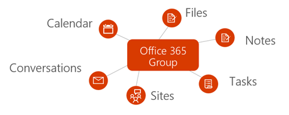

# Información general sobre los grupos de Office 365 en Microsoft Graph

Los grupos de Office 365 proporcionan el servicio de suscripción fundamental para que los usuarios puedan compartir conversaciones, archivos, notas, calendarios, planes y muchos otros activos. 

## ¿Por qué debería integrar con grupos de Office 365?   

Los grupos forman la base que permite la colaboración de usuario y la integración en todos los servicios para permitir escenarios enriquecidos de planificación de tareas, trabajo en equipo, educación y más. Cuando se integra con grupos de Office 365, la aplicación puede admitir millones de usuarios, mientras pasan entre las diferentes experiencias en el conjunto de aplicaciones de Office 365 y más allá.  
 
### Crear grupos para facilitar el trabajo en equipo a través de servicios 
 
Puede usar la API de Microsoft Graph para crear, administrar y eliminar grupos en todo el ciclo de vida de la colaboración. Por ejemplo, puede hacer lo siguiente:  
 
- Use la API [Crear grupo](/graph/api/group-post-groups?view=graph-rest-1.0) para aprovisionar un nuevo grupo. El grupo pasa a estar disponible en una amplia variedad de aplicaciones, como Outlook, SharePoint, Microsoft Teams, Planner e incluso Microsoft Stream. Microsoft Graph se sincroniza en estos servicios conectados para proporcionar acceso directo a todos los miembros del grupo.  
 
    **Cada grupo de Office 365 se integra con un conjunto predeterminado de servicios de Office 365**

      

- Permita a los miembros indicar que un grupo es uno de sus [favoritos](/graph/api/group-addfavorite?view=graph-rest-1.0) o [quitarlo de sus favoritos](/graph/api/group-removefavorite?view=graph-rest-1.0) si lo eligen. 
- [Cree](/graph/api/group-post-conversations?view=graph-rest-1.0), [obtenga](/graph/api/group-get-conversation?view=graph-rest-1.0) o [elimine](/graph/api/group-delete-conversation?view=graph-rest-1.0) conversaciones de grupo desde su aplicación personalizada. 
- Programe [eventos](/graph/api/resources/event?view=graph-rest-1.0) de calendario en el calendario del grupo. 
- Obtenga información sobre el [sitio de SharePoint](/graph/api/resources/site?view=graph-rest-1.0) que está asociado a un grupo, como las [listas](/graph/api/list-list?view=graph-rest-1.0) o los [subsitios](/graph/api/site-list-subsites?view=graph-rest-1.0) de la biblioteca de documentos. 
- [Cree un plan](/graph/api/planner-post-buckets?view=graph-rest-1.0) en Planner que pertenezca a un grupo. El plan proporciona una forma visual para realizar un seguimiento del trabajo en equipo al permitirle [crear tareas](/graph/api/planner-post-tasks?view=graph-rest-1.0) que pueden [organizarse en cubos](/graph/api/planner-post-buckets?view=graph-rest-1.0). 
- Acceda al bloc de notas de [OneNote](/graph/api/resources/onenote?view=graph-rest-1.0) asociado a un grupo, que puede usarse para recopilar notas de reunión y organizar las ideas. 
  
    **Conversaciones y grupos de Office 365 en Outlook en la web**

     

- [Habilite un grupo de Microsoft Teams](/graph/api/team-put-teams?view=graph-rest-beta) (versión preliminar) para permitir a los miembros del grupo participar en el chat persistente.  
- [Elimine grupos](/graph/api/group-delete?view=graph-rest-1.0). Cuando se elimina un grupo, también se eliminará todo el contenido asociado, lo que impide que se produzcan sitios, conversaciones o planes huérfanos. 
 
### Administrar la pertenencia sin problemas 
 
Los grupos de Office 365 son colecciones de usuarios que comparten el acceso a recursos de servicios Microsoft o de la aplicación. Como la pertenencia a grupos se administra de forma centralizada, los cambios realizados a la pertenencia afectan a todos los servicios asociados con el grupo. Puede usar Microsoft Graph para realizar las siguientes tareas de pertenencia a grupos:
 
- [Agregar](/graph/api/group-post-members?view=graph-rest-1.0) y [quitar](/graph/api/group-delete-members?view=graph-rest-1.0) miembros de un grupo existente. 
- Obtener una [lista de propietarios](/graph/api/group-list-owners?view=graph-rest-1.0) o una [lista de miembros](/graph/api/group-list-members?view=graph-rest-1.0) de un grupo. Esto ayuda a transmitir quién tiene acceso al contenido del grupo, o quién debe realizar tareas administrativas, como renovar el grupo o aprobar una solicitud de combinación. 
- Designar grupos como **públicos**, en los que el contenido del grupo está visible para todos los usuarios de la misma organización, o **privados**, en los que el contenido de grupo solo está visible para los miembros, mediante la operación [Actualizar grupo](/graph/api/group-update?view=graph-rest-1.0). 
- [Quitar propietarios](/graph/api/group-delete-owners?view=graph-rest-1.0) que ya no participan en las responsabilidades de propiedad de un grupo determinado de la lista de propietarios del grupo. 
 
### Establecer y mantener la configuración de directiva de grupo 
 
A medida que empieza a crecer el número de grupos creados en una organización, Microsoft Graph admite la capacidad de controlar el uso y el ciclo de vida del grupo. Puede aplicar directivas de grupo en todos los grupos de una organización. Puede usar la API de Microsoft Graph para:

- Configurar una amplia gama de [opciones de configuración de directiva de grupo](/graph/api/resources/groupsetting?view=graph-rest-1.0) que ayudan a definir comportamientos, como eliminar automáticamente los grupos a menos que los renueve un propietario y aplicar directivas de nomenclatura de grupos de Office 365. 
- [Renovar](/graph/api/group-renew?view=graph-rest-1.0) grupos que estén a punto de expirar para permitir que los miembros del equipo puedan continuar colaborando y accediendo al contenido. Si no se renueva el grupo según la directiva de expiración establecida, se eliminará automáticamente. 
- [Restaurar](/graph/api/directory-deleteditems-restore?view=graph-rest-1.0) grupos eliminados.

## Referencia de la API
¿Busca la referencia de la API para este servicio?

- [API de grupos en Microsoft Graph v1.0](/graph/api/resources/groups-overview?view=graph-rest-1.0)
- [API de grupos en Microsoft Graph beta](/graph/api/resources/groups-overview?view=graph-rest-beta)

## Pasos siguientes

- Pruebe algunas solicitudes de API de ejemplo en el [Probador de Graph](https://developer.microsoft.com/graph/graph-explorer). 
- Obtenga más información sobre cómo [usar los grupos API](/graph/api/resources/groups-overview?view=graph-rest-1.0) en Microsoft Graph.
