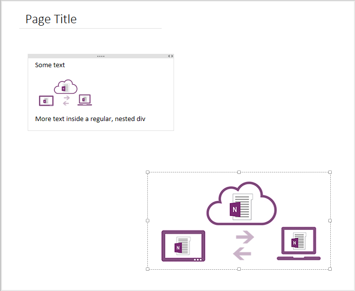

# <a name="create-absolute-positioned-elements-in-onenote-pages"></a><span data-ttu-id="a43e5-101">Crear elementos con posición absoluta en páginas de OneNote</span><span class="sxs-lookup"><span data-stu-id="a43e5-101">Create absolute positioned elements in OneNote pages</span></span>

<span data-ttu-id="a43e5-102">El cuerpo de una página de OneNote puede contener varios elementos secundarios `div`, `img` y `object` directos que pueden colocarse en la página por separado.</span><span class="sxs-lookup"><span data-stu-id="a43e5-102">The body of a OneNote page can contain multiple direct `div`, `img`, and `object` child elements that can be positioned independently on the page.</span></span>

<a name="attributes"></a>

## <a name="attributes-and-positioning-behavior"></a><span data-ttu-id="a43e5-103">Comportamiento de posicionamiento y atributos</span><span class="sxs-lookup"><span data-stu-id="a43e5-103">Attributes and positioning behavior</span></span>

<span data-ttu-id="a43e5-104">Use los atributos `data-absolute-enabled` y [`style`](#supported-css-style-attributes) para crear elementos con posición absoluta en una página, como se indica a continuación:</span><span class="sxs-lookup"><span data-stu-id="a43e5-104">Use the `data-absolute-enabled` and [`style`](#supported-css-style-attributes) attributes to create absolute positioned elements on a page, as follows:</span></span>

- <span data-ttu-id="a43e5-105">El elemento de cuerpo debe especificar `data-absolute-enabled="true"`.</span><span class="sxs-lookup"><span data-stu-id="a43e5-105">The body element must specify `data-absolute-enabled="true"`.</span></span> <span data-ttu-id="a43e5-106">Si se omite o establece en `false`, todo el contenido del cuerpo se representa dentro de una div con posición absoluta `_default` que la API ha creado, y se ignora la configuración de posición.</span><span class="sxs-lookup"><span data-stu-id="a43e5-106">If omitted or set to `false`, all body content is rendered inside a `_default` absolute positioned div that the API creates, and all position settings are ignored.</span></span>

- <span data-ttu-id="a43e5-107">Solo los elementos `div`, `img` y `object` pueden ser elementos con posición absoluta.</span><span class="sxs-lookup"><span data-stu-id="a43e5-107">Only `div`, `img`, and `object` elements can be absolute positioned elements.</span></span> 

- <span data-ttu-id="a43e5-108">Los elementos con posición absoluta deben especificar `style="position:absolute"`.</span><span class="sxs-lookup"><span data-stu-id="a43e5-108">Absolute positioned elements must specify `style="position:absolute"`.</span></span>

- <span data-ttu-id="a43e5-109">Los elementos con posición absolutos deben ser secundarios directos del elemento `body`.</span><span class="sxs-lookup"><span data-stu-id="a43e5-109">Absolute positioned elements must be direct children of the `body` element.</span></span> <span data-ttu-id="a43e5-110">Cualquier secundario directo del cuerpo que no sea un elemento `div`, `img` o `object` con posición absoluta se representa como contenido estático dentro de la div `_default` con posición absoluta.</span><span class="sxs-lookup"><span data-stu-id="a43e5-110">Any direct children of the body that aren't absolute positioned `div`, `img`, or `object` elements are rendered as static content inside the absolute positioned `_default` div.</span></span>

- <span data-ttu-id="a43e5-111">Los elementos con posición absoluta tienen su posición en las coordenadas superior e izquierda especificadas, relativas a la posición inicial 0:0 en el extremo superior izquierdo de la página encima del área de título.</span><span class="sxs-lookup"><span data-stu-id="a43e5-111">Absolute positioned elements are positioned at their specified top and left coordinates, relative to the 0:0 starting position at the top, left corner of the page above the title area.</span></span>

- <span data-ttu-id="a43e5-112">Si un elemento con posición absoluta omite las coordenadas superior o izquierda, la coordenada que falta se establece en el valor predeterminado: `top:120px` o `left:48px`.</span><span class="sxs-lookup"><span data-stu-id="a43e5-112">If an absolute positioned element omits the top or left coordinate, the missing coordinate is set to its default value: `top:120px` or `left:48px`.</span></span> <span data-ttu-id="a43e5-113">Estas coordenadas predeterminadas especifican una posición justo debajo del área de título.</span><span class="sxs-lookup"><span data-stu-id="a43e5-113">These default coordinates specify a position just below the title area.</span></span> <span data-ttu-id="a43e5-114">Tenga en cuenta que omitir coordenadas puede traducirse en elementos que aparecen apilados uno encima de otro.</span><span class="sxs-lookup"><span data-stu-id="a43e5-114">Be aware that omitting coordinates can result in elements that are stacked on top of each other.</span></span>

- <span data-ttu-id="a43e5-115">Los elementos con posición absoluta no se pueden anidar ni contener elementos con posición.</span><span class="sxs-lookup"><span data-stu-id="a43e5-115">Absolute positioned elements cannot be nested or contain positioned elements.</span></span> <span data-ttu-id="a43e5-116">La API omite cualquier configuración de la posición especificada en los elementos anidados dentro de una div con posición absoluta, procesa el contenido anidado dentro de la div primaria con posición absoluta y devuelve una advertencia en la propiedad **api.diagnostics** en la respuesta.</span><span class="sxs-lookup"><span data-stu-id="a43e5-116">The API ignores any position settings specified on nested elements inside an absolute positioned div, renders the nested content inside the absolute positioned parent div, and returns a warning in the **api.diagnostics** property in the response.</span></span>


### <a name="example"></a><span data-ttu-id="a43e5-117">Ejemplo</span><span class="sxs-lookup"><span data-stu-id="a43e5-117">Example</span></span>

<span data-ttu-id="a43e5-118">El ejemplo siguiente contiene un secundario `p` directo, una div con posición absoluta y una div sin posición absoluta.</span><span class="sxs-lookup"><span data-stu-id="a43e5-118">The following example contains a direct `p` child, an absolute positioned div, and a non-absolute positioned div.</span></span>

#### <a name="input-html"></a><span data-ttu-id="a43e5-119">HTML de entrada</span><span class="sxs-lookup"><span data-stu-id="a43e5-119">Input HTML</span></span>  

   ```html 
   <body data-absolute-enabled="true">
       <p>This content will appear in the _default div.</p>
       <div style="position:absolute;top:175px;left:100px" data-id="div1">
         <p>This content will appear in an absolute positioned div.</p>
       </div>
       <div>
           <p>This content will also appear in the _default div.</p>
       </div>
   </body>
   ```

<span data-ttu-id="a43e5-120">La API representa la div sin posición absoluta en la div predeterminada.</span><span class="sxs-lookup"><span data-stu-id="a43e5-120">The API renders the non-absolute positioned div in the default div.</span></span> <span data-ttu-id="a43e5-121">Tenga en cuenta que las etiquetas `<div>` anidadas se descartan porque no definen información semántica (como `data-id`).</span><span class="sxs-lookup"><span data-stu-id="a43e5-121">Note that the nested  `<div>` tags are discarded because they do not define any semantic information (such as `data-id`).</span></span>

#### <a name="output-html"></a><span data-ttu-id="a43e5-122">HTML de salida</span><span class="sxs-lookup"><span data-stu-id="a43e5-122">Output HTML</span></span> 

   ```html 
   <body data-absolute-enabled="true" style="font-family:Calibri;font-size:11pt">
       <div data-id="_default" style="position:absolute;left:48px;top:120px;width:624px">
           <p>This content will appear in the _default div.</p>
           <p>This content will also appear in the _default div.</p>
       </div>
       <div data-id="div1" style="position:absolute;left:99px;top:174px;width:624px">
           <p>This content will appear in an absolute positioned div.</p>
       </div>
   </body>
   ```

### <a name="example"></a><span data-ttu-id="a43e5-123">Ejemplo</span><span class="sxs-lookup"><span data-stu-id="a43e5-123">Example</span></span>

<span data-ttu-id="a43e5-124">El siguiente ejemplo crea una página que contiene una div con posición absoluta y una imagen con posición absoluta.</span><span class="sxs-lookup"><span data-stu-id="a43e5-124">The following example creates a page that contains one absolute positioned div and one absolute positioned image.</span></span>


#### <a name="input-html"></a><span data-ttu-id="a43e5-125">HTML de entrada</span><span class="sxs-lookup"><span data-stu-id="a43e5-125">Input HTML</span></span>  

```html 
<html>
    <head>
        <title>Page Title</title>
    </head>
    <body data-absolute-enabled="true">
        <div style="position:absolute;width:280px;top:120px;left:68px">
            <p>Some text</p>
            
            <div>
                <p>More text inside a regular, nested div</p>
            </div>
        </div>
        
    </body>
</html>
```
 
<span data-ttu-id="a43e5-126">La API de OneNote evalúa el HTML de entrada y conserva todo el contenido semántico y cualquier información estructural que es compatible con OneNote.</span><span class="sxs-lookup"><span data-stu-id="a43e5-126">The OneNote API evaluates the input HTML and preserves all semantic content and any structural information that is supported by OneNote.</span></span> <span data-ttu-id="a43e5-127">La página resultante se representa como se muestra en la siguiente imagen (pero sin los bordes de la imagen y div visibles).</span><span class="sxs-lookup"><span data-stu-id="a43e5-127">The resulting page renders as shown in the following image (but without the visible borders for the div and image).</span></span> 



<span data-ttu-id="a43e5-129">Observe los cambios en la div anidada no colaborador del HTML de entrada.</span><span class="sxs-lookup"><span data-stu-id="a43e5-129">Notice the changes to the non-contributing, nested div from the input HTML.</span></span> <span data-ttu-id="a43e5-130">La API conserva el contenido de la div pero descarta las etiquetas `<div>` porque la div no define información semántica (como `data-id`).</span><span class="sxs-lookup"><span data-stu-id="a43e5-130">The API preserves the div's content but discards the `<div>` tags because the div doesn't define semantic information (such as `data-id`).</span></span>

<span data-ttu-id="a43e5-131">Para obtener más información sobre cómo la API de OneNote controla el HTML de entrada y salida, consulte [HTML de entrada y salida para páginas de OneNote](onenote_input_output_html.md).</span><span class="sxs-lookup"><span data-stu-id="a43e5-131">For more information about how the OneNote API handles input and output HTML, see [Input and output HTML for OneNote pages](onenote_input_output_html.md).</span></span>

<a name="style-attributes"></a>

## <a name="supported-css-style-attributes"></a><span data-ttu-id="a43e5-132">Atributos de estilo CSS compatibles</span><span class="sxs-lookup"><span data-stu-id="a43e5-132">Supported CSS style attributes</span></span>

<span data-ttu-id="a43e5-133">Todos los elementos con posición absoluta pueden especificar las posiciones superior e izquierda.</span><span class="sxs-lookup"><span data-stu-id="a43e5-133">All absolute positioned elements can specify top and left positions.</span></span> <span data-ttu-id="a43e5-134">Las div e imágenes pueden especificar la anchura y las imágenes también pueden especificar la altura.</span><span class="sxs-lookup"><span data-stu-id="a43e5-134">Divs and images can specify width, and images can also specify height.</span></span> <span data-ttu-id="a43e5-135">Por ejemplo:</span><span class="sxs-lookup"><span data-stu-id="a43e5-135">For example:</span></span>

```html

```

| <span data-ttu-id="a43e5-136">Atributo</span><span class="sxs-lookup"><span data-stu-id="a43e5-136">Attribute</span></span> | <span data-ttu-id="a43e5-137">Elemento admitido</span><span class="sxs-lookup"><span data-stu-id="a43e5-137">Supported element</span></span> | <span data-ttu-id="a43e5-138">Descripción</span><span class="sxs-lookup"><span data-stu-id="a43e5-138">Description</span></span> |  
|:------|:------|:------|  
| <span data-ttu-id="a43e5-139">top</span><span class="sxs-lookup"><span data-stu-id="a43e5-139">top</span></span> | <span data-ttu-id="a43e5-140">div, img, object</span><span class="sxs-lookup"><span data-stu-id="a43e5-140">div, img, object</span></span> | <span data-ttu-id="a43e5-141">Las coordenadas del eje y del borde superior del elemento, en píxeles únicamente.</span><span class="sxs-lookup"><span data-stu-id="a43e5-141">The y-axis coordinate of the element's top border, in pixels only.</span></span> <span data-ttu-id="a43e5-142">El valor predeterminado es 120 píxeles.</span><span class="sxs-lookup"><span data-stu-id="a43e5-142">Default is 120 pixels.</span></span><br/><br/><span data-ttu-id="a43e5-143">Ejemplo: `top:140px`</span><span class="sxs-lookup"><span data-stu-id="a43e5-143">Example: `top:140px`</span></span> |  
| <span data-ttu-id="a43e5-144">left</span><span class="sxs-lookup"><span data-stu-id="a43e5-144">left</span></span> |  <span data-ttu-id="a43e5-145">div, img, object</span><span class="sxs-lookup"><span data-stu-id="a43e5-145">div, img, object</span></span>  | <span data-ttu-id="a43e5-146">La coordenada del eje x del borde izquierdo del elemento en píxeles únicamente.</span><span class="sxs-lookup"><span data-stu-id="a43e5-146">The x-axis coordinate of the element's left border, in pixels only.</span></span> <span data-ttu-id="a43e5-147">El valor predeterminado es 48 píxeles.</span><span class="sxs-lookup"><span data-stu-id="a43e5-147">Default is 48 pixels.</span></span><br/><br/><span data-ttu-id="a43e5-148">Ejemplo: `left:95px`</span><span class="sxs-lookup"><span data-stu-id="a43e5-148">Example: `left:95px`</span></span> |  
| <span data-ttu-id="a43e5-149">width</span><span class="sxs-lookup"><span data-stu-id="a43e5-149">width</span></span> |  <span data-ttu-id="a43e5-150">div, img</span><span class="sxs-lookup"><span data-stu-id="a43e5-150">div, img</span></span>  | <span data-ttu-id="a43e5-151">La anchura del elemento, en píxeles únicamente.</span><span class="sxs-lookup"><span data-stu-id="a43e5-151">The width of the element, in pixels only.</span></span><br/><br/><span data-ttu-id="a43e5-152">Ejemplo: `width:480px`</span><span class="sxs-lookup"><span data-stu-id="a43e5-152">Example: `width:480px`</span></span> |  
| <span data-ttu-id="a43e5-153">height</span><span class="sxs-lookup"><span data-stu-id="a43e5-153">height</span></span> | <span data-ttu-id="a43e5-154">img</span><span class="sxs-lookup"><span data-stu-id="a43e5-154">img</span></span> | <span data-ttu-id="a43e5-155">La altura del elemento, en píxeles únicamente.</span><span class="sxs-lookup"><span data-stu-id="a43e5-155">The height of the element, in pixels only.</span></span> <span data-ttu-id="a43e5-156">Para div, se calcula la altura en runtime y se omite cualquier valor de altura especificado.</span><span class="sxs-lookup"><span data-stu-id="a43e5-156">For divs, height is calculated at runtime and any specified height value is ignored.</span></span><br/><br/><span data-ttu-id="a43e5-157">Ejemplo: `height:665px`</span><span class="sxs-lookup"><span data-stu-id="a43e5-157">Example: `height:665px`</span></span> |  
 
<span data-ttu-id="a43e5-158">Se ignoran otros atributos de posición, como `z-index`.</span><span class="sxs-lookup"><span data-stu-id="a43e5-158">Other position attributes, such as `z-index`, are ignored.</span></span> <span data-ttu-id="a43e5-159">Las imágenes con posición absolutas pueden usar el atributo `data-render-src` o `src`.</span><span class="sxs-lookup"><span data-stu-id="a43e5-159">Absolute positioned images can use either the `data-render-src` or `src` attribute.</span></span>


<a name="request-response-info"></a>

## <a name="response-information"></a><span data-ttu-id="a43e5-160">Información de respuesta</span><span class="sxs-lookup"><span data-stu-id="a43e5-160">Response information</span></span>

<span data-ttu-id="a43e5-161">La API de OneNote proporciona la siguiente información en la respuesta.</span><span class="sxs-lookup"><span data-stu-id="a43e5-161">The OneNote API returns the following information in the response.</span></span>

| <span data-ttu-id="a43e5-162">Datos de respuesta</span><span class="sxs-lookup"><span data-stu-id="a43e5-162">Response data</span></span> | <span data-ttu-id="a43e5-163">Descripción</span><span class="sxs-lookup"><span data-stu-id="a43e5-163">Description</span></span> |  
|:------|:------|  
| <span data-ttu-id="a43e5-164">Código correcto</span><span class="sxs-lookup"><span data-stu-id="a43e5-164">Success code</span></span> | <span data-ttu-id="a43e5-165">Un código de estado HTTP 201 para una solicitud POST correcta y un código de estado HTTP 204 para una solicitud PATCH correcta.</span><span class="sxs-lookup"><span data-stu-id="a43e5-165">A 201 HTTP status code for a successful POST request, and a 204 HTTP status code for a successful PATCH request.</span></span> |  
| <span data-ttu-id="a43e5-166">Errores</span><span class="sxs-lookup"><span data-stu-id="a43e5-166">Errors</span></span> | <span data-ttu-id="a43e5-167">Lea [Códigos de error para API de OneNote de Microsoft Graph](onenote_error_codes.md) para obtener información sobre los errores de OneNote que puede devolver Microsoft Graph.</span><span class="sxs-lookup"><span data-stu-id="a43e5-167">Read [Error codes for OneNote APIs in Microsoft Graph](onenote_error_codes.md) to learn about OneNote errors that Microsoft Graph can return.</span></span> |  
  


<a name="permissions"></a>

## <a name="permissions"></a><span data-ttu-id="a43e5-168">Permisos</span><span class="sxs-lookup"><span data-stu-id="a43e5-168">Permissions</span></span>

<span data-ttu-id="a43e5-169">Para crear o actualizar páginas de OneNote, necesita solicitar los permisos adecuados.</span><span class="sxs-lookup"><span data-stu-id="a43e5-169">To create or update OneNote pages, you'll need to request appropriate permissions.</span></span> <span data-ttu-id="a43e5-170">Seleccione el nivel inferior de permisos que necesita la aplicación para funcionar correctamente.</span><span class="sxs-lookup"><span data-stu-id="a43e5-170">Choose the lowest level of permissions that your app needs to do its work.</span></span>

#### <a name="permissions-for-post-pages"></a><span data-ttu-id="a43e5-171">Permisos para páginas POST</span><span class="sxs-lookup"><span data-stu-id="a43e5-171">Permissions for POST pages</span></span> 

- <span data-ttu-id="a43e5-172">Notes.Create</span><span class="sxs-lookup"><span data-stu-id="a43e5-172">Notes.Create</span></span>
- <span data-ttu-id="a43e5-173">Notes.ReadWrite</span><span class="sxs-lookup"><span data-stu-id="a43e5-173">Notes.ReadWrite</span></span>
- <span data-ttu-id="a43e5-174">Notes.ReadWrite.All</span><span class="sxs-lookup"><span data-stu-id="a43e5-174">Notes.ReadWrite.All</span></span>  


#### <a name="permissions-for-patch-pages"></a><span data-ttu-id="a43e5-175">Permisos para páginas PATCH</span><span class="sxs-lookup"><span data-stu-id="a43e5-175">Permissions for PATCH pages</span></span> 

- <span data-ttu-id="a43e5-176">Notes.ReadWrite</span><span class="sxs-lookup"><span data-stu-id="a43e5-176">Notes.ReadWrite</span></span>
- <span data-ttu-id="a43e5-177">Notes.ReadWrite.All</span><span class="sxs-lookup"><span data-stu-id="a43e5-177">Notes.ReadWrite.All</span></span>

<span data-ttu-id="a43e5-178">Para obtener más información sobre los ámbitos de permiso y cómo funcionan, consulte los [ámbitos de permisos de OneNote](permissions_reference.md#notes-permissions).</span><span class="sxs-lookup"><span data-stu-id="a43e5-178">For more information about permission scopes and how they work, see [OneNote permission scopes](permissions_reference.md#notes-permissions).</span></span>


<a name="see-also"></a>

## <a name="see-also"></a><span data-ttu-id="a43e5-179">Vea también</span><span class="sxs-lookup"><span data-stu-id="a43e5-179">See also</span></span>

- [<span data-ttu-id="a43e5-180">Crear páginas de OneNote</span><span class="sxs-lookup"><span data-stu-id="a43e5-180">Create OneNote pages</span></span>](onenote-create-page.md)
- [<span data-ttu-id="a43e5-181">Actualizar el contenido de la página de OneNote</span><span class="sxs-lookup"><span data-stu-id="a43e5-181">Update OneNote page content</span></span>](onenote_update_page.md)
- [<span data-ttu-id="a43e5-182">Integración con OneNote</span><span class="sxs-lookup"><span data-stu-id="a43e5-182">Integrate with OneNote</span></span>](integrate_with_onenote.md)
- [<span data-ttu-id="a43e5-183">Blog para desarrolladores de OneNote</span><span class="sxs-lookup"><span data-stu-id="a43e5-183">OneNote Developer Blog</span></span>](http://go.microsoft.com/fwlink/?LinkID=390183)
- [<span data-ttu-id="a43e5-184">Preguntas de desarrollo de OneNote en Stack Overflow</span><span class="sxs-lookup"><span data-stu-id="a43e5-184">OneNote development questions on Stack Overflow</span></span>](http://go.microsoft.com/fwlink/?LinkID=390182)
- [<span data-ttu-id="a43e5-185">Repositorios de OneNote en GitHub</span><span class="sxs-lookup"><span data-stu-id="a43e5-185">OneNote GitHub repos</span></span>](http://go.microsoft.com/fwlink/?LinkID=390178)  

