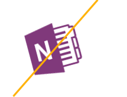
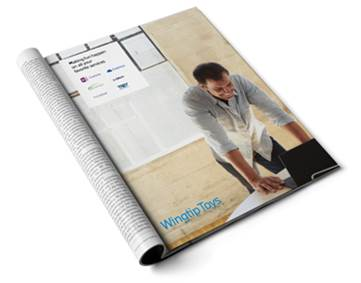

# Instrucciones de personalización de marca para desarrolladores de API de OneNoteBranding guidelines for OneNote API developers 
 
**Se aplica a:** Blocs de notas para consumidores de OneDrive | Blocs de notas empresariales de Office 365**Applies to:** Consumer notebooks on OneDrive | Enterprise notebooks on Office 365

Siga las instrucciones que se indican en este artículo para integrar mejor la marca de OneNote en su producto y cumplir con los requisitos de personalización de marca de OneNote.Follow the guidance in this article to best integrate the OneNote brand within your product and satisfy OneNote branding requirements.

## Logotipos descargablesDownloadable logos

Puede descargar los logotipos que se muestran en este artículo y una copia en PDF de estas directrices en nuestra página de descarga de [Instrucciones de personalización de marca para desarrolladores de API de OneNote](https://www.microsoft.com/download/details.aspx?id=42977).You can download the logos shown in this article and a PDF copy of these guidelines from our [Branding guidelines for OneNote API developers](https://www.microsoft.com/download/details.aspx?id=42977) download page.

## Variaciones de los logotiposLogo variations

### Bloqueo del icono y nombre (preferido)Icon and name lockup (Preferred) 

Se bloquea el símbolo de icono con el nombre.The icon symbol is locked with the name. Esta es la representación gráfica preferida del logotipo de OneNote.This is the preferred graphic representation of the OneNote logo.

### Símbolo de iconoIcon symbol 

Ciertos entornos, como los dispositivos pequeños, no proporcionan suficiente espacio para el bloqueo del logotipo completo.Certain environments, such as on small devices, don't provide enough room for the entire logo lockup. En estos casos, el símbolo de icono solo puede usarse en una aplicación o en marketing digital.In those cases, the icon symbol alone may be used in an app or in digital marketing. Cuando se utilice en una aplicación, use el símbolo de icono solo cuando necesite un icono o icono de favoritos para representar a OneNote.When used in an app, use the icon symbol alone only when you need an icon or favicon to represent OneNote.

## Espacio libreClear space 

Tratar el logotipo con respeto y dele espacio suficiente. El logotipo debe estar rodeado por un espacio libre mínimo equivalente a la altura del símbolo.Treat the logo with respect and give it room to breathe. A minimum clear space equivalent to the height of the symbol must surround the logo.

## Tamaño mínimoMinimum size 

El logotipo debe tener al menos 16 píxeles de alto cuando aparezca en pantalla y un mínimo de 5 mm (0,2 pulgadas) de alto cuando se imprima.The logo should be at least 16 pixels high when it appears on-screen and at least 5 mm (0.2 inches) high when it appears in print.

**Pantalla:**&nbsp;&nbsp;16 píxeles**Screen:**&nbsp;&nbsp;16 pixels
 
**Impreso:**&nbsp;&nbsp;5 mm (0,2 pulgadas)**Print:**&nbsp;&nbsp;5 mm (0.2 inches) 

## ColorColor

Cuando el logotipo de OneNote se usa en los fondos blancos o claros, el color preferido del logotipo es púrpura, su color de marca:When the OneNote logo is used on white or light backgrounds, the preferred logo color is purple--its brand color. Cuando aparezca en un fondo de color púrpura, el logotipo debe mostrarse de color blanco.When it appears on a purple background, the logo should be knocked out to white.

**Pantalla:**&nbsp;&nbsp;R128 G57 B123 o Hex #80397B**Screen:**&nbsp;&nbsp;R128 G57 B123 or Hex #80397B

**Impreso:**&nbsp;&nbsp; C75 M100 Y0 K0**Print:**&nbsp;&nbsp;C75 M100 Y0 K0 

  
 
En entornos de color limitado y diseños de un solo color, el logotipo puede aparecer en negro.In color-limited environments and one-color designs, the logo can appear in black. However, the logo should never appear in gray. Sin embargo, el logotipo nunca debería aparecer en gris.However, the logo should never appear in gray.
<!--or white?-->

## Lo que no se debe hacer con los logotiposLogo don’ts

**No coloque el logotipo o el icono en un fondo de color****Don’t place the logo or icon on a color background** 

 

**No cambie la escala ni las proporciones****Don’t change the scale or the proportions**

 

**No use una sombra paralela****Don’t use a drop shadow**

 

**No cambie el color, excepto a blanco o negro** (consulte [Color](#color))**Don’t change the color, except to black or white** (see [Color](#color))

 

 

**No gire el logotipo o icono****Don’t rotate the logo or icon**   

 

**No reorganice los elementos del logotipo****Don’t rearrange the logo elements** 

 

**No use efectos como de extrusión o biselado****Don’t use an effect such as extrude and bevel**  

 

**No cree un nuevo logotipo o icono****Don’t create a new logo or icon**

 

## Hacer referencia al nombre de OneNoteReferencing the OneNote name

**Nombre completo:**&nbsp;&nbsp;Microsoft OneNote**Full name:**&nbsp;&nbsp;Microsoft OneNote 

**Nombre corto:**&nbsp;&nbsp;OneNote**Short name:**&nbsp;&nbsp;OneNote
 
Vea la siguiente tabla para saber cómo hacer referencia a OneNote en diferentes contextos.Refer to the table below for details about how to refer to OneNote in various contexts.

| ContextoContext | UsoUsage |
|------|------|
| Nombres de aplicacionesApp names | Para evitar confundir a los consumidores en las tiendas de aplicaciones, preferimos que no incluya *OneNote* en el nombre de su aplicación.To avoid confusing consumers within the app stores, we prefer that *OneNote* not be included in the name of your app. Si se determina que *OneNote* debe usarse en el nombre de la aplicación, una preposición debe modificar a *OneNote* (por ejemplo, *para OneNote* o *con OneNote*).If it’s determined that OneNote must be used in the app name, *OneNote* must be modified by a preposition (for example, *for OneNote* or *with OneNote*).  Ejemplo:&nbsp;&nbsp;*Proseware para OneNote*Example:&nbsp;&nbsp;*Proseware for OneNote*  En ningún caso el nombre de la aplicación puede comenzar con *OneNote*.Under no circumstances can the name of your app begin with OneNote.
| Nombres de publicadorPublisher names | El nombre del editor no puede incluir referencias a *OneNote*.The publisher’s name may not include a reference to OneNote. El nombre del editor no puede atentar contra ninguna marca comercial de Microsoft.The publisher’s name may not infringe upon any Microsoft trademarks. |
| Indicación de interoperabilidad con OneNoteIndicating interoperability with OneNote | **Recomendado:**&nbsp;&nbsp;Enviar a OneNote**Recommended:**&nbsp;&nbsp;Send to OneNote  **Aceptable:**&nbsp;&nbsp;Compartir con OneNote**Acceptable:**&nbsp;&nbsp;Share with OneNote Aceptable cuando se usa con respecto a "compartir" con otras aplicaciones (por ejemplo, *Compartir con OneNote, Facebook y Twitter*).Acceptable when used in reference to "sharing" with other applications—for example, *Share with OneNote, Facebook, or Twitter.*)  **Nunca:**&nbsp;&nbsp;Guardar en OneNote**Never:**&nbsp;&nbsp;Save to OneNote Esto es técnicamente incorrecto.This is technically incorrect. |
| Marketing general (incluidas las descripciones de las aplicaciones)General marketing (including app descriptions) | La primera mención en una comunicación debe incluir el nombre completo: *Microsoft OneNote*.The first mention in a communication should use the full name: *Microsoft OneNote*.  Las referencias posteriores pueden usar el nombre corto: *OneNote*.Subsequent references in the communication can use the short name: *OneNote*.
 

## EjemplosExamples

**Aplicaciones****Applications**

 

**Publicidad****Advertising**

 

**Sitio web****Website**

 

**Embalaje****Packaging**

Si tiene preguntas sobre estas instrucciones o quiere crear comunicaciones nuevas con los recursos de marca que se muestran aquí, comuníquese con nosotros en [@onenotedev](http://twitter.com/onenotedev).If you have any questions about these guidelines or are creating new communications using the brand assets shown here, please contact us at [@onenotedev](http://twitter.com/onenotedev).

## Vea tambiénSee also

- [Instrucciones de personalización de marca para desarrolladores de API de OneNote](https://www.microsoft.com/download/details.aspx?id=42977) (página de descarga)[Branding guidelines for OneNote API developers](https://www.microsoft.com/download/details.aspx?id=42977) (download page)
- [Integración con OneNoteIntegrate with OneNote](integrate_with_onenote.md)
- [Blog para desarrolladores de OneNoteOneNote Developer Blog](http://go.microsoft.com/fwlink/?LinkID=390183)
- [Preguntas de desarrollo de OneNote en Stack OverflowOneNote development questions on Stack Overflow](http://go.microsoft.com/fwlink/?LinkID=390182)
- [Repositorios de OneNote en GitHubOneNote GitHub repos](http://go.microsoft.com/fwlink/?LinkID=390178)  

