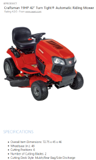

# <a name="use-onenote-api-div-tags-to-extract-data-from-captures"></a>Usar etiquetas div de la API de OneNote para extraer datos de capturas 

*__Se aplica a:__ Blocs de notas para consumidores de OneDrive | Blocs de notas empresariales de Office 365*

Use la API de OneNote para extraer datos de tarjetas de presentación de imágenes, o bien datos de recetas y productos de URL.

<a name="attributes"></a>
## <a name="extraction-attributes"></a>Atributos de extracción

Para extraer y transformar datos, solo tiene que incluir un div que especifique el contenido de origen, el método de extracción y el comportamiento de reserva en la solicitud [create-page](onenote-create-page.md) o [update-page](onenote_update_page.md). La API representa los datos extraídos de la página en un formato de fácil lectura. 

```
<div
  data-render-src="image-or-url"
  data-render-method="extraction-method"
  data-render-fallback="fallback-action">
</div>
```

**data-render-src**

El origen de contenido. Puede ser una imagen de una tarjeta de presentación, o bien una URL absoluta de sitios web populares de productos o recetas. Obligatorio.

Para obtener los mejores resultados al especificar una dirección URL, use la URL canónica definida en el HTML de la página web de origen, si se define una. Por ejemplo, se puede definir una URL canónica en la página web de origen de esta forma:

`<link rel="canonical" href="www.domainname.com/page/123/size12/type987" />` 


**data-render-method**

El método de extracción que se ejecutará. Obligatorio.

| Valor | Descripción |
|:------|:------|
| extract.businesscard | Una extracción de tarjetas de presentación. |
| extract.recipe | Una extracción de recetas. |
| extract.product | Una extracción de listas de productos. |
| extract | Un tipo de extracción desconocido. |

Para obtener los mejores resultados, especifique el tipo de contenido (`extract.businesscard`, `extract.recipe` o `extract.product`) si lo conoce. Si el tipo es desconocido, use el método `extract` y la API de OneNote para intentar detectar automáticamente el tipo.

**data-render-fallback**

El comportamiento de reserva si hay un error de extracción. Si se omite, se establece de forma predeterminada como **render**. 

| Valor | Descripción |
|:------|:------|
| render | Representa la imagen de origen o una instantánea de la página web del producto o la receta. |
| none | No realiza ninguna acción.<br />Esta opción es útil si siempre quiere incluir una instantánea de la tarjeta de presentación o la página web en la página, además del contenido extraído. Asegúrese de enviar un elemento `img` separado en la solicitud, como se muestra en los ejemplos. |

<a name="biz-card"></a>
## <a name="business-card-extractions"></a>Extracciones de tarjetas de presentación

La API de OneNote intenta encontrar y presentar la siguiente información de contacto según la imagen de la tarjeta de presentación de una persona o una empresa.


- Nombre
- El título
- Organización
- Números de teléfono y fax
- Direcciones de correo y físicas
- Direcciones de correo
- Sitios web
   
  

En la página, también se inserta una vCard (archivo .VCF) con la información del contacto extraída. Una vCard es una forma útil de obtener la información de contacto al recuperar el contenido HTML de una página.

### <a name="common-scenarios-for-business-card-extractions"></a>Escenarios comunes de extracciones de tarjetas de presentación

**Extraer información de tarjetas de presentación y, además, representar la imagen de la tarjeta de presentación**

Especifique el método `extract.businesscard` y la reserva `none`. Además, envíe un elemento `img` con el atributo `src` que también haga referencia la imagen. Si la API no puede extraer ningún contenido, solo representará la imagen de la tarjeta de presentación.

```html 
<div
    data-render-src="name:scanned-card-image"
    data-render-method="extract.businesscard"
    data-render-fallback="none">
</div>

```


**Extraer información de tarjetas de presentación y solo representar la imagen de la tarjeta de presentación si la extracción produce errores**

Especifique el método `extract.businesscard` y use la reserva `render` predeterminada. Si la API no puede extraer ningún contenido, solo representará la imagen de la tarjeta de presentación en su lugar.

```html
<div
    data-render-src="name:scanned-card-image"
    data-render-method="extract.businesscard">
</div>
```
 
Para extracciones de tarjetas de presentación, la imagen se envía como un elemento con nombre en una solicitud de varias partes. Vea [Agregar imágenes y archivos](onenote_images_files.md) para obtener ejemplos de cómo enviar una imagen en una solicitud.


<a name="recipe"></a>
## <a name="recipe-extractions"></a>Extracciones de recetas

La API de OneNote intenta buscar y procesar la siguiente información según la dirección URL de una receta.

- Imagen principal
- Clasificación
- Ingredientes
- Instrucciones
- Preparación, cocción, tiempo total
- Raciones

   

La API está optimizada para recetas de sitios populares, como *Allrecipes.com*, *FoodNetwork.com* y *SeriousEats.com*.

### <a name="common-scenarios-for-recipe-extractions"></a>Escenarios comunes de extracciones de recetas

**Extraer información de la receta y, además, mostrar una instantánea de la página web de la receta**

Especifique el método `extract.recipe` y la reserva `none`. Además, envía un elemento `img` con el atributo `data-render-src` establecido en la URL de la receta. Si la API no puede extraer ningún contenido, solo mostrará una instantánea de la página web de la receta.

Este escenario proporciona potencialmente la mayor cantidad de información posible, ya que la página web puede contener información adicional, como sugerencias y opiniones de clientes.

```html 
<div
    data-render-src="http://allrecipes.com/recipe/guacamole/"
    data-render-method="extract.recipe"
    data-render-fallback="none">
</div>

```
 

**Extraer información de la receta y solo mostrar una instantánea de la página web de la receta si la extracción produce errores**

Especifique el método `extract.recipe` y use la reserva de representación predeterminada. Si la API no puede extraer ningún contenido, solo mostrará una instantánea de la página web de la receta en su lugar.

```html  
<div
    data-render-src="http://www.foodnetwork.com/recipes/alton-brown/creme-brulee-recipe.html"
    data-render-method="extract.recipe">
</div>
```


**Extraer la información de la receta y, además, mostrar un vínculo la receta**

Especifique el método `extract.recipe` y la reserva `none`. Además, envía un elemento `a` con el atributo `src` establecido en la URL de la receta (o bien, puede enviar cualquier otra información que quiera agregar a la página). Si la API no puede extraer ningún contenido, solo se mostrará el vínculo de la receta.

```html  
<div
    data-render-src="http://www.seriouseats.com/recipes/2014/09/diy-spicy-kimchi-beef-instant-noodles-recipe.html"
    data-render-method="extract.recipe"
    data-render-fallback="none">
</div>
<a href="http://www.seriouseats.com/recipes/2014/09/diy-spicy-kimchi-beef-instant-noodles-recipe.html">Recipe URL</a>
``` 


<a name="product"></a>
## <a name="product-listing-extractions"></a>Extracciones de listas de productos

- El título
- Clasificación
- Imagen principal
- Descripción
- Características
- Especificaciones</td>

  

La API está optimizada para productos de muchos sitios populares como *Amazon.com* y *HomeDepot.com*.

### <a name="common-scenarios-for-recipe-extractions"></a>Escenarios comunes de extracciones de recetas

**Extraer información de productos y, además, mostrar una instantánea de la página web del producto**

Especifique el método `extract.product` y la reserva `none`. Además, envía un elemento `img` con el atributo `data-render-src` establecido en la URL del producto. Si la API no puede extraer ningún contenido, solo mostrará una instantánea de la página web del producto.

Este escenario proporciona potencialmente la mayor cantidad de información posible, ya que la página web puede contener información adicional, como sugerencias y opiniones de clientes.

```html 
<div
    data-render-src="http://www.amazon.com/Microsoft-Band-Small/dp/B00P2T2WVO"
    data-render-method="extract.product"
    data-render-fallback="none">
</div>

```


**Extraer información del producto y solo mostrar una instantánea de la página web del producto si la extracción produce errores**

Especifique el método `extract.product` y use la reserva de representación predeterminada. Si la API no puede extraer ningún contenido, solo mostrará una instantánea de la página web del producto en su lugar.

```html 
<div
    data-render-src="http://www.sears.com/craftsman-19hp-42-8221-turn-tight-174-hydrostatic-yard-tractor/p-07120381000P"
    data-render-method="extract.product">
</div>
```
 

**Extraer la información del producto y, además, mostrar un vínculo al producto**

Especifique el método `extract.product` y la reserva `none`. Además, envía un elemento `a` con el atributo `src` establecido en la URL del producto (o bien, puede enviar cualquier otra información que quiera agregar a la página). Si la API no puede extraer ningún contenido, solo se mostrará el vínculo de la página.

```html 
<div
    data-render-src="http://www.homedepot.com/p/Active-Ventilation-5-Watt-Solar-Powered-Exhaust-Attic-Fan-RBSF-8-WT/204203001"
    data-render-method="extract.product"
    data-render-fallback="none">
</div>
<a href="http://www.homedepot.com/p/Active-Ventilation-5-Watt-Solar-Powered-Exhaust-Attic-Fan-RBSF-8-WT/204203001">Product URL</a>
```


<a name="unknown"></a> 
## <a name="unknown-content-type-extractions"></a>Extracciones de tipo de contenido desconocido

Si no conoce el tipo de contenido (tarjeta de presentación, receta o producto) que quiere enviar, puede usar el método `extract` incompleto y dejar que la API de OneNote detecte el tipo automáticamente. Puede hacer esto si la aplicación envía distintos tipos de captura.

> **Nota:** Si conoce el tipo de contenido que quiere enviar, necesita usar el método `extract.businesscard`, `extract.recipe` o `extract.product`. En algunos casos, esto puede permitirle optimizar los resultados de la extracción.
 
### <a name="common-scenarios-for-unknown-extractions"></a>Escenarios comunes para extracciones desconocidas

**Enviar una imagen de una URL y, si la extracción produce errores, representar la imagen proporcionada o una instantánea de la página web**

Especifique el método `extract` para que la API detecte automáticamente el tipo de contenido y use la reserva de representación predeterminada. Si la API no puede extraer ningún contenido, en su lugar se mostrará la imagen proporcionada o una instantánea de la página web.

```html 
<div
    data-render-src="some image or url"
    data-render-method="extract">
</div>
```


<a name="request-response-info"></a>
## <a name="response-information"></a>Información de respuesta

| Datos de respuesta | Descripción |  
|------|------|  
| Código correcto | Un código de estado HTTP 201 para una solicitud POST correcta y un código de estado HTTP 204 para una solicitud PATCH correcta. |  
| Errores| Para obtener información sobre los errores de OneNote que puede mostrar Microsoft Graph, vea [Códigos de error para las API de OneNote en Microsoft Graph](onenote_error_codes.md). |  


<a name="permissions"></a>
## <a name="permissions"></a>Permisos

Para crear o actualizar páginas de OneNote, necesita solicitar los permisos adecuados. Seleccione el nivel inferior de permisos que necesita la aplicación para funcionar correctamente.

**Permisos para _PUBLICAR páginas_**

- Notes.Create
- Notes.ReadWrite
- Notes.ReadWrite.All  

**Permisos para _APLICAR REVISIONES de páginas_**

- Notes.ReadWrite
- Notes.ReadWrite.All

Para obtener más información sobre los ámbitos de permiso y cómo funcionan, vea [Referencias de permisos de Microsoft Graph](permissions_reference.md).


<a name="see-also"></a>
## <a name="additional-resources"></a>Recursos adicionales

- [Crear páginas de OneNote](onenote-create-page.md)
- [Actualizar el contenido de la página de OneNote](onenote_update_page.md)
- [Agregar imágenes y archivos](onenote_images_files.md)
- [Integración con OneNote](integrate_with_onenote.md)
- [Blog para desarrolladores de OneNote](http://go.microsoft.com/fwlink/?LinkID=390183)
- [Preguntas de desarrollo de OneNote en Stack Overflow](http://go.microsoft.com/fwlink/?LinkID=390182)
- [Repositorios de OneNote en GitHub](http://go.microsoft.com/fwlink/?LinkID=390178)  

