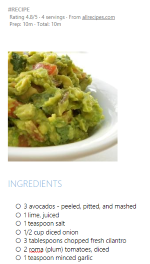

# <a name="use-onenote-api-div-tags-to-extract-data-from-captures"></a><span data-ttu-id="757e8-103">Usar las etiquetas div de la API de OneNote para extraer datos de capturas</span><span class="sxs-lookup"><span data-stu-id="757e8-103">Use OneNote API div tags to extract data from captures</span></span> 

<span data-ttu-id="757e8-104">**Se aplica a:** Blocs de notas para consumidores de OneDrive | Blocs de notas empresariales de Office 365</span><span class="sxs-lookup"><span data-stu-id="757e8-104">**Applies to** Consumer notebooks on OneDrive | Enterprise notebooks on Office 365</span></span>

<span data-ttu-id="757e8-105">Use la API de OneNote para extraer datos de tarjetas de presentación de imágenes, o bien datos de recetas y productos de URL.</span><span class="sxs-lookup"><span data-stu-id="757e8-105">Use the OneNote API to extract business card data from an image, or recipe and product data from a URL.</span></span>

<a name="attributes"></a>

## <a name="extraction-attributes"></a><span data-ttu-id="757e8-106">Atributos de extracción</span><span class="sxs-lookup"><span data-stu-id="757e8-106">Extraction attributes</span></span>

<span data-ttu-id="757e8-107">Para extraer y transformar datos, solo tiene que incluir un div que especifique el contenido de origen, el método de extracción y el comportamiento de reserva en la solicitud [create-page](onenote-create-page.md) o [update-page](onenote-update-page.md).</span><span class="sxs-lookup"><span data-stu-id="757e8-107">To extract and transform data, simply include a div that specifies the source content, extraction method, and fallback behavior in your [create-page](onenote-create-page.md) or [update-page](onenote-update-page.md) request.</span></span> <span data-ttu-id="757e8-108">La API representa los datos extraídos de la página en un formato de fácil lectura.</span><span class="sxs-lookup"><span data-stu-id="757e8-108">The API renders extracted data on the page in an easy-to-read format.</span></span> 

```html
<div
  data-render-src="image-or-url"
  data-render-method="extraction-method"
  data-render-fallback="fallback-action">
</div>
```

### <a name="data-render-src"></a><span data-ttu-id="757e8-109">data-render-src</span><span class="sxs-lookup"><span data-stu-id="757e8-109">data-render-src</span></span>

<span data-ttu-id="757e8-110">El origen de contenido.</span><span class="sxs-lookup"><span data-stu-id="757e8-110">The content source.</span></span> <span data-ttu-id="757e8-111">Puede ser una imagen de una tarjeta de presentación, o bien una URL absoluta de sitios web populares de productos o recetas.</span><span class="sxs-lookup"><span data-stu-id="757e8-111">This can be an image of a business card or an absolute URL from many popular recipe or product websites.</span></span> <span data-ttu-id="757e8-112">Obligatorio.</span><span class="sxs-lookup"><span data-stu-id="757e8-112">Required.</span></span>

<span data-ttu-id="757e8-113">Para obtener los mejores resultados al especificar una dirección URL, use la URL canónica definida en el HTML de la página web de origen, si se define una.</span><span class="sxs-lookup"><span data-stu-id="757e8-113">For best results when specifying a URL, use the canonical URL defined in the HTML of the source webpage, if one is defined.</span></span> <span data-ttu-id="757e8-114">Por ejemplo, se puede definir una URL canónica en la página web de origen de esta forma:</span><span class="sxs-lookup"><span data-stu-id="757e8-114">For example, a canonical URL might be defined in the source webpage like this:</span></span>

`<link rel="canonical" href="www.domainname.com/page/123/size12/type987" />` 


### <a name="data-render-method"></a><span data-ttu-id="757e8-115">data-render-method</span><span class="sxs-lookup"><span data-stu-id="757e8-115">data-render-method</span></span>

<span data-ttu-id="757e8-116">El método de extracción que se ejecutará.</span><span class="sxs-lookup"><span data-stu-id="757e8-116">The extraction method to run.</span></span> <span data-ttu-id="757e8-117">Obligatorio.</span><span class="sxs-lookup"><span data-stu-id="757e8-117">Required.</span></span>

| <span data-ttu-id="757e8-118">Valor</span><span class="sxs-lookup"><span data-stu-id="757e8-118">Value</span></span> | <span data-ttu-id="757e8-119">Descripción</span><span class="sxs-lookup"><span data-stu-id="757e8-119">Description</span></span> |
|:------|:------|
| <span data-ttu-id="757e8-120">extract.businesscard</span><span class="sxs-lookup"><span data-stu-id="757e8-120">extract.businesscard</span></span> | <span data-ttu-id="757e8-121">Una extracción de tarjetas de presentación.</span><span class="sxs-lookup"><span data-stu-id="757e8-121">A business card extraction.</span></span> |
| <span data-ttu-id="757e8-122">extract.recipe</span><span class="sxs-lookup"><span data-stu-id="757e8-122">extract.recipe</span></span> | <span data-ttu-id="757e8-123">Una extracción de recetas.</span><span class="sxs-lookup"><span data-stu-id="757e8-123">A recipe extraction.</span></span> |
| <span data-ttu-id="757e8-124">extract.product</span><span class="sxs-lookup"><span data-stu-id="757e8-124">extract.product</span></span> | <span data-ttu-id="757e8-125">Una extracción de listas de productos.</span><span class="sxs-lookup"><span data-stu-id="757e8-125">A product listing extraction.</span></span> |
| <span data-ttu-id="757e8-126">extract</span><span class="sxs-lookup"><span data-stu-id="757e8-126">extract</span></span> | <span data-ttu-id="757e8-127">Un tipo de extracción desconocido.</span><span class="sxs-lookup"><span data-stu-id="757e8-127">An unknown extraction type.</span></span> |

<span data-ttu-id="757e8-128">Para obtener los mejores resultados, especifique el tipo de contenido (`extract.businesscard`, `extract.recipe` o `extract.product`) si lo conoce.</span><span class="sxs-lookup"><span data-stu-id="757e8-128">For best results, specify the content type (`extract.businesscard`, `extract.recipe`, or `extract.product`) if you know it.</span></span> <span data-ttu-id="757e8-129">Si el tipo es desconocido, use el método `extract` y la API de OneNote para intentar detectar automáticamente el tipo.</span><span class="sxs-lookup"><span data-stu-id="757e8-129">If the type is unknown, use the `extract` method, and the OneNote API will try to auto-detect the type.</span></span>

### <a name="data-render-fallback"></a><span data-ttu-id="757e8-130">data-render-fallback</span><span class="sxs-lookup"><span data-stu-id="757e8-130">data-render-fallback</span></span>

<span data-ttu-id="757e8-131">El comportamiento de reserva si hay un error de extracción.</span><span class="sxs-lookup"><span data-stu-id="757e8-131">The fallback behavior if the extraction fails.</span></span> <span data-ttu-id="757e8-132">Si se omite, se establece de forma predeterminada como **render**.</span><span class="sxs-lookup"><span data-stu-id="757e8-132">Defaults to **render** if omitted.</span></span> 

| <span data-ttu-id="757e8-133">Valor</span><span class="sxs-lookup"><span data-stu-id="757e8-133">Value</span></span> | <span data-ttu-id="757e8-134">Descripción</span><span class="sxs-lookup"><span data-stu-id="757e8-134">Description</span></span> |
|:------|:------|
| <span data-ttu-id="757e8-135">render</span><span class="sxs-lookup"><span data-stu-id="757e8-135">render</span></span> | <span data-ttu-id="757e8-136">Representa la imagen de origen o una instantánea de la página web del producto o la receta.</span><span class="sxs-lookup"><span data-stu-id="757e8-136">Renders the source image or a snapshot of the recipe or product webpage.</span></span> |
| <span data-ttu-id="757e8-137">none</span><span class="sxs-lookup"><span data-stu-id="757e8-137">none</span></span> | <span data-ttu-id="757e8-138">No realiza ninguna acción.</span><span class="sxs-lookup"><span data-stu-id="757e8-138">Does nothing.</span></span><br /><br /><span data-ttu-id="757e8-139">Esta opción es útil si siempre quiere incluir una instantánea de la tarjeta de presentación o la página web en la página, además del contenido extraído.</span><span class="sxs-lookup"><span data-stu-id="757e8-139">This option is useful if you want to always include a snapshot of the business card or webpage on the page in addition to any extracted content.</span></span> <span data-ttu-id="757e8-140">Asegúrese de enviar un elemento `img` separado en la solicitud, como se muestra en los ejemplos.</span><span class="sxs-lookup"><span data-stu-id="757e8-140">Be sure to send a separate `img` element in the request, as shown in the examples.</span></span> |

<a name="biz-card"></a>

## <a name="business-card-extractions"></a><span data-ttu-id="757e8-141">Extracciones de tarjetas de presentación</span><span class="sxs-lookup"><span data-stu-id="757e8-141">Business card extractions</span></span>

<span data-ttu-id="757e8-142">La API de OneNote intenta encontrar y presentar la siguiente información de contacto según la imagen de la tarjeta de presentación de una persona o una empresa.</span><span class="sxs-lookup"><span data-stu-id="757e8-142">The OneNote API tries to find and render the following contact information based on an image of a person's or company's business card.</span></span>

- <span data-ttu-id="757e8-143">Nombre</span><span class="sxs-lookup"><span data-stu-id="757e8-143">Name</span></span>
- <span data-ttu-id="757e8-144">El título</span><span class="sxs-lookup"><span data-stu-id="757e8-144">Title</span></span>
- <span data-ttu-id="757e8-145">Organización</span><span class="sxs-lookup"><span data-stu-id="757e8-145">Organization</span></span>
- <span data-ttu-id="757e8-146">Números de teléfono y fax</span><span class="sxs-lookup"><span data-stu-id="757e8-146">Phone and fax numbers</span></span>
- <span data-ttu-id="757e8-147">Direcciones de correo y físicas</span><span class="sxs-lookup"><span data-stu-id="757e8-147">Mailing and physical addresses</span></span>
- <span data-ttu-id="757e8-148">Direcciones de correo</span><span class="sxs-lookup"><span data-stu-id="757e8-148">Email addresses</span></span>
- <span data-ttu-id="757e8-149">Sitios web</span><span class="sxs-lookup"><span data-stu-id="757e8-149">Websites</span></span>


<span data-ttu-id="757e8-p108">Un archivo vCard (archivo .VCF) con la información extraída del contacto también se inserta en la página. El archivo vCard es una forma cómoda de obtener la información de contacto cuando se recupera el contenido HTML de la página.</span><span class="sxs-lookup"><span data-stu-id="757e8-p108">A vCard (.VCF file) with the extracted contact information is also embedded in the page. The vCard is a convenient way to get the contact information when retrieving page HTML content.</span></span>

### <a name="common-scenarios-for-business-card-extractions"></a><span data-ttu-id="757e8-152">Escenarios comunes de extracciones de tarjetas de presentación</span><span class="sxs-lookup"><span data-stu-id="757e8-152">Common scenarios for business card extractions</span></span>

#### <a name="extract-business-card-information-and-also-render-the-business-card-image"></a><span data-ttu-id="757e8-153">Extraer información de tarjetas de presentación y además representar la imagen de la tarjeta de presentación</span><span class="sxs-lookup"><span data-stu-id="757e8-153">Extract business card information, and also render the business card image</span></span>

<span data-ttu-id="757e8-154">Especifique el método `extract.businesscard` y la reserva `none`.</span><span class="sxs-lookup"><span data-stu-id="757e8-154">Specify the `extract.businesscard` method and the `none` fallback.</span></span> <span data-ttu-id="757e8-155">Además, envíe un elemento `img` con el atributo `src` que también haga referencia la imagen.</span><span class="sxs-lookup"><span data-stu-id="757e8-155">Also send an `img` element with the `src` attribute that also references the image.</span></span> <span data-ttu-id="757e8-156">Si la API no puede extraer ningún contenido, solo representará la imagen de la tarjeta de presentación.</span><span class="sxs-lookup"><span data-stu-id="757e8-156">If the API is unable to extract any content, it renders the business card image only.</span></span>

```html 
<div
    data-render-src="name:scanned-card-image"
    data-render-method="extract.businesscard"
    data-render-fallback="none">
</div>

```


#### <a name="extract-business-card-information-and-render-the-business-card-image-only-if-the-extraction-fails"></a><span data-ttu-id="757e8-157">Extraer información de tarjetas de presentación y solo representar la imagen de la tarjeta de presentación si la extracción produce errores</span><span class="sxs-lookup"><span data-stu-id="757e8-157">Extract business card information, and render the business card image only if the extraction fails</span></span>

<span data-ttu-id="757e8-158">Especifique el método `extract.businesscard` y use la reserva `render` predeterminada.</span><span class="sxs-lookup"><span data-stu-id="757e8-158">Specify the `extract.businesscard` method and use the default `render` fallback.</span></span> <span data-ttu-id="757e8-159">Si la API no puede extraer ningún contenido, solo representará la imagen de la tarjeta de presentación en su lugar.</span><span class="sxs-lookup"><span data-stu-id="757e8-159">If the API is unable to extract any content, it renders the business card image instead.</span></span>

```html
<div
    data-render-src="name:scanned-card-image"
    data-render-method="extract.businesscard">
</div>
```
 
<span data-ttu-id="757e8-160">Para extracciones de tarjetas de presentación, la imagen se envía como un elemento con nombre en una solicitud de varias partes.</span><span class="sxs-lookup"><span data-stu-id="757e8-160">For business card extractions, the image is sent as a named part in a multipart request.</span></span> <span data-ttu-id="757e8-161">Vea [Agregar imágenes y archivos](onenote-images-files.md) para obtener ejemplos de cómo enviar una imagen en una solicitud.</span><span class="sxs-lookup"><span data-stu-id="757e8-161">See [Add images and files](onenote-images-files.md) for examples that show how to send an image in a request.</span></span>


<a name="recipe"></a>

## <a name="recipe-extractions"></a><span data-ttu-id="757e8-162">Extracciones de recetas</span><span class="sxs-lookup"><span data-stu-id="757e8-162">Recipe extractions</span></span>

<span data-ttu-id="757e8-163">La API de OneNote intenta buscar y procesar la siguiente información según la dirección URL de una receta.</span><span class="sxs-lookup"><span data-stu-id="757e8-163">The OneNote API tries to find and render the following information based on a recipe's URL.</span></span>

- <span data-ttu-id="757e8-164">Imagen principal</span><span class="sxs-lookup"><span data-stu-id="757e8-164">Hero image</span></span>
- <span data-ttu-id="757e8-165">Clasificación</span><span class="sxs-lookup"><span data-stu-id="757e8-165">Rating</span></span>
- <span data-ttu-id="757e8-166">Ingredientes</span><span class="sxs-lookup"><span data-stu-id="757e8-166">Ingredients</span></span>
- <span data-ttu-id="757e8-167">Instrucciones</span><span class="sxs-lookup"><span data-stu-id="757e8-167">Instructions</span></span>
- <span data-ttu-id="757e8-168">Preparación, cocción, tiempo total</span><span class="sxs-lookup"><span data-stu-id="757e8-168">Prep, cook, and total times</span></span>
- <span data-ttu-id="757e8-169">Raciones</span><span class="sxs-lookup"><span data-stu-id="757e8-169">Servings</span></span>




<span data-ttu-id="757e8-170">La API está optimizada para recetas de sitios populares, como *Allrecipes.com*, *FoodNetwork.com* y *SeriousEats.com*.</span><span class="sxs-lookup"><span data-stu-id="757e8-170">The API is optimized for recipes from many popular sites such as *Allrecipes.com*, *FoodNetwork.com*, and *SeriousEats.com*.</span></span>

### <a name="common-scenarios-for-recipe-extractions"></a><span data-ttu-id="757e8-171">Escenarios comunes de extracciones de recetas</span><span class="sxs-lookup"><span data-stu-id="757e8-171">Common scenarios for recipe extractions</span></span>

#### <a name="extract-recipe-information-and-also-render-a-snapshot-of-the-recipe-webpage"></a><span data-ttu-id="757e8-172">Extraer información de la receta y además mostrar una instantánea de la página web de la receta</span><span class="sxs-lookup"><span data-stu-id="757e8-172">Extract recipe information, and also render a snapshot of the recipe webpage</span></span>

<span data-ttu-id="757e8-173">Especifique el método `extract.recipe` y la reserva `none`.</span><span class="sxs-lookup"><span data-stu-id="757e8-173">Specify the `extract.recipe` method and the `none` fallback.</span></span> <span data-ttu-id="757e8-174">Además, envía un elemento `img` con el atributo `data-render-src` establecido en la URL de la receta.</span><span class="sxs-lookup"><span data-stu-id="757e8-174">Also send an `img` element with the `data-render-src` attribute set to the recipe URL.</span></span> <span data-ttu-id="757e8-175">Si la API no puede extraer ningún contenido, solo mostrará una instantánea de la página web de la receta.</span><span class="sxs-lookup"><span data-stu-id="757e8-175">If the API is unable to extract any content, it renders a snapshot of the recipe webpage only.</span></span>

<span data-ttu-id="757e8-176">Este escenario proporciona potencialmente la mayor cantidad de información posible, ya que la página web puede contener información adicional, como sugerencias y opiniones de clientes.</span><span class="sxs-lookup"><span data-stu-id="757e8-176">This scenario potentially provides the most information because the webpage may include additional information, such as customer reviews and suggestions.</span></span>

```html 
<div
    data-render-src="https://allrecipes.com/recipe/guacamole/"
    data-render-method="extract.recipe"
    data-render-fallback="none">
</div>

```
 

#### <a name="extract-recipe-information-and-render-a-snapshot-of-the-recipe-webpage-only-if-the-extraction-fails"></a><span data-ttu-id="757e8-177">Extraer información de la receta y solo mostrar una instantánea de la página web de la receta si la extracción produce errores</span><span class="sxs-lookup"><span data-stu-id="757e8-177">Extract recipe information, and render a snapshot of the recipe webpage only if the extraction fails</span></span>

<span data-ttu-id="757e8-178">Especifique el método `extract.recipe` y use la reserva de representación predeterminada.</span><span class="sxs-lookup"><span data-stu-id="757e8-178">Specify the `extract.recipe` method and use the default render fallback.</span></span> <span data-ttu-id="757e8-179">Si la API no puede extraer ningún contenido, solo mostrará una instantánea de la página web de la receta en su lugar.</span><span class="sxs-lookup"><span data-stu-id="757e8-179">If the API is unable to extract any content, it renders a snapshot of the recipe webpage instead.</span></span>

```html  
<div
    data-render-src="https://www.foodnetwork.com/recipes/alton-brown/creme-brulee-recipe.html"
    data-render-method="extract.recipe">
</div>
```


#### <a name="extract-recipe-information-and-also-render-a-link-to-the-recipe"></a><span data-ttu-id="757e8-180">Extraer la información de la receta y además mostrar un vínculo a la receta</span><span class="sxs-lookup"><span data-stu-id="757e8-180">Extract recipe information, and also render a link to the recipe</span></span>

<span data-ttu-id="757e8-181">Especifique el método `extract.recipe` y la reserva `none`.</span><span class="sxs-lookup"><span data-stu-id="757e8-181">Specify the `extract.recipe` method and the `none` fallback.</span></span> <span data-ttu-id="757e8-182">Además, envía un elemento `a` con el atributo `src` establecido en la URL de la receta (o bien, puede enviar cualquier otra información que quiera agregar a la página).</span><span class="sxs-lookup"><span data-stu-id="757e8-182">Also send an `a` element with the `src` attribute set to the recipe URL (or you can send any other information you want to add to the page).</span></span> <span data-ttu-id="757e8-183">Si la API no puede extraer ningún contenido, solo se mostrará el vínculo de la receta.</span><span class="sxs-lookup"><span data-stu-id="757e8-183">If the API is unable to extract any content, only the recipe link is rendered.</span></span>

```html  
<div
    data-render-src="https://www.seriouseats.com/recipes/2014/09/diy-spicy-kimchi-beef-instant-noodles-recipe.html"
    data-render-method="extract.recipe"
    data-render-fallback="none">
</div>
<a href="https://www.seriouseats.com/recipes/2014/09/diy-spicy-kimchi-beef-instant-noodles-recipe.html">Recipe URL</a>
``` 


<a name="product"></a>

## <a name="product-listing-extractions"></a><span data-ttu-id="757e8-184">Extracciones de listas de productos</span><span class="sxs-lookup"><span data-stu-id="757e8-184">Product listing extractions</span></span>

- <span data-ttu-id="757e8-185">El título</span><span class="sxs-lookup"><span data-stu-id="757e8-185">Title</span></span>
- <span data-ttu-id="757e8-186">Clasificación</span><span class="sxs-lookup"><span data-stu-id="757e8-186">Rating</span></span>
- <span data-ttu-id="757e8-187">Imagen principal</span><span class="sxs-lookup"><span data-stu-id="757e8-187">Primary image</span></span>
- <span data-ttu-id="757e8-188">Descripción</span><span class="sxs-lookup"><span data-stu-id="757e8-188">Description</span></span>
- <span data-ttu-id="757e8-189">Características</span><span class="sxs-lookup"><span data-stu-id="757e8-189">Features</span></span>
- <span data-ttu-id="757e8-190">Especificaciones</span><span class="sxs-lookup"><span data-stu-id="757e8-190">Specifications</span></span>


<span data-ttu-id="757e8-191">La API está optimizada para productos de muchos sitios populares como *Amazon.com* y *HomeDepot.com*.</span><span class="sxs-lookup"><span data-stu-id="757e8-191">The API is optimized for products from many popular sites such as *Amazon.com* and *HomeDepot.com*.</span></span>

### <a name="common-scenarios-for-recipe-extractions"></a><span data-ttu-id="757e8-192">Escenarios comunes de extracciones de recetas</span><span class="sxs-lookup"><span data-stu-id="757e8-192">Common scenarios for recipe extractions</span></span>

#### <a name="extract-product-information-and-also-render-a-snapshot-of-the-product-webpage"></a><span data-ttu-id="757e8-193">Extraer información de productos y además mostrar una instantánea de la página web del producto</span><span class="sxs-lookup"><span data-stu-id="757e8-193">Extract product information, and also render a snapshot of the product webpage</span></span>

<span data-ttu-id="757e8-194">Especifique el método `extract.product` y la reserva `none`.</span><span class="sxs-lookup"><span data-stu-id="757e8-194">Specify the `extract.product` method and the `none` fallback.</span></span> <span data-ttu-id="757e8-195">Además, envía un elemento `img` con el atributo `data-render-src` establecido en la URL del producto.</span><span class="sxs-lookup"><span data-stu-id="757e8-195">Also send an `img` element with the `data-render-src` attribute set to the product URL.</span></span> <span data-ttu-id="757e8-196">Si la API no puede extraer ningún contenido, solo mostrará una instantánea de la página web del producto.</span><span class="sxs-lookup"><span data-stu-id="757e8-196">If the API is unable to extract any content, it renders a snapshot of the product webpage only.</span></span>

<span data-ttu-id="757e8-197">Este escenario proporciona potencialmente la mayor cantidad de información posible, ya que la página web puede contener información adicional, como sugerencias y opiniones de clientes.</span><span class="sxs-lookup"><span data-stu-id="757e8-197">This scenario potentially provides the most information because the webpage may include additional information, such as customer reviews and suggestions.</span></span>

```html 
<div
    data-render-src="https://www.amazon.com/Microsoft-Band-Small/dp/B00P2T2WVO"
    data-render-method="extract.product"
    data-render-fallback="none">
</div>

```


#### <a name="extract-product-information-and-render-a-snapshot-of-the-product-webpage-only-if-the-extraction-fails"></a><span data-ttu-id="757e8-198">Extraer información del producto y solo mostrar una instantánea de la página web del producto si la extracción produce errores</span><span class="sxs-lookup"><span data-stu-id="757e8-198">Extract product information, and render a snapshot of the product webpage only if the extraction fails</span></span>

<span data-ttu-id="757e8-199">Especifique el método `extract.product` y use la reserva de representación predeterminada.</span><span class="sxs-lookup"><span data-stu-id="757e8-199">Specify the `extract.product` method and use the default render fallback.</span></span> <span data-ttu-id="757e8-200">Si la API no puede extraer ningún contenido, solo mostrará una instantánea de la página web del producto en su lugar.</span><span class="sxs-lookup"><span data-stu-id="757e8-200">If the API is unable to extract any content, it renders a snapshot of the product webpage instead.</span></span>

```html 
<div
    data-render-src="https://www.sears.com/craftsman-19hp-42-8221-turn-tight-174-hydrostatic-yard-tractor/p-07120381000P"
    data-render-method="extract.product">
</div>
```
 

#### <a name="extract-product-information-and-also-render-a-link-to-the-product"></a><span data-ttu-id="757e8-201">Extraer la información del producto y además mostrar un vínculo al producto</span><span class="sxs-lookup"><span data-stu-id="757e8-201">Extract product information, and also render a link to the product</span></span>

<span data-ttu-id="757e8-202">Especifique el método `extract.product` y la reserva `none`.</span><span class="sxs-lookup"><span data-stu-id="757e8-202">Specify the `extract.product` method and the `none` fallback.</span></span> <span data-ttu-id="757e8-203">Además, envía un elemento `a` con el atributo `src` establecido en la URL del producto (o bien, puede enviar cualquier otra información que quiera agregar a la página).</span><span class="sxs-lookup"><span data-stu-id="757e8-203">Also send an `a` element with the `src` attribute set to the product URL (or you can send any other information you want to add to the page).</span></span> <span data-ttu-id="757e8-204">Si la API no puede extraer ningún contenido, solo se mostrará el vínculo de la página.</span><span class="sxs-lookup"><span data-stu-id="757e8-204">If the API is unable to extract any content, only the page link is rendered.</span></span>

```html 
<div
    data-render-src="https://www.homedepot.com/p/Active-Ventilation-5-Watt-Solar-Powered-Exhaust-Attic-Fan-RBSF-8-WT/204203001"
    data-render-method="extract.product"
    data-render-fallback="none">
</div>
<a href="https://www.homedepot.com/p/Active-Ventilation-5-Watt-Solar-Powered-Exhaust-Attic-Fan-RBSF-8-WT/204203001">Product URL</a>
```


<a name="unknown"></a> 

## <a name="unknown-content-type-extractions"></a><span data-ttu-id="757e8-205">Extracciones de tipo de contenido desconocido</span><span class="sxs-lookup"><span data-stu-id="757e8-205">Unknown content type extractions</span></span>

<span data-ttu-id="757e8-206">Si no conoce el tipo de contenido (tarjeta de presentación, receta o producto) que quiere enviar, puede usar el método `extract` incompleto y dejar que la API de OneNote detecte el tipo automáticamente.</span><span class="sxs-lookup"><span data-stu-id="757e8-206">If you don't know the content type (business card, recipe, or product) that you're sending, you can use the unqualified `extract` method and let the OneNote API automatically detect the type.</span></span> <span data-ttu-id="757e8-207">Puede hacer esto si la aplicación envía distintos tipos de captura.</span><span class="sxs-lookup"><span data-stu-id="757e8-207">You might want to do this if your app sends different capture types.</span></span>

> <span data-ttu-id="757e8-208">**Nota:** Si conoce el tipo de contenido que quiere enviar, necesita usar el método `extract.businesscard`, `extract.recipe` o `extract.product`.</span><span class="sxs-lookup"><span data-stu-id="757e8-208">**Note:** If you do know the content type that you're sending, you should use the `extract.businesscard`, `extract.recipe`, or `extract.product` method.</span></span> <span data-ttu-id="757e8-209">En algunos casos, esto puede permitirle optimizar los resultados de la extracción.</span><span class="sxs-lookup"><span data-stu-id="757e8-209">In some cases, this can help to optimize the extraction results.</span></span>
 
### <a name="common-scenarios-for-unknown-extractions"></a><span data-ttu-id="757e8-210">Escenarios comunes para extracciones desconocidas</span><span class="sxs-lookup"><span data-stu-id="757e8-210">Common scenarios for unknown extractions</span></span>

#### <a name="send-an-image-or-a-url-and-render-the-supplied-image-or-a-snapshot-of-the-webpage-if-the-extraction-fails"></a><span data-ttu-id="757e8-211">Enviar una imagen de una URL y, si la extracción produce errores, representar la imagen proporcionada o una instantánea de la página web</span><span class="sxs-lookup"><span data-stu-id="757e8-211">Send an image or a URL, and render the supplied image or a snapshot of the webpage if the extraction fails</span></span>

<span data-ttu-id="757e8-212">Especifique el método `extract` para que la API detecte automáticamente el tipo de contenido y use la reserva de representación predeterminada.</span><span class="sxs-lookup"><span data-stu-id="757e8-212">Specify the `extract` method so the API automatically detects the content type, and use the default render fallback.</span></span> <span data-ttu-id="757e8-213">Si la API no puede extraer ningún contenido, en su lugar se mostrará la imagen proporcionada o una instantánea de la página web.</span><span class="sxs-lookup"><span data-stu-id="757e8-213">If the API is unable to extract any content, it renders the supplied image or snapshot of the webpage instead.</span></span>

```html 
<div
    data-render-src="some image or url"
    data-render-method="extract">
</div>
```


<a name="request-response-info"></a>

## <a name="response-information"></a><span data-ttu-id="757e8-214">Información de respuesta</span><span class="sxs-lookup"><span data-stu-id="757e8-214">Response information</span></span>

| <span data-ttu-id="757e8-215">Datos de respuesta</span><span class="sxs-lookup"><span data-stu-id="757e8-215">Response data</span></span> | <span data-ttu-id="757e8-216">Descripción</span><span class="sxs-lookup"><span data-stu-id="757e8-216">Description</span></span> |  
|------|------|  
| <span data-ttu-id="757e8-217">Código correcto</span><span class="sxs-lookup"><span data-stu-id="757e8-217">Success code</span></span> | <span data-ttu-id="757e8-218">Un código de estado HTTP 201 para una solicitud POST correcta y un código de estado HTTP 204 para una solicitud PATCH correcta.</span><span class="sxs-lookup"><span data-stu-id="757e8-218">A 201 HTTP status code for a successful POST request, and a 204 HTTP status code for a successful PATCH request.</span></span> |  
| <span data-ttu-id="757e8-219">Errores</span><span class="sxs-lookup"><span data-stu-id="757e8-219">Errors</span></span>| <span data-ttu-id="757e8-220">Lea [Códigos de error para API de OneNote de Microsoft Graph](onenote-error-codes.md) para obtener información sobre los errores de OneNote que puede devolver Microsoft Graph.</span><span class="sxs-lookup"><span data-stu-id="757e8-220">Read [Error codes for OneNote APIs in Microsoft Graph](onenote-error-codes.md) to learn about OneNote errors that Microsoft Graph can return.</span></span> |  


<a name="permissions"></a>

## <a name="permissions"></a><span data-ttu-id="757e8-221">Permisos</span><span class="sxs-lookup"><span data-stu-id="757e8-221">Permissions</span></span>

<span data-ttu-id="757e8-222">Para crear o actualizar páginas de OneNote, necesita solicitar los permisos adecuados.</span><span class="sxs-lookup"><span data-stu-id="757e8-222">To create or update OneNote pages, you'll need to request appropriate permissions.</span></span> <span data-ttu-id="757e8-223">Seleccione el nivel inferior de permisos que necesita la aplicación para funcionar correctamente.</span><span class="sxs-lookup"><span data-stu-id="757e8-223">Choose the lowest level of permissions that your app needs to do its work.</span></span>

#### <a name="permissions-for-post-pages"></a><span data-ttu-id="757e8-224">Permisos para páginas POST</span><span class="sxs-lookup"><span data-stu-id="757e8-224">Permissions for POST pages</span></span>

- <span data-ttu-id="757e8-225">Notes.Create</span><span class="sxs-lookup"><span data-stu-id="757e8-225">Notes.Create</span></span>
- <span data-ttu-id="757e8-226">Notes.ReadWrite</span><span class="sxs-lookup"><span data-stu-id="757e8-226">Notes.ReadWrite</span></span>
- <span data-ttu-id="757e8-227">Notes.ReadWrite.All</span><span class="sxs-lookup"><span data-stu-id="757e8-227">Notes.ReadWrite.All</span></span>  

#### <a name="permissions-for-patch-pages"></a><span data-ttu-id="757e8-228">Permisos para páginas PATCH</span><span class="sxs-lookup"><span data-stu-id="757e8-228">Permissions for PATCH pages</span></span>

- <span data-ttu-id="757e8-229">Notes.ReadWrite</span><span class="sxs-lookup"><span data-stu-id="757e8-229">Notes.ReadWrite</span></span>
- <span data-ttu-id="757e8-230">Notes.ReadWrite.All</span><span class="sxs-lookup"><span data-stu-id="757e8-230">Notes.ReadWrite.All</span></span>

<span data-ttu-id="757e8-231">Para obtener más información sobre los ámbitos de permiso y cómo funcionan, vea [Referencias de permisos de Microsoft Graph](permissions-reference.md).</span><span class="sxs-lookup"><span data-stu-id="757e8-231">For more information about permission scopes and how they work, see [Microsoft Graph permissions reference](permissions-reference.md).</span></span>


<a name="see-also"></a>

## <a name="see-also"></a><span data-ttu-id="757e8-232">Vea también</span><span class="sxs-lookup"><span data-stu-id="757e8-232">See also</span></span>

- [<span data-ttu-id="757e8-233">Crear páginas de OneNote</span><span class="sxs-lookup"><span data-stu-id="757e8-233">Create OneNote pages</span></span>](onenote-create-page.md)
- [<span data-ttu-id="757e8-234">Actualizar el contenido de la página de OneNote</span><span class="sxs-lookup"><span data-stu-id="757e8-234">Update OneNote page content</span></span>](onenote-update-page.md)
- [<span data-ttu-id="757e8-235">Agregar imágenes y archivos</span><span class="sxs-lookup"><span data-stu-id="757e8-235">Add images and files</span></span>](onenote-images-files.md)
- [<span data-ttu-id="757e8-236">Integración con OneNote</span><span class="sxs-lookup"><span data-stu-id="757e8-236">Integrate with OneNote</span></span>](integrate-with-onenote.md)
- [<span data-ttu-id="757e8-237">Blog para desarrolladores de OneNote</span><span class="sxs-lookup"><span data-stu-id="757e8-237">OneNote Developer Blog</span></span>](https://go.microsoft.com/fwlink/?LinkID=390183)
- [<span data-ttu-id="757e8-238">Preguntas de desarrollo de OneNote en Stack Overflow</span><span class="sxs-lookup"><span data-stu-id="757e8-238">OneNote development questions on Stack Overflow</span></span>](https://go.microsoft.com/fwlink/?LinkID=390182)
- [<span data-ttu-id="757e8-239">Repositorios de OneNote en GitHub</span><span class="sxs-lookup"><span data-stu-id="757e8-239">OneNote GitHub repos</span></span>](https://go.microsoft.com/fwlink/?LinkID=390178)  

