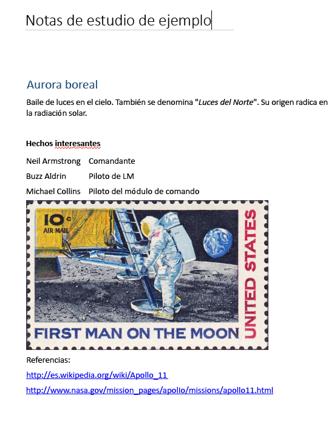

# <a name="input-and-output-html-in-onenote-pages"></a>HTML de entrada y salida en páginas de OneNote

El código HTML que define el contenido y la estructura de la página cuando [crea](onenote-create-page.md) o [actualiza](onenote-update-page.md) una página de OneNote se llama *HTML de entrada*. 

El código HTML que se devuelve cuando [,obtiene el contenido de la página](onenote-get-content.md) se denomina *HTML de salida*. El HTML de salida no será el mismo que el de entrada.

Las API de OneNote en Microsoft Graph conservan el contenido semántico y la estructura básica del HTML de entrada, pero la convierten en un conjunto de [elementos HTML y propiedades CSS compatibles](onenote-create-page.md#supported-html-and-css-for-onenote-pages). Las API también agregan atributos personalizados que admiten las características de OneNote.
 
Este artículo describe los principales elementos y atributos del HTML de entrada y de salida. Puede ser útil comprender el HTML de entrada cuando crea o actualiza el contenido de la página, y el HTML de salida cuando analiza el contenido de la página devuelto. 

## <a name="body-element"></a>body element

El contenido HTML en el cuerpo de la página representa el contenido y la estructura de la página, incluidos los recursos de imagen y archivo. El elemento **body** puede contener los siguientes atributos en el HTML de entrada y salida.

#### <a name="input-attributes"></a>Atributos de entrada

|Atributo de entrada|Descripción|
|:------|:------|
| data-absolute-enabled | Indica si el cuerpo de entrada admite los elementos [con posición absoluta](onenote-abs-pos.md). |
| style | <p>Las propiedades CSS [style](#styles) del cuerpo. En el HTML de salida, la configuración de entrada podría devolverse insertada en los elementos secundarios adecuados.</p><p>Actualmente, el color de fondo no es compatible con el elemento **body**.</p> |
 

#### <a name="output-attributes"></a>Atributos de salida

|Atributo de salida|Descripción|
|:------|:------|
| data-absolute-enabled | Indica si el cuerpo admite los elementos [con posición absoluta](onenote-abs-pos.md). Siempre **true** en el HTML de salida. |
| style | Las propiedades **font-family** y **font-size** del cuerpo. |


## <a name="div-elements"></a>Elementos div

Los elementos **div** contienen texto, imágenes y otro contenido. Un elemento **div** puede contener los siguientes atributos en el HTML de entrada y salida.

#### <a name="input-attributes"></a>Atributos de entrada

|Atributo de entrada|Descripción|
|:------|:------|
| data-id | Una referencia para el elemento.<br/><br/>Se usa para [actualizar el contenido de la página](onenote-update-page.md). |
| data-render-fallback | La acción de reserva si falla la [extracción](onenote-extract-data.md): **render** (predeterminado) o **none** |
| data-render-method | El método [extraction](onenote-extract-data.md) para llevar a cabo, por ejemplo:<br/>`extract.businesscard` o `extract.recipe` |
| data-render-src | El origen del contenido para la [extracción](onenote-extract-data.md). |
| style | La posición, tamaño, fuente y propiedades de color del elemento div: <ul><li>**position** (solo **absolute**), **left**, **top** y **width** (height se configura automáticamente para div)<br/><br/>Se usa para crear un elemento div [con posición absoluta](onenote-abs-pos.md), solo si el div es un elemento secundario directo del cuerpo cuando el cuerpo indica `data-absolute-enabled="true"`.<br/><br/>Ejemplo: `<div style="position:absolute;width:360px;top:350px;left:300px" ... />`</li><li>Las propiedades CSS [style](#styles) del elemento. En el HTML de salida, estos valores se devuelven en línea en elementos secundarios correspondientes.</li></ul> |
 

Las API de OneNote en Microsoft Graph ajustan todo el contenido del cuerpo en al menos un div. La API crea un div predeterminado (con atributos `data-id="_default"`) para contener el contenido del cuerpo si:

- El atributo **data-absolute-enabled** del elemento de entrada del cuerpo se omite o se establece en **false**. En este caso, se coloca todo el contenido del cuerpo en el div predeterminado.

- El atributo **data-absolute-enabled** del elemento de entrada del cuerpo es **true**, pero el HTML de entrada contiene elementos secundarios directos que no son elementos [con posición absoluta](onenote-abs-pos.md)&nbsp;**div**, **img** u **object**. En este caso, los elementos secundarios directos que no son elementos [con posición absoluta](onenote-abs-pos.md)&nbsp;**div**, **img** u **object** se colocan en el div predeterminado.


#### <a name="output-attributes"></a>Atributos de salida

|Atributo de salida|Descripción|
|:------|:------|
| data-id | Una referencia para el elemento.<br/><br/>Se usa para [actualizar el contenido de la página](onenote-update-page.md). |
| id | Un identificador único, generado para el elemento. Devuelto por [solicitudes GET al punto de conexión del *contenido* de una página](/graph/api/page-get?view=graph-rest-1.0) cuando se usa la opción de consulta `includeIDs=true`.<br/><br/>Se usa para [actualizar el contenido de la página](onenote-update-page.md). |
| style | Las propiedades de posición y tamaño del div. |
 
### <a name="non-contributing-divs"></a>Div que no contribuyen

Cuando un elemento **div** en el HTML de entrada no contribuye a la estructura de la página o lleva información que OneNote usa, la API mueve el contenido del div al div primario o predeterminado. Se muestra en los ejemplos siguientes.

#### <a name="input-html"></a>HTML de entrada

Contiene un div anidado de no contribución.

```html
<html>
    <head>
        <title>Page Title</title>
    </head>
    <body>
        <div>
            <p>Some text</p>
            <div>
                <p>More text inside a div that doesn't define page structure</p>
            </div>
        </div>
    </body>
</html>
```

#### <a name="output-html"></a>HTML de salida

> **Nota:** El contenido del div se movió al div principal y se eliminaron las etiquetas `<div>` anidadas. El div se habría conservado si hubiera definido cualquier información semántica, como un **data-id** (ejemplo: `<div data-id="keep-me">`).

```html
<html htmlns="https://www.w3.org/1999/xhtml" lang="en-US">
    <head>
        <title>Page Title</title>
    </head>
    <body data-absolute-enabled="true" style="font-family:Calibri;font-size:11px">
        <div data-id="_default" style="position:absolute;left:48px;top:120px;width:624px">
            <p>Some text</p>
            <p>More text inside a nested div</p>
        </div>
    </body>
</html>
```


## <a name="img-elements"></a>Elementos img

Las imágenes en las páginas de OneNote están representadas por elementos **img**. Un elemento **img** puede contener los siguientes atributos en el HTML de entrada y salida.

#### <a name="input-attributes"></a>Atributos de entrada

|Atributo de entrada|Descripción|
|:------|:------|
| alt | El texto alternativo que se proporciona para la imagen. |
| data-id | Una referencia para el elemento.<br/><br/>Se usa para [actualizar el contenido de la página](onenote-update-page.md). |
| data-render-src |Se necesita **data-render-src** o **src**.<br/><br/>La página web para representar como imagen como mapa de bits en la página de OneNote:<br/><br/> - `data-render-src="https://..."` para una dirección URL pública.<br/><br/> - `data-render-src="name:BlockName"` para una parte de imagen en el bloque "Presentación" de una [solicitud de varias partes](/graph/api/section-post-pages?view=graph-rest-1.0#example).<br/><br/>Este método es útil cuando la página web es más compleja que la página que OneNote puede representar fielmente, o cuando la página requiere credenciales de inicio de sesión.|
| etiqueta de datos | Una [etiqueta de nota](onenote-note-tags.md) en el elemento. |
| style |Las propiedades de posición y tamaño de la imagen: **posición** (**absoluta** solo), **izquierda**, **arriba**, **ancho** y **alto**.<br/><br/>El tamaño se puede establecer en cualquier imagen.<br/><br/>Las propiedades de posición se usan para crear una imagen [con posición absoluta](onenote-abs-pos.md), solo si la imagen es un elemento secundario directo del cuerpo cuando el cuerpo indica `data-absolute-enabled="true"`.<br/><br/>Ejemplo: ``<br/><br/>En el HTML de salida, el tamaño de la imagen se devuelve por separado en los atributos **width** y **height**. |
| src |Se necesita **src** o **data-render-src**.<br/><br/>La imagen para representar en la página de OneNote:<br/><br/>- `src="https://..."` para una dirección URL a una imagen disponible públicamente en Internet.<br/><br/> - `src="name:BlockName"` para una parte con nombre en una solicitud con varias partes que representa a la imagen.|
| width, height | El ancho o alto de la imagen, en píxeles pero sin px. Ejemplo: `width="400"` |
 
> **Nota**: Las API de OneNote detectan automáticamente el tipo de imagen de entrada y lo devuelven como el **data-fullres-src-type** en el HTML de salida. La API también devuelve el tipo de imagen de la imagen optimizada en **data-src-type**.
 

#### <a name="output-attributes"></a>Atributos de salida

|Atributo de salida|Descripción|
|:------|:------|
| alt | El texto alternativo que se proporciona para la imagen. |
| data-id | Una referencia para el elemento.<br/><br/>Se usa para [actualizar el contenido de la página](onenote-update-page.md). |
| data-index | La posición de la imagen. Para compatibilidad con [imagen dividida](#split-images). |
| data-fullres-src | El extremo para la versión del recurso de la imagen que se incrustó originalmente en la página. |
| data-fullres-src-type | El tipo de medios del recurso **data-fullres-src**. Por ejemplo: `image/png` o `image/jpeg`. |
| data-options | El tipo de origen: **printout** para archivos PDF o **splitimage** para todos los demás. Se aplica únicamente a [imágenes divididas](#split-images) creadas con el atributo **data-render-src**. |
| data-render-original-src | La dirección URL de origen de la imagen, si la imagen de origen proviene de Internet pública y se creó con el atributo **data-render-src**. |
| data-src-type | El tipo de medios del recurso **src**. Por ejemplo: `image/png` o `image/jpeg`. |
| etiqueta de datos | Una [etiqueta de nota](onenote-note-tags.md) en el elemento. |
| id | Un identificador único, generado para el elemento. Devuelto por [solicitudes GET al punto de conexión del *contenido* de una página](/graph/api/page-get?view=graph-rest-1.0) cuando se usa la opción de consulta `includeIDs=true`.<br/><br/>Se usa para [actualizar el contenido de la página](onenote-update-page.md). |
| src | El extremo para la versión del recurso de imagen que se ha optimizado para exploradores web y factores de forma móviles y de tabletas. |
| style | Las propiedades de posición de la imagen. |
| width, height | El ancho o alto de la imagen, en píxeles. |
 

### <a name="output-html-examples-for-images"></a>Ejemplos de HTML de salida para imágenes

Los elementos **img** de salida contienen puntos de conexión para los recursos de archivo de imagen y el tipo de imagen, como se muestra a continuación. Puede hacer [solicitudes GET independientes a puntos de conexión de recursos de imagen](/graph/api/resource-get?view=graph-rest-1.0) para recuperar su contenido binario.

```html

```

De forma predeterminada, las imágenes no se representarán directamente en un explorador porque son privadas y se necesita una autorización para recuperarlas, al igual que el contenido de la página. Para obtener direcciones URL públicas a los recursos de imagen en una página, incluya **preAuthenticated=true** en la cadena de consulta cuando recupere el contenido de la página (ejemplo: `GET ../pages/{page-id}/content?preAuthenticated=true`). Las direcciones URL públicas que se devuelven son válidas durante una hora. 

#### <a name="image-with-public-url-when-preauthenticatedtrue-is-included-in-the-request"></a>Imagen con dirección URL pública cuando se incluye _preAuthenticated=true_ en la solicitud

```html

```

Los siguientes ejemplos muestran la información que un elemento **img** podría contener en el HTML de salida.

#### <a name="image-with-web-ready-and-high-resolution-resources"></a>Imagen con recursos de alta resolución y listos para la web

```html

```

#### <a name="image-created-by-using-the-data-render-src-attribute"></a>Imagen creada mediante el atributo *data-render-src*

```html

```

### <a name="split-images"></a>Imágenes divididas

Las imágenes que se crean mediante el atributo **data-render-src** (de una dirección URL de una página web o una parte con nombre) podrían dividirse en varias componentes de imágenes por motivos de representación y de rendimiento. A todos los componentes de imágenes se les asigna el mismo valor **data-id**. Cada componente de imagen tiene un atributo de índice de datos de base cero que define el diseño vertical original.

#### <a name="split-image-with-three-component-images"></a>Imagen dividida con tres imágenes con componente

```html
<div data-id="multi-component-image" style="position:absolute;left:48px;top:120px;width:624px">
    
    
    
</div>
```

Debido a que los usuarios pueden mover las imágenes en la página, los índices devueltos pueden estar desordenados. El orden debe estar en orden descendente en el eje y, y de izquierda a derecha en el eje x, si hay conflictos en el eje y.

## <a name="iframe-elements"></a>Elementos iframe

Las páginas de OneNote pueden contener vídeos insertados representados por elementos **iframe**. 

> **Nota**: También puede [adjuntar un archivo de vídeo mediante un elemento **object**](onenote-images-files.md#adding-files).

#### <a name="input-attributes"></a>Atributos de entrada

|Atributo de entrada|Descripción|
|:------|:------|
| data-original-src | Obligatorio. La dirección URL del origen del vídeo. Consulte la [lista de orígenes de vídeo compatibles](onenote-images-files.md#adding-videos). <br/><br/>Ejemplo: `data-original-src="https://www.youtube.com/watch?v=3Ztr44aKmQ8"` |
| width, height | El ancho o alto del iframe, en píxeles. Ejemplo: `width=300` |

#### <a name="output-attributes"></a>Atributos de salida

|Atributo de salida|Descripción|
|:------|:------|
| data-original-src | La dirección URL del origen del vídeo. |
| src | Un vínculo al vídeo que está insertado en la página de OneNote. |
| width, height | El ancho o alto del iframe, en píxeles.<br/><br/>Ejemplo: `width=300` |
 
### <a name="output-html-example-for-videos"></a>Ejemplo de HTML de salida para vídeos

Los elementos **iframe** de salida contienen los puntos de conexión que vinculan a la página de origen y el vídeo, como se muestra a continuación. 

```html
<iframe 
    width="340" height="280" 
    data-original-src="https://www.youtube.com/watch?v=3Ztr44aKmQ8" 
    src="https://www.youtube.com/embed/3Ztr44aKmQ8?feature=oembed&autoplay=true" />
``` 

## <a name="object-elements"></a>Elementos object

Las páginas de OneNote pueden contener archivos adjuntos representados por elementos **object**. Un elemento **object** puede contener los siguientes atributos en el HTML de entrada y salida.

> **Nota**: Las API de OneNote también pueden representar el contenido de archivos como imágenes en una página cuando el archivo se envía como imagen y usa el atributo **data-render-src**.
> Ejemplo: ``
 

#### <a name="input-attributes"></a>Atributos de entrada

|Atributo de entrada|Descripción|
|:------|:------|
| data | Obligatorio. El nombre de la parte que representa el archivo en una [solicitud de varias partes](/graph/api/section-post-pages?view=graph-rest-1.0#example). |
| data-attachment | Obligatorio. El nombre del archivo. |
| data-id | Una referencia para el elemento.<br/><br/>Se usa para [actualizar el contenido de la página](onenote-update-page.md). |
| style | Las propiedades de posición y tamaño del objeto: **posición** (**absoluta** solo), **izquierda**, **arriba** y **ancho**.<br/><br/>Se usa para crear un objeto [con posición absoluta](onenote-abs-pos.md), solo si el objeto es un elemento secundario directo del cuerpo cuando el cuerpo indica `data-absolute-enabled="true"`.<br/><br/>Ejemplo: `<object style="position:absolute;top:350px;left:300px" ... />` |
| type | Obligatorio.<br/><br/>El tipo de archivo de medios estándar. Los tipos de archivo conocidos muestran el icono asociado con el tipo de archivo en la página de OneNote. Los tipos de archivo desconocidos muestran un icono de archivo genérico. |
<!--todo: add link to known file types--> 

#### <a name="output-attributes"></a>Atributos de salida

|Atributo de salida|Descripción|
|:------|:------|
| data | El extremo para el recurso de archivo. |
| data-attachment | El nombre del archivo. |
| data-id | Una referencia para el elemento.<br/><br/>Se usa para [actualizar el contenido de la página](onenote-update-page.md). |
| id | Un identificador único, generado para el elemento. Devuelto por [solicitudes GET al punto de conexión del *contenido* de una página](/graph/api/page-get?view=graph-rest-1.0) cuando se usa la opción de consulta `includeIDs=true`.<br/><br/>Se usa para [actualizar el contenido de la página](onenote-update-page.md). |
| style | Las propiedades de posición del objeto. |
| type | El tipo de archivo de medios estándar. |
 

#### <a name="output-html-example-for-objects"></a>Ejemplo HTML de salida para objetos

Los elementos **object** de salida contienen puntos de conexión que vinculan a los recursos de archivo en la página, como se muestra a continuación. Puede hacer [solicitudes GET independientes a puntos de conexión de recursos de archivo](/graph/api/resource-get?view=graph-rest-1.0) para recuperar su contenido binario.

```html
<object
    data="https://graph.microsoft.com/v1.0/me/onenote/resources/{file-id}/$value"
    data-attachment="fileName.pdf" 
    type="application/pdf" 
    [style="..."] />
``` 

## <a name="paragraphs-and-headings"></a>Párrafos y encabezados

Los párrafos, encabezados y otros contenedores de texto pueden contener los siguientes atributos en el HTML de entrada y salida.

#### <a name="input-attributes"></a>Atributos de entrada

|Atributo de entrada|Descripción|
|:------|:------|
| data-id | Una referencia para el elemento.<br/><br/>Se usa para [actualizar el contenido de la página](onenote-update-page.md). |
| etiqueta de datos | Una [etiqueta de nota](onenote-note-tags.md) en un elemento de **p** o **h1** - **h6**. |
| style | Las propiedades CSS [style](#styles) del elemento. |
 

#### <a name="output-attributes"></a>Atributos de salida

|Atributo de salida|Descripción|
|:------|:------|
| data-id | Una referencia para el elemento.<br/><br/>Se usa para [actualizar el contenido de la página](onenote-update-page.md). |
| etiqueta de datos | Una [etiqueta de nota](onenote-note-tags.md) en un elemento de **p** o **h1** - **h6**. |
| id | Un identificador único, generado para el elemento. Devuelto por [solicitudes GET al punto de conexión del *contenido* de una página](/graph/api/page-get?view=graph-rest-1.0) cuando se usa la opción de consulta `includeIDs=true`.<br/><br/>Se usa para [actualizar el contenido de la página](onenote-update-page.md). |
| style | Las propiedades CSS [style](#styles) del elemento. En el HTML de salida, estos valores podrían devolverse insertados en los elementos secundarios adecuados o en elementos **span**. |
 

Los siguientes ejemplos muestran HTML de entrada que usa diferentes maneras de definir estilos en contenedores de texto y el HTML de salida que se devuelve.

#### <a name="input-html-with-styles-defined-using-inline-character-styles-in-the-start-tag-and-within-a-span-element"></a>HTML de entrada con estilos definidos mediante estilos de caracteres en línea, en la etiqueta de inicio, y dentro de un elemento span.

```html
<h1>Heading <i>One</i> text</h1>
<p style="font-size:8pt;color:green;font-family:Courier;text-align:center">Some text</p>
<p>Some <span  style="font-size:16px;color:#ff0000;font-family:Segoe UI Black">more</span> text</p>
``` 

#### <a name="output-html-with-the-i-character-style-and-the-font-settings-in-the-p-start-tag-returned-as-inline-css-styles-on-span-elements"></a>HTML de salida con el estilo de caracteres `<i>` y la configuración de fuentes en la etiqueta de inicio `<p>` devuelta como estilos CSS insertados en elementos span.

```html
<h1 style="font-size:16pt;color:#1e4e79;margin-top:11pt;margin-bottom:11pt">Heading <span style="font-style:italic">One</span> text</h1>
<p style="text-align:center"><span style="font-family:Courier;font-size:8pt;color:green">Some text</span></p>
<p>Some <span style="font-family:Segoe UI Black;font-size:12pt;color:red">more</span> text</p>
``` 


## <a name="lists"></a>Listas

Las listas se representan como elementos **ol** o **ul** que contienen elementos list representados como **li**.

Los elementos lists y list pueden contener los siguientes atributos en el HTML de entrada y salida.

#### <a name="input-attributes"></a>Atributos de entrada

|Atributo de entrada|Descripción|
|:------|:------|
| data-id | Una referencia para el elemento.<br/><br/>Se usa para [actualizar el contenido de la página](onenote-update-page.md). |
| etiqueta de datos | Una [etiqueta de nota](onenote-note-tags.md) en un elemento de **ul**, **ol** o de **li**. |
| style | Las propiedades CSS **list-style-type** y [style](#styles) para la lista o el elemento de lista. |
 

#### <a name="output-attributes"></a>Atributos de salida

|Atributo de salida|Descripción|
|:------|:------|
| data-id | Una referencia para el elemento.<br/><br/>Se usa para [actualizar el contenido de la página](onenote-update-page.md). |
| etiqueta de datos |  Una [etiqueta de nota](onenote-note-tags.md) en un span en un elemento de **li**. |
| id | Un identificador único, generado para el elemento. Devuelto por [solicitudes GET al punto de conexión del *contenido* de una página](/graph/api/page-get?view=graph-rest-1.0) cuando se usa la opción de consulta `includeIDs=true`.<br/><br/>Se usa para [actualizar el contenido de la página](onenote-update-page.md). |
| style | Las propiedades **list-style-type** y CSS [style](#styles) del elemento. En el HTML de salida, la configuración de nivel de lista se devuelve en elementos list. No se devuelven las propiedades predeterminadas. |
 
### <a name="list-styles"></a>Estilos de lista

Las API de OneNote en Microsoft Graph admiten los siguientes estilos de lista:

|Lista ordenada|Lista no ordenada|
|:------|:------|
| ninguno | ninguno |
| 
decimal (predeterminado) | 
disc (predeterminado) |
| 
lower-alpha | 
circle |
| 
lower-roman | 

square |
| 
upper-alpha | &nbsp; |
| 
upper-roman | &nbsp; |
 
Puede aplicar estilos globales para una lista en el elemento **ol** o **ul** del HTML de entrada, pero los estilos se devuelven en los elementos **li**.

#### <a name="homogenous-list-style"></a>Estilo de lista homogénea

Este ejemplo muestra el HTML de entrada que establece el tipo de estilo de lista en el elemento **ol** y estilos CSS en elementos de listas individuales.

```html
<ol style="list-style-type:upper-roman;color:blue">
    <li style="font-weight:bold">Jacksonville</li>
    <li style="text-decoration:line-through">Orlando</li>
    <li style="font-family:Courier">Naples</li>
</ol>
``` 

Este es el HTML de salida. Observe que los estilos se devuelven en línea en los elementos **li** o **span** individuales.

```html
<ol>
    <li style="list-style-type:upper-roman"><span style="color:blue;font-weight:bold">Jacksonville</span></li>
    <li style="list-style-type:upper-roman"><span style="color:blue;text-decoration:line-through">Orlando</span></li>
    <li style="list-style-type:upper-roman"><span style="font-family:Courier;color:blue">Naples</span></li>
</ol>
``` 

#### <a name="variable-list-styles"></a>Estilos de listas variables

Este ejemplo muestra HTML de entrada que establece diferentes tipos de estilos de listas en los elementos **li**.

```html
<ul style="font-style:italic">
    <li style="list-style-type:square">square style</li>
    <li style="list-style-type:circle">circle style</li>
    <li style="list-style-type:disc">disc style (default)</li>
</ul>
``` 

Este es el HTML de salida. Observe que los estilos se devuelven en línea en los elementos **li** o **span** individuales.

```html
<ul>
    <li style="list-style-type:square"><span style="font-style:italic">square style</span></li>
    <li style="list-style-type:circle"><span style="font-style:italic">circle style</span></li>
    <li><span style="font-style:italic">disc style (default)</span></li>
</ul>
``` 


## <a name="tables"></a>Tablas

Las tablas se representan como elementos **table** que pueden contener elementos **tr** y **td**. Se admiten tablas anidadas.

Las tablas pueden contener los siguientes atributos en el HTML de entrada y salida. Las API de OneNote no admiten los atributos **rowspan** o **colspan**. 

#### <a name="input-attributes"></a>Atributos de entrada

|Atributo de entrada|Descripción|
|:------|:------|
| data-id | Una referencia para el elemento.<br/><br/>Se usa para [actualizar el contenido de la página](onenote-update-page.md). |
| style | Las propiedades CSS [style](#styles) del elemento y también:<br/> - **border**. Puede ser 0px o 1px.<br/> - **width**. Compatible con **table** y **td** como píxeles o porcentaje de ancho de página.<br/><br/>Por ejemplo, `width="100px"` o `width="60%"` |
 

#### <a name="output-attributes"></a>Atributos de salida

|Atributo de salida|Descripción|
|:------|:------|
| data-id | Una referencia para el elemento.<br/><br/>Se usa para [actualizar el contenido de la página](onenote-update-page.md). |
| id | Un identificador único, generado para el elemento. Devuelto por [solicitudes GET al punto de conexión del *contenido* de una página](/graph/api/page-get?view=graph-rest-1.0) cuando se usa la opción de consulta `includeIDs=true`.<br/><br/>Se usa para [actualizar el contenido de la página](onenote-update-page.md). |
| style | Las propiedades CSS [style](#styles) del elemento. |
 

Los siguientes ejemplos muestran HTML de entrada que usa diferentes maneras de definir estilos en tablas y el HTML de salida que se devuelve.

#### <a name="input-html-with-optional-settings-at-different-levels"></a>HTML de entrada con configuración opcional en diferentes niveles.

```html
<table style="border:0px;width:500px;background-color:green">
    <tr> 
        <td>Cell 1</td> 
        <td>Cell 2</td> 
        <td>Cell 3</td> 
    </tr> 
    <tr style="background-color:blue"> 
        <td style="text-align:right;background-color:red">Left</td> 
        <td style="text-align:center">Middle</td> 
        <td>Right</td> 
    </tr> 
</table>
```
 
#### <a name="output-html-with-css-styles-returned-inline-on-the-td-elements"></a>HTML de salida con estilos CSS devueltos en línea en los elementos td.

```html
<table style="border:0px">
    <tr>
        <td style="background-color:green;width:166;border:0px">Cell 1</td>
        <td style="background-color:green;width:166;border:0px">Cell 2</td>
        <td style="background-color:green;width:166;border:0px">Cell 3</td>
    </tr>
    <tr>
        <td style="background-color:red;width:166;border:0px;text-align:right">Left</td>
        <td style="background-color:blue;width:166;border:0px;text-align:center">Middle</td>
        <td style="background-color:blue;width:166;border:0px">Right</td>
    </tr>
</table>
``` 


## <a name="styles"></a>Estilos

Las API de OneNote en Microsoft Graph admiten las siguientes propiedades CSS **style** insertadas para elementos en el cuerpo de la página, como **body**, **div**, **p**, **li** y **span**.

|Propiedad|Ejemplo|
|:------|:------|
| background-color | `style="background-color:#66cc66"` (el valor predeterminado es blanco)<br/><br/>Se admiten tanto en formato hexadecimal y colores con nombre. |
| color | `style="color:#ffffff"` (el valor predeterminado es negro) |
| font-family | `style="font-family:Courier"` (el valor predeterminado es Calibri) |
| font-size | `style="font-size:10pt"`(el valor predeterminado es 11pt)<br/><br/>Las API aceptan el tamaño de fuente en *pt* o *px*, pero convierten *px* a *pt*. Los valores decimales se redondean al más próximo n.0pt o n.5pt. |
| font-style | `style="font-style:italic"`(solo normal o cursiva) |
| font-weight | `style="font-weight:bold"`(solo normal o negrita) |
| strike-through | `style="text-decoration:line-through"` |
| text-align | `style="text-align:center"`(solo para elementos de bloque) |
| text-decoration | `style="text-decoration:underline"` (ninguno o solo subrayado) |
 

También se admiten los siguientes estilos de caracteres insertados:

<table id="simpletable">
<tr>
<td id="simplecell"><n></td>
<td id="simplecell"><k></td>
<td id="simplecell"><s></td>
</tr>
<tr>
<td id="simplecell"><em></td>
<td id="simplecell"><Texto en negrita.></td>
<td id="simplecell"><Tachado></td>
</tr>
<tr>
<td id="simplecell"><sup></td>
<td id="simplecell"><sub></td>
<td id="simplecell"><supr></td>
</tr>
<tr>
<td id="simplecell"><cite></td>
<td id="simplecell">&nbsp;</td>
<td id="simplecell">&nbsp;</td>
</tr>
</table>

 
## <a name="input-and-output-html-example"></a>HTML de entrada y salida de ejemplo

La siguiente imagen muestra una página simple que se creó con Microsoft Graph.



Este es el HTML de entrada que se envió en el cuerpo del mensaje para crear la página.

```html
<html lang="en-US">
    <head>
        <title>Sample Study Notes</title>
        <meta name="created" content="2015-01-01T01:01"/>
    </head>
    <body>
        <h1>Aurora Borealis</h1>
        <p>Dancing lights in the sky. Also called <i>Northern Lights</i>. Caused by solar radiation.</p>
        <br />
        <p><b>Intersting facts</b></p>
        <table>
            <tr>
                <td>Neil Armstrong</td>
                <td>Commander</td>
            </tr>
            <tr>
                <td>Buzz Aldrin</td>
                <td>LM Pilot</td>
            </tr>
            <tr>
                <td>Michael Collins</td>
                <td>Command Module Pilot</td>
            </tr>
        </table>
        
        <p>References:</p>
        <p><a href="https://en.wikipedia.org/wiki/Apollo_11">https://en.wikipedia.org/wiki/Apollo_11</a></p>
        <p><a href="https://www.nasa.gov/mission_pages/apollo/missions/apollo11.html">https://www.nasa.gov/mission_pages/apollo/missions/apollo11.html</a></p>
    </body>
</html>
``` 

<br/>

Este es el HTML de salida que Microsoft Graph devuelve cuando [obtiene el contenido de la página](onenote-get-content.md).

> **Nota**: Cuando [crea una página](onenote-create-page.md) u [obtiene los metadatos de una página](/graph/api/page-get?view=graph-rest-1.0), la API devuelve la dirección URL del punto de conexión del *contenido* de la página en la propiedad **contentUrl**.

```html
<html htmlns="https://www.w3.org/1999/xhtml" lang="en-US">
    <head>
        <title>Sample Study Notes</title>
    </head>
    <body data-absolute-enabled="true" style="font-family:Calibri;font-size:11pt">
        <div data-id="_default" style="position:absolute;left:48px;top:120px;width:624px">
            <h1 style="font-size:16pt;color:#1e4e79;margin-top:11pt;margin-bottom:11pt">American History 101: Moon Landing</h1>
            <p>First moon landing - July 20, 1969 with Apollo 11 (Eagle)</p>
            <br />
            <p><span style="font-weight:bold">Apollo 11 Astronauts</span></p>
            <table style="border:0px">
                <tr>
                    <td style="border:0px">Neil Armstrong</td>
                    <td style="border:0px">Commander</td>
                </tr>
                <tr>
                    <td style="border:0px">Buzz Aldrin</td>
                    <td style="border:0px">LM Pilot</td>
                </tr>
                <tr>
                    <td style="border:0px">Michael Collins</td>
                    <td style="border:0px">Command Module Pilot</td>
                </tr>
            </table>
            <br />
            
            <p>References:</p>
            <p><a href="https://en.wikipedia.org/wiki/Apollo_11">https://en.wikipedia.org/wiki/Apollo_11</a></p>
            <p><a href="https://www.nasa.gov/mission_pages/apollo/missions/apollo11.html">https://www.nasa.gov/mission_pages/apollo/missions/apollo11.html</a></p>
        </div>
    </body>
</html>
``` 

## <a name="see-also"></a>Consulte también

- [Obtener el contenido y la estructura de OneNote](onenote-get-content.md)
- [Crear páginas de OneNote](onenote-create-page.md)
- [Actualizar el contenido de la página de OneNote](onenote-update-page.md)
- [Agregar imágenes, vídeos y archivos](onenote-images-files.md)
