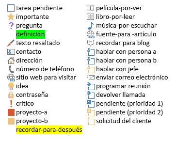

# <a name="use-note-tags-in-onenote-pages"></a>Usar etiquetas de nota en páginas de OneNote

**Se aplica a:** Blocs de notas para consumidores de OneDrive | Blocs de notas empresariales de Office 365

Use el atributo `data-tag` para agregar y actualizar casillas, estrellas y otras etiquetas de nota integradas en una página de OneNote, como se muestra en la siguiente imagen.


<a name="attributes"></a>

## <a name="note-tag-attributes"></a>Atributos de etiqueta de nota

En el código HTML de una página de OneNote, una etiqueta de nota se representa mediante el atributo `data-tag`. Por ejemplo:

- Una casilla de tarea pendiente sin marcar: `<p data-tag="to-do">` 

- Una casilla de tarea pendiente marcada: `<p data-tag="to-do:completed">` 

- Una estrella: `<h2 data-tag="important">` 

Un valor `data-tag` se compone de una forma y, a veces, de un estado (vea todos los [valores compatibles](#built-in-note-tags-for-onenote)).

| Propiedad | Descripción |  
|:------|:------|  
| shape | El identificador de la etiqueta de nota (ejemplo: `to-do` o `important`). |  
| status | El estado de las etiquetas de nota de casillas. Se usa solo para establecer casillas como completadas. |  
 

<a name="note-tags"></a>

## <a name="add-or-update-note-tags"></a>Agregar o actualizar etiquetas de nota

Para agregar o actualizar una etiqueta de nota integrada, use el atributo `data-tag` en un elemento compatible. Por ejemplo, este es un párrafo marcado como importante:

```html
<p data-tag="important">...</p>
```

Separe las distintas etiquetas de nota mediante comas:

```html
<p data-tag="important, critical">...</p>
```

Puede definir un `data-tag` en los siguientes elementos:

- p 
- ul, ol, li (vea más información sobre [etiquetas de nota en listas](#note-tags-on-lists))
- img 
- h1 - h6 
- title 

Vea [Etiquetas de nota integradas](#built-in-note-tags-for-onenote) para obtener una lista de las etiquetas de nota que puede usar con Microsoft Graph. No es posible agregar o actualizar etiquetas personalizadas por medio de Microsoft Graph.
 
### <a name="examples"></a>Ejemplos

Aquí se muestra una lista de tareas pendientes simple con el primer elemento completado.

```html 
<p data-tag="to-do:completed" data-id="prep">Till garden bed</p> 
<p data-tag="to-do" data-id="spring">Plant peas and spinach</p>
<p data-tag="to-do" data-id="summer">Plant tomatoes and peppers</p>
```

Tenga en cuenta que las etiquetas `<p>` anteriores incluyen cada una un atributo `data-id`. Esto simplifica la actualización de las etiquetas de nota de casilla. Por ejemplo, la solicitud siguiente marca el elemento de tarea pendiente de siembra de primavera como completado.

```json
PATCH https://graph.microsoft.com/v1.0/me/onenote/notebooks/pages/{page-id}/content

Content-Type: application/json
Authorization: Bearer {token}

[
   {
    'target':'#spring',
    'action':'replace',
    'content':'<p data-tag="to-do:completed"  data-id="spring">Plant peas and spinach</p>'
  }
]
```

La siguiente solicitud crea una página que contiene todas las [etiquetas de nota integradas](#built-in-note-tags-for-onenote).

```html 
POST https://graph.microsoft.com/v1.0/me/onenote/notebooks/pages

Content-Type: text/html
Authorization: Bearer {token}


<!DOCTYPE html>
<html>
  <head>
    <title data-tag="to-do:completed">All built-in note tags</title>
  </head>
  <body>
    <h1 data-tag="important">Paragraphs with built-in note tags</h1>
    <p data-tag="to-do">to-do</p>
    <p data-tag="important">important</p>
    <p data-tag="question">question</p>
    <p data-tag="definition">definition</p>
    <p data-tag="highlight">highlight</p>
    <p data-tag="contact">contact</p>
    <p data-tag="address">address</p>
    <p data-tag="phone-number">phone-number</p>
    <p data-tag="web-site-to-visit">web-site-to-visit</p>
    <p data-tag="idea">idea</p>
    <p data-tag="password">password</p>
    <p data-tag="critical">critical</p>
    <p data-tag="project-a">project-a</p>
    <p data-tag="project-b">project-b</p>
    <p data-tag="remember-for-later">remember-for-later</p>
    <p data-tag="movie-to-see">movie-to-see</p>
    <p data-tag="book-to-read">book-to-read</p>
    <p data-tag="music-to-listen-to">music-to-listen-to</p>
    <p data-tag="source-for-article">source-for-article</p>
    <p data-tag="remember-for-blog">remember-for-blog</p>
    <p data-tag="discuss-with-person-a">discuss-with-person-a</p>
    <p data-tag="discuss-with-person-b">discuss-with-person-b</p>
    <p data-tag="discuss-with-manager">discuss-with-manager</p>
    <p data-tag="send-in-email">send-in-email</p>
    <p data-tag="schedule-meeting">schedule-meeting</p>
    <p data-tag="call-back">call-back</p>
    <p data-tag="to-do-priority-1">to-do-priority-1</p>
    <p data-tag="to-do-priority-2">to-do-priority-2</p>
    <p data-tag="client-request">client-request</p>
    <h1 data-tag="important">Paragraphs with check boxes marked with "completed" status</h1>
    <p data-tag="to-do:completed">to-do:completed</p>
    <p data-tag="discuss-with-person-a:completed">discuss-with-person-a:completed</p>
    <p data-tag="discuss-with-person-b:completed">discuss-with-person-b:completed</p>
    <p data-tag="discuss-with-manager:completed">discuss-with-manager:completed</p>
    <p data-tag="schedule-meeting:completed">schedule-meeting:completed</p>
    <p data-tag="call-back:completed">call-back:completed</p>
    <p data-tag="to-do-priority-1:completed">to-do-priority-1:completed</p>
    <p data-tag="to-do-priority-2:completed">to-do-priority-2:completed</p>
    <p data-tag="client-request:completed">client-request:completed</p>
    <h1 data-tag="important">Multiple note tags</h1>
    <p data-tag="project-a,  client-request:completed">Two note tags:  project-a, client-request:completed</p>
    <p data-tag="idea, send-in-email, question">Three note tags:  idea, send-in-email, question</p>
    <h1 data-tag="important">Using note tags with other elements</h1>
    <p><b>Note tag on a list item:</b></p>
    <ul>
      <li data-tag="to-do-priority-1:completed">Make a to-do list</li>
    </ul>
    <p><b>Note tag on an image:</b></p>
    
    <p><b>Note tag with embedded style:</b></p>
    <p data-tag="important">Next time, <b>don't</b> forget to invite <span style="background-color:yellow">Dan</span>.</p>
  </body>
</html>
``` 

Para obtener más información sobre la creación de páginas, vea [Crear páginas de OneNote](onenote-create-page.md). Para obtener más información sobre actualizar páginas, vea [Actualizar páginas de OneNote](onenote_update_page.md).


<a name="note-tags-lists"></a>

## <a name="note-tags-on-lists"></a>Las etiquetas de nota en listas

Aquí encontrará algunas directrices para trabajar con etiquetas de nota en listas:

- Use elementos `p` para las listas de tareas pendientes. No muestran viñetas ni números, y son más fáciles de actualizar.

- Para crear o actualizar listas que muestren la **misma** etiqueta de nota para todos los elementos de la lista, defina `data-tag` en `ul` o `ol`. Para actualizar la lista completa, tendrá que volver a definir la `data-tag` en el `ul` o `ol`.

- Para crear o actualizar listas que muestren una etiqueta de nota **unique** para algunos o todos los elementos de lista, defina `data-tag` en elementos `li` y no anide los elementos `li` en una `ul` o `ol`. Para actualizar la lista completa, tendrá que quitar el `ul` que se devuelve en el HTML de salida y proporcionar solo los elementos `li` desanidados.

- Para actualizar elementos `li` específicos, ponga como objetivo los elementos `li` por separado y defina la `data-tag` en el elemento `li`. Cualquier elemento `li` individualmente dirigido puede actualizarse para mostrar una etiqueta de nota única, independientemente de cómo se haya definido la lista originalmente.

  Las instrucciones se basan en las siguientes reglas aplicadas por Microsoft Graph:

  - La configuración `data-tag` para un `ul` u `ol` invalida todas las configuraciones de elementos `li` secundarios. Esto se aplica incluso cuando el `ul` u `ol` no especifica un `data-tag` pero sí lo hacen sus elementos `li` secundarios.

    Por ejemplo, si crea un `ul` u `ol` que define `data-tag="project-a"`, todos los elementos de la lista mostrarán la etiqueta de nota *Proyecto A*. O si la `ul` u `ol` no define una `data-tag`, ninguno de los elementos mostrará una etiqueta de nota. Esta invalidación ocurre independientemente de la configuración explícita de elementos `li` secundarios.

- Los valores de `data-tag` únicos se tienen en cuenta en elementos de lista cuando se dan las siguientes condiciones:

  - En una solicitud de creación o actualización, los elementos `li` no están anidados en un `ul` u `ol`.

  - Un elemento `li` se trata individualmente en una solicitud de actualización.

- Los elementos `li` sin anidar enviados en el código HTML de entrada se devuelven en un `ul` en el código HTML de salida.

- En el código HTML de salida, todos las opciones de configuración de la lista `data-tag` se definen en elementos `span` de la lista de elementos.


El siguiente código muestra cómo se aplican algunas de estas reglas. El código HTML de entrada crea dos listas con etiquetas de nota. El código HTML de salida es lo que se devuelve para las listas cuando se recupera el contenido de la página.

#### <a name="input-html"></a>HTML de entrada

```html 
<!--To display the same note tag on all list items, define note tags on the ul or ol.--> 
<ul data-tag="project-a" data-id="agenda">
  <li>An item with a Project A note tag</li>
  <li>An item with a Project A note tag</li>
</ul>

<!--To display unique note tags on list items, don't nest li elements in a ul or ol.--> 
<li data-tag="idea" data-id="my-idea">An item with an Idea note tag</li>
<li data-tag="question" data-id="my-question">An item with a Question note tag</li>
```
 
#### <a name="output-html"></a>HTML de salida

```html 
<ul>
  <li><span data-tag="project-a">An item with a Project A note tag</span></li>
  <li><span data-tag="project-a">An item with a Project A note tag</span></li>
</ul>
<br />
<ul>
  <li style="..."><span data-tag="idea">An item with an Idea note tag</span></li>
  <li style="..."><span data-tag="question">An item with a Question note tag</span></li>
</ul>
```

<a name="output-html"></a>

## <a name="retrieve-note-tags"></a>Recuperar etiquetas de nota

Las etiquetas de nota integradas se incluyen en el código HTML de salida cuando obtiene el contenido de página:

`GET ../api/v1.0/pages/{page-id}/content` 

Un atributo `data-tag` en el código HTML de salida incluye siempre un valor de forma y solo incluye el estado si representa una etiqueta de nota de casilla establecida en completada. Los siguientes ejemplos muestran el código HTML de salida utilizado para crear algunas etiquetas de nota y el código HTML de salida que se devuelve.

#### <a name="input-html"></a>HTML de entrada

```html 
<h1>Status meeting</h1>
<p data-tag="important">Next week's meeting has been moved to <b>Wednesday</b>.</p>
<p data-tag="question">What are the exact dates for the conference?</p>
<p>Upcoming training opportunities. See Katie for more info.</p>
<p data-tag="project-a">Around the room updates.</p>
<ul data-tag="critical">
  <li>Design handouts</li>
  <li>Plan keynote</li>
</ul>
```

#### <a name="output-html"></a>HTML de salida

```html 
<h1 style="...">Status meeting</h1>
<p data-tag="important">Next week's meeting has been moved to <span style="font-weight:bold">Wednesday</span>.</p>
<p data-tag="question">What are the exact dates for the conference?</p>
<p>Upcoming training opportunities. See Katie for more info.</p>
<p data-tag="project-a">Around the room updates.</p>
<ul>
  <li><span data-tag="critical">Design handouts</span></li>
  <li><span data-tag="critical">Plan keynote</span></li>
</ul>
```

Tenga en cuenta que el atributo `data-tag` definido en el nivel de lista se inserta en los elementos de lista. Para obtener más información sobre el uso de etiquetas de nota con listas, consulte [Etiquetas de nota en listas](#note-tags-on-lists).

> **Nota:** En el código HTML de salida, las etiquetas de definición y de notas de recordatorio se devuelven como `data-tag="remember-for-later"`. El elemento `title` no devuelve información de etiqueta de nota.


<a name="built-in-tags"></a>

## <a name="built-in-note-tags-for-onenote"></a>Etiquetas de nota integradas para OneNote

OneNote contiene las siguientes etiquetas de nota integradas:



Los valores que puede asignar al atributo `data-tag` se muestran en la siguiente tabla. No se admiten etiquetas personalizadas.

||Etiquetas||
|:---|:---|:-----|
|`shape[:status]` |`to-do`<br/><br/>`to-do:completed`|`important`|
|`question`|`definition`|`highlight`|
|`contact`|`address`|`phone-number`|
|`web-site-to-visit`|`idea`|`password`|
|`critical`|`project-a`|`project-b`|
|`remember-for-later`|`movie-to-see`|`book-to-read`|
|`music-to-listen-to`|`source-for-article`|`remember-for-blog`|
|`discuss-with-person-a`<br/><br/>`discuss-with-person-a:completed`|`discuss-with-person-b`<br/><br/>`discuss-with-person-b:completed`|`discuss-with-manager`<br/><br/>`discuss-with-manager:completed`|
|`send-in-email`|`schedule-meeting`<br/><br/>`schedule-meeting:completed`|`call-back`<br/><br/>`call-back:completed`|
|`to-do-priority-1`<br/><br/>`to-do-priority-1:completed`|`to-do-priority-2`<br/><br/>`to-do-priority-2:completed`|`client-request`<br/><br/>`client-request:completed`|


<a name="request-response-info"></a>

## <a name="response-information"></a>Información de respuesta

Microsoft Graph proporciona la siguiente información en la respuesta.

| Datos de respuesta | Descripción |  
|------|------|  
| Código correcto | Un código de estado HTTP 201 para una solicitud POST correcta y un código de estado HTTP 204 para una solicitud PATCH correcta. |  
| Errores | Lea [Códigos de error para API de OneNote de Microsoft Graph](onenote_error_codes.md) para obtener información sobre los errores de OneNote que puede devolver Microsoft Graph. |  


<a name="permissions"></a>

## <a name="permissions"></a>Permisos

Para crear o actualizar páginas de OneNote, necesita solicitar los permisos adecuados. Seleccione el nivel inferior de permisos que necesita la aplicación para funcionar correctamente.

#### <a name="permissions-for-post-pages"></a>Permisos para páginas POST

- Notes.Create
- Notes.ReadWrite
- Notes.ReadWrite.All  

#### <a name="permissions-for-patch-pages"></a>Permisos para páginas PATCH

- Notes.ReadWrite
- Notes.ReadWrite.All  

Para obtener más información sobre los ámbitos de permiso y cómo funcionan, consulte los [ámbitos de permisos de OneNote](permissions_reference.md).


<a name="see-also"></a>

## <a name="see-also"></a>Vea también

- [Crear páginas de OneNote](onenote-create-page.md)
- [Actualizar el contenido de la página de OneNote](onenote_update_page.md)
- [Integración con OneNote](integrate_with_onenote.md)
- [Blog para desarrolladores de OneNote](http://go.microsoft.com/fwlink/?LinkID=390183)
- [Preguntas de desarrollo de OneNote en Stack Overflow](http://go.microsoft.com/fwlink/?LinkID=390182)
- [Repositorios de OneNote en GitHub](http://go.microsoft.com/fwlink/?LinkID=390178)  
 


