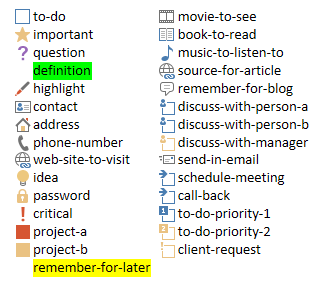

# <a name="use-note-tags-in-onenote-pages"></a><span data-ttu-id="83359-101">Usar etiquetas de nota en páginas de OneNote</span><span class="sxs-lookup"><span data-stu-id="83359-101">Use note tags in OneNote pages</span></span>

<span data-ttu-id="83359-102">**Se aplica a:** Blocs de notas para consumidores de OneDrive | Blocs de notas empresariales de Office 365</span><span class="sxs-lookup"><span data-stu-id="83359-102">**Applies to:** Consumer notebooks on OneDrive | Enterprise notebooks on Office 365</span></span>

<span data-ttu-id="83359-103">Use el atributo `data-tag` para agregar y actualizar casillas, estrellas y otras etiquetas de nota integradas en una página de OneNote, como se muestra en la siguiente imagen.</span><span class="sxs-lookup"><span data-stu-id="83359-103">Use the `data-tag` attribute to add and update check boxes, stars, and other built-in note tags on a OneNote page, as shown in the following image.</span></span>


<a name="attributes"></a>

## <a name="note-tag-attributes"></a><span data-ttu-id="83359-105">Atributos de etiqueta de nota</span><span class="sxs-lookup"><span data-stu-id="83359-105">Note tag attributes</span></span>

<span data-ttu-id="83359-106">En el código HTML de una página de OneNote, una etiqueta de nota se representa mediante el atributo `data-tag`.</span><span class="sxs-lookup"><span data-stu-id="83359-106">In the HTML of a OneNote page, a note tag is represented by the `data-tag` attribute.</span></span> <span data-ttu-id="83359-107">Por ejemplo:</span><span class="sxs-lookup"><span data-stu-id="83359-107">For example:</span></span>

- <span data-ttu-id="83359-108">Una casilla de tarea pendiente sin marcar: `<p data-tag="to-do">`</span><span class="sxs-lookup"><span data-stu-id="83359-108">An unchecked to-do box:  `<p data-tag="to-do">`</span></span> 

- <span data-ttu-id="83359-109">Una casilla de tarea pendiente marcada: `<p data-tag="to-do:completed">`</span><span class="sxs-lookup"><span data-stu-id="83359-109">A checked to-do box:  `<p data-tag="to-do:completed">`</span></span> 

- <span data-ttu-id="83359-110">Una estrella: `<h2 data-tag="important">`</span><span class="sxs-lookup"><span data-stu-id="83359-110">A star:  `<h2 data-tag="important">`</span></span> 

<span data-ttu-id="83359-111">Un valor `data-tag` se compone de una forma y, a veces, de un estado (vea todos los [valores compatibles](#built-in-note-tags-for-onenote)).</span><span class="sxs-lookup"><span data-stu-id="83359-111">A `data-tag` value is composed of a shape, and sometimes a status.</span></span>

| <span data-ttu-id="83359-112">Propiedad</span><span class="sxs-lookup"><span data-stu-id="83359-112">Property</span></span> | <span data-ttu-id="83359-113">Descripción</span><span class="sxs-lookup"><span data-stu-id="83359-113">Description</span></span> |  
|:------|:------|  
| <span data-ttu-id="83359-114">shape</span><span class="sxs-lookup"><span data-stu-id="83359-114">shape</span></span> | <span data-ttu-id="83359-115">El identificador de la etiqueta de nota (ejemplo: `to-do` o `important`).</span><span class="sxs-lookup"><span data-stu-id="83359-115">The identifier of the note tag (example: `to-do` or `important`).</span></span> |  
| <span data-ttu-id="83359-116">status</span><span class="sxs-lookup"><span data-stu-id="83359-116">status</span></span> | <span data-ttu-id="83359-117">El estado de las etiquetas de nota de casillas.</span><span class="sxs-lookup"><span data-stu-id="83359-117">The status of check-box note tags.</span></span> <span data-ttu-id="83359-118">Se usa solo para establecer casillas como completadas.</span><span class="sxs-lookup"><span data-stu-id="83359-118">This is used only to set check boxes as completed.</span></span> |  
 

<a name="note-tags"></a>

## <a name="add-or-update-note-tags"></a><span data-ttu-id="83359-119">Agregar o actualizar etiquetas de nota</span><span class="sxs-lookup"><span data-stu-id="83359-119">Add or update note tags</span></span>

<span data-ttu-id="83359-120">Para agregar o actualizar una etiqueta de nota integrada, use el atributo `data-tag` en un elemento compatible.</span><span class="sxs-lookup"><span data-stu-id="83359-120">To add or update a built-in note tag, just use the `data-tag` attribute on a supported element.</span></span> <span data-ttu-id="83359-121">Por ejemplo, este es un párrafo marcado como importante:</span><span class="sxs-lookup"><span data-stu-id="83359-121">For example, here's a paragraph marked as important:</span></span>

```html
<p data-tag="important">...</p>
```

<span data-ttu-id="83359-122">Separe las distintas etiquetas de nota mediante comas:</span><span class="sxs-lookup"><span data-stu-id="83359-122">Separate multiple note tags with commas:</span></span>

```html
<p data-tag="important, critical">...</p>
```

<span data-ttu-id="83359-123">Puede definir un `data-tag` en los siguientes elementos:</span><span class="sxs-lookup"><span data-stu-id="83359-123">You can define a `data-tag` on the following elements:</span></span>

- <span data-ttu-id="83359-124">p</span><span class="sxs-lookup"><span data-stu-id="83359-124">p</span></span> 
- <span data-ttu-id="83359-125">ul, ol, li (vea más información sobre [etiquetas de nota en listas](#note-tags-on-lists))</span><span class="sxs-lookup"><span data-stu-id="83359-125">ul, ol, li (see more about [note tags on lists](#note-tags-on-lists))</span></span>
- <span data-ttu-id="83359-126">img</span><span class="sxs-lookup"><span data-stu-id="83359-126">img</span></span> 
- <span data-ttu-id="83359-127">h1 - h6</span><span class="sxs-lookup"><span data-stu-id="83359-127">h1 - h6</span></span> 
- <span data-ttu-id="83359-128">title</span><span class="sxs-lookup"><span data-stu-id="83359-128">title</span></span> 

<span data-ttu-id="83359-129">Vea [Etiquetas de nota integradas](#built-in-note-tags-for-onenote) para obtener una lista de las etiquetas de nota que puede usar con Microsoft Graph.</span><span class="sxs-lookup"><span data-stu-id="83359-129">See [Built-in note tags](#built-in-note-tags-for-onenote) for a list of note tags that you can use with Microsoft Graph.</span></span> <span data-ttu-id="83359-130">No es posible agregar o actualizar etiquetas personalizadas por medio de Microsoft Graph.</span><span class="sxs-lookup"><span data-stu-id="83359-130">Adding or updating custom tags using Microsoft Graph is not supported.</span></span>
 
### <a name="examples"></a><span data-ttu-id="83359-131">Ejemplos</span><span class="sxs-lookup"><span data-stu-id="83359-131">Examples</span></span>

<span data-ttu-id="83359-132">Aquí se muestra una lista de tareas pendientes simple con el primer elemento completado.</span><span class="sxs-lookup"><span data-stu-id="83359-132">Here's a simple to-do list with the first item completed.</span></span>

```html 
<p data-tag="to-do:completed" data-id="prep">Till garden bed</p> 
<p data-tag="to-do" data-id="spring">Plant peas and spinach</p>
<p data-tag="to-do" data-id="summer">Plant tomatoes and peppers</p>
```

<span data-ttu-id="83359-133">Tenga en cuenta que las etiquetas `<p>` anteriores incluyen cada una un atributo `data-id`.</span><span class="sxs-lookup"><span data-stu-id="83359-133">Note that the `<p>` tags above each include a `data-id` attribute.</span></span> <span data-ttu-id="83359-134">Esto simplifica la actualización de las etiquetas de nota de casilla.</span><span class="sxs-lookup"><span data-stu-id="83359-134">This makes it easier to update the check-box note tags.</span></span> <span data-ttu-id="83359-135">Por ejemplo, la solicitud siguiente marca el elemento de tarea pendiente de siembra de primavera como completado.</span><span class="sxs-lookup"><span data-stu-id="83359-135">For example, the following request marks the spring planting to-do item as completed.</span></span>

```json
PATCH https://graph.microsoft.com/v1.0/me/onenote/notebooks/pages/{page-id}/content

Content-Type: application/json
Authorization: Bearer {token}

[
   {
    'target':'#spring',
    'action':'replace',
    'content':'<p data-tag="to-do:completed"  data-id="spring">Plant peas and spinach</p>'
  }
]
```

<span data-ttu-id="83359-136">La siguiente solicitud crea una página que contiene todas las [etiquetas de nota integradas](#built-in-note-tags-for-onenote).</span><span class="sxs-lookup"><span data-stu-id="83359-136">The following request creates a page that contains all [built-in note tags](#built-in-note-tags-for-onenote).</span></span>

```html 
POST https://graph.microsoft.com/v1.0/me/onenote/notebooks/pages

Content-Type: text/html
Authorization: Bearer {token}


<!DOCTYPE html>
<html>
  <head>
    <title data-tag="to-do:completed">All built-in note tags</title>
  </head>
  <body>
    <h1 data-tag="important">Paragraphs with built-in note tags</h1>
    <p data-tag="to-do">to-do</p>
    <p data-tag="important">important</p>
    <p data-tag="question">question</p>
    <p data-tag="definition">definition</p>
    <p data-tag="highlight">highlight</p>
    <p data-tag="contact">contact</p>
    <p data-tag="address">address</p>
    <p data-tag="phone-number">phone-number</p>
    <p data-tag="web-site-to-visit">web-site-to-visit</p>
    <p data-tag="idea">idea</p>
    <p data-tag="password">password</p>
    <p data-tag="critical">critical</p>
    <p data-tag="project-a">project-a</p>
    <p data-tag="project-b">project-b</p>
    <p data-tag="remember-for-later">remember-for-later</p>
    <p data-tag="movie-to-see">movie-to-see</p>
    <p data-tag="book-to-read">book-to-read</p>
    <p data-tag="music-to-listen-to">music-to-listen-to</p>
    <p data-tag="source-for-article">source-for-article</p>
    <p data-tag="remember-for-blog">remember-for-blog</p>
    <p data-tag="discuss-with-person-a">discuss-with-person-a</p>
    <p data-tag="discuss-with-person-b">discuss-with-person-b</p>
    <p data-tag="discuss-with-manager">discuss-with-manager</p>
    <p data-tag="send-in-email">send-in-email</p>
    <p data-tag="schedule-meeting">schedule-meeting</p>
    <p data-tag="call-back">call-back</p>
    <p data-tag="to-do-priority-1">to-do-priority-1</p>
    <p data-tag="to-do-priority-2">to-do-priority-2</p>
    <p data-tag="client-request">client-request</p>
    <h1 data-tag="important">Paragraphs with check boxes marked with "completed" status</h1>
    <p data-tag="to-do:completed">to-do:completed</p>
    <p data-tag="discuss-with-person-a:completed">discuss-with-person-a:completed</p>
    <p data-tag="discuss-with-person-b:completed">discuss-with-person-b:completed</p>
    <p data-tag="discuss-with-manager:completed">discuss-with-manager:completed</p>
    <p data-tag="schedule-meeting:completed">schedule-meeting:completed</p>
    <p data-tag="call-back:completed">call-back:completed</p>
    <p data-tag="to-do-priority-1:completed">to-do-priority-1:completed</p>
    <p data-tag="to-do-priority-2:completed">to-do-priority-2:completed</p>
    <p data-tag="client-request:completed">client-request:completed</p>
    <h1 data-tag="important">Multiple note tags</h1>
    <p data-tag="project-a,  client-request:completed">Two note tags:  project-a, client-request:completed</p>
    <p data-tag="idea, send-in-email, question">Three note tags:  idea, send-in-email, question</p>
    <h1 data-tag="important">Using note tags with other elements</h1>
    <p><b>Note tag on a list item:</b></p>
    <ul>
      <li data-tag="to-do-priority-1:completed">Make a to-do list</li>
    </ul>
    <p><b>Note tag on an image:</b></p>
    
    <p><b>Note tag with embedded style:</b></p>
    <p data-tag="important">Next time, <b>don't</b> forget to invite <span style="background-color:yellow">Dan</span>.</p>
  </body>
</html>
``` 

<span data-ttu-id="83359-137">Para obtener más información sobre la creación de páginas, vea [Crear páginas de OneNote](onenote-create-page.md).</span><span class="sxs-lookup"><span data-stu-id="83359-137">For more information about creating pages, see [Create OneNote pages](onenote-create-page.md).</span></span> <span data-ttu-id="83359-138">Para obtener más información sobre actualizar páginas, vea [Actualizar páginas de OneNote](onenote_update_page.md).</span><span class="sxs-lookup"><span data-stu-id="83359-138">For more about updating pages, see [Update OneNote pages](onenote_update_page.md).</span></span>


<a name="note-tags-lists"></a>

## <a name="note-tags-on-lists"></a><span data-ttu-id="83359-139">Las etiquetas de nota en listas</span><span class="sxs-lookup"><span data-stu-id="83359-139">Note tags on lists</span></span>

<span data-ttu-id="83359-140">Aquí encontrará algunas directrices para trabajar con etiquetas de nota en listas:</span><span class="sxs-lookup"><span data-stu-id="83359-140">Here are some guidelines for working with note tags on lists:</span></span>

- <span data-ttu-id="83359-141">Use elementos `p` para las listas de tareas pendientes.</span><span class="sxs-lookup"><span data-stu-id="83359-141">Use `p` elements for to-do lists.</span></span> <span data-ttu-id="83359-142">No muestran viñetas ni números, y son más fáciles de actualizar.</span><span class="sxs-lookup"><span data-stu-id="83359-142">They don't display a bullet or number, and they're easier to update.</span></span>

- <span data-ttu-id="83359-143">Para crear o actualizar listas que muestren la **misma** etiqueta de nota para todos los elementos de la lista, defina `data-tag` en `ul` o `ol`.</span><span class="sxs-lookup"><span data-stu-id="83359-143">To create or update lists that display the **same** note tag for all list items:</span></span> <span data-ttu-id="83359-144">Para actualizar la lista completa, tendrá que volver a definir la `data-tag` en el `ul` o `ol`.</span><span class="sxs-lookup"><span data-stu-id="83359-144">To update the entire list, you'll need to redefine `data-tag` on the `ul` or `ol`.</span></span>

- <span data-ttu-id="83359-145">Para crear o actualizar listas que muestren una etiqueta de nota **unique** para algunos o todos los elementos de lista, defina `data-tag` en elementos `li` y no anide los elementos `li` en una `ul` o `ol`.</span><span class="sxs-lookup"><span data-stu-id="83359-145">To create or update lists that display a **unique** note tag for some or all list items, define `data-tag` on `li` elements, and don't nest the `li` elements in a `ul` or `ol`.</span></span> <span data-ttu-id="83359-146">Para actualizar la lista completa, tendrá que quitar el `ul` que se devuelve en el HTML de salida y proporcionar solo los elementos `li` desanidados.</span><span class="sxs-lookup"><span data-stu-id="83359-146">To update the entire list, you'll need to remove the `ul` that's returned in the output HTML and provide only the unnested `li` elements.</span></span>

- <span data-ttu-id="83359-147">Para actualizar elementos `li` específicos, ponga como objetivo los elementos `li` por separado y defina la `data-tag` en el elemento `li`.</span><span class="sxs-lookup"><span data-stu-id="83359-147">To update specific `li` elements, target the `li` elements individually and define the `data-tag` on the `li` element.</span></span> <span data-ttu-id="83359-148">Cualquier elemento `li` individualmente dirigido puede actualizarse para mostrar una etiqueta de nota única, independientemente de cómo se haya definido la lista originalmente.</span><span class="sxs-lookup"><span data-stu-id="83359-148">Any individually addressed `li` element can be updated to display a unique note tag, no matter how the list was originally defined.</span></span>

  <span data-ttu-id="83359-149">Las instrucciones se basan en las siguientes reglas aplicadas por Microsoft Graph:</span><span class="sxs-lookup"><span data-stu-id="83359-149">The guidelines are based on the following rules that are applied by Microsoft Graph:</span></span>

  - <span data-ttu-id="83359-150">La configuración `data-tag` para un `ul` u `ol` invalida todas las configuraciones de elementos `li` secundarios.</span><span class="sxs-lookup"><span data-stu-id="83359-150">The `data-tag` setting for a `ul` or `ol` overrides all settings on child `li` elements.</span></span> <span data-ttu-id="83359-151">Esto se aplica incluso cuando el `ul` u `ol` no especifica un `data-tag` pero sí lo hacen sus elementos `li` secundarios.</span><span class="sxs-lookup"><span data-stu-id="83359-151">This applies even when the `ul` or `ol` doesn't specify a `data-tag` but its child `li` elements do.</span></span>

    <span data-ttu-id="83359-152">Por ejemplo, si crea un `ul` u `ol` que define `data-tag="project-a"`, todos los elementos de la lista mostrarán la etiqueta de nota *Proyecto A*.</span><span class="sxs-lookup"><span data-stu-id="83359-152">For example, if you create a `ul` or `ol` that defines `data-tag="project-a"`, all its list items will display the *Project A* note tag.</span></span> <span data-ttu-id="83359-153">O si la `ul` u `ol` no define una `data-tag`, ninguno de los elementos mostrará una etiqueta de nota.</span><span class="sxs-lookup"><span data-stu-id="83359-153">Or if the `ul` or `ol` doesn't define a `data-tag`, none of its items will display a note tag.</span></span> <span data-ttu-id="83359-154">Esta invalidación ocurre independientemente de la configuración explícita de elementos `li` secundarios.</span><span class="sxs-lookup"><span data-stu-id="83359-154">This override happens regardless of any explicit settings on child `li` elements.</span></span>

- <span data-ttu-id="83359-155">Los valores de `data-tag` únicos se tienen en cuenta en elementos de lista cuando se dan las siguientes condiciones:</span><span class="sxs-lookup"><span data-stu-id="83359-155">Unique `data-tag` settings are honored for list items under the following conditions:</span></span>

  - <span data-ttu-id="83359-156">En una solicitud de creación o actualización, los elementos `li` no están anidados en un `ul` u `ol`.</span><span class="sxs-lookup"><span data-stu-id="83359-156">The `li` elements are not nested in a `ul` or `ol` in a create or update request.</span></span>

  - <span data-ttu-id="83359-157">Un elemento `li` se trata individualmente en una solicitud de actualización.</span><span class="sxs-lookup"><span data-stu-id="83359-157">An `li` element is individually addressed in an update request.</span></span>

- <span data-ttu-id="83359-158">Los elementos `li` sin anidar enviados en el código HTML de entrada se devuelven en un `ul` en el código HTML de salida.</span><span class="sxs-lookup"><span data-stu-id="83359-158">Unnested `li` elements sent in input HTML are returned in a `ul` in the output HTML.</span></span>

- <span data-ttu-id="83359-159">En el código HTML de salida, todos las opciones de configuración de la lista `data-tag` se definen en elementos `span` de la lista de elementos.</span><span class="sxs-lookup"><span data-stu-id="83359-159">In output HTML, all `data-tag` list settings are defined on `span` elements on the list items.</span></span>


<span data-ttu-id="83359-160">El siguiente código muestra cómo se aplican algunas de estas reglas.</span><span class="sxs-lookup"><span data-stu-id="83359-160">The following code shows how some of these rules are applied.</span></span> <span data-ttu-id="83359-161">El código HTML de entrada crea dos listas con etiquetas de nota.</span><span class="sxs-lookup"><span data-stu-id="83359-161">The input HTML creates two lists with note tags.</span></span> <span data-ttu-id="83359-162">El código HTML de salida es lo que se devuelve para las listas cuando se recupera el contenido de la página.</span><span class="sxs-lookup"><span data-stu-id="83359-162">The output HTML is what's returned for the lists when you retrieve page content.</span></span>

#### <a name="input-html"></a><span data-ttu-id="83359-163">HTML de entrada</span><span class="sxs-lookup"><span data-stu-id="83359-163">Input HTML</span></span>

```html 
<!--To display the same note tag on all list items, define note tags on the ul or ol.--> 
<ul data-tag="project-a" data-id="agenda">
  <li>An item with a Project A note tag</li>
  <li>An item with a Project A note tag</li>
</ul>

<!--To display unique note tags on list items, don't nest li elements in a ul or ol.--> 
<li data-tag="idea" data-id="my-idea">An item with an Idea note tag</li>
<li data-tag="question" data-id="my-question">An item with a Question note tag</li>
```
 
#### <a name="output-html"></a><span data-ttu-id="83359-164">HTML de salida</span><span class="sxs-lookup"><span data-stu-id="83359-164">Output HTML</span></span>

```html 
<ul>
  <li><span data-tag="project-a">An item with a Project A note tag</span></li>
  <li><span data-tag="project-a">An item with a Project A note tag</span></li>
</ul>
<br />
<ul>
  <li style="..."><span data-tag="idea">An item with an Idea note tag</span></li>
  <li style="..."><span data-tag="question">An item with a Question note tag</span></li>
</ul>
```

<a name="output-html"></a>

## <a name="retrieve-note-tags"></a><span data-ttu-id="83359-165">Recuperar etiquetas de nota</span><span class="sxs-lookup"><span data-stu-id="83359-165">Retrieve note tags</span></span>

<span data-ttu-id="83359-166">Las etiquetas de nota integradas se incluyen en el código HTML de salida cuando obtiene el contenido de página:</span><span class="sxs-lookup"><span data-stu-id="83359-166">Built-in note tags are included in the output HTML when you get page content:</span></span>

`GET ../api/v1.0/pages/{page-id}/content` 

<span data-ttu-id="83359-167">Un atributo `data-tag` en el código HTML de salida incluye siempre un valor de forma y solo incluye el estado si representa una etiqueta de nota de casilla establecida en completada.</span><span class="sxs-lookup"><span data-stu-id="83359-167">A `data-tag` attribute in the output HTML always includes a shape value, and it only includes a status if it represents a check-box note tag that's set to completed.</span></span> <span data-ttu-id="83359-168">Los siguientes ejemplos muestran el código HTML de salida utilizado para crear algunas etiquetas de nota y el código HTML de salida que se devuelve.</span><span class="sxs-lookup"><span data-stu-id="83359-168">The following examples show the input HTML used to create some note tags and the output HTML that's returned.</span></span>

#### <a name="input-html"></a><span data-ttu-id="83359-169">HTML de entrada</span><span class="sxs-lookup"><span data-stu-id="83359-169">Input HTML</span></span>

```html 
<h1>Status meeting</h1>
<p data-tag="important">Next week's meeting has been moved to <b>Wednesday</b>.</p>
<p data-tag="question">What are the exact dates for the conference?</p>
<p>Upcoming training opportunities. See Katie for more info.</p>
<p data-tag="project-a">Around the room updates.</p>
<ul data-tag="critical">
  <li>Design handouts</li>
  <li>Plan keynote</li>
</ul>
```

#### <a name="output-html"></a><span data-ttu-id="83359-170">HTML de salida</span><span class="sxs-lookup"><span data-stu-id="83359-170">Output HTML</span></span>

```html 
<h1 style="...">Status meeting</h1>
<p data-tag="important">Next week's meeting has been moved to <span style="font-weight:bold">Wednesday</span>.</p>
<p data-tag="question">What are the exact dates for the conference?</p>
<p>Upcoming training opportunities. See Katie for more info.</p>
<p data-tag="project-a">Around the room updates.</p>
<ul>
  <li><span data-tag="critical">Design handouts</span></li>
  <li><span data-tag="critical">Plan keynote</span></li>
</ul>
```

<span data-ttu-id="83359-171">Tenga en cuenta que el atributo `data-tag` definido en el nivel de lista se inserta en los elementos de lista.</span><span class="sxs-lookup"><span data-stu-id="83359-171">Note that the `data-tag` attribute defined at the list level is pushed to its list items.</span></span> <span data-ttu-id="83359-172">Para obtener más información sobre el uso de etiquetas de nota con listas, consulte [Etiquetas de nota en listas](#note-tags-on-lists).</span><span class="sxs-lookup"><span data-stu-id="83359-172">For more information about using note tags with lists, see [Note tags on lists](#note-tags-on-lists).</span></span>

> <span data-ttu-id="83359-173">**Nota:** En el código HTML de salida, las etiquetas de definición y de notas de recordatorio se devuelven como `data-tag="remember-for-later"`.</span><span class="sxs-lookup"><span data-stu-id="83359-173">**Note:** In the output HTML, the definition and remember-for-later note tags are both returned as `data-tag="remember-for-later"`.</span></span> <span data-ttu-id="83359-174">El elemento `title` no devuelve información de etiqueta de nota.</span><span class="sxs-lookup"><span data-stu-id="83359-174">The `title` element doesn't return any note tag information.</span></span>


<a name="built-in-tags"></a>

## <a name="built-in-note-tags-for-onenote"></a><span data-ttu-id="83359-175">Etiquetas de nota integradas para OneNote</span><span class="sxs-lookup"><span data-stu-id="83359-175">Built-in note tags for OneNote</span></span>

<span data-ttu-id="83359-176">OneNote contiene las siguientes etiquetas de nota integradas:</span><span class="sxs-lookup"><span data-stu-id="83359-176">OneNote includes the following built-in note tags:</span></span>



<span data-ttu-id="83359-178">Los valores que puede asignar al atributo `data-tag` se muestran en la siguiente tabla.</span><span class="sxs-lookup"><span data-stu-id="83359-178">The values you can assign to the `data-tag` attribute are shown below.</span></span> <span data-ttu-id="83359-179">No se admiten etiquetas personalizadas.</span><span class="sxs-lookup"><span data-stu-id="83359-179">Custom tags are not supported.</span></span>

||<span data-ttu-id="83359-180">Etiquetas</span><span class="sxs-lookup"><span data-stu-id="83359-180">Tags</span></span>||
|:---|:---|:-----|
|`shape[:status]` |`to-do`<br/><br/>`to-do:completed`|`important`|
|`question`|`definition`|`highlight`|
|`contact`|`address`|`phone-number`|
|`web-site-to-visit`|`idea`|`password`|
|`critical`|`project-a`|`project-b`|
|`remember-for-later`|`movie-to-see`|`book-to-read`|
|`music-to-listen-to`|`source-for-article`|`remember-for-blog`|
|`discuss-with-person-a`<br/><br/>`discuss-with-person-a:completed`|`discuss-with-person-b`<br/><br/>`discuss-with-person-b:completed`|`discuss-with-manager`<br/><br/>`discuss-with-manager:completed`|
|`send-in-email`|`schedule-meeting`<br/><br/>`schedule-meeting:completed`|`call-back`<br/><br/>`call-back:completed`|
|`to-do-priority-1`<br/><br/>`to-do-priority-1:completed`|`to-do-priority-2`<br/><br/>`to-do-priority-2:completed`|`client-request`<br/><br/>`client-request:completed`|


<a name="request-response-info"></a>

## <a name="response-information"></a><span data-ttu-id="83359-181">Información de respuesta</span><span class="sxs-lookup"><span data-stu-id="83359-181">Response information</span></span>

<span data-ttu-id="83359-182">Microsoft Graph proporciona la siguiente información en la respuesta.</span><span class="sxs-lookup"><span data-stu-id="83359-182">Microsoft Graph returns the following information in the response.</span></span>

| <span data-ttu-id="83359-183">Datos de respuesta</span><span class="sxs-lookup"><span data-stu-id="83359-183">Response data</span></span> | <span data-ttu-id="83359-184">Descripción</span><span class="sxs-lookup"><span data-stu-id="83359-184">Description</span></span> |  
|------|------|  
| <span data-ttu-id="83359-185">Código correcto</span><span class="sxs-lookup"><span data-stu-id="83359-185">Success code</span></span> | <span data-ttu-id="83359-186">Un código de estado HTTP 201 para una solicitud POST correcta y un código de estado HTTP 204 para una solicitud PATCH correcta.</span><span class="sxs-lookup"><span data-stu-id="83359-186">A 201 HTTP status code for a successful POST request, and a 204 HTTP status code for a successful PATCH request.</span></span> |  
| <span data-ttu-id="83359-187">Errores</span><span class="sxs-lookup"><span data-stu-id="83359-187">Errors</span></span> | <span data-ttu-id="83359-188">Lea [Códigos de error para API de OneNote de Microsoft Graph](onenote_error_codes.md) para obtener información sobre los errores de OneNote que puede devolver Microsoft Graph.</span><span class="sxs-lookup"><span data-stu-id="83359-188">Read [Error codes for OneNote APIs in Microsoft Graph](onenote_error_codes.md) to learn about OneNote errors that Microsoft Graph can return.</span></span> |  


<a name="permissions"></a>

## <a name="permissions"></a><span data-ttu-id="83359-189">Permisos</span><span class="sxs-lookup"><span data-stu-id="83359-189">Permissions</span></span>

<span data-ttu-id="83359-190">Para crear o actualizar páginas de OneNote, necesita solicitar los permisos adecuados.</span><span class="sxs-lookup"><span data-stu-id="83359-190">To create or update OneNote pages, you'll need to request appropriate permissions.</span></span> <span data-ttu-id="83359-191">Seleccione el nivel inferior de permisos que necesita la aplicación para funcionar correctamente.</span><span class="sxs-lookup"><span data-stu-id="83359-191">Choose the lowest level of permissions that your app needs to do its work.</span></span>

#### <a name="permissions-for-post-pages"></a><span data-ttu-id="83359-192">Permisos para páginas POST</span><span class="sxs-lookup"><span data-stu-id="83359-192">Permissions for POST pages</span></span>

- <span data-ttu-id="83359-193">Notes.Create</span><span class="sxs-lookup"><span data-stu-id="83359-193">Notes.Create</span></span>
- <span data-ttu-id="83359-194">Notes.ReadWrite</span><span class="sxs-lookup"><span data-stu-id="83359-194">Notes.ReadWrite</span></span>
- <span data-ttu-id="83359-195">Notes.ReadWrite.All</span><span class="sxs-lookup"><span data-stu-id="83359-195">Notes.ReadWrite.All</span></span>  

#### <a name="permissions-for-patch-pages"></a><span data-ttu-id="83359-196">Permisos para páginas PATCH</span><span class="sxs-lookup"><span data-stu-id="83359-196">Permissions for PATCH pages</span></span>

- <span data-ttu-id="83359-197">Notes.ReadWrite</span><span class="sxs-lookup"><span data-stu-id="83359-197">Notes.ReadWrite</span></span>
- <span data-ttu-id="83359-198">Notes.ReadWrite.All</span><span class="sxs-lookup"><span data-stu-id="83359-198">Notes.ReadWrite.All</span></span>  

<span data-ttu-id="83359-199">Para obtener más información sobre los ámbitos de permiso y cómo funcionan, consulte los [ámbitos de permisos de OneNote](permissions_reference.md).</span><span class="sxs-lookup"><span data-stu-id="83359-199">For more information about permission scopes and how they work, see [OneNote permission scopes](permissions_reference.md).</span></span>


<a name="see-also"></a>

## <a name="see-also"></a><span data-ttu-id="83359-200">Vea también</span><span class="sxs-lookup"><span data-stu-id="83359-200">See also</span></span>

- [<span data-ttu-id="83359-201">Crear páginas de OneNote</span><span class="sxs-lookup"><span data-stu-id="83359-201">Create OneNote pages</span></span>](onenote-create-page.md)
- [<span data-ttu-id="83359-202">Actualizar el contenido de la página de OneNote</span><span class="sxs-lookup"><span data-stu-id="83359-202">Update OneNote page content</span></span>](onenote_update_page.md)
- [<span data-ttu-id="83359-203">Integración con OneNote</span><span class="sxs-lookup"><span data-stu-id="83359-203">Integrate with OneNote</span></span>](integrate_with_onenote.md)
- [<span data-ttu-id="83359-204">Blog para desarrolladores de OneNote</span><span class="sxs-lookup"><span data-stu-id="83359-204">OneNote Developer Blog</span></span>](http://go.microsoft.com/fwlink/?LinkID=390183)
- [<span data-ttu-id="83359-205">Preguntas de desarrollo de OneNote en Stack Overflow</span><span class="sxs-lookup"><span data-stu-id="83359-205">OneNote development questions on Stack Overflow</span></span>](http://go.microsoft.com/fwlink/?LinkID=390182)
- [<span data-ttu-id="83359-206">Repositorios de OneNote en GitHub</span><span class="sxs-lookup"><span data-stu-id="83359-206">OneNote GitHub repos</span></span>](http://go.microsoft.com/fwlink/?LinkID=390178)  
 


