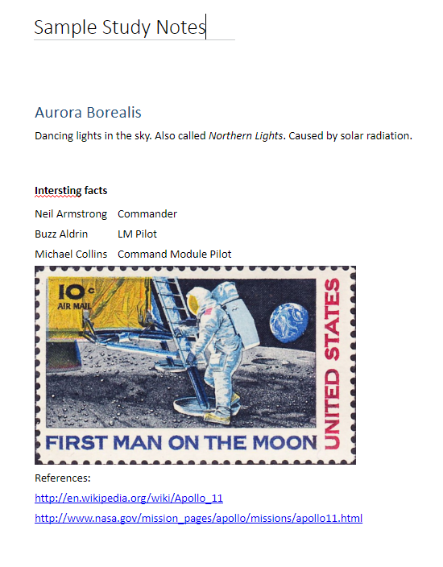

# <a name="input-and-output-html-in-onenote-pages"></a><span data-ttu-id="e8400-101">HTML de entrada y salida en páginas de OneNote</span><span class="sxs-lookup"><span data-stu-id="e8400-101">Input and output HTML for OneNote pages</span></span>

<span data-ttu-id="e8400-102">El código HTML que define el contenido y la estructura de la página cuando [crea](../api-reference/v1.0/api/section_post_pages.md) o [actualiza](../api-reference/v1.0/api/page_update.md) una página de OneNote se llama *HTML de entrada*.</span><span class="sxs-lookup"><span data-stu-id="e8400-102">The HTML that defines the page content and structure when you [create](../api-reference/v1.0/api/section_post_pages.md) or [update](../api-reference/v1.0/api/page_update.md) a OneNote page is called *input HTML*.</span></span> 

<span data-ttu-id="e8400-103">El código HTML que se devuelve cuando [,obtiene el contenido de la página](../api-reference/v1.0/api/page_get.md) se denomina *HTML de salida*.</span><span class="sxs-lookup"><span data-stu-id="e8400-103">The HTML that's returned when you [get page content](../api-reference/v1.0/api/page_get.md) is called *output HTML*.</span></span> <span data-ttu-id="e8400-104">El HTML de salida no será el mismo que el de entrada.</span><span class="sxs-lookup"><span data-stu-id="e8400-104">Output HTML won't be the same as input HTML.</span></span>

<span data-ttu-id="e8400-105">Las API de OneNote en Microsoft Graph conservan el contenido semántico y la estructura básica del HTML de entrada, pero la convierten en un conjunto de [elementos HTML y propiedades CSS compatibles](https://msdn.microsoft.com/es-ES/office/office365/howto/onenote-create-page#supported-html).</span><span class="sxs-lookup"><span data-stu-id="e8400-105">The OneNote APIs in Microsoft Graph preserve the semantic content and basic structure of the input HTML, but convert it to a set of [supported HTML elements and CSS properties](https://msdn.microsoft.com/es-ES/office/office365/howto/onenote-create-page#supported-html).</span></span> <span data-ttu-id="e8400-106">Las API también agregan atributos personalizados que admiten las características de OneNote.</span><span class="sxs-lookup"><span data-stu-id="e8400-106">The APIs also add custom attributes that support OneNote features.</span></span>
 
<span data-ttu-id="e8400-107">Este artículo describe los principales elementos y atributos del HTML de entrada y de salida.</span><span class="sxs-lookup"><span data-stu-id="e8400-107">This article describes the principal elements and attributes of input and output HTML.</span></span> <span data-ttu-id="e8400-108">Puede ser útil comprender el HTML de entrada cuando crea o actualiza el contenido de la página, y el HTML de salida cuando analiza el contenido de la página devuelto.</span><span class="sxs-lookup"><span data-stu-id="e8400-108">It can be helpful to understand input HTML when you're creating or updating page content, and output HTML when you're parsing returned page content.</span></span> 

## <a name="body-element"></a><span data-ttu-id="e8400-109">Elemento body</span><span class="sxs-lookup"><span data-stu-id="e8400-109">Body element</span></span>
<span data-ttu-id="e8400-110">El contenido HTML en el cuerpo de la página representa el contenido y la estructura de la página, incluidos los recursos de imagen y archivo.</span><span class="sxs-lookup"><span data-stu-id="e8400-110">The HTML content in the page body represents  the page content and structure, including image and file resources. The body element can contain the following attributes in the input and output HTML.</span></span> <span data-ttu-id="e8400-111">El elemento **body** puede contener los siguientes atributos en el HTML de entrada y salida.</span><span class="sxs-lookup"><span data-stu-id="e8400-111">Lists and list items can contain the following attributes in the input and output HTML.</span></span>

<span data-ttu-id="e8400-112">**Atributos de entrada**</span><span class="sxs-lookup"><span data-stu-id="e8400-112">**Input attributes**</span></span>

|<span data-ttu-id="e8400-113">Atributo de entrada</span><span class="sxs-lookup"><span data-stu-id="e8400-113">Input attribute</span></span>|<span data-ttu-id="e8400-114">Descripción</span><span class="sxs-lookup"><span data-stu-id="e8400-114">Description</span></span>|
|:------|:------|
| <span data-ttu-id="e8400-115">data-absolute-enabled</span><span class="sxs-lookup"><span data-stu-id="e8400-115">data-absolute-enabled</span></span> | <span data-ttu-id="e8400-116">Indica si el cuerpo de entrada admite los elementos [con posición absoluta](https://msdn.microsoft.com/es-ES/office/office365/howto/onenote-abs-pos).</span><span class="sxs-lookup"><span data-stu-id="e8400-116">Indicates whether the input body supports [absolute positioned](https://msdn.microsoft.com/es-ES/office/office365/howto/onenote-abs-pos) elements.</span></span> |
| <span data-ttu-id="e8400-117">style</span><span class="sxs-lookup"><span data-stu-id="e8400-117">style</span></span> | <p><span data-ttu-id="e8400-118">Las propiedades CSS [style](#styles) del cuerpo.</span><span class="sxs-lookup"><span data-stu-id="e8400-118">The CSS [style](#styles) properties of the body.</span></span> <span data-ttu-id="e8400-119">En el HTML de salida, la configuración de entrada podría devolverse insertada en los elementos secundarios adecuados.</span><span class="sxs-lookup"><span data-stu-id="e8400-119">In the output HTML, input settings might be returned inline on appropriate child elements.</span></span></p><p><span data-ttu-id="e8400-120">Actualmente, el color de fondo no es compatible con el elemento **body**.</span><span class="sxs-lookup"><span data-stu-id="e8400-120">Background color is not currently supported for the **body** element.</span></span></p> |
 

<span data-ttu-id="e8400-121">**Atributos de salida**</span><span class="sxs-lookup"><span data-stu-id="e8400-121">**Output attributes**</span></span>

|<span data-ttu-id="e8400-122">Atributo de salida</span><span class="sxs-lookup"><span data-stu-id="e8400-122">Output attribute</span></span>|<span data-ttu-id="e8400-123">Descripción</span><span class="sxs-lookup"><span data-stu-id="e8400-123">Description</span></span>|
|:------|:------|
| <span data-ttu-id="e8400-124">data-absolute-enabled</span><span class="sxs-lookup"><span data-stu-id="e8400-124">data-absolute-enabled</span></span> | <span data-ttu-id="e8400-125">Indica si el cuerpo admite los elementos [con posición absoluta](https://msdn.microsoft.com/es-ES/office/office365/howto/onenote-abs-pos).</span><span class="sxs-lookup"><span data-stu-id="e8400-125">Indicates whether the body supports absolutely positioned elements. Always true in output HTML.</span></span> <span data-ttu-id="e8400-126">Siempre **true** en el HTML de salida.</span><span class="sxs-lookup"><span data-stu-id="e8400-126">Always **true** in output HTML.</span></span> |
| <span data-ttu-id="e8400-127">style</span><span class="sxs-lookup"><span data-stu-id="e8400-127">style</span></span> | <span data-ttu-id="e8400-128">Las propiedades **font-family** y **font-size** del cuerpo.</span><span class="sxs-lookup"><span data-stu-id="e8400-128">The **font-family** and **font-size** properties of the body.</span></span> |


## <a name="div-elements"></a><span data-ttu-id="e8400-129">Elementos div</span><span class="sxs-lookup"><span data-stu-id="e8400-129">Div elements</span></span>
<span data-ttu-id="e8400-130">Los elementos **div** contienen texto, imágenes y otro contenido.</span><span class="sxs-lookup"><span data-stu-id="e8400-130">**Div** elements contain text, images, and other content.</span></span> <span data-ttu-id="e8400-131">Un elemento **div** puede contener los siguientes atributos en el HTML de entrada y salida.</span><span class="sxs-lookup"><span data-stu-id="e8400-131">Divs contain text, images, and other content. A **div** element can contain the following attributes in the input and output HTML.</span></span>

<span data-ttu-id="e8400-132">**Atributos de entrada**</span><span class="sxs-lookup"><span data-stu-id="e8400-132">**Input attributes**</span></span>

|<span data-ttu-id="e8400-133">Atributo de entrada</span><span class="sxs-lookup"><span data-stu-id="e8400-133">Input attribute</span></span>|<span data-ttu-id="e8400-134">Descripción</span><span class="sxs-lookup"><span data-stu-id="e8400-134">Description</span></span>|
|:------|:------|
| <span data-ttu-id="e8400-135">data-id</span><span class="sxs-lookup"><span data-stu-id="e8400-135">data-id</span></span> | <span data-ttu-id="e8400-136">Una referencia para el elemento.</span><span class="sxs-lookup"><span data-stu-id="e8400-136">A reference for the element.</span></span> <span data-ttu-id="e8400-137">Se usa para [actualizar el contenido de la página](../api-reference/v1.0/api/page_update.md).</span><span class="sxs-lookup"><span data-stu-id="e8400-137">Used to [update page content](../api-reference/v1.0/api/page_update.md).</span></span> |
| <span data-ttu-id="e8400-138">data-render-fallback</span><span class="sxs-lookup"><span data-stu-id="e8400-138">data-render-fallback</span></span> | <span data-ttu-id="e8400-139">La acción de reserva si falla la [extracción](https://msdn.microsoft.com/es-ES/office/office365/howto/onenote-extract-data): **render** (predeterminado) o **none**.</span><span class="sxs-lookup"><span data-stu-id="e8400-139">The fallback action if the [extraction](https://msdn.microsoft.com/es-ES/office/office365/howto/onenote-extract-data) fails: **render** (default) or **none**.</span></span> |
| <span data-ttu-id="e8400-140">data-render-method</span><span class="sxs-lookup"><span data-stu-id="e8400-140">data-render-method</span></span> | <span data-ttu-id="e8400-141">El método [extraction](https://msdn.microsoft.com/es-ES/office/office365/howto/onenote-extract-data) para llevar a cabo, por ejemplo: `extract.businesscard` o `extract.recipe`.</span><span class="sxs-lookup"><span data-stu-id="e8400-141">The [extraction](https://msdn.microsoft.com/es-ES/office/office365/howto/onenote-extract-data) method to perform, for example: `extract.businesscard`extract.businesscard`extract.recipe`

or extract.recipe.</span></span> |
| <span data-ttu-id="e8400-142">data-render-src</span><span class="sxs-lookup"><span data-stu-id="e8400-142">data-render-src</span></span> | <span data-ttu-id="e8400-143">El origen del contenido para la [extracción](https://msdn.microsoft.com/es-ES/office/office365/howto/onenote-extract-data).</span><span class="sxs-lookup"><span data-stu-id="e8400-143">The content source for the [extraction](https://msdn.microsoft.com/es-ES/office/office365/howto/onenote-extract-data).</span></span> |
| <span data-ttu-id="e8400-144">style</span><span class="sxs-lookup"><span data-stu-id="e8400-144">style</span></span> | <p><span data-ttu-id="e8400-145">La posición, tamaño, fuente y propiedades de color del elemento div:</span><span class="sxs-lookup"><span data-stu-id="e8400-145">The position, size, font, and color properties for the div:</span></span></p><p> <span data-ttu-id="e8400-146">- **posición** (**absoluta** solo), **izquierda**, **arriba** y **ancho**.</span><span class="sxs-lookup"><span data-stu-id="e8400-146">- **position** (**absolute** only), **left**, **top**, and **width**.</span></span> <span data-ttu-id="e8400-147">(La altura se configura automáticamente para los elementos div).</span><span class="sxs-lookup"><span data-stu-id="e8400-147">(Height is auto-configured for divs.)</span></span><br /><span data-ttu-id="e8400-148">Se usa para crear un elemento div [con posición absoluta](https://msdn.microsoft.com/es-ES/office/office365/howto/onenote-abs-pos), solo si el div es un elemento secundario directo del cuerpo cuando el cuerpo indica `data-absolute-enabled="true"`.</span><span class="sxs-lookup"><span data-stu-id="e8400-148">Used to create an [absolute positioned](https://msdn.microsoft.com/es-ES/office/office365/howto/onenote-abs-pos) div, only if the div is a direct child of the body when the body sets `data-absolute-enabled="true"`.</span></span><br /><span data-ttu-id="e8400-149">Ejemplo: `<div style="position:absolute;width:360px;top:350px;left:300px" ... />`</span><span class="sxs-lookup"><span data-stu-id="e8400-149">Example`<div style="position:absolute;width:360px;top:350px;left:300px" ... />`</span></span></p><p> <span data-ttu-id="e8400-150">Las propiedades CSS [style](#styles) del elemento.</span><span class="sxs-lookup"><span data-stu-id="e8400-150">The CSS [style](#styles) properties of the element.</span></span> <span data-ttu-id="e8400-151">En el HTML de salida, estos valores podrían devolverse insertados en los elementos secundarios adecuados.</span><span class="sxs-lookup"><span data-stu-id="e8400-151">The CSS style properties of the element. In the output HTML, these values are returned inline on appropriate child elements.</span></span></p> |
 

<span data-ttu-id="e8400-152">Las API de OneNote en Microsoft Graph ajustan todo el contenido del cuerpo en al menos un div.</span><span class="sxs-lookup"><span data-stu-id="e8400-152">The OneNote APIs in Microsoft Graph wrap all body content in at least one div.</span></span> <span data-ttu-id="e8400-153">La API crea un div predeterminado (con atributos `data-id="_default"`) para contener el contenido del cuerpo si:</span><span class="sxs-lookup"><span data-stu-id="e8400-153">The API creates a default div (attributed with `data-id="_default"`) to contain the body content if:</span></span>

- <span data-ttu-id="e8400-154">El atributo **data-absolute-enabled** del elemento de entrada del cuerpo se omite o se establece en **false**.</span><span class="sxs-lookup"><span data-stu-id="e8400-154">The input body element's data-absolute-enabled attribute is omitted or set to false. In this case, all body content is put in the default div.</span></span> <span data-ttu-id="e8400-155">En este caso, se coloca todo el contenido del cuerpo en el div predeterminado.</span><span class="sxs-lookup"><span data-stu-id="e8400-155">The input body element's data-absolute-enabled attribute is omitted or set to false. In this case, all body content is put in the default div.</span></span>

- <span data-ttu-id="e8400-156">El atributo **data-absolute-enabled** del elemento de entrada del cuerpo es **true**, pero el HTML de entrada contiene elementos secundarios directos que no son elementos [con posición absoluta](https://msdn.microsoft.com/es-ES/office/office365/howto/onenote-abs-pos)&nbsp;**div**, **img** u **object**.</span><span class="sxs-lookup"><span data-stu-id="e8400-156">The input body element's data-absolute-enabled attribute is true, but the input HTML  contains direct children that aren't absolutely positioned div, img, or object elements. In this case, direct children that aren't absolutely positioned div, img, or object elements are put in the default div.</span></span> <span data-ttu-id="e8400-157">En este caso, los elementos secundarios directos que no son elementos [con posición absoluta](https://msdn.microsoft.com/es-ES/office/office365/howto/onenote-abs-pos)&nbsp;**div**, **img** u **object** se colocan en el div predeterminado.</span><span class="sxs-lookup"><span data-stu-id="e8400-157">In this case, direct children that aren't [absolute positioned](https://msdn.microsoft.com/es-ES/office/office365/howto/onenote-abs-pos)&nbsp;**div**, **img**, or **object** elements are put in the default div.</span></span>


<span data-ttu-id="e8400-158">**Atributos de salida**</span><span class="sxs-lookup"><span data-stu-id="e8400-158">**Output attributes**</span></span>

|<span data-ttu-id="e8400-159">Atributo de salida</span><span class="sxs-lookup"><span data-stu-id="e8400-159">Output attribute</span></span>|<span data-ttu-id="e8400-160">Descripción</span><span class="sxs-lookup"><span data-stu-id="e8400-160">Description</span></span>|
|:------|:------|
| <span data-ttu-id="e8400-161">data-id</span><span class="sxs-lookup"><span data-stu-id="e8400-161">data-id</span></span> | <span data-ttu-id="e8400-162">Una referencia para el elemento.</span><span class="sxs-lookup"><span data-stu-id="e8400-162">A reference for the element.</span></span> <span data-ttu-id="e8400-163">Se usa para [actualizar el contenido de la página](../api-reference/v1.0/api/page_update.md).</span><span class="sxs-lookup"><span data-stu-id="e8400-163">Used to [update page content](../api-reference/v1.0/api/page_update.md).</span></span> |
| <span data-ttu-id="e8400-164">id</span><span class="sxs-lookup"><span data-stu-id="e8400-164">id</span></span> | <span data-ttu-id="e8400-165">Un identificador único, generado para el elemento.</span><span class="sxs-lookup"><span data-stu-id="e8400-165">A unique ID for the group.</span></span> <span data-ttu-id="e8400-166">Devuelto por [solicitudes GET al punto de conexión del *contenido* de una página](../api-reference/v1.0/api/page_get.md) cuando se usa la opción de consulta `includeIDs=true`.</span><span class="sxs-lookup"><span data-stu-id="e8400-166">A unique, generated ID for the element. Returned by GET  requests to  a page's  *content* endpoint when the includeIDs=true`includeIDs=true` query option is used. Used for page updates.</span></span> <span data-ttu-id="e8400-167">Se usa para [actualizar el contenido de la página](../api-reference/v1.0/api/page_update.md).</span><span class="sxs-lookup"><span data-stu-id="e8400-167">Used to [update page content](../api-reference/v1.0/api/page_update.md).</span></span> |
| <span data-ttu-id="e8400-168">style</span><span class="sxs-lookup"><span data-stu-id="e8400-168">style</span></span> | <span data-ttu-id="e8400-169">Las propiedades de posición y tamaño del div.</span><span class="sxs-lookup"><span data-stu-id="e8400-169">The position and size properties of the div.</span></span> |
 
### <a name="non-contributing-divs"></a><span data-ttu-id="e8400-170">Div que no contribuyen</span><span class="sxs-lookup"><span data-stu-id="e8400-170">Non-contributing divs</span></span>
<span data-ttu-id="e8400-171">Cuando un elemento **div** en el HTML de entrada no contribuye a la estructura de la página o lleva información que OneNote usa, la API mueve el contenido del div al div primario o predeterminado.</span><span class="sxs-lookup"><span data-stu-id="e8400-171">When a div element in the input HTML does not contribute to the page structure or carry information that onnvshort uses,  the API moves the div's content into the parent or default div.</span></span> <span data-ttu-id="e8400-172">Se muestra en los siguientes ejemplos.</span><span class="sxs-lookup"><span data-stu-id="e8400-172">This is illustrated in the following examples.</span></span>

<span data-ttu-id="e8400-173">**HTML de entrada** que contiene un div anidado que no contribuye.</span><span class="sxs-lookup"><span data-stu-id="e8400-173">**Input HTML**  that contains a non-contributing, nested div.</span></span>

```html
<html>
    <head>
        <title>Page Title</title>
    </head>
    <body>
        <div>
            <p>Some text</p>
            <div>
                <p>More text inside a div that doesn't define page structure</p>
            </div>
        </div>
    </body>
</html>
```

<span data-ttu-id="e8400-174">**HTML de salida**</span><span class="sxs-lookup"><span data-stu-id="e8400-174">**Output HTML**</span></span>

><span data-ttu-id="e8400-175">**Nota**: El contenido del div se ha movido al div principal, y se han eliminado las etiquetas `<div>` anidadas.</span><span class="sxs-lookup"><span data-stu-id="e8400-175">**Note:** The div's content was moved to the parent div and the nested `<div>` tags have been removed.</span></span> <span data-ttu-id="e8400-176">El div se habría conservado si hubiera definido cualquier información semántica, como un **data-id** (ejemplo: `<div data-id="keep-me">`).</span><span class="sxs-lookup"><span data-stu-id="e8400-176">The div would have been preserved if it defined any semantic information, such as a **data-id** (example: `<div data-id="keep-me">`).</span></span>

```html
<html htmlns="http://www.w3.org/1999/xhtml" lang="en-US">
    <head>
        <title>Page Title</title>
    </head>
    <body data-absolute-enabled="true" style="font-family:Calibri;font-size:11px">
        <div data-id="_default" style="position:absolute;left:48px;top:120px;width:624px">
            <p>Some text</p>
            <p>More text inside a nested div</p>
        </div>
    </body>
</html>
```


## <a name="img-elements"></a><span data-ttu-id="e8400-177">Elementos img</span><span class="sxs-lookup"><span data-stu-id="e8400-177">Img elements</span></span>
<span data-ttu-id="e8400-178">Las imágenes en las páginas de OneNote están representadas por elementos **img**.</span><span class="sxs-lookup"><span data-stu-id="e8400-178">Images on OneNote pages are represented by **img** elements.</span></span> <span data-ttu-id="e8400-179">Un elemento **img** puede contener los siguientes atributos en el HTML de entrada y salida.</span><span class="sxs-lookup"><span data-stu-id="e8400-179">Images on onnvshort pages are represented by **img** elements. An img element can contain the following attributes in the input and output HTML.</span></span>

<span data-ttu-id="e8400-180">**Atributos de entrada**</span><span class="sxs-lookup"><span data-stu-id="e8400-180">**Input attributes**</span></span>

|<span data-ttu-id="e8400-181">Atributo de entrada</span><span class="sxs-lookup"><span data-stu-id="e8400-181">Input attribute</span></span>|<span data-ttu-id="e8400-182">Descripción</span><span class="sxs-lookup"><span data-stu-id="e8400-182">Description</span></span>|
|:------|:------|
| <span data-ttu-id="e8400-183">alt</span><span class="sxs-lookup"><span data-stu-id="e8400-183">alt</span></span> | <span data-ttu-id="e8400-184">El texto alternativo que se proporciona para la imagen.</span><span class="sxs-lookup"><span data-stu-id="e8400-184">The supplied alt text for the image.</span></span> |
| <span data-ttu-id="e8400-185">data-id</span><span class="sxs-lookup"><span data-stu-id="e8400-185">data-id</span></span> | <span data-ttu-id="e8400-186">Una referencia para el elemento.</span><span class="sxs-lookup"><span data-stu-id="e8400-186">A reference for the element.</span></span> <span data-ttu-id="e8400-187">Se usa para [actualizar el contenido de la página](../api-reference/v1.0/api/page_update.md).</span><span class="sxs-lookup"><span data-stu-id="e8400-187">Used to [update page content](../api-reference/v1.0/api/page_update.md).</span></span> |
| <span data-ttu-id="e8400-188">data-render-src</span><span class="sxs-lookup"><span data-stu-id="e8400-188">data-render-src</span></span> |<span data-ttu-id="e8400-189">Se necesita **data-render-src** o **src**.</span><span class="sxs-lookup"><span data-stu-id="e8400-189">Either **data-render-src** or **src** is required.</span></span><br/><br/><span data-ttu-id="e8400-190">La página web para representar como imagen como mapa de bits en la página de OneNote:</span><span class="sxs-lookup"><span data-stu-id="e8400-190">The webpage to render as a bit-mapped image on the onnvshort page:</span></span><br /> <span data-ttu-id="e8400-191">- `data-render-src="http://..."` para una dirección URL pública.</span><span class="sxs-lookup"><span data-stu-id="e8400-191">- `data-render-src="http://..."` for a public URL.</span></span><br /> <span data-ttu-id="e8400-192">- `data-render-src="name:BlockName"` para una parte de imagen en el bloque "Presentación" de una [solicitud de varias partes](../api-reference/v1.0/api/section_post_pages.md#example).</span><span class="sxs-lookup"><span data-stu-id="e8400-192">- `data-render-src="name:BlockName"` for an image part in the "Presentation" block of a [multipart request](../api-reference/v1.0/api/section_post_pages.md#example).</span></span><br/><br/><span data-ttu-id="e8400-193">Este método es útil cuando la página web es más compleja que la página que OneNote puede representar fielmente, o cuando la página requiere credenciales de inicio de sesión.</span><span class="sxs-lookup"><span data-stu-id="e8400-193">data-render-src="name:BlockName" for an image part in the Presentation block of a multi-part request. This method is useful when the webpage is more complex than the onnvshort page can faithfully render, or when the page requires login credentials.</span></span>|
| <span data-ttu-id="e8400-194">etiqueta de datos</span><span class="sxs-lookup"><span data-stu-id="e8400-194">data-tag</span></span> | <span data-ttu-id="e8400-195">Una [etiqueta de nota](https://msdn.microsoft.com/es-ES/office/office365/howto/onenote-note-tags) en el elemento.</span><span class="sxs-lookup"><span data-stu-id="e8400-195">A [note tag](https://msdn.microsoft.com/es-ES/office/office365/howto/onenote-note-tags) on the element.</span></span> |
| <span data-ttu-id="e8400-196">style</span><span class="sxs-lookup"><span data-stu-id="e8400-196">style</span></span> |<span data-ttu-id="e8400-197">Las propiedades de posición y tamaño de la imagen: **posición** (**absoluta** solo), **izquierda**, **arriba**, **ancho** y **alto**.</span><span class="sxs-lookup"><span data-stu-id="e8400-197">The position and size properties for the image: **position** (**absolute** only), **left**, **top**, **width**, and **height**.</span></span><br/><br/><span data-ttu-id="e8400-198">El tamaño se puede establecer en cualquier imagen.</span><span class="sxs-lookup"><span data-stu-id="e8400-198">Size can be set on any image.</span></span> <span data-ttu-id="e8400-199">Las propiedades de posición se usan para crear una imagen [con posición absoluta](https://msdn.microsoft.com/es-ES/office/office365/howto/onenote-abs-pos), solo si la imagen es un elemento secundario directo del cuerpo cuando el cuerpo indica `data-absolute-enabled="true"`.</span><span class="sxs-lookup"><span data-stu-id="e8400-199">Position properties are used to create an [absolute positioned](https://msdn.microsoft.com/es-ES/office/office365/howto/onenote-abs-pos) image, only if the image is a direct child of the body when the body sets `data-absolute-enabled="true"`.</span></span><br /><span data-ttu-id="e8400-200">Ejemplo: ``</span><span class="sxs-lookup"><span data-stu-id="e8400-200">Example``</span></span><br/><br/><span data-ttu-id="e8400-201">En el HTML de salida, el tamaño de la imagen se devuelve por separado en los atributos **width** y **height**.</span><span class="sxs-lookup"><span data-stu-id="e8400-201">In the output HTML, the image size is returned separately in  **width** and **height** attributes.</span></span> |
| <span data-ttu-id="e8400-202">src</span><span class="sxs-lookup"><span data-stu-id="e8400-202">src</span></span> |<span data-ttu-id="e8400-203">Se necesita **src** o **data-render-src**.</span><span class="sxs-lookup"><span data-stu-id="e8400-203">Either **src** or **data-render-src** is required.</span></span><br/><br/><span data-ttu-id="e8400-204">La imagen para representar en la página de OneNote:</span><span class="sxs-lookup"><span data-stu-id="e8400-204">The image to render on the onnvshort page:</span></span><br /> <span data-ttu-id="e8400-205">- `src="http://..."` para una dirección URL a una imagen disponible públicamente en Internet.</span><span class="sxs-lookup"><span data-stu-id="e8400-205">src="http://..." for a URL to a publicly available image on the internet.</span></span><br /> <span data-ttu-id="e8400-206">- `src="name:BlockName"` para una parte con nombre en una solicitud con varias partes que representa a la imagen.</span><span class="sxs-lookup"><span data-stu-id="e8400-206">src="name:BlockName" for a named part in a multi-part request that represents the image.</span></span>|
| <span data-ttu-id="e8400-207">width, height</span><span class="sxs-lookup"><span data-stu-id="e8400-207">width, height</span></span> | <span data-ttu-id="e8400-208">El ancho o alto de la imagen, en píxeles pero sin px.</span><span class="sxs-lookup"><span data-stu-id="e8400-208">The width or height of the image, in pixels but without the px. Example: width="400"</span></span> <span data-ttu-id="e8400-209">Ejemplo: `width="400"`</span><span class="sxs-lookup"><span data-stu-id="e8400-209">Example`width="400"`</span></span> |
 
><span data-ttu-id="e8400-210">**Nota**: Las API de OneNote detectan automáticamente el tipo de imagen de entrada y lo devuelve como el **data-fullres-src-type** en el HTML de salida.</span><span class="sxs-lookup"><span data-stu-id="e8400-210">**Note:** The OneNote APIs automatically detect the input image type, and returns it as the **data-fullres-src-type** in the output HTML.</span></span> <span data-ttu-id="e8400-211">La API también devuelve el tipo de imagen de la imagen optimizada en **data-src-type**.</span><span class="sxs-lookup"><span data-stu-id="e8400-211">The API also returns the image type of the optimized image in **data-src-type**.</span></span>
 

<span data-ttu-id="e8400-212">**Atributos de salida**</span><span class="sxs-lookup"><span data-stu-id="e8400-212">**Output attributes**</span></span>

|<span data-ttu-id="e8400-213">Atributo de salida</span><span class="sxs-lookup"><span data-stu-id="e8400-213">Output attribute</span></span>|<span data-ttu-id="e8400-214">Descripción</span><span class="sxs-lookup"><span data-stu-id="e8400-214">Description</span></span>|
|:------|:------|
| <span data-ttu-id="e8400-215">alt</span><span class="sxs-lookup"><span data-stu-id="e8400-215">alt</span></span> | <span data-ttu-id="e8400-216">El texto alternativo que se proporciona para la imagen.</span><span class="sxs-lookup"><span data-stu-id="e8400-216">The supplied alt text for the image.</span></span> |
| <span data-ttu-id="e8400-217">data-id</span><span class="sxs-lookup"><span data-stu-id="e8400-217">data-id</span></span> | <span data-ttu-id="e8400-218">Una referencia para el elemento.</span><span class="sxs-lookup"><span data-stu-id="e8400-218">A reference for the element.</span></span> <span data-ttu-id="e8400-219">Se usa para [actualizar el contenido de la página](../api-reference/v1.0/api/page_update.md).</span><span class="sxs-lookup"><span data-stu-id="e8400-219">Used to [update page content](../api-reference/v1.0/api/page_update.md).</span></span> |
| <span data-ttu-id="e8400-220">data-index</span><span class="sxs-lookup"><span data-stu-id="e8400-220">data-index</span></span> | <span data-ttu-id="e8400-221">La posición de la imagen.</span><span class="sxs-lookup"><span data-stu-id="e8400-221">The position properties of the image.</span></span> <span data-ttu-id="e8400-222">Para compatibilidad con [imagen dividida](#split-images).</span><span class="sxs-lookup"><span data-stu-id="e8400-222">For [split image](#split-images) support.</span></span> |
| <span data-ttu-id="e8400-223">data-fullres-src</span><span class="sxs-lookup"><span data-stu-id="e8400-223">data-fullres-src</span></span> | <span data-ttu-id="e8400-224">El extremo para la versión del recurso de la imagen que se incrustó originalmente en la página.</span><span class="sxs-lookup"><span data-stu-id="e8400-224">The endpoint for the version of the image resource that was originally embedded in the page.</span></span> |
| <span data-ttu-id="e8400-225">data-fullres-src-type</span><span class="sxs-lookup"><span data-stu-id="e8400-225">data-fullres-src-type</span></span> | <span data-ttu-id="e8400-226">El tipo de medios del recurso **data-fullres-src**. Por ejemplo: `image/png` o `image/jpeg`.</span><span class="sxs-lookup"><span data-stu-id="e8400-226">The MIME type of the **data-fullres-src** resource, for example: image/png`image/png` or image/jpeg`image/jpeg`.</span></span> |
| <span data-ttu-id="e8400-227">data-options</span><span class="sxs-lookup"><span data-stu-id="e8400-227">data-options</span></span> | <span data-ttu-id="e8400-228">El tipo de origen: **copia impresa** para archivos PDF o **imagen dividida** para todos los demás.</span><span class="sxs-lookup"><span data-stu-id="e8400-228">The source type: **printout** for PDF files or **splitimage** for all others. Applies only to split images created with the data-render-src attribute.</span></span> <span data-ttu-id="e8400-229">Solo se aplica a [imágenes divididas](#split-images) creadas con el atributo **data-render-src**.</span><span class="sxs-lookup"><span data-stu-id="e8400-229">The source type: **printout** for PDF files or splitimage for all others. Applies only to [split images](#split-images) created with the data-render-src attribute.</span></span> |
| <span data-ttu-id="e8400-230">data-render-original-src</span><span class="sxs-lookup"><span data-stu-id="e8400-230">data-render-original-src</span></span> | <span data-ttu-id="e8400-231">La dirección URL de origen de la imagen, si la imagen de origen proviene de Internet pública y se creó con el atributo **data-render-src**.</span><span class="sxs-lookup"><span data-stu-id="e8400-231">The original source URL of the image, if the source image  is from the public internet and was created with the **data-render-src** attribute.</span></span> |
| <span data-ttu-id="e8400-232">data-src-type</span><span class="sxs-lookup"><span data-stu-id="e8400-232">data-src-type</span></span> | <span data-ttu-id="e8400-233">El tipo de medios del recurso **src**. Por ejemplo: `image/png` o `image/jpeg`.</span><span class="sxs-lookup"><span data-stu-id="e8400-233">The MIME type of the **src** resource, for example: image/png`image/png` or image/jpeg`image/jpeg`.</span></span> |
| <span data-ttu-id="e8400-234">etiqueta de datos</span><span class="sxs-lookup"><span data-stu-id="e8400-234">data-tag</span></span> | <span data-ttu-id="e8400-235">Una [etiqueta de nota](https://msdn.microsoft.com/es-ES/office/office365/howto/onenote-note-tags) en el elemento.</span><span class="sxs-lookup"><span data-stu-id="e8400-235">A [note tag](https://msdn.microsoft.com/es-ES/office/office365/howto/onenote-note-tags) on the element.</span></span> |
| <span data-ttu-id="e8400-236">id</span><span class="sxs-lookup"><span data-stu-id="e8400-236">id</span></span> | <span data-ttu-id="e8400-237">Un identificador único, generado para el elemento.</span><span class="sxs-lookup"><span data-stu-id="e8400-237">A unique ID for the group.</span></span> <span data-ttu-id="e8400-238">Devuelto por [solicitudes GET al punto de conexión del *contenido* de una página](../api-reference/v1.0/api/page_get.md) cuando se usa la opción de consulta `includeIDs=true`.</span><span class="sxs-lookup"><span data-stu-id="e8400-238">A unique, generated ID for the element. Returned by GET  requests to  a page's  *content* endpoint when the includeIDs=true`includeIDs=true` query option is used. Used for page updates.</span></span> <span data-ttu-id="e8400-239">Se usa para [actualizar el contenido de la página](../api-reference/v1.0/api/page_update.md).</span><span class="sxs-lookup"><span data-stu-id="e8400-239">Used to [update page content](../api-reference/v1.0/api/page_update.md).</span></span> |
| <span data-ttu-id="e8400-240">src</span><span class="sxs-lookup"><span data-stu-id="e8400-240">src</span></span> | <span data-ttu-id="e8400-241">El extremo para la versión del recurso de imagen que se ha optimizado para exploradores web y factores de forma móviles y de tabletas.</span><span class="sxs-lookup"><span data-stu-id="e8400-241">The endpoint for the version of the image resource that has been optimized for web browsers and mobile and tablet form factors.</span></span> |
| <span data-ttu-id="e8400-242">style</span><span class="sxs-lookup"><span data-stu-id="e8400-242">style</span></span> | <span data-ttu-id="e8400-243">Las propiedades de posición de la imagen.</span><span class="sxs-lookup"><span data-stu-id="e8400-243">The position properties of the image.</span></span> |
| <span data-ttu-id="e8400-244">width, height</span><span class="sxs-lookup"><span data-stu-id="e8400-244">width, height</span></span> | <span data-ttu-id="e8400-245">El ancho o alto de la imagen, en píxeles.</span><span class="sxs-lookup"><span data-stu-id="e8400-245">The width or height of the image, in pixels.</span></span> |
 

### <a name="output-html-examples-for-images"></a><span data-ttu-id="e8400-246">Ejemplos de HTML de salida para imágenes</span><span class="sxs-lookup"><span data-stu-id="e8400-246">Output HTML examples for images</span></span>
<span data-ttu-id="e8400-247">Los elementos **img** de salida contienen puntos de conexión para los recursos de archivo de imagen y el tipo de imagen, como se muestra a continuación.</span><span class="sxs-lookup"><span data-stu-id="e8400-247">Output **img** elements contain endpoints for image file resources and the image type, as shown below.</span></span> <span data-ttu-id="e8400-248">Puede hacer [solicitudes GET independientes a puntos de conexión de recursos de imagen](../api-reference/v1.0/api/resource_get.md) para recuperar su contenido binario.</span><span class="sxs-lookup"><span data-stu-id="e8400-248">Output object elements  contain  endpoints that link to the file resources in the page. You can make separate GET requests to these resource endpoints to retrieve their binary contents.</span></span>

```http

```

<span data-ttu-id="e8400-249">De forma predeterminada, las imágenes no se representarán directamente en un explorador porque son privadas y se necesita una autorización para recuperarlas, al igual que el contenido de la página.</span><span class="sxs-lookup"><span data-stu-id="e8400-249">Images won’t render directly in a browser because they are private and require authorization to retrieve them, like the rest of the page contents.</span></span> <span data-ttu-id="e8400-250">Para obtener direcciones URL públicas a los recursos de imagen en una página, incluya **preAuthenticated=true** en la cadena de consulta cuando recupere el contenido de la página (ejemplo: `GET ../pages/{page-id}/content?preAuthenticated=true`).</span><span class="sxs-lookup"><span data-stu-id="e8400-250">To get public URLs to the image resources on a page, include **preAuthenticated=true** in the query string when you retrieve the page content (example: `GET ../pages/{page-id}/content?preAuthenticated=true`).</span></span> <span data-ttu-id="e8400-251">Las direcciones URL públicas que se devuelven son válidas durante una hora.</span><span class="sxs-lookup"><span data-stu-id="e8400-251">The public URLs that are returned are valid for one hour.</span></span> 

<span data-ttu-id="e8400-252">**Imagen con dirección URL pública cuando se incluye _preAuthenticated=true_ en la solicitud**</span><span class="sxs-lookup"><span data-stu-id="e8400-252">**Image with public URL when _preAuthenticated=true_ is included in the request**</span></span>

```html

```

<span data-ttu-id="e8400-253">Los siguientes ejemplos muestran la información que un elemento **img** podría contener en el HTML de salida.</span><span class="sxs-lookup"><span data-stu-id="e8400-253">The following examples show the information an **img** element might contain in the output HTML.</span></span>

<span data-ttu-id="e8400-254">**Imagen con recursos de alta resolución y listos para la web**</span><span class="sxs-lookup"><span data-stu-id="e8400-254">**Image with web-ready and high resolution resources**</span></span>

```html

```

<span data-ttu-id="e8400-255">**Imagen creada mediante el atributo *data-render-src***</span><span class="sxs-lookup"><span data-stu-id="e8400-255">**Image created by using the *data-render-src* attribute**</span></span>

```html

```

### <a name="split-images"></a><span data-ttu-id="e8400-256">Imágenes divididas</span><span class="sxs-lookup"><span data-stu-id="e8400-256">Split images</span></span>

<span data-ttu-id="e8400-257">Las imágenes que se crean mediante el atributo **data-render-src** (de una dirección URL de una página web o una parte con nombre) podrían dividirse en varias componentes de imágenes por motivos de representación y de rendimiento.</span><span class="sxs-lookup"><span data-stu-id="e8400-257">Images that are created using the **data-render-src** attribute from a webpage URL or a named part might be split into multiple component images for performance and rendering reasons. Component images are all assigned the same data-id value.  Each component image has a zero-based data-index attribute that defines the  original vertical layout.</span></span> <span data-ttu-id="e8400-258">A todos los componentes de imágenes se les asigna el mismo valor **data-id**.</span><span class="sxs-lookup"><span data-stu-id="e8400-258">Component images are all assigned the same **data-id** value.</span></span> <span data-ttu-id="e8400-259">Cada componente de imagen tiene un atributo de índice de datos de base cero que define el diseño vertical original.</span><span class="sxs-lookup"><span data-stu-id="e8400-259">Each component image has a zero-based data-index attribute that defines the original vertical layout.</span></span>

<span data-ttu-id="e8400-260">**Imagen dividida con tres imágenes con componente**</span><span class="sxs-lookup"><span data-stu-id="e8400-260">**Split image with three component images**</span></span>

```html
<div data-id="multi-component-image" style="position:absolute;left:48px;top:120px;width:624px">
    
    
    
</div>
```

<span data-ttu-id="e8400-261">Debido a que los usuarios pueden mover las imágenes en la página, los índices devueltos pueden estar desordenados.</span><span class="sxs-lookup"><span data-stu-id="e8400-261">Because users can move the images on the page, the returned indexes might be out of order.
Ordering should be in top to bottom y-order, then left to right x-order if there are y-order conflicts.</span></span> <span data-ttu-id="e8400-262">El orden debe estar en orden descendente en el eje y, y de izquierda a derecha en el eje x, si hay conflictos en el eje y.</span><span class="sxs-lookup"><span data-stu-id="e8400-262">Because users can move the images on the page, the returned indexes might be out of order.
Ordering should be in top to bottom y-order, then left to right x-order if there are y-order conflicts.</span></span>

## <a name="iframe-elements"></a><span data-ttu-id="e8400-263">elementos iframe</span><span class="sxs-lookup"><span data-stu-id="e8400-263">iframe elements</span></span>
<span data-ttu-id="e8400-264">Las páginas de OneNote pueden contener vídeos insertados representados por elementos **iframe**.</span><span class="sxs-lookup"><span data-stu-id="e8400-264">OneNote pages can contain embedded videos represented by **iframe** elements.</span></span> 

><span data-ttu-id="e8400-265">**Nota**: También puede [adjuntar un archivo de vídeo mediante un elemento **object**](https://msdn.microsoft.com/es-ES/office/office365/howto/onenote-images-files#files).</span><span class="sxs-lookup"><span data-stu-id="e8400-265">**Note:** You can also [attach a video file using an **object** element](https://msdn.microsoft.com/es-ES/office/office365/howto/onenote-images-files#files).</span></span>

<span data-ttu-id="e8400-266">**Atributos de entrada**</span><span class="sxs-lookup"><span data-stu-id="e8400-266">**Input attributes**</span></span>

|<span data-ttu-id="e8400-267">Atributo de entrada</span><span class="sxs-lookup"><span data-stu-id="e8400-267">Input attribute</span></span>|<span data-ttu-id="e8400-268">Descripción</span><span class="sxs-lookup"><span data-stu-id="e8400-268">Description</span></span>|
|:------|:------|
| <span data-ttu-id="e8400-269">data-original-src</span><span class="sxs-lookup"><span data-stu-id="e8400-269">data-original-src</span></span> | <span data-ttu-id="e8400-270">Obligatorio.</span><span class="sxs-lookup"><span data-stu-id="e8400-270">Required.</span></span> <span data-ttu-id="e8400-271">La dirección URL del origen del vídeo.</span><span class="sxs-lookup"><span data-stu-id="e8400-271">The URL of the video source.</span></span> <span data-ttu-id="e8400-272">Consulte la [lista de orígenes de vídeo compatibles](https://msdn.microsoft.com/es-ES/office/office365/howto/onenote-images-files#videos).</span><span class="sxs-lookup"><span data-stu-id="e8400-272">See the [list of supported video sources](https://msdn.microsoft.com/es-ES/office/office365/howto/onenote-images-files#videos).</span></span> <span data-ttu-id="e8400-273">Ejemplo: `data-original-src="https://www.youtube.com/watch?v=3Ztr44aKmQ8"`</span><span class="sxs-lookup"><span data-stu-id="e8400-273">Example`data-original-src="https://www.youtube.com/watch?v=3Ztr44aKmQ8"`</span></span> |
| <span data-ttu-id="e8400-274">width, height</span><span class="sxs-lookup"><span data-stu-id="e8400-274">width, height</span></span> | <span data-ttu-id="e8400-275">El ancho o alto del iframe, en píxeles.</span><span class="sxs-lookup"><span data-stu-id="e8400-275">The width or height of the image, in pixels.</span></span> <span data-ttu-id="e8400-276">Ejemplo: `width=300`</span><span class="sxs-lookup"><span data-stu-id="e8400-276">Example`width=300`</span></span> |

<span data-ttu-id="e8400-277">**Atributos de salida**</span><span class="sxs-lookup"><span data-stu-id="e8400-277">**Output attributes**</span></span>

|<span data-ttu-id="e8400-278">Atributo de salida</span><span class="sxs-lookup"><span data-stu-id="e8400-278">Output attribute</span></span>|<span data-ttu-id="e8400-279">Descripción</span><span class="sxs-lookup"><span data-stu-id="e8400-279">Description</span></span>|
|:------|:------|
| <span data-ttu-id="e8400-280">data-original-src</span><span class="sxs-lookup"><span data-stu-id="e8400-280">data-original-src</span></span> | <span data-ttu-id="e8400-281">La dirección URL del origen del vídeo.</span><span class="sxs-lookup"><span data-stu-id="e8400-281">The URL of the video source.</span></span> |
| <span data-ttu-id="e8400-282">src</span><span class="sxs-lookup"><span data-stu-id="e8400-282">src</span></span> | <span data-ttu-id="e8400-283">Un vínculo al vídeo que está insertado en la página de OneNote.</span><span class="sxs-lookup"><span data-stu-id="e8400-283">A link to the video that is embedded in the OneNote page.</span></span> |
| <span data-ttu-id="e8400-284">width, height</span><span class="sxs-lookup"><span data-stu-id="e8400-284">width, height</span></span> | <span data-ttu-id="e8400-285">El ancho o alto del iframe, en píxeles.</span><span class="sxs-lookup"><span data-stu-id="e8400-285">The width or height of the image, in pixels.</span></span> <span data-ttu-id="e8400-286">Ejemplo: `width=300`</span><span class="sxs-lookup"><span data-stu-id="e8400-286">Example`width=300`</span></span> |
 
<span data-ttu-id="e8400-287">Ejemplo de **HTML de salida** para vídeos</span><span class="sxs-lookup"><span data-stu-id="e8400-287">Output HTML example for objects</span></span>

<span data-ttu-id="e8400-288">Los elementos **iframe** de salida contienen los puntos de conexión que vinculan a la página de origen y el vídeo, como se muestra a continuación.</span><span class="sxs-lookup"><span data-stu-id="e8400-288">Output **iframe** elements contain endpoints that link to the source page and video, as shown.</span></span> 

```html
<iframe 
    width="340" height="280" 
    data-original-src="https://www.youtube.com/watch?v=3Ztr44aKmQ8" 
    src="https://www.youtube.com/embed/3Ztr44aKmQ8?feature=oembed&autoplay=true" />
``` 

## <a name="object-elements"></a><span data-ttu-id="e8400-289">Elementos object</span><span class="sxs-lookup"><span data-stu-id="e8400-289">Object elements</span></span>
<span data-ttu-id="e8400-290">Las páginas de OneNote pueden contener archivos adjuntos representados por elementos **object**.</span><span class="sxs-lookup"><span data-stu-id="e8400-290">OneNote pages can contain file attachments represented by **object** elements.</span></span> <span data-ttu-id="e8400-291">Un elemento **object** puede contener los siguientes atributos en el HTML de entrada y salida.</span><span class="sxs-lookup"><span data-stu-id="e8400-291">onnvshort pages can contain file attachments  represented by **object** elements. An object element can contain the following attributes in the input and output HTML.</span></span>

><span data-ttu-id="e8400-292">**Nota**: Las API de OneNote también pueden representar el contenido de archivos como imágenes en una página cuando el archivo se envía como imagen y usa el atributo **data-render-src**.</span><span class="sxs-lookup"><span data-stu-id="e8400-292">The onnvshort API can also render file content as images in a page when the file is sent as an image and uses the data-render-src attribute.  Example: </span></span> <span data-ttu-id="e8400-293">Ejemplo: ``</span><span class="sxs-lookup"><span data-stu-id="e8400-293">Example``</span></span>
 

<span data-ttu-id="e8400-294">**Atributos de entrada**</span><span class="sxs-lookup"><span data-stu-id="e8400-294">**Input attributes**</span></span>

|<span data-ttu-id="e8400-295">Atributo de entrada</span><span class="sxs-lookup"><span data-stu-id="e8400-295">Input attribute</span></span>|<span data-ttu-id="e8400-296">Descripción</span><span class="sxs-lookup"><span data-stu-id="e8400-296">Description</span></span>|
|:------|:------|
| <span data-ttu-id="e8400-297">data</span><span class="sxs-lookup"><span data-stu-id="e8400-297">data</span></span> | <span data-ttu-id="e8400-298">Obligatorio.</span><span class="sxs-lookup"><span data-stu-id="e8400-298">Required.</span></span> <span data-ttu-id="e8400-299">El nombre de la parte que representa el archivo en una [solicitud de varias partes](../api-reference/v1.0/api/section_post_pages.md#example).</span><span class="sxs-lookup"><span data-stu-id="e8400-299">Required. The name of the part that represents the file in the multi-part request.</span></span> |
| <span data-ttu-id="e8400-300">data-attachment</span><span class="sxs-lookup"><span data-stu-id="e8400-300">data-attachment</span></span> | <span data-ttu-id="e8400-p137">Obligatorio. El nombre del archivo.</span><span class="sxs-lookup"><span data-stu-id="e8400-p137">Required. The file name.</span></span> |
| <span data-ttu-id="e8400-303">data-id</span><span class="sxs-lookup"><span data-stu-id="e8400-303">data-id</span></span> | <span data-ttu-id="e8400-304">Una referencia para el elemento.</span><span class="sxs-lookup"><span data-stu-id="e8400-304">A reference for the element.</span></span> <span data-ttu-id="e8400-305">Se usa para [actualizar el contenido de la página](../api-reference/v1.0/api/page_update.md).</span><span class="sxs-lookup"><span data-stu-id="e8400-305">Used to [update page content](../api-reference/v1.0/api/page_update.md).</span></span> |
| <span data-ttu-id="e8400-306">style</span><span class="sxs-lookup"><span data-stu-id="e8400-306">style</span></span> | <p><span data-ttu-id="e8400-307">Las propiedades de posición y tamaño del objeto: **posición** (**absoluta** solo), **izquierda**, **arriba** y **ancho**.</span><span class="sxs-lookup"><span data-stu-id="e8400-307">The position and size properties for the object: **position** (**absolute** only), **left**, **top**, and **width**.</span></span></p><p><span data-ttu-id="e8400-308">Se usa para crear un objeto [con posición absoluta](https://msdn.microsoft.com/es-ES/office/office365/howto/onenote-abs-pos), solo si el objeto es un elemento secundario directo del cuerpo cuando el cuerpo indica `data-absolute-enabled="true"`.</span><span class="sxs-lookup"><span data-stu-id="e8400-308">position (absolute only), left, top, and width properties. Used to create an absolutely positioned object, only if the object is a direct child of the body when the  body sets data-absolute-enabled="true". Learn more about absolutely positioned elements. Example: <object style="position:absolute;top:350px;left:300px" ... /></span></span><br /><span data-ttu-id="e8400-309">Ejemplo: `<object style="position:absolute;top:350px;left:300px" ... />`</span><span class="sxs-lookup"><span data-stu-id="e8400-309">Example`<object style="position:absolute;top:350px;left:300px" ... />`</span></span></p> |
| <span data-ttu-id="e8400-310">type</span><span class="sxs-lookup"><span data-stu-id="e8400-310">type</span></span> | <span data-ttu-id="e8400-311">Obligatorio.</span><span class="sxs-lookup"><span data-stu-id="e8400-311">Required.</span></span> <span data-ttu-id="e8400-312">El tipo de archivo de medios estándar.</span><span class="sxs-lookup"><span data-stu-id="e8400-312">The standard MIME file type.</span></span> <span data-ttu-id="e8400-313">Los tipos de archivo conocidos muestran el icono asociado con el tipo de archivo en la página de OneNote.</span><span class="sxs-lookup"><span data-stu-id="e8400-313">Required. The standard MIME file type.  Known file types display the icon associated with the file type on the onnvshort page. Unknown file types display a generic file icon.</span></span> <span data-ttu-id="e8400-314">Los tipos de archivo desconocidos muestran un icono de archivo genérico.</span><span class="sxs-lookup"><span data-stu-id="e8400-314">Unknown file types display a generic file icon.</span></span> |
<!--todo: add link to known file types--> 

<span data-ttu-id="e8400-315">**Atributos de salida**</span><span class="sxs-lookup"><span data-stu-id="e8400-315">**Output attributes**</span></span>

|<span data-ttu-id="e8400-316">Atributo de salida</span><span class="sxs-lookup"><span data-stu-id="e8400-316">Output attribute</span></span>|<span data-ttu-id="e8400-317">Descripción</span><span class="sxs-lookup"><span data-stu-id="e8400-317">Description</span></span>|
|:------|:------|
| <span data-ttu-id="e8400-318">data</span><span class="sxs-lookup"><span data-stu-id="e8400-318">data</span></span> | <span data-ttu-id="e8400-319">El extremo para el recurso de archivo.</span><span class="sxs-lookup"><span data-stu-id="e8400-319">The endpoint for the file resource.</span></span> |
| <span data-ttu-id="e8400-320">data-attachment</span><span class="sxs-lookup"><span data-stu-id="e8400-320">data-attachment</span></span> | <span data-ttu-id="e8400-321">El nombre del archivo.</span><span class="sxs-lookup"><span data-stu-id="e8400-321">The file name.</span></span> |
| <span data-ttu-id="e8400-322">data-id</span><span class="sxs-lookup"><span data-stu-id="e8400-322">data-id</span></span> | <span data-ttu-id="e8400-323">Una referencia para el elemento.</span><span class="sxs-lookup"><span data-stu-id="e8400-323">A reference for the element.</span></span> <span data-ttu-id="e8400-324">Se usa para [actualizar el contenido de la página](../api-reference/v1.0/api/page_update.md).</span><span class="sxs-lookup"><span data-stu-id="e8400-324">Used to [update page content](../api-reference/v1.0/api/page_update.md).</span></span> |
| <span data-ttu-id="e8400-325">id</span><span class="sxs-lookup"><span data-stu-id="e8400-325">id</span></span> | <span data-ttu-id="e8400-326">Un identificador único, generado para el elemento.</span><span class="sxs-lookup"><span data-stu-id="e8400-326">A unique ID for the group.</span></span> <span data-ttu-id="e8400-327">Devuelto por [solicitudes GET al punto de conexión del *contenido* de una página](../api-reference/v1.0/api/page_get.md) cuando se usa la opción de consulta `includeIDs=true`.</span><span class="sxs-lookup"><span data-stu-id="e8400-327">A unique, generated ID for the element. Returned by GET  requests to  a page's  *content* endpoint when the includeIDs=true`includeIDs=true` query option is used. Used for page updates.</span></span> <span data-ttu-id="e8400-328">Se usa para [actualizar el contenido de la página](../api-reference/v1.0/api/page_update.md).</span><span class="sxs-lookup"><span data-stu-id="e8400-328">Used to [update page content](../api-reference/v1.0/api/page_update.md).</span></span> |
| <span data-ttu-id="e8400-329">style</span><span class="sxs-lookup"><span data-stu-id="e8400-329">style</span></span> | <span data-ttu-id="e8400-330">Las propiedades de posición del objeto.</span><span class="sxs-lookup"><span data-stu-id="e8400-330">The position properties of the object.</span></span> |
| <span data-ttu-id="e8400-331">type</span><span class="sxs-lookup"><span data-stu-id="e8400-331">type</span></span> | <span data-ttu-id="e8400-332">El tipo de archivo de medios estándar.</span><span class="sxs-lookup"><span data-stu-id="e8400-332">The standard MIME file type.</span></span> |
 

<span data-ttu-id="e8400-333">Ejemplo de **HTML de salida** para objetos</span><span class="sxs-lookup"><span data-stu-id="e8400-333">Output HTML example for objects</span></span>

<span data-ttu-id="e8400-334">Los elementos **object** de salida contienen puntos de conexión que vinculan a los recursos de archivo en la página, como se muestra a continuación.</span><span class="sxs-lookup"><span data-stu-id="e8400-334">Output **object** elements contain endpoints that link to the file resources in the page, as shown.</span></span> <span data-ttu-id="e8400-335">Puede hacer [solicitudes GET independientes a puntos de conexión de recursos de archivo](../api-reference/v1.0/api/resource_get.md) para recuperar su contenido binario.</span><span class="sxs-lookup"><span data-stu-id="e8400-335">Output object elements  contain  endpoints that link to the file resources in the page. You can make separate GET requests to these resource endpoints to retrieve their binary contents.</span></span>

```html
<object
    data="https://graph.microsoft.com/v1.0/me/onenote/resources/{file-id}/$value"
    data-attachment="fileName.pdf" 
    type="application/pdf" 
    [style="..."] />
``` 

## <a name="paragraphs-and-headings"></a><span data-ttu-id="e8400-336">Párrafos y encabezados</span><span class="sxs-lookup"><span data-stu-id="e8400-336">Paragraphs and headings</span></span>

<span data-ttu-id="e8400-337">Los párrafos, encabezados y otros contenedores de texto pueden contener los siguientes atributos en el HTML de entrada y salida.</span><span class="sxs-lookup"><span data-stu-id="e8400-337">Paragraphs, headings, and other text containers can contain the following attributes in the input and output HTML.</span></span>

<span data-ttu-id="e8400-338">**Atributos de entrada**</span><span class="sxs-lookup"><span data-stu-id="e8400-338">**Input attributes**</span></span>

|<span data-ttu-id="e8400-339">Atributo de entrada</span><span class="sxs-lookup"><span data-stu-id="e8400-339">Input attribute</span></span>|<span data-ttu-id="e8400-340">Descripción</span><span class="sxs-lookup"><span data-stu-id="e8400-340">Description</span></span>|
|:------|:------|
| <span data-ttu-id="e8400-341">data-id</span><span class="sxs-lookup"><span data-stu-id="e8400-341">data-id</span></span> | <span data-ttu-id="e8400-342">Una referencia para el elemento.</span><span class="sxs-lookup"><span data-stu-id="e8400-342">A reference for the element.</span></span> <span data-ttu-id="e8400-343">Se usa para [actualizar el contenido de la página](../api-reference/v1.0/api/page_update.md).</span><span class="sxs-lookup"><span data-stu-id="e8400-343">Used to [update page content](../api-reference/v1.0/api/page_update.md).</span></span> |
| <span data-ttu-id="e8400-344">etiqueta de datos</span><span class="sxs-lookup"><span data-stu-id="e8400-344">data-tag</span></span> | <span data-ttu-id="e8400-345">Una [etiqueta de nota](https://msdn.microsoft.com/es-ES/office/office365/howto/onenote-note-tags) en un elemento de **p** o **h1** - **h6**.</span><span class="sxs-lookup"><span data-stu-id="e8400-345">A [note tag](https://msdn.microsoft.com/es-ES/office/office365/howto/onenote-note-tags) on a **p** or **h1** - **h6** element.</span></span> |
| <span data-ttu-id="e8400-346">style</span><span class="sxs-lookup"><span data-stu-id="e8400-346">style</span></span> | <span data-ttu-id="e8400-347">Las propiedades CSS [style](#styles) del elemento.</span><span class="sxs-lookup"><span data-stu-id="e8400-347">The CSS [style](#styles) properties of the element.</span></span> |
 

<span data-ttu-id="e8400-348">**Atributos de salida**</span><span class="sxs-lookup"><span data-stu-id="e8400-348">**Output attributes**</span></span>

|<span data-ttu-id="e8400-349">Atributo de salida</span><span class="sxs-lookup"><span data-stu-id="e8400-349">Output attribute</span></span>|<span data-ttu-id="e8400-350">Descripción</span><span class="sxs-lookup"><span data-stu-id="e8400-350">Description</span></span>|
|:------|:------|
| <span data-ttu-id="e8400-351">data-id</span><span class="sxs-lookup"><span data-stu-id="e8400-351">data-id</span></span> | <span data-ttu-id="e8400-352">Una referencia para el elemento.</span><span class="sxs-lookup"><span data-stu-id="e8400-352">A reference for the element.</span></span> <span data-ttu-id="e8400-353">Se usa para [actualizar el contenido de la página](../api-reference/v1.0/api/page_update.md).</span><span class="sxs-lookup"><span data-stu-id="e8400-353">Used to [update page content](../api-reference/v1.0/api/page_update.md).</span></span> |
| <span data-ttu-id="e8400-354">etiqueta de datos</span><span class="sxs-lookup"><span data-stu-id="e8400-354">data-tag</span></span> | <span data-ttu-id="e8400-355">Una [etiqueta de nota](https://msdn.microsoft.com/es-ES/office/office365/howto/onenote-note-tags) en un elemento de **p** o **h1** - **h6**.</span><span class="sxs-lookup"><span data-stu-id="e8400-355">A [note tag](https://msdn.microsoft.com/es-ES/office/office365/howto/onenote-note-tags) on a **p** or **h1** - **h6** element.</span></span> |
| <span data-ttu-id="e8400-356">id</span><span class="sxs-lookup"><span data-stu-id="e8400-356">id</span></span> | <span data-ttu-id="e8400-357">Un identificador único, generado para el elemento.</span><span class="sxs-lookup"><span data-stu-id="e8400-357">A unique ID for the group.</span></span> <span data-ttu-id="e8400-358">Devuelto por [solicitudes GET al punto de conexión del *contenido* de una página](../api-reference/v1.0/api/page_get.md) cuando se usa la opción de consulta `includeIDs=true`.</span><span class="sxs-lookup"><span data-stu-id="e8400-358">A unique, generated ID for the element. Returned by GET  requests to  a page's  *content* endpoint when the includeIDs=true`includeIDs=true` query option is used. Used for page updates.</span></span> <span data-ttu-id="e8400-359">Se usa para [actualizar el contenido de la página](../api-reference/v1.0/api/page_update.md).</span><span class="sxs-lookup"><span data-stu-id="e8400-359">Used to [update page content](../api-reference/v1.0/api/page_update.md).</span></span> |
| <span data-ttu-id="e8400-360">style</span><span class="sxs-lookup"><span data-stu-id="e8400-360">style</span></span> | <span data-ttu-id="e8400-361">Las propiedades CSS [style](#styles) del elemento.</span><span class="sxs-lookup"><span data-stu-id="e8400-361">The CSS [style](#styles) properties of the element.</span></span> <span data-ttu-id="e8400-362">En el HTML de salida, estos valores podrían devolverse insertados en los elementos secundarios adecuados o en elementos **span**.</span><span class="sxs-lookup"><span data-stu-id="e8400-362">The CSS style properties of the element. In the output HTML, these values may be returned on inline on appropriate child elements or span elements.</span></span> |
 

<span data-ttu-id="e8400-363">Los siguientes ejemplos muestran HTML de entrada que usa diferentes maneras de definir estilos en contenedores de texto y el HTML de salida que se devuelve.</span><span class="sxs-lookup"><span data-stu-id="e8400-363">The following examples show input HTML that uses different ways to define styles on text containers and the output HTML that's returned.</span></span>

<span data-ttu-id="e8400-364">**HTML de entrada** con estilos definidos mediante estilos de caracteres en línea, en la etiqueta de inicio, y dentro de un elemento **span**.</span><span class="sxs-lookup"><span data-stu-id="e8400-364">**Input HTML** with styles defined using inline character styles, in the start tag,  and within a **span** element.</span></span>

```html
<h1>Heading <i>One</i> text</h1>
<p style="font-size:8pt;color:green;font-family:Courier;text-align:center">Some text</p>
<p>Some <span  style="font-size:16px;color:#ff0000;font-family:Segoe UI Black">more</span> text</p>
``` 

<span data-ttu-id="e8400-365">**HTML de salida** con el estilo de caracteres `<i>` y la configuración de fuentes en la etiqueta de inicio `<p>` devuelta como estilos CSS insertados en elementos **span**.</span><span class="sxs-lookup"><span data-stu-id="e8400-365">**Output HTML** with the **<i>`<i>` character style and the font settings in the <p>`<p>` start tag returned as inline CSS styles on span** elements.</span></span>

```html
<h1 style="font-size:16pt;color:#1e4e79;margin-top:11pt;margin-bottom:11pt">Heading <span style="font-style:italic">One</span> text</h1>
<p style="text-align:center"><span style="font-family:Courier;font-size:8pt;color:green">Some text</span></p>
<p>Some <span style="font-family:Segoe UI Black;font-size:12pt;color:red">more</span> text</p>
``` 


## <a name="lists"></a><span data-ttu-id="e8400-366">Listas</span><span class="sxs-lookup"><span data-stu-id="e8400-366">Lists</span></span>
<span data-ttu-id="e8400-367">Las listas se representan como elementos **ol** o **ul** que contienen elementos list representados como **li**.</span><span class="sxs-lookup"><span data-stu-id="e8400-367">
 


Lists are represented as ol or ul elements that can contain li elements.</span></span>

<span data-ttu-id="e8400-368">Los elementos lists y list pueden contener los siguientes atributos en el HTML de entrada y salida.</span><span class="sxs-lookup"><span data-stu-id="e8400-368">Lists and list items can contain the following attributes in the input and output HTML.</span></span>

<span data-ttu-id="e8400-369">**Atributos de entrada**</span><span class="sxs-lookup"><span data-stu-id="e8400-369">**Input attributes**</span></span>

|<span data-ttu-id="e8400-370">Atributo de entrada</span><span class="sxs-lookup"><span data-stu-id="e8400-370">Input attribute</span></span>|<span data-ttu-id="e8400-371">Descripción</span><span class="sxs-lookup"><span data-stu-id="e8400-371">Description</span></span>|
|:------|:------|
| <span data-ttu-id="e8400-372">data-id</span><span class="sxs-lookup"><span data-stu-id="e8400-372">data-id</span></span> | <span data-ttu-id="e8400-373">Una referencia para el elemento.</span><span class="sxs-lookup"><span data-stu-id="e8400-373">A reference for the element.</span></span> <span data-ttu-id="e8400-374">Se usa para [actualizar el contenido de la página](../api-reference/v1.0/api/page_update.md).</span><span class="sxs-lookup"><span data-stu-id="e8400-374">Used to [update page content](../api-reference/v1.0/api/page_update.md).</span></span> |
| <span data-ttu-id="e8400-375">etiqueta de datos</span><span class="sxs-lookup"><span data-stu-id="e8400-375">data-tag</span></span> | <span data-ttu-id="e8400-376">Una [etiqueta de nota](https://msdn.microsoft.com/es-ES/office/office365/howto/onenote-note-tags) en un elemento de **ul**, **ol** o de **li**.</span><span class="sxs-lookup"><span data-stu-id="e8400-376">A [note tag](https://msdn.microsoft.com/es-ES/office/office365/howto/onenote-note-tags) on a **ul**, **ol**, or **li** element.</span></span> |
| <span data-ttu-id="e8400-377">style</span><span class="sxs-lookup"><span data-stu-id="e8400-377">style</span></span> | <span data-ttu-id="e8400-378">Las propiedades CSS **list-style-type** y [style](#styles) para la lista o el elemento de lista.</span><span class="sxs-lookup"><span data-stu-id="e8400-378">The **list-style-type** and the  CSS [style](#styles) properties for the list or list item.</span></span> |
 

<span data-ttu-id="e8400-379">**Atributos de salida**</span><span class="sxs-lookup"><span data-stu-id="e8400-379">**Output attributes**</span></span>

|<span data-ttu-id="e8400-380">Atributo de salida</span><span class="sxs-lookup"><span data-stu-id="e8400-380">Output attribute</span></span>|<span data-ttu-id="e8400-381">Descripción</span><span class="sxs-lookup"><span data-stu-id="e8400-381">Description</span></span>|
|:------|:------|
| <span data-ttu-id="e8400-382">data-id</span><span class="sxs-lookup"><span data-stu-id="e8400-382">data-id</span></span> | <span data-ttu-id="e8400-383">Una referencia para el elemento.</span><span class="sxs-lookup"><span data-stu-id="e8400-383">A reference for the element.</span></span> <span data-ttu-id="e8400-384">Se usa para [actualizar el contenido de la página](../api-reference/v1.0/api/page_update.md).</span><span class="sxs-lookup"><span data-stu-id="e8400-384">Used to [update page content](../api-reference/v1.0/api/page_update.md).</span></span> |
| <span data-ttu-id="e8400-385">etiqueta de datos</span><span class="sxs-lookup"><span data-stu-id="e8400-385">data-tag</span></span> |  <span data-ttu-id="e8400-386">Una [etiqueta de nota](https://msdn.microsoft.com/es-ES/office/office365/howto/onenote-note-tags) en un span en un elemento de **li**.</span><span class="sxs-lookup"><span data-stu-id="e8400-386">A [note tag](https://msdn.microsoft.com/es-ES/office/office365/howto/onenote-note-tags) on a **span** in a li element.</span></span> |
| <span data-ttu-id="e8400-387">id</span><span class="sxs-lookup"><span data-stu-id="e8400-387">id</span></span> | <span data-ttu-id="e8400-388">Un identificador único, generado para el elemento.</span><span class="sxs-lookup"><span data-stu-id="e8400-388">A unique ID for the group.</span></span> <span data-ttu-id="e8400-389">Devuelto por [solicitudes GET al punto de conexión del *contenido* de una página](../api-reference/v1.0/api/page_get.md) cuando se usa la opción de consulta `includeIDs=true`.</span><span class="sxs-lookup"><span data-stu-id="e8400-389">A unique, generated ID for the element. Returned by GET  requests to  a page's  *content* endpoint when the includeIDs=true`includeIDs=true` query option is used. Used for page updates.</span></span> <span data-ttu-id="e8400-390">Se usa para [actualizar el contenido de la página](../api-reference/v1.0/api/page_update.md).</span><span class="sxs-lookup"><span data-stu-id="e8400-390">Used to [update page content](../api-reference/v1.0/api/page_update.md).</span></span> |
| <span data-ttu-id="e8400-391">style</span><span class="sxs-lookup"><span data-stu-id="e8400-391">style</span></span> | <span data-ttu-id="e8400-392">Las propiedades **list-style-type** y CSS [style](#styles) del elemento.</span><span class="sxs-lookup"><span data-stu-id="e8400-392">The CSS [style](#styles) properties of the element, and also:</span></span> <span data-ttu-id="e8400-393">En el HTML de salida, la configuración de nivel de lista se devuelve en elementos list.</span><span class="sxs-lookup"><span data-stu-id="e8400-393">In the output HTML, list-level settings are returned on list items.</span></span> <span data-ttu-id="e8400-394">No se devuelven las propiedades predeterminadas.</span><span class="sxs-lookup"><span data-stu-id="e8400-394">The following properties are not returned:</span></span> |
 

<span data-ttu-id="e8400-395">Las API de OneNote en Microsoft Graph admiten los siguientes estilos de lista:</span><span class="sxs-lookup"><span data-stu-id="e8400-395">The OneNote APIs in Microsoft Graph support the following list styles:</span></span>

|<span data-ttu-id="e8400-396">Lista ordenada</span><span class="sxs-lookup"><span data-stu-id="e8400-396">Ordered list</span></span>|<span data-ttu-id="e8400-397">Lista no ordenada</span><span class="sxs-lookup"><span data-stu-id="e8400-397">Unordered list</span></span>|
|:------|:------|
| <span data-ttu-id="e8400-398">ninguno</span><span class="sxs-lookup"><span data-stu-id="e8400-398">none</span></span> | <span data-ttu-id="e8400-399">ninguno</span><span class="sxs-lookup"><span data-stu-id="e8400-399">none</span></span> |
| <span data-ttu-id="e8400-400">
decimal (predeterminado)</span><span class="sxs-lookup"><span data-stu-id="e8400-400">decimal (default)</span></span> | <span data-ttu-id="e8400-401">
disc (predeterminado)</span><span class="sxs-lookup"><span data-stu-id="e8400-401">disc (default)</span></span> |
| <span data-ttu-id="e8400-402">
lower-alpha</span><span class="sxs-lookup"><span data-stu-id="e8400-402">lower-alpha</span></span> | <span data-ttu-id="e8400-403">
circle</span><span class="sxs-lookup"><span data-stu-id="e8400-403">Circle</span></span> |
| <span data-ttu-id="e8400-404">
lower-roman</span><span class="sxs-lookup"><span data-stu-id="e8400-404">lower-roman</span></span> | <span data-ttu-id="e8400-405">

square</span><span class="sxs-lookup"><span data-stu-id="e8400-405">square</span></span> |
| <span data-ttu-id="e8400-406">
upper-alpha</span><span class="sxs-lookup"><span data-stu-id="e8400-406">upper-alpha</span></span> | &nbsp; |
| <span data-ttu-id="e8400-407">
upper-roman</span><span class="sxs-lookup"><span data-stu-id="e8400-407">upper-roman</span></span> | &nbsp; |
 
<span data-ttu-id="e8400-408">Puede aplicar estilos globales para una lista en el elemento **ol** o **ul** del HTML de entrada, pero los estilos se devuelven en los elementos **li**.</span><span class="sxs-lookup"><span data-stu-id="e8400-408">You can apply global styles for a list on the **ol** or **ul** element in the input HTML, but styles are returned on the **li** elements.</span></span>

<span data-ttu-id="e8400-409">**Estilo de lista homogénea**</span><span class="sxs-lookup"><span data-stu-id="e8400-409">**Homogenous list style**</span></span>

<span data-ttu-id="e8400-410">Este ejemplo muestra el HTML de entrada que establece el tipo de estilo de lista en el elemento **ol** y estilos CSS en elementos de listas individuales.</span><span class="sxs-lookup"><span data-stu-id="e8400-410">This example shows input HTML that sets the list style type on the **ol** element and CSS styles on individual list items.</span></span>

```html
<ol style="list-style-type:upper-roman;color:blue">
    <li style="font-weight:bold">Jacksonville</li>
    <li style="text-decoration:line-through">Orlando</li>
    <li style="font-family:Courier">Naples</li>
</ol>
``` 

<span data-ttu-id="e8400-411">Esta es el HTML de salida.</span><span class="sxs-lookup"><span data-stu-id="e8400-411">This is the output HTML.</span></span> <span data-ttu-id="e8400-412">Observe que los estilos se devuelven en línea en los elementos **li** o **span** individuales.</span><span class="sxs-lookup"><span data-stu-id="e8400-412">This is the output HTML. Notice that styles are returned inline on the individual **li** or **span** elements.</span></span>

```html
<ol>
    <li style="list-style-type:upper-roman"><span style="color:blue;font-weight:bold">Jacksonville</span></li>
    <li style="list-style-type:upper-roman"><span style="color:blue;text-decoration:line-through">Orlando</span></li>
    <li style="list-style-type:upper-roman"><span style="font-family:Courier;color:blue">Naples</span></li>
</ol>
``` 

<span data-ttu-id="e8400-413">**Estilos de listas variables**</span><span class="sxs-lookup"><span data-stu-id="e8400-413">**Variable list styles**</span></span>

<span data-ttu-id="e8400-414">Este ejemplo muestra HTML de entrada que establece diferentes tipos de estilos de listas en los elementos **li**.</span><span class="sxs-lookup"><span data-stu-id="e8400-414">This example shows input HTML that sets different list style types on the **li** elements.</span></span>

```html
<ul style="font-style:italic">
    <li style="list-style-type:square">square style</li>
    <li style="list-style-type:circle">circle style</li>
    <li style="list-style-type:disc">disc style (default)</li>
</ul>
``` 

<span data-ttu-id="e8400-415">Esta es el HTML de salida.</span><span class="sxs-lookup"><span data-stu-id="e8400-415">This is the output HTML.</span></span> <span data-ttu-id="e8400-416">Observe que los estilos se devuelven en línea en los elementos **li** o **span** individuales.</span><span class="sxs-lookup"><span data-stu-id="e8400-416">This is the output HTML. Notice that styles are returned inline on the individual **li** or **span** elements.</span></span>

```html
<ul>
    <li style="list-style-type:square"><span style="font-style:italic">square style</span></li>
    <li style="list-style-type:circle"><span style="font-style:italic">circle style</span></li>
    <li><span style="font-style:italic">disc style (default)</span></li>
</ul>
``` 


## <a name="tables"></a><span data-ttu-id="e8400-417">Tablas</span><span class="sxs-lookup"><span data-stu-id="e8400-417">Tables</span></span>
<span data-ttu-id="e8400-418">Las tablas se representan como elementos **table** que pueden contener elementos **tr** y **td**.</span><span class="sxs-lookup"><span data-stu-id="e8400-418">Tables are represented as **table** elements that can contain **tr** and **td** elements. Nested tables are supported.</span></span> <span data-ttu-id="e8400-419">Se admiten tablas anidadas.</span><span class="sxs-lookup"><span data-stu-id="e8400-419">Nested tables are supported.</span></span>

<span data-ttu-id="e8400-420">Las tablas pueden contener los siguientes atributos en el HTML de entrada y salida.</span><span class="sxs-lookup"><span data-stu-id="e8400-420">Lists and list items can contain the following attributes in the input and output HTML.</span></span> <span data-ttu-id="e8400-421">Las API de OneNote no admiten los atributos **rowspan** o **colspan**.</span><span class="sxs-lookup"><span data-stu-id="e8400-421">The OneNote APIs do not support **rowspan** or **colspan** attributes.</span></span> 

<span data-ttu-id="e8400-422">**Atributos de entrada**</span><span class="sxs-lookup"><span data-stu-id="e8400-422">**Input attributes**</span></span>

|<span data-ttu-id="e8400-423">Atributo de entrada</span><span class="sxs-lookup"><span data-stu-id="e8400-423">Input attribute</span></span>|<span data-ttu-id="e8400-424">Descripción</span><span class="sxs-lookup"><span data-stu-id="e8400-424">Description</span></span>|
|:------|:------|
| <span data-ttu-id="e8400-425">data-id</span><span class="sxs-lookup"><span data-stu-id="e8400-425">data-id</span></span> | <span data-ttu-id="e8400-426">Una referencia para el elemento.</span><span class="sxs-lookup"><span data-stu-id="e8400-426">A reference for the element.</span></span> <span data-ttu-id="e8400-427">Se usa para [actualizar el contenido de la página](../api-reference/v1.0/api/page_update.md).</span><span class="sxs-lookup"><span data-stu-id="e8400-427">Used to [update page content](../api-reference/v1.0/api/page_update.md).</span></span> |
| <span data-ttu-id="e8400-428">style</span><span class="sxs-lookup"><span data-stu-id="e8400-428">style</span></span> | <span data-ttu-id="e8400-429">Las propiedades CSS [style](#styles) del elemento y también:</span><span class="sxs-lookup"><span data-stu-id="e8400-429">The CSS [style](#styles) properties of the element, and also:</span></span><br/> <span data-ttu-id="e8400-430">- **border**.</span><span class="sxs-lookup"><span data-stu-id="e8400-430">Border</span></span> <span data-ttu-id="e8400-431">Puede ser 0px o 1px.</span><span class="sxs-lookup"><span data-stu-id="e8400-431">border. Can be either 0px or 1px.</span></span><br /> <span data-ttu-id="e8400-432">- **width**.</span><span class="sxs-lookup"><span data-stu-id="e8400-432">width</span></span> <span data-ttu-id="e8400-433">Compatible con **table** y **td** como píxeles o porcentaje de ancho de página.</span><span class="sxs-lookup"><span data-stu-id="e8400-433">**width**. Supported by **table** and td as pixels or percentage of page width. Example: width="100px" or width="60%"</span></span><br /><span data-ttu-id="e8400-434">Por ejemplo, `width="100px"` o `width="60%"`</span><span class="sxs-lookup"><span data-stu-id="e8400-434">Example: `width="100px"` or `width="60%"`</span></span> |
 

<span data-ttu-id="e8400-435">**Atributos de salida**</span><span class="sxs-lookup"><span data-stu-id="e8400-435">**Output attributes**</span></span>

|<span data-ttu-id="e8400-436">Atributo de salida</span><span class="sxs-lookup"><span data-stu-id="e8400-436">Output attribute</span></span>|<span data-ttu-id="e8400-437">Descripción</span><span class="sxs-lookup"><span data-stu-id="e8400-437">Description</span></span>|
|:------|:------|
| <span data-ttu-id="e8400-438">data-id</span><span class="sxs-lookup"><span data-stu-id="e8400-438">data-id</span></span> | <span data-ttu-id="e8400-439">Una referencia para el elemento.</span><span class="sxs-lookup"><span data-stu-id="e8400-439">A reference for the element.</span></span> <span data-ttu-id="e8400-440">Se usa para [actualizar el contenido de la página](../api-reference/v1.0/api/page_update.md).</span><span class="sxs-lookup"><span data-stu-id="e8400-440">Used to [update page content](../api-reference/v1.0/api/page_update.md).</span></span> |
| <span data-ttu-id="e8400-441">id</span><span class="sxs-lookup"><span data-stu-id="e8400-441">id</span></span> | <span data-ttu-id="e8400-442">Un identificador único, generado para el elemento.</span><span class="sxs-lookup"><span data-stu-id="e8400-442">A unique ID for the group.</span></span> <span data-ttu-id="e8400-443">Devuelto por [solicitudes GET al punto de conexión del *contenido* de una página](../api-reference/v1.0/api/page_get.md) cuando se usa la opción de consulta `includeIDs=true`.</span><span class="sxs-lookup"><span data-stu-id="e8400-443">A unique, generated ID for the element. Returned by GET  requests to  a page's  *content* endpoint when the includeIDs=true`includeIDs=true` query option is used. Used for page updates.</span></span> <span data-ttu-id="e8400-444">Se usa para [actualizar el contenido de la página](../api-reference/v1.0/api/page_update.md).</span><span class="sxs-lookup"><span data-stu-id="e8400-444">Used to [update page content](../api-reference/v1.0/api/page_update.md).</span></span> |
| <span data-ttu-id="e8400-445">style</span><span class="sxs-lookup"><span data-stu-id="e8400-445">style</span></span> | <span data-ttu-id="e8400-446">Las propiedades CSS [style](#styles) del elemento.</span><span class="sxs-lookup"><span data-stu-id="e8400-446">The CSS [style](#styles) properties of the element.</span></span> |
 

<span data-ttu-id="e8400-447">Los siguientes ejemplos muestran HTML de entrada que usa diferentes maneras de definir estilos en tablas y el HTML de salida que se devuelve.</span><span class="sxs-lookup"><span data-stu-id="e8400-447">The following examples show input HTML that uses different ways to define styles on tables and the output HTML that's returned.</span></span>

<span data-ttu-id="e8400-448">**HTML de entrada** con configuración opcional en diferentes niveles.</span><span class="sxs-lookup"><span data-stu-id="e8400-448">**Input HTML** with optional settings at different levels.</span></span>

```html
<table style="border:0px;width:500px;background-color:green">
    <tr> 
        <td>Cell 1</td> 
        <td>Cell 2</td> 
        <td>Cell 3</td> 
    </tr> 
    <tr style="background-color:blue"> 
        <td style="text-align:right;background-color:red">Left</td> 
        <td style="text-align:center">Middle</td> 
        <td>Right</td> 
    </tr> 
</table>
```
 
<span data-ttu-id="e8400-449">**HTML de salida** con estilos CSS devueltos en línea en los elementos **td**.</span><span class="sxs-lookup"><span data-stu-id="e8400-449">**Output HTML** with CSS styles returned inline on the **td** elements.</span></span>

```html
<table style="border:0px">
    <tr>
        <td style="background-color:green;width:166;border:0px">Cell 1</td>
        <td style="background-color:green;width:166;border:0px">Cell 2</td>
        <td style="background-color:green;width:166;border:0px">Cell 3</td>
    </tr>
    <tr>
        <td style="background-color:red;width:166;border:0px;text-align:right">Left</td>
        <td style="background-color:blue;width:166;border:0px;text-align:center">Middle</td>
        <td style="background-color:blue;width:166;border:0px">Right</td>
    </tr>
</table>
``` 


## <a name="styles"></a><span data-ttu-id="e8400-450">Estilos</span><span class="sxs-lookup"><span data-stu-id="e8400-450">Styles</span></span>
<span data-ttu-id="e8400-451">Las API de OneNote en Microsoft Graph admiten las siguientes propiedades CSS **style** insertadas para elementos en el cuerpo de la página, como **body**, **div**, **p**, **li** y **span**.</span><span class="sxs-lookup"><span data-stu-id="e8400-451">The onnvshort API supports the following inline CSS style properties for elements in the page body, such as body, div, p, li, and span.</span></span>

|<span data-ttu-id="e8400-452">Propiedad</span><span class="sxs-lookup"><span data-stu-id="e8400-452">Property</span></span>|<span data-ttu-id="e8400-453">Ejemplo</span><span class="sxs-lookup"><span data-stu-id="e8400-453">Example</span></span>|
|:------|:------|
| <span data-ttu-id="e8400-454">background-color</span><span class="sxs-lookup"><span data-stu-id="e8400-454">background-color</span></span> | <span data-ttu-id="e8400-455">`style="background-color:#66cc66"` (el valor predeterminado es blanco)</span><span class="sxs-lookup"><span data-stu-id="e8400-455">style="background-color:#66cc66"`style="background-color:#66cc66"` (defaults to  white)</span></span><br /><span data-ttu-id="e8400-456">Se admiten tanto en formato hexadecimal y colores con nombre.</span><span class="sxs-lookup"><span data-stu-id="e8400-456">Both hexadecimal format and named colors are supported.</span></span> |
| <span data-ttu-id="e8400-457">color</span><span class="sxs-lookup"><span data-stu-id="e8400-457">color</span></span> | <span data-ttu-id="e8400-458">`style="color:#ffffff"` (el valor predeterminado es negro)</span><span class="sxs-lookup"><span data-stu-id="e8400-458">style="color:#ffffff"`style="color:#ffffff"` (defaults to black)</span></span> |
| <span data-ttu-id="e8400-459">font-family</span><span class="sxs-lookup"><span data-stu-id="e8400-459">font-family</span></span> | <span data-ttu-id="e8400-460">`style="font-family:Courier"` (el valor predeterminado es Calibri)</span><span class="sxs-lookup"><span data-stu-id="e8400-460">style="font-family:Courier"`style="font-family:Courier"` (defaults to Calibri)</span></span> |
| <span data-ttu-id="e8400-461">font-size</span><span class="sxs-lookup"><span data-stu-id="e8400-461">font-size</span></span> | <span data-ttu-id="e8400-462">`style="font-size:10pt"`(el valor predeterminado es 11pt)</span><span class="sxs-lookup"><span data-stu-id="e8400-462">style="font-size:10pt"`style="font-size:10pt"` (defaults to 11pt)</span></span><br /><span data-ttu-id="e8400-463">Las API aceptan el tamaño de fuente en *pt* o *px*, pero convierten *px* a *pt*.</span><span class="sxs-lookup"><span data-stu-id="e8400-463">The APIs accept font size in *pt* or *px*, but converts *px* to *pt*.</span></span> <span data-ttu-id="e8400-464">Los valores decimales se redondean al más próximo n.0pt o n.5pt.</span><span class="sxs-lookup"><span data-stu-id="e8400-464">The onnvshort API accepts font size in pt or px, but converts px to pt. Decimal values are rounded to the nearest n.0pt or n.5pt.</span></span> |
| <span data-ttu-id="e8400-465">font-style</span><span class="sxs-lookup"><span data-stu-id="e8400-465">font-style</span></span> | <span data-ttu-id="e8400-466">`style="font-style:italic"`(solo normal o cursiva)</span><span class="sxs-lookup"><span data-stu-id="e8400-466">style="font-style:italic"`style="font-style:italic"` (normal or italic only)</span></span> |
| <span data-ttu-id="e8400-467">font-weight</span><span class="sxs-lookup"><span data-stu-id="e8400-467">font-weight</span></span> | <span data-ttu-id="e8400-468">`style="font-weight:bold"`(solo normal o negrita)</span><span class="sxs-lookup"><span data-stu-id="e8400-468">style="font-weight:bold"`style="font-weight:bold"` (normal or bold only)</span></span> |
| <span data-ttu-id="e8400-469">strike-through</span><span class="sxs-lookup"><span data-stu-id="e8400-469">strike-through</span></span> | `style="text-decoration:line-through"` |
| <span data-ttu-id="e8400-470">text-align</span><span class="sxs-lookup"><span data-stu-id="e8400-470">text-align</span></span> | <span data-ttu-id="e8400-471">`style="text-align:center"`(solo para elementos de bloque)</span><span class="sxs-lookup"><span data-stu-id="e8400-471">style="text-align:center"`style="text-align:center"` (for block elements only)</span></span> |
| <span data-ttu-id="e8400-472">text-decoration</span><span class="sxs-lookup"><span data-stu-id="e8400-472">text-decoration</span></span> | <span data-ttu-id="e8400-473">`style="text-decoration:underline"`(ninguno o solo subrayado)</span><span class="sxs-lookup"><span data-stu-id="e8400-473">style="text-decoration:underline"`style="text-decoration:underline"` (none or underline only)</span></span> |
 

<span data-ttu-id="e8400-474">También se admiten los siguientes estilos de caracteres insertados:</span><span class="sxs-lookup"><span data-stu-id="e8400-474">The following inline character styles and are also supported:</span></span>

<table id="simpletable">
<tr>
<td id="simplecell"><span data-ttu-id="e8400-475">&lt;n&gt;</span><span class="sxs-lookup"><span data-stu-id="e8400-475">&lt;B</span></span></td>
<td id="simplecell"><span data-ttu-id="e8400-476">&lt;k&gt;</span><span class="sxs-lookup"><span data-stu-id="e8400-476">&lt;I</span></span></td>
<td id="simplecell"><span data-ttu-id="e8400-477">&lt;s&gt;</span><span class="sxs-lookup"><span data-stu-id="e8400-477">&lt;U</span></span></td>
</tr>
<tr>
<td id="simplecell"><span data-ttu-id="e8400-478">&lt;em&gt;</span><span class="sxs-lookup"><span data-stu-id="e8400-478">
EM 
</span></span></td>
<td id="simplecell"><span data-ttu-id="e8400-479">&lt;Texto en negrita.&gt;</span><span class="sxs-lookup"><span data-stu-id="e8400-479">Strong.</span></span></td>
<td id="simplecell"><span data-ttu-id="e8400-480">&lt;Tachado&gt;</span><span class="sxs-lookup"><span data-stu-id="e8400-480">&lt;strike&gt;</span></span></td>
</tr>
<tr>
<td id="simplecell"><span data-ttu-id="e8400-481">&lt;sup&gt;</span><span class="sxs-lookup"><span data-stu-id="e8400-481">Scr sup.</span></span></td>
<td id="simplecell"><span data-ttu-id="e8400-482">&lt;sub&gt;</span><span class="sxs-lookup"><span data-stu-id="e8400-482">&lt;Sub&gt;</span></span></td>
<td id="simplecell"><span data-ttu-id="e8400-483">&lt;supr&gt;</span><span class="sxs-lookup"><span data-stu-id="e8400-483">&lt;del&gt;</span></span></td>
</tr>
<tr>
<td id="simplecell"><span data-ttu-id="e8400-484">&lt;cite&gt;</span><span class="sxs-lookup"><span data-stu-id="e8400-484">&lt;cite&gt;</span></span></td>
<td id="simplecell">&nbsp;</td>
<td id="simplecell">&nbsp;</td>
</tr>
</table>

 
## <a name="input-and-output-html-example"></a><span data-ttu-id="e8400-485">HTML de entrada y salida de ejemplo</span><span class="sxs-lookup"><span data-stu-id="e8400-485">Input and output HTML example</span></span>
<span data-ttu-id="e8400-486">La siguiente imagen muestra una página simple que se creó con Microsoft Graph.</span><span class="sxs-lookup"><span data-stu-id="e8400-486">The following image shows a simple page that was created with the onnvshort API.</span></span>



<span data-ttu-id="e8400-488">Este es el HTML de entrada que se envió en el cuerpo del mensaje para crear la página.</span><span class="sxs-lookup"><span data-stu-id="e8400-488">This is the input HTML that was sent in the request body to create the page.</span></span>

```html
<html lang="en-US">
    <head>
        <title>Sample Study Notes</title>
        <meta name="created" content="2015-01-01T01:01"/>
    </head>
    <body>
        <h1>Aurora Borealis</h1>
        <p>Dancing lights in the sky. Also called <i>Northern Lights</i>. Caused by solar radiation.</p>
        <br />
        <p><b>Intersting facts</b></p>
        <table>
            <tr>
                <td>Neil Armstrong</td>
                <td>Commander</td>
            </tr>
            <tr>
                <td>Buzz Aldrin</td>
                <td>LM Pilot</td>
            </tr>
            <tr>
                <td>Michael Collins</td>
                <td>Command Module Pilot</td>
            </tr>
        </table>
        
        <p>References:</p>
        <p><a href="http://en.wikipedia.org/wiki/Apollo_11">http://en.wikipedia.org/wiki/Apollo_11</a></p>
        <p><a href="http://www.nasa.gov/mission_pages/apollo/missions/apollo11.html">http://www.nasa.gov/mission_pages/apollo/missions/apollo11.html</a></p>
    </body>
</html>
``` 

<span data-ttu-id="e8400-489">Este es el HTML de salida que Microsoft Graph devuelve cuando [obtiene el contenido de la página](../api-reference/v1.0/api/page_get.md).</span><span class="sxs-lookup"><span data-stu-id="e8400-489">This is the output HTML that the onnvshort API returns when you get the page content.</span></span>

><span data-ttu-id="e8400-490">**Nota**: Cuando [crea una página](../api-reference/v1.0/api/section_post_pages.md) u [obtiene los metadatos de una página](../api-reference/v1.0/api/page_get.md), la API devuelve la dirección URL del punto de conexión del *contenido* de la página en la propiedad **contentUrl**.</span><span class="sxs-lookup"><span data-stu-id="e8400-490">**Note:** When you [create a page](../api-reference/v1.0/api/section_post_pages.md) or [get page metadata](../api-reference/v1.0/api/page_get.md), the API returns the *content* endpoint URL of the page in the **contentUrl** property.</span></span>

```html
<html htmlns="http://www.w3.org/1999/xhtml" lang="en-US">
    <head>
        <title>Sample Study Notes</title>
    </head>
    <body data-absolute-enabled="true" style="font-family:Calibri;font-size:11pt">
        <div data-id="_default" style="position:absolute;left:48px;top:120px;width:624px">
            <h1 style="font-size:16pt;color:#1e4e79;margin-top:11pt;margin-bottom:11pt">American History 101: Moon Landing</h1>
            <p>First moon landing - July 20, 1969 with Apollo 11 (Eagle)</p>
            <br />
            <p><span style="font-weight:bold">Apollo 11 Astronauts</span></p>
            <table style="border:0px">
                <tr>
                    <td style="border:0px">Neil Armstrong</td>
                    <td style="border:0px">Commander</td>
                </tr>
                <tr>
                    <td style="border:0px">Buzz Aldrin</td>
                    <td style="border:0px">LM Pilot</td>
                </tr>
                <tr>
                    <td style="border:0px">Michael Collins</td>
                    <td style="border:0px">Command Module Pilot</td>
                </tr>
            </table>
            <br />
            
            <p>References:</p>
            <p><a href="http://en.wikipedia.org/wiki/Apollo_11">http://en.wikipedia.org/wiki/Apollo_11</a></p>
            <p><a href="http://www.nasa.gov/mission_pages/apollo/missions/apollo11.html">http://www.nasa.gov/mission_pages/apollo/missions/apollo11.html</a></p>
        </div>
    </body>
</html>
``` 

## <a name="see-also"></a><span data-ttu-id="e8400-491">Ver también</span><span class="sxs-lookup"><span data-stu-id="e8400-491">See also</span></span>

- [<span data-ttu-id="e8400-492">Obtener el contenido y la estructura de OneNote</span><span class="sxs-lookup"><span data-stu-id="e8400-492">Get OneNote content and structure</span></span>](../api-reference/v1.0/api/page_get.md)
- [<span data-ttu-id="e8400-493">Crear páginas de OneNote</span><span class="sxs-lookup"><span data-stu-id="e8400-493">Create OneNote pages</span></span>](../api-reference/v1.0/api/section_post_pages.md)
- [<span data-ttu-id="e8400-494">Actualizar el contenido de la página de OneNote</span><span class="sxs-lookup"><span data-stu-id="e8400-494">Update page content</span></span>](../api-reference/v1.0/api/page_update.md)
- [<span data-ttu-id="e8400-495">Agregar imágenes y archivos</span><span class="sxs-lookup"><span data-stu-id="e8400-495">Add images and files</span></span>](https://msdn.microsoft.com/es-ES/office/office365/howto/onenote-note-tags)
