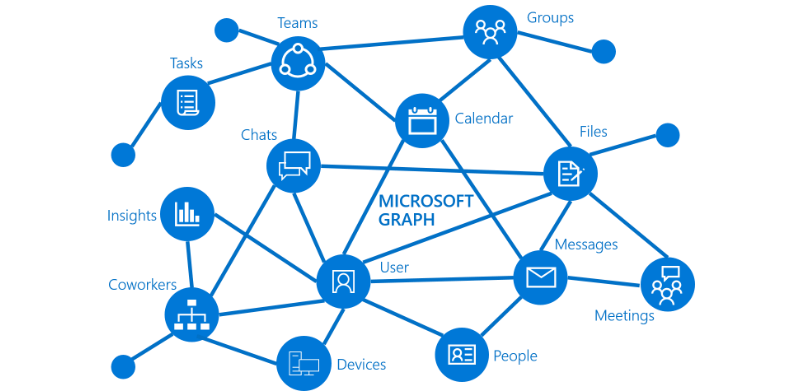

# Información general de Microsoft GraphOverview of Microsoft Graph

Microsoft Graph es la puerta de enlace a datos y la inteligencia de Microsoft 365.Microsoft Graph is the gateway to data and intelligence in Microsoft 365. Microsoft Graph proporciona un modelo de programación unificado que puede usar para aprovechar la gran cantidad de datos en Office 365, Enterprise Mobility + Security y Windows 10.Microsoft Graph provides a unified programmability model that you can use to take advantage of the tremendous amount of data in Office 365, Enterprise Mobility + Security, and Windows 10. 

Puede usar la API de Microsoft Graph para crear aplicaciones para las organizaciones y los consumidores que interactúan con los datos de millones de usuarios.You can use the Microsoft Graph API to build apps for organizations and consumers that interact with the data of millions of users. Con Microsoft Graph, puede conectarse a una gran cantidad de recursos, relaciones e información, todo ello a través de un único punto de conexión: `https://graph.microsoft.com`.With Microsoft Graph, you can connect to a wealth of resources, relationships, and intelligence, all through a single endpoint: `https://graph.microsoft.com`.

## ¿Qué contiene el gráfico?What's in the graph?
Microsoft Graph expone las API de REST y las bibliotecas de cliente para tener acceso a estos datos:Microsoft Graph exposes REST APIs and client libraries to access data on the following:

- Azure Active DirectoryAzure Active Directory
- Servicios de Office 365: SharePoint, OneDrive, Exchange y Outlook, Microsoft Teams, OneNote, Planner y ExcelOffice 365 services: SharePoint, OneDrive, Outlook/Exchange, Microsoft Teams, OneNote, Planner, and Excel
- Servicios de Enterprise Mobility + Security: Identity Manager, Intune, Advanced Threat Analytics y protección contra amenazas avanzada.Enterprise Mobility and Security services: Identity Manager, Intune, Advanced Threat Analytics, and Advanced Threat Protection.
- Servicios de Windows 10: actividades y dispositivosWindows 10 services: activities and devices
- EducaciónEducation

Para obtener más información, consulte [Principales servicios y características de Microsoft Graph](overview-major-services.md).To find out more, see [Major services and features in Microsoft Graph](overview-major-services.md).

Microsoft Graph se conecta a todos los recursos en estos servicios mediante relaciones.Microsoft Graph connects all the resources across these services using relationships. Por ejemplo, un usuario puede conectarse a un grupo mediante una relación [memberOf](/graph/api/user-list-memberof?view=graph-rest-1.0) y a otro usuario a través de una [relación manager](/graph/api/user-list-manager?view=graph-rest-1.0).For example, a user can be connected to a group through a [memberOf](/graph/api/user-list-memberof?view=graph-rest-1.0) relationship, and to another user through a [manager relationship](/graph/api/user-list-manager?view=graph-rest-1.0). Su aplicación puede conectar estas relaciones para acceder a estos recursos conectados y realizar acciones en ellos a través de la API.Your app can traverse these relationships to access these connected resources and perform actions on them through the API.

Desde Microsoft Graph, también puede obtener valiosas conclusiones e información sobre los datos.You can also get valuable insights and intelligence about the data from Microsoft Graph. Por ejemplo, puede obtener los archivos populares [del entorno de](/graph/api/resources/insights-trending?view=graph-rest-beta) un usuario en particular o sus [contactos más relevantes](/graph/api/user-list-people?view=graph-rest-beta).For example, you can get the popular files [trending around](/graph/api/resources/insights-trending?view=graph-rest-beta) a particular user, or [get the most relevant people](/graph/api/user-list-people?view=graph-rest-beta) around a user.

Descubra las posibilidades que ofrecen las relaciones en Microsoft Graph.Discover the possibilities in the relationships within Microsoft Graph.

## ¿Qué puede hacer con Microsoft Graph?What can you do with Microsoft Graph? 

Puede usar Microsoft Graph para crear experiencias en torno al contexto único del usuario para ayudarle a aumentar su productividad. Imagine una aplicación que...You can use Microsoft Graph to build experiences around the user's unique context to help them be more productive. Imagine an app that...

- Comprueba cuál es su próxima reunión y le ayuda a prepararse para ella proporcionándole la información de perfil de los asistentes, incluidos sus puestos y sus compañeros de trabajo, así como información sobre los documentos y los proyectos más recientes en los que trabajan.Looks at your next meeting and helps you prepare for it by providing profile information for attendees, including their job titles and who they work with, as well as information about the latest documents and projects they're working on.
- Examina su calendario y sugiere las mejores horas para la siguiente reunión de equipo.Scans your calendar, and suggests the best times for the next team meeting.
- Captura el gráfico de proyección de ventas más recientes de un archivo de Excel en su OneDrive y le permite actualizar la previsión en tiempo real (todo ello desde el teléfono).Fetches the latest sales projection chart from an Excel file in your OneDrive and lets you update the forecast in real time, all from your phone.
- Se suscribe a los cambios del calendario, le envía una alerta cuando está dedicando demasiado tiempo a reuniones y proporciona recomendaciones para las reuniones que se puede saltar o que podría delegar en función de lo relevantes que considere que son los asistentes.Subscribes to changes in your calendar, sends you an alert when you’re spending too much time in meetings, and provides recommendations for the ones you can miss or delegate based on how relevant the attendees are to you.
- Le ayuda a ordenar la información personal y la laboral en su teléfono mediante acciones como la clasificación de las imágenes que deberían almacenarse en su OneDrive personal y de los documentos empresariales que deberían almacenarse en su OneDrive para la Empresa.Helps you sort out personal and work information on your phone; for example, by categorizing pictures that should go to your personal OneDrive and business receipts that should go to your OneDrive for Business.

Puede realizar todas estas acciones, entre otras, con la API de Microsoft Graph.You can do all this and more with the Microsoft Graph API.

>
  \*\*Note:\*\* Al usar la API de Microsoft Graph, acepta las [Condiciones de uso de Microsoft Graph](https://developer.microsoft.com/graph/docs/misc/terms-of-use) y la [Declaración de privacidad de Microsoft](https://go.microsoft.com/fwlink/?LinkId=521839).**Note:** When you use the Microsoft Graph API, you agree to the [Microsoft Graph Terms of Use](https://developer.microsoft.com/graph/docs/misc/terms-of-use) and the [Microsoft Privacy Statement](https://go.microsoft.com/fwlink/?LinkId=521839).

### Solicitudes popularesPopular requests

Consulte algunos escenarios comunes para trabajar con la API de Microsoft Graph.Check out some of these common scenarios for working with the Microsoft Graph API. Los vínculos le llevan al [Probador de Graph](https://developer.microsoft.com/graph/graph-explorer).The links take you to the [Graph Explorer](https://developer.microsoft.com/graph/graph-explorer).

| **Operación****Operation** | **URL****URL** |
|:--------------------------|:----------------------------------------|
|   OBTENER mi perfilGET my profile |    [`https://graph.microsoft.com/v1.0/me`](https://developer.microsoft.com/graph/graph-explorer/?request=me&version=v1.0) |
|   OBTENER mis archivosGET my files | [`https://graph.microsoft.com/v1.0/me/drive/root/children`](https://developer.microsoft.com/graph/graph-explorer/?request=me%2Fdrive%2Froot%2Fchildren&version=v1.0) |
|   OBTENER mi fotoGET my photo | [`https://graph.microsoft.com/v1.0/me/photo/$value`](https://developer.microsoft.com/graph/graph-explorer/?request=me%2Fphoto%2F%24value&version=v1.0) |
|   OBTENER mi correoGET my mail |   [`https://graph.microsoft.com/v1.0/me/messages`](https://developer.microsoft.com/graph/graph-explorer/?request=me%2Fmessages&version=v1.0) |
|   OBTENER mi correo electrónico de importancia altaGET my high importance email | [`https://graph.microsoft.com/v1.0/me/messages?$filter=importance%20eq%20'high'`](https://developer.microsoft.com/graph/graph-explorer/?request=me%2Fmessages%3F%24filter%3Dimportance%2520eq%2520'high'&version=v1.0) |
|   OBTENER mis eventos de calendarioGET my calendar events |    [`https://graph.microsoft.com/v1.0/me/events`](https://developer.microsoft.com/graph/graph-explorer/?request=me%2Fevents&version=v1.0) |
|   OBTENER mi administradorGET my manager  | [`https://graph.microsoft.com/v1.0/me/manager`](https://developer.microsoft.com/graph/graph-explorer/?request=me%2Fmanager&version=v1.0) |
|   OBTENER el último usuario que modificó el archivo foo.txtGET last user to modify file foo.txt |  [`https://graph.microsoft.com/v1.0/me/drive/root/children/foo.txt/lastModifiedByUser`](https://developer.microsoft.com/graph/graph-explorer/?request=me%2Fdrive%2Froot%2Fchildren%2Ffoo.txt%2FlastModifiedByUser&version=v1.0) |
|   OBTENER grupos de Office 365 de los que soy miembroGET Office365 groups I’m member of| [`https://graph.microsoft.com/v1.0/me/memberOf/$/microsoft.graph.group?$filter=groupTypes/any(a:a%20eq%20'unified')`](https://developer.microsoft.com/graph/graph-explorer/?request=me%2FmemberOf%2F%24%2Fmicrosoft.graph.group%3F%24filter%3DgroupTypes%2Fany(a%3Aa%2520eq%2520'unified')&version=v1.0) |
|   OBTENER usuarios de mi organizaciónGET users in my organization     | [`https://graph.microsoft.com/v1.0/users`](https://developer.microsoft.com/graph/graph-explorer/?request=users&version=v1.0) |
|   OBTENER grupos de mi organizaciónGET groups in my organization | [`https://graph.microsoft.com/v1.0/groups`](https://developer.microsoft.com/graph/graph-explorer/?request=groups&version=v1.0) |
|   OBTENER usuarios relacionados conmigoGET people related to me    | [`https://graph.microsoft.com/v1.0/me/people`](https://developer.microsoft.com/graph/graph-explorer/?request=me%2Fpeople&version=beta)  |
|   OBTENER elementos de tendencias a mi alrededorGET items trending around me |  [`https://graph.microsoft.com/beta/me/insights/trending`](https://developer.microsoft.com/graph/graph-explorer/?request=me%2Finsights%2Ftrending&version=beta) |
|   GET mis notasGET my notes |  [`https://graph.microsoft.com/v1.0/me/onenote/notebooks`](https://developer.microsoft.com/graph/graph-explorer/?request=me%2Fonenote%2Fnotebooks&version=beta) |

## Obtener acceso a Microsoft Graph a escalaAccess Microsoft Graph at scale

La conexión de datos de Microsoft Graph permite el acceso masivo, en lugar de un acceso tradicional y transaccional, a los datos de Office 365.Microsoft Graph Data Connect enables bulk - rather than the traditional transactional - access to Office 365 data. Con el conjunto masivo de datos de Office 365, puede usar herramientas de Azure para crear aplicaciones inteligentes que:With the bulk Office 365 data, you can use Azure tools to build intelligent apps that:

- Buscan el experto más cercano sobre un tema de la organizaciónFind you the closest expert on a topic to you in your organization 
- Automatizan la creación del conocimiento baseAutomate knowledge base creation
- Analizan las convocatorias de reunión para proporcionar información sobre el uso de la sala de conferenciasAnalyze meeting requests to provide insights into conference room utilization
- Detectan el fraude con datos de comunicación y productividadDetect fraud with productivity and communication data

## Introducción a la conexión de datos de Microsoft GraphWhen should I use Microsoft Graph Data Connect?

La conexión de datos de Microsoft Graph proporciona una nueva forma de interactuar con los datos y está disponible mediante las API de Microsoft Graph.Microsoft Graph Data Connect provides a new way for you to interact with the data that's available through Microsoft Graph APIs. Además de proporcionar un acceso escalable a los datos de Office 365, la conexión de datos de Microsoft Graph también proporciona un único conjunto de capacidades que simplifican la creación de aplicaciones inteligentes, todo ello desde la nube de Microsoft.In addition to providing scalable access to Office 365 data, Microsoft Graph Data Connect also provides a unique set of capabilities that streamline the building of intelligent applications, all within the Microsoft cloud.

|**Característica****Feature**| **API de Microsoft Graph****Microsoft Graph API** | **Conexión de datos de Microsoft Graph****Microsoft Graph Data Connect** |
|:----------|:------------------------|:--------------------------------------|
| **Ámbito de acceso****Access scope** | Usuario único o espacio empresarialSingle user or entire tenant | Muchos usuarios o gruposMany users or groups |
| **Patrón de acceso****Access pattern** | Tiempo realReal time | Programación recurrenteRecurrent schedule |
| **Operaciones de datos****Data operations** | Funciona en el patrón de datosOperates on data master | Funciona en una caché de los datosOperates on a cache of the data |
| **Protección de datos****Data protection** | Los datos están protegidos en Microsoft 365Data is protected while in Microsoft 365 | La protección de datos se extiende a la caché de datos de su suscripción de AzureData protection is extended to the cache of data in your Azure subscription |
| **Consentimiento del usuario****User consent** | Sí mismoSelf Tipos de recursosResource types | NingunoNone |
| **Consentimiento del administrador****Admin consent** | Toda la organizaciónEntire organization Tipos de recursosResource types | Seleccione los usuarios de los gruposSelect groups of users Propiedades y tipos de recursosResource types and properties Excluye los usuariosExcludes users |
| **Herramientas de acceso****Access tools** | Consultas web RESTfulRESTful web queries | Azure Data FactoryAzure Data Factory |

Para más información sobre la conexión de datos de Microsoft Graph, consulte [Conexión de datos de Microsoft Graph](data-connect-overview.md).For more information about Microsoft Graph Data Connect, see [Microsoft Graph Data Connect](data-connect-overview.md). Para empezar, consulte [Introducción a la conexión de datos de Microsoft Graph](data-connect-concept-overview.md)To get started, see [Overview of Microsoft Graph Data Connect](data-connect-concept-overview.md). 

## Pasos siguientesNext steps

- Consulte algunos [escenarios destacados](https://developer.microsoft.com/graph/examples).Check out some [featured scenarios](https://developer.microsoft.com/graph/examples).
- Pruebe una solicitud de ejemplo en el [Probador de Graph](https://developer.microsoft.com/graph/graph-explorer).Try a sample request in the [Graph Explorer](https://developer.microsoft.com/graph/graph-explorer).
- Use el [inicio rápido](https://developer.microsoft.com/graph/quick-start) para configurar una aplicación de ejemplo lista para ejecutar.Use the [quick start](https://developer.microsoft.com/graph/quick-start) to set up a ready-to-run sample app.
- En la tabla de contenido, busque en **Aprender** para obtener información sobre los servicios y las características que puede usar en los escenarios.Look under **Learn** in the table of contents to read about services and features that you can use in your scenarios. 
- Descubra cómo [obtener un token de autenticación](auth-overview.md) en su aplicación.Find out how to [get an auth token](auth-overview.md) in your app.
- Empiece a [usar la API](use-the-api.md).Start [using the API](use-the-api.md).

## ¿Quiere realizar algún comentario?Feedback?

Su opinión es importante para nosotros. Póngase en contacto con nosotros en [Stack Overflow](https://stackoverflow.com/questions/tagged/office365+or+microsoftgraph). Etiquete sus preguntas con {MicrosoftGraph}.Your feedback is important to us. Connect with us on [Stack Overflow](https://stackoverflow.com/questions/tagged/office365+or+microsoftgraph). Tag your questions with {MicrosoftGraph}.

