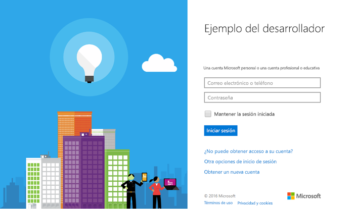

# <a name="get-started-with-microsoft-graph-in-a-php-app"></a><span data-ttu-id="596af-101">Introducción a Microsoft Graph en una aplicación PHP</span><span class="sxs-lookup"><span data-stu-id="596af-101">Get started with Microsoft Graph in a PHP app</span></span>

<span data-ttu-id="596af-p101">En este artículo se describen las tareas necesarias para obtener un token de acceso desde el punto de conexión v2.0 de Azure AD y llamar a Microsoft Graph. Le muestra los pasos para la creación del [Ejemplo de conexión para PHP (REST)](https://github.com/microsoftgraph/php-connect-rest-sample) y explica los conceptos principales que implementará para usar Microsoft Graph. El artículo también describe cómo acceder a Microsoft Graph mediante llamadas de REST.</span><span class="sxs-lookup"><span data-stu-id="596af-p101">This article describes the tasks required to get an access token from the Azure AD v2.0 endpoint and call  Microsoft Graph. It walks you through building the [Connect Sample for PHP (REST)](https://github.com/microsoftgraph/php-connect-rest-sample) and explains the main concepts that you implement to use Microsoft Graph. The article also describes how to access Microsoft Graph by using REST calls.</span></span>

<span data-ttu-id="596af-p102">Para utilizar Microsoft Graph en la aplicación PHP, debe mostrar la página de inicio de sesión de Microsoft a los usuarios. La siguiente captura de pantalla muestra una página de inicio de sesión para cuentas de Microsoft.</span><span class="sxs-lookup"><span data-stu-id="596af-p102">To use Microsoft Graph in your PHP app, you need to show the Microsoft sign in page to your users. The following screenshot shows a sign in page for Microsoft accounts.</span></span>



<span data-ttu-id="596af-108">**¿No quiere compilar una aplicación?**</span><span class="sxs-lookup"><span data-stu-id="596af-108">**Don't feel like building an app?**</span></span> <span data-ttu-id="596af-109">Puede ponerlo todo en funcionamiento de manera rápida si descarga el [ejemplo Connect para PHP (REST)](https://github.com/microsoftgraph/php-connect-rest-sample) en el que se basa este artículo.</span><span class="sxs-lookup"><span data-stu-id="596af-109">Get up and running fast by downloading the [Connect Sample for PHP (REST)](https://github.com/microsoftgraph/php-connect-rest-sample) that this article is based on.</span></span> <span data-ttu-id="596af-110">También puede probar la versión del [ejemplo Connect para PHP (SDK)](https://github.com/microsoftgraph/php-connect-sample) que usa la [biblioteca de Microsoft Graph para PHP](https://github.com/microsoftgraph/msgraph-sdk-php).</span><span class="sxs-lookup"><span data-stu-id="596af-110">Or try out the [Connect Sample for PHP (SDK)](https://github.com/microsoftgraph/php-connect-sample) version that uses the [Microsoft Graph Library for PHP](https://github.com/microsoftgraph/msgraph-sdk-php).</span></span>


## <a name="prerequisites"></a><span data-ttu-id="596af-111">Requisitos previos</span><span class="sxs-lookup"><span data-stu-id="596af-111">Prerequisites</span></span>

<span data-ttu-id="596af-112">Para comenzar, necesitará:</span><span class="sxs-lookup"><span data-stu-id="596af-112">To get started, you'll need:</span></span> 

- <span data-ttu-id="596af-113">Una [cuenta Microsoft](https://www.outlook.com/) o una [cuenta profesional o educativa](https://docs.microsoft.com/en-us/office/developer-program/office-365-developer-program-faq#account-types)</span><span class="sxs-lookup"><span data-stu-id="596af-113">A [Microsoft account](https://www.outlook.com/) or a [work or school account](https://docs.microsoft.com/en-us/office/developer-program/office-365-developer-program-faq#account-types)</span></span>
- <span data-ttu-id="596af-114">PHP (versión 5.5.9 o superior)</span><span class="sxs-lookup"><span data-stu-id="596af-114">PHP version 5.5.9 or greater</span></span>
- [<span data-ttu-id="596af-115">Composer</span><span class="sxs-lookup"><span data-stu-id="596af-115">Composer</span></span>](https://getcomposer.org/)


## <a name="register-the-application"></a><span data-ttu-id="596af-116">Registrar la aplicación</span><span class="sxs-lookup"><span data-stu-id="596af-116">Register the application</span></span>
<span data-ttu-id="596af-p104">Registre una aplicación en el Portal de registro de aplicaciones de Microsoft. Este proceso generará el identificador de la aplicación y la contraseña que utilizará para configurar la aplicación.</span><span class="sxs-lookup"><span data-stu-id="596af-p104">Register an app on the Microsoft App Registration Portal. This generates the app ID and password that you'll use to configure the app.</span></span>

1. <span data-ttu-id="596af-119">Inicie sesión en el [Portal de registro de aplicaciones de Microsoft](https://apps.dev.microsoft.com/) mediante su cuenta personal, profesional o educativa.</span><span class="sxs-lookup"><span data-stu-id="596af-119">Sign into the [Microsoft App Registration Portal](https://apps.dev.microsoft.com/) using either your personal or work or school account.</span></span>

2. <span data-ttu-id="596af-120">Seleccione **Agregar una aplicación**.</span><span class="sxs-lookup"><span data-stu-id="596af-120">Choose **Add an app**.</span></span>

3. <span data-ttu-id="596af-121">Escriba un nombre para la aplicación y seleccione **Crear aplicación**.</span><span class="sxs-lookup"><span data-stu-id="596af-121">Enter a name for the app, and choose **Create application**.</span></span> 
    
    <span data-ttu-id="596af-122">Se muestra la página de registro, indicando las propiedades de la aplicación.</span><span class="sxs-lookup"><span data-stu-id="596af-122">The registration page displays, listing the properties of your app.</span></span>

4. <span data-ttu-id="596af-123">Elija **Generar nueva contraseña**.</span><span class="sxs-lookup"><span data-stu-id="596af-123">Choose **Generate New Password**.</span></span>

5. <span data-ttu-id="596af-124">Copie el id. de la aplicación y la contraseña.</span><span class="sxs-lookup"><span data-stu-id="596af-124">Copy the application ID and password.</span></span>

6. <span data-ttu-id="596af-125">Elija **Agregar plataforma** y **Web**.</span><span class="sxs-lookup"><span data-stu-id="596af-125">Choose **Add Platform** and **Web**.</span></span>

7. <span data-ttu-id="596af-126">En el campo **URI de redirección**, escriba `http://localhost:8000/oauth`.</span><span class="sxs-lookup"><span data-stu-id="596af-126">In the **Redirect URI** field, type `http://localhost:8000/oauth`.</span></span>

8. <span data-ttu-id="596af-127">Seleccione **Guardar**.</span><span class="sxs-lookup"><span data-stu-id="596af-127">Choose **Save**.</span></span>


## <a name="configure-the-project"></a><span data-ttu-id="596af-128">Configurar el proyecto</span><span class="sxs-lookup"><span data-stu-id="596af-128">Configure the project</span></span>

<span data-ttu-id="596af-p105">Inicie un nuevo proyecto mediante Composer. Para crear un nuevo proyecto PHP mediante el marco Laravel, use el siguiente comando:</span><span class="sxs-lookup"><span data-stu-id="596af-p105">Start a new project using composer. To create a new PHP project using the Laravel framework, use the following command:</span></span>

```bash
composer create-project --prefer-dist laravel/laravel getstarted
```
 
<span data-ttu-id="596af-131">Esta acción creará una carpeta **getstarted** que podrá usar para este proyecto.</span><span class="sxs-lookup"><span data-stu-id="596af-131">This creates a **getstarted** folder that you can use for this project.</span></span>

> <span data-ttu-id="596af-132">Nota: También puede usar el [Proyecto inicial](https://github.com/microsoftgraph/php-connect-rest-sample/tree/master/starter-project) que se ocupa de la configuración del proyecto para que el usuario pueda centrarse en las secciones de codificación de este tutorial.</span><span class="sxs-lookup"><span data-stu-id="596af-132">Note: You can also use the [Starter project](https://github.com/microsoftgraph/php-connect-rest-sample/tree/master/starter-project) that takes care of the project configuration so you can focus on the coding sections of this walkthrough.</span></span>

## <a name="authenticate-the-user-and-get-an-access-token"></a><span data-ttu-id="596af-133">Autenticar al usuario y obtener un token de acceso</span><span class="sxs-lookup"><span data-stu-id="596af-133">Authenticate the user and get an access token</span></span>
<span data-ttu-id="596af-p106">Use una biblioteca de OAuth para simplificar el proceso de autenticación. [La liga de PHP](http://thephpleague.com/) proporciona una [biblioteca cliente de OAuth](https://github.com/thephpleague/oauth2-client) que podrá usar en este proyecto.</span><span class="sxs-lookup"><span data-stu-id="596af-p106">Use an OAuth library to simplify the authentication process. [The PHP League](http://thephpleague.com/) provides an [OAuth client library](https://github.com/thephpleague/oauth2-client) that you can use in this project.</span></span>

### <a name="add-the-dependency-to-composer"></a><span data-ttu-id="596af-136">Agregar la dependencia a Composer</span><span class="sxs-lookup"><span data-stu-id="596af-136">Add the dependency to composer</span></span>

<span data-ttu-id="596af-137">Abra el archivo `composer.json` e incluya la siguiente dependencia en la sección **require**:</span><span class="sxs-lookup"><span data-stu-id="596af-137">Open the `composer.json` file and include the following dependency in the **require** section:</span></span>

```json
"league/oauth2-client": "^1.4"
```

<span data-ttu-id="596af-138">Actualice las dependencias ejecutando el siguiente comando:</span><span class="sxs-lookup"><span data-stu-id="596af-138">Update the dependencies by running the following command:</span></span>

```bash
composer update
```

### <a name="start-the-authentication-flow"></a><span data-ttu-id="596af-139">Inicie el flujo de autenticación</span><span class="sxs-lookup"><span data-stu-id="596af-139">Start the authentication flow</span></span>

1. <span data-ttu-id="596af-p107">Abra el archivo **resources** > **views** > **welcome.blade.php**. Reemplace el elemento div **title** por el siguiente código.</span><span class="sxs-lookup"><span data-stu-id="596af-p107">Open the **resources** > **views** > **welcome.blade.php** file. Replace the **title** div element with the following code.</span></span>
    ```html
    <div class="title" onClick="window.location='/oauth'">Sign in to Microsoft</div>
    ```
    
2. <span data-ttu-id="596af-p108">Escriba una sugerencia de la clase `Illuminate\Http\Request` en el archivo **app** > **Http** > **routes.php**. Agregue la siguiente línea antes de cualquier declaración de ruta.</span><span class="sxs-lookup"><span data-stu-id="596af-p108">Type-hint the `Illuminate\Http\Request` class on the **app** > **Http** > **routes.php** file. Add the following line before any route declaration.</span></span>
    ```php
    use Illuminate\Http\Request;
    ```
    
3. <span data-ttu-id="596af-p109">Agregue una ruta */oauth* al archivo **app** > **Http** > **routes.php**. Para agregar la ruta, copie el siguiente código después de la declaración de ruta predeterminada. Inserte el **Id. de la aplicación** y la **contraseña** de la aplicación en los marcadores de posición marcados como **\<YOUR_APPLICATION_ID\>** y **\<YOUR_PASSWORD\>**, respectivamente.</span><span class="sxs-lookup"><span data-stu-id="596af-p109">Add an */oauth* route to the **app** > **Http** > **routes.php** file. To add the route, copy the following code after the default route declaration. Insert the **application ID** and **password** of your app in the placeholder marked with **\<YOUR_APPLICATION_ID\>** and **\<YOUR_PASSWORD\>** respectively.</span></span>
    ```php
    Route::get('/oauth', function () {
        $provider = new \League\OAuth2\Client\Provider\GenericProvider([
            'clientId'                => '<YOUR_APPLICATION_ID>',
            'clientSecret'            => '<YOUR_PASSWORD>',
            'redirectUri'             => 'http://localhost:8000/oauth',
            'urlAuthorize'            => 'https://login.microsoftonline.com/common/oauth2/v2.0/authorize',
            'urlAccessToken'          => 'https://login.microsoftonline.com/common/oauth2/v2.0/token',
            'urlResourceOwnerDetails' => '',
            'scopes'                  => 'openid mail.send'
        ]);

        if (!$request->has('code')) {
            return redirect($provider->getAuthorizationUrl());
        }
    });
    ```
    
<span data-ttu-id="596af-p110">Cuando llegue a este punto, deberá tener una aplicación PHP que muestre lo siguiente: *Iniciar sesión en Microsoft*. Si hace clic en el texto, la aplicación muestra la página de inicio de sesión de Microsoft. El siguiente paso es controlar el código que envía el servidor de autorización a la URI de redirección y cambiarlo por un token de acceso.</span><span class="sxs-lookup"><span data-stu-id="596af-p110">At this point, you should have a PHP app that displays *Sign in to Microsoft*. If you click the text, the app presents the Microsoft sign-in page. The next step is to handle the code that the authorization server sends to the redirect URI and exchange it for an access token.</span></span>

### <a name="exchange-the-authorization-code-for-an-access-token"></a><span data-ttu-id="596af-150">Cambiar el código de autorización por un token de acceso</span><span class="sxs-lookup"><span data-stu-id="596af-150">Exchange the authorization code for an access token</span></span>

<span data-ttu-id="596af-151">Es necesario usar la respuesta del servidor de autorización, que contiene un código que puede intercambiar por un token de acceso.</span><span class="sxs-lookup"><span data-stu-id="596af-151">You need to handle the authorization server response, which contains a code that you can exchange for an access token.</span></span>

<span data-ttu-id="596af-p111">Actualice la ruta */oauth* de manera que pueda obtener un token de acceso con el código de autorización. Para ello, abra el archivo **app** > **Http** > **routes.php** y agregue la siguiente cláusula condicional *else* a la instrucción *if* existente.</span><span class="sxs-lookup"><span data-stu-id="596af-p111">Update the */oauth* route so it can get an access token with the authorization code. To do this, open the **app** > **Http** > **routes.php** file and add the following *else* conditional clause to the existing *if* statement.</span></span>

```php
if (!$request->has('code')) {
    ...
    // add the following lines
} else {
    $accessToken = $provider->getAccessToken('authorization_code', [
        'code'     => $request->input('code')
    ]);
    exit($accessToken->getToken());
}
```
    
<span data-ttu-id="596af-p112">Tenga en cuenta que hay un token de acceso en la línea siguiente: `exit($accessToken->getToken());`. Ahora, ya puede agregar el código para llamar a Microsoft Graph.</span><span class="sxs-lookup"><span data-stu-id="596af-p112">Note that you have an access token in this line: `exit($accessToken->getToken());`. Now you're ready to add code to call Microsoft Graph.</span></span> 

## <a name="call-microsoft-graph-using-rest"></a><span data-ttu-id="596af-156">Llamar a Microsoft Graph con REST</span><span class="sxs-lookup"><span data-stu-id="596af-156">Call Microsoft Graph using REST</span></span>
<span data-ttu-id="596af-p113">Puede llamar a Microsoft Graph con REST. Reemplace la línea `exit($accessToken->getToken());` por el siguiente código. Escriba su dirección de correo electrónico en el marcador de posición marcado como **\<YOUR_EMAIL_ADDRESS\>**.</span><span class="sxs-lookup"><span data-stu-id="596af-p113">You can call Microsoft Graph using REST. Replace the line `exit($accessToken->getToken());` with the following code. Insert your email address in the placeholder marked with **\<YOUR_EMAIL_ADDRESS\>**.</span></span>

```php
$client = new \GuzzleHttp\Client();

$email = "{
    Message: {
    Subject: 'Sent using the Microsoft Graph REST API',
    Body: {
        ContentType: 'text',
        Content: 'This is the email body'
    },
    ToRecipients: [
        {
            EmailAddress: {
            Address: '<YOUR_EMAIL_ADDRESS>'
            }
        }
    ]
    }}";

$response = $client->request('POST', 'https://graph.microsoft.com/v1.0/me/sendmail', [
    'headers' => [
        'Authorization' => 'Bearer ' . $accessToken->getToken(),
        'Content-Type' => 'application/json;odata.metadata=minimal;odata.streaming=true'
    ],
    'body' => $email
]);
if($response.getStatusCode() === 201) {
    exit('Email sent, check your inbox');
} else {
    exit('There was an error sending the email. Status code: ' . $response.getStatusCode());
}
```

## <a name="run-the-app"></a><span data-ttu-id="596af-160">Ejecutar la aplicación</span><span class="sxs-lookup"><span data-stu-id="596af-160">Run the app</span></span>
<span data-ttu-id="596af-161">Ya puede probar la aplicación PHP.</span><span class="sxs-lookup"><span data-stu-id="596af-161">You're ready to try your PHP app.</span></span>

1. <span data-ttu-id="596af-162">En el shell escriba el siguiente comando:</span><span class="sxs-lookup"><span data-stu-id="596af-162">In your shell, type the following command:</span></span>
    ```bash
    php artisan serve
    ```
    
2. <span data-ttu-id="596af-163">Vaya a `http://localhost:8000` en el explorador web.</span><span class="sxs-lookup"><span data-stu-id="596af-163">Go to `http://localhost:8000` in your web browser.</span></span>
3. <span data-ttu-id="596af-164">Elija **Iniciar sesión en Microsoft**.</span><span class="sxs-lookup"><span data-stu-id="596af-164">Choose **Sign in to Microsoft**.</span></span>
4. <span data-ttu-id="596af-165">Inicie sesión con su cuenta personal, profesional o educativa y conceda los permisos solicitados.</span><span class="sxs-lookup"><span data-stu-id="596af-165">Sign in with your personal or work or school account and grant the requested permissions.</span></span>

<span data-ttu-id="596af-p114">Compruebe la Bandeja de entrada de la dirección de correo electrónico que configuró en la sección [Llamar a Microsoft Graph con REST](#call-microsoft-graph-using-rest). Debe tener un correo electrónico de la cuenta que utilizó para iniciar sesión en la aplicación.</span><span class="sxs-lookup"><span data-stu-id="596af-p114">Check the inbox of the email address that you configured in [Call the Microsoft Graph using REST](#call-microsoft-graph-using-rest) section. You should have an email from the account that you used to sign in to the app.</span></span>

## <a name="next-steps"></a><span data-ttu-id="596af-168">Pasos siguientes</span><span class="sxs-lookup"><span data-stu-id="596af-168">Next steps</span></span>
- <span data-ttu-id="596af-169">Pruebe el [Probador de Microsoft Graph](https://developer.microsoft.com/graph/graph-explorer).</span><span class="sxs-lookup"><span data-stu-id="596af-169">Try out the [Microsoft Graph explorer](https://developer.microsoft.com/graph/graph-explorer).</span></span>


## <a name="see-also"></a><span data-ttu-id="596af-170">Recursos adicionales</span><span class="sxs-lookup"><span data-stu-id="596af-170">See also</span></span>
* [<span data-ttu-id="596af-171">Protocolos de Azure AD v2.0</span><span class="sxs-lookup"><span data-stu-id="596af-171">Azure AD v2.0 protocols</span></span>](https://azure.microsoft.com/en-us/documentation/articles/active-directory-v2-protocols/)
* [<span data-ttu-id="596af-172">Tokens de Azure AD v2.0</span><span class="sxs-lookup"><span data-stu-id="596af-172">Azure AD v2.0 tokens</span></span>](https://azure.microsoft.com/en-us/documentation/articles/active-directory-v2-tokens/)
