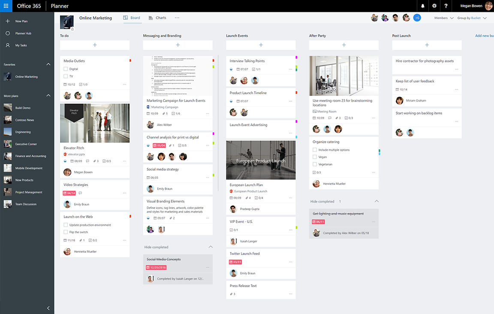

# Introducción a la API de tareas y planes de PlannerPlanner tasks and plans API overview
Planner proporciona a los equipos una forma simple y visual de organizar su trabajo.Planner provides a simple and visual way for teams to organize their work. Los clientes pueden usar Planner para crear planes, organizar y asignar tareas, compartir el progreso y colaborar en contenido.Customers can use Planner to create plans, organize and assign tasks, share progress, and collaborate on content.  Planner proporciona varias experiencias interactivas como un panel de tareas, una página de gráficos y una vista Programación, así como aplicaciones integradas en Office 365.Planner provides several interactive experiences including a task board, a charts page, and a schedule view, as well as integrations throughout Office 365.

**Panel de tareas de Office 365 Planner****Office 365 Planner task board**

## ¿Por qué debería realizar la integración con las tareas de Planner?Why integrate with Planner tasks?
Planner proporciona capacidades de seguimiento de tareas para experiencias de colaboración de Office 365.Planner provides task tracking capabilities for collaboration experiences in Office 365. Si los escenarios requieren el seguimiento de tareas y organizar el trabajo de un equipo o un grupo de usuarios finales, Planner es el servicio adecuado para usted.If your scenarios require tracking tasks and organizing work for a team or group of end users, Planner is the right service for you. La integración de Planner puede ayudarle a alcanzar a los millones de usuarios que colaboran en Office 365.Planner integration can help you reach the millions of users collaborating on Office 365. 

### Organizar el trabajo del equipoOrganize your team’s work
Planner proporciona un espacio compartido donde puede crear un equipo, [crear tareas](/graph/api/planner-post-tasks?view=graph-rest-1.0) y asignarlas a otras personas del equipo.Planner provides a shared space where you can build a team, [create tasks](/graph/api/planner-post-tasks?view=graph-rest-1.0), and assign them to others on the team. Planner facilita a todos saber quién está haciendo qué y si todo va bien. Puede actualizar las tareas con información adicional, como fechas de vencimiento, el progreso y descripciones, y organizar más las tareas con cubos personalizables y etiquetas de categoría.Planner makes it easy for everyone to know who’s doing what and if things are on track. You can update tasks with additional information like due dates, progress, and descriptions, and then further organize tasks with customizable buckets and category labels.   

### Colaborar en Office 365Collaborate across Office 365
Planner se integra en las experiencias de colaboración en Office 365.Planner integrates into collaboration experiences across Office 365. Además de los clientes móvil y web de Planner, los usuarios pueden ver y actualizar los planes y las tareas de Planner desde SharePoint y Microsoft Teams.In addition to Planner web and mobile clients, users can view and update Planner plans and tasks from within SharePoint and Microsoft Teams.  

Planner usa la tecnología de Microsoft Graph y el servicio de grupo de Office 365.Planner itself is also powered by the Microsoft Graph and the Office 365 group service. Los archivos que cargue y adjunte a tareas de Planner se almacenan en SharePoint.Files that you upload and attach to Planner tasks are stored in SharePoint. Los comentarios de Planner se basan en las conversaciones de grupo de Outlook.Planner comments are based on Outlook group conversations.

<!-- Add image
Note: Put an image here showing the relationship between Planner and other things
-->

### Automatizar la creación de tareas y planesAutomate the creation of plans and tasks
¿Estás trabajando en tipos de proyecto o procesos repetidos?Are you working on repeated process or project type? Puede usar la API de Planner para automatizar la creación de un plan y una lista de tareas.You can use the Planner API to automate the creation of a plan and a list of tasks.  
 
## Principales tareas de la API de PlannerTop Planner API tasks

|OperaciónOperation|URLURL|
|:--------|:--|
|Ver todos los [planes](/graph/api/resources/plannerplan?view=graph-rest-beta) de un grupoSee all the [plans](/graph/api/resources/plannerplan?view=graph-rest-beta) for a group|GET [https://graph.microsoft.com/v1.0/groups/{id}/planner/plans](https://developer.microsoft.com/graph/graph-explorer?request=groups/{id}/planner/plans&version=v1.0)GET [https://graph.microsoft.com/v1.0/groups/{id}/planner/plans](https://developer.microsoft.com/graph/graph-explorer?request=groups/{id}/planner/plans&version=v1.0)|
|Ver [tareas](/graph/api/resources/plannertask?view=graph-rest-beta) en un planSee [tasks](/graph/api/resources/plannertask?view=graph-rest-beta) in a plan|GET [https://graph.microsoft.com/v1.0/planner/plans/{id}/tasks](https://developer.microsoft.com/graph/graph-explorer?request=planner/plans/{id}/tasks&version=v1.0)GET [https://graph.microsoft.com/v1.0/planner/plans/{id}/tasks](https://developer.microsoft.com/graph/graph-explorer?request=planner/plans/{id}/tasks&version=v1.0)|
|Ver todas [las tareas](/graph/api/planneruser-list-tasks?view=graph-rest-beta) que me asignaron en los planesSee all [my tasks](/graph/api/planneruser-list-tasks?view=graph-rest-beta) assigned to me across plans|GET [https://graph.microsoft.com/v1.0/me/planner/tasks/](https://developer.microsoft.com/graph/graph-explorer?request=me/planner/tasks/&version=v1.0)GET [https://graph.microsoft.com/v1.0/me/planner/tasks/](https://developer.microsoft.com/graph/graph-explorer?request=me/planner/tasks/&version=v1.0)|
|[Cree una nueva tareaCreate a new task](/graph/api/planner-post-tasks?view=graph-rest-1.0)|POST [https://graph.microsoft.com/v1.0/planner/tasks](https://developer.microsoft.com/graph/graph-explorer?request=groups/{id}/planner/plans&version=v1.0)POST [https://graph.microsoft.com/v1.0/planner/tasks](https://developer.microsoft.com/graph/graph-explorer?request=groups/{id}/planner/plans&version=v1.0)|
|[Actualizar una tareaUpdate a task](/graph/api/plannertask-update?view=graph-rest-1.0)|PATCH [https://graph.microsoft.com/v1.0/planner/tasks/{task-id}](https://developer.microsoft.com/graph/graph-explorer?request=groups/{id}/planner/plans&version=v1.0)PATCH [https://graph.microsoft.com/v1.0/planner/tasks/{task-id}](https://developer.microsoft.com/graph/graph-explorer?request=groups/{id}/planner/plans&version=v1.0)|
|[Eliminar una tareaDelete a task](/graph/api/plannertask-delete?view=graph-rest-1.0)|ELIMINAR [https://graph.microsoft.com/v1.0/planner/tasks/{id}](https://developer.microsoft.com/graph/graph-explorer?request=groups/{id}/planner/plans&version=v1.0)DELETE [https://graph.microsoft.com/v1.0/planner/tasks/{id}](https://developer.microsoft.com/graph/graph-explorer?request=groups/{id}/planner/plans&version=v1.0)|

## Referencia de la APIAPI reference
¿Busca la referencia de la API para este servicio?Looking for the API reference for this service?

- [API de Planner en Microsoft Graph v1.0Planner API in Microsoft Graph v1.0](/graph/api/resources/planner-overview?view=graph-rest-1.0)
- [API de Planner en Microsoft Graph betaPlanner API in Microsoft Graph beta](/graph/api/resources/planner-overview?view=graph-rest-beta)

## Pasos siguientesNext steps

- [Usar la API de PlannerUse the Planner API](/graph/api/resources/planner-overview?view=graph-rest-1.0)
- [Trabajar con planesWork with plans](/graph/api/resources/planner-overview?view=graph-rest-1.0#plans)
- [Trabajar con tareasWork with tasks](/graph/api/resources/planner-overview?view=graph-rest-1.0#tasks)
