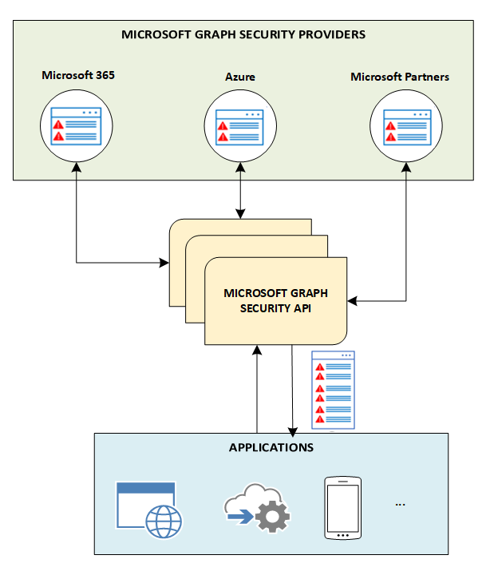

# Introducción a la API de seguridad de Microsoft Graph

Puede usar la API de seguridad de Microsoft Graph para conectar los productos de seguridad, servicios y socios de Microsoft para optimizar las operaciones de seguridad y mejorar la protección contra amenazas, su detección y la capacidad de respuesta. La API de seguridad de Microsoft Graph es un servicio intermediario (o agente) que ofrece una interfaz de programación única para conectar a varios [proveedores de seguridad de Microsoft Graph](/graph/api/resources/securityvendorinformation?view=graph-rest-1.0) (también denominados proveedores de seguridad o simplemente proveedores). Las solicitudes a la API de seguridad de Microsoft Graph están federadas a todos los proveedores de seguridad aplicables. Los resultados se agregan y se devuelven a la aplicación solicitante en un esquema común, como se muestra en el siguiente diagrama. Para más información, consulte el [Flujo de datos de la API de seguridad de Microsoft Graph](security-dataflow.md).

Para obtener información acerca de la autorización, consulte [Autorización y la API de seguridad de Microsoft Graph](security-authorization.md). Para obtener información sobre permisos, incluidos permisos delegados y de aplicación, consulte [Permisos](permissions-reference.md#security-permissions).

## Por qué usar la API de seguridad de Microsoft Graph

La [API de seguridad de Microsoft Graph](/graph/api/resources/security-api-overview?view=graph-rest-1.0) le permite conectar fácilmente con diferentes productos y servicios de seguridad de Microsoft y socios de Microsoft. Le permite materializar y enriquecer más fácilmente el valor de estas soluciones.

### Unificar y estandarizar el seguimiento de alertas

Escriba código una vez para integrar las alertas de cualquier solución de seguridad integrada de Microsoft Graph y mantenga sincronizados los estados de alerta y las tareas en todas las soluciones. También puede transmitir alertas a soluciones de Administración de eventos e información de seguridad (SIEM) como Splunk e IBM QRadar mediante [Azure Monitor](https://docs.microsoft.com/es-ES/azure/monitoring-and-diagnostics/monitor-stream-monitoring-data-event-hubs#what-can-i-do-with-the-monitoring-data-being-sent-to-my-event-hub). Para más información sobre la integración de SIEM con las entidades de la API de seguridad, consulte [Integrar con un SIEM](security-siemintegration.md).

### Correlacionar las alertas de seguridad para mejorar la respuesta y la protección contra amenazas

Correlacione alertas en las soluciones de seguridad más fácilmente con un esquema de alertas unificado. Esto no solo le permite recibir información de alertas que requieren acción, sino que también permite a los analistas de seguridad dinamizar y enriquecer las alertas con activos e información de usuario, lo que protege los activos y genera respuestas más rápidas ante amenazas.  

### Actualizar tareas, estado y etiquetas de alerta

Etiquete las alertas con inteligencia de amenazas o contexto adicional para informar de respuestas y correcciones. Asegúrese de que los comentarios sobre las alertas se capturan para ver todos los flujos de trabajo. Mantenga las tareas y el estado de las alertas sincronizados para que todas las soluciones integradas reflejen el estado actual. Use suscripciones de webhook para obtener una notificación de cambios.  

### Desbloquear el contexto de seguridad a la investigación de unidad

Profundice en el inventario relacionado con la seguridad (como los usuarios, los host y las aplicaciones), después, agregue contexto organizativo de otros proveedores de Microsoft Graph (Azure AD, Microsoft Intune, Office 365) para unir los contextos de seguridad y de la empresa y mejorar la respuesta contra amenazas.

### Administrar los riesgos de seguridad de manera proactiva (versión preliminar)

Use la Puntuación de seguridad de Microsoft (versión preliminar) para proporcionar visibilidad sobre las necesidades de seguridad de su organización y obtener sugerencias sobre cómo mejorarla; ganará una puntuación mejorada después de la incorporación de dichas sugerencias. Mida su progreso conforme pase el tiempo y obtenga información sobre los cambios específicos que condujeron a la mejora de la puntuación.

## Ventajas de usar la API de seguridad de Microsoft Graph

En la siguiente tabla se enumeran las ventajas a las que pueden acceder diferentes soluciones de seguridad mediante la integración con la API de seguridad de Microsoft Graph.  

|**Área**     | **Ventajas**|
|:---------------|:---------|
|**Proveedores de servicios de seguridad administrados (MSSPs)**|<ul><li>Integración simplificada con herramientas y servicios de operaciones de seguridad.</li> <li>Implementación reducida y tiempo y esfuerzos de mantenimiento.</li> <li>Capacidad para ofrecer más valor a los clientes MSSP.</li></ul>|
|**Soluciones de administración de riesgos de TI y SIEM**|<ul><li>Integración sencilla con soluciones de seguridad de Microsoft y socios del ecosistema.</li> <li>Metadatos de alerta enriquecidos.</li> <li>Mejor correlación de alerta.</li></ul>|
|**Aplicaciones**  (Inteligencia de amenazas, Móvil, Nube, IoT, Detección de fraude, Identidad y acceso, Riesgo y cumplimiento, Firewall, etc.)|<ul><li>Administración de amenazas unificada, prevención y administración de riesgos en distintas soluciones de seguridad.</li> <li>Alertas, inventario, configuración y acciones que se exponen a través de Microsoft Graph.</li> <li>Integración instantánea con soluciones habilitadas para Microsoft Graph.</li></ul>|

## Referencia de la API
¿Busca la referencia de la API para este servicio?

- [API de seguridad en Microsoft Graph versión 1.0](/graph/api/resources/security-api-overview?view=graph-rest-1.0)
- [API de seguridad en Microsoft Graph versión beta](/graph/api/resources/security-api-overview?view=graph-rest-beta)

## Pasos siguientes

- [Usar la API de seguridad de Microsoft Graph](/graph/api/resources/security-api-overview?view=graph-rest-1.0)
- ¿Está interesado en ser proveedor de seguridad? Póngase en contacto con [graphsecfeedback](mailto:graphsecfeedback@microsoft.com).
