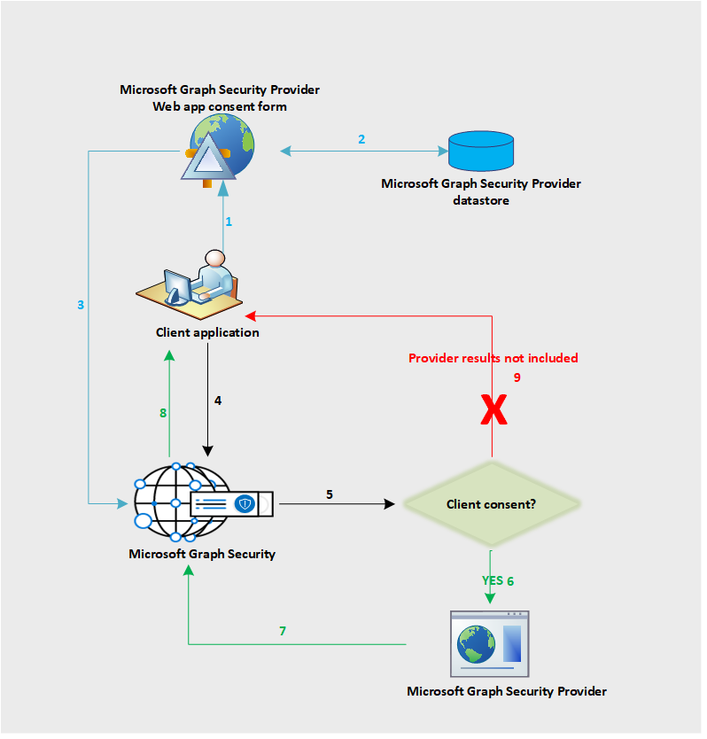

# El flujo de datos de la API de seguridad de Microsoft GraphMicrosoft Graph Security API data flow

La API de seguridad de Microsoft Graph federa solicitudes a todos los proveedores en el ecosistema de seguridad de Microsoft Graph.The Microsoft Graph Security API federates requests to all providers in the Microsoft Graph Security ecosystem. Esto se basa en el consentimiento del proveedor de seguridad proporcionado por la aplicación, como se muestra en el siguiente diagrama.This is based on the security provider consent provided by the application, as shown in the following diagram. El flujo de trabajo de consentimiento solo se aplica a los proveedores que no son de Microsoft.The consent workflow only applies to non-Microsoft providers.

A continuación se describe el flujo:The following is a description of the flow:

1. El usuario de la aplicación inicia sesión en la aplicación del proveedor para ver el formulario de consentimiento.The application user signs in to the provider application to view the consent form from the provider. La experiencia de este formulario de consentimiento o su interfaz de usuario son propiedad de proveedor y se aplican a los proveedores que no son de Microsoft solo para obtener un consentimiento explícito de sus clientes para enviar solicitudes a la API de seguridad de Microsoft Graph.This consent form experience or UI is owned by the provider and applies to non-Microsoft providers only to get explicit consent from their customers to send requests to Microsoft Graph Security API.
2. El consentimiento del cliente se almacena en el lado del proveedor.The client consent is stored on the provider side.
3. El servicio de consentimiento del proveedor llama a la API de seguridad de Microsoft Graph para informar sobre la aprobación del consentimiento del cliente correspondiente.The provider consent service calls the Microsoft Graph Security API to inform consent approval for the respective customer.
4. La aplicación envía una solicitud a la API de seguridad de Microsoft Graph.The application sends a request to the Microsoft Graph Security API.
5. La API de seguridad de Microsoft Graph comprueba la información del consentimiento para este cliente asignado a varios proveedores.The Microsoft Graph Security API checks for the consent information for this customer mapped to various providers.
6. La API de seguridad de Microsoft Graph llama a todos los proveedores a los que el cliente ha dado un consentimiento explícito mediante el consentimiento del proveedor.The Microsoft Graph Security API calls all those providers the customer has given explicit consent to via the provider consent experience.
7. Todos los proveedores con el consentimiento de ese cliente devuelven la respuesta.The response is returned from all the consented providers for that client.
8. La respuesta del conjunto de resultados se devuelve a la aplicación.The result set response is returned to the application.
9. Si el cliente no ha dado el consentimiento a ningún proveedor, la respuesta no incluirá los resultados de dichos proveedores.If the customer has not consented to any provider, no results from those providers are included in the response.
