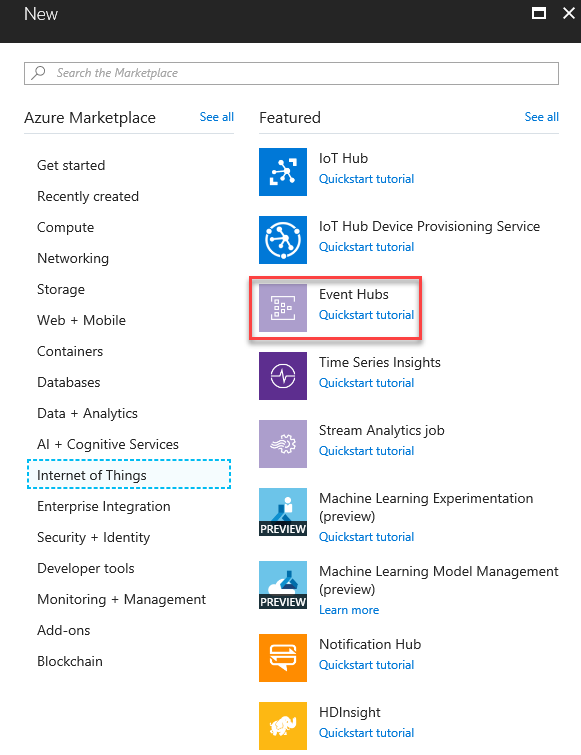

# <a name="integrate-microsoft-graph-security-api-alerts-with-ibm-qradar-siem-using-azure-monitor"></a>Integrar alertas de API de seguridad de Microsoft Graph con SIEM IBM QRadar a través de Azure Monitor

Los proveedores de seguridad de Microsoft Graph se pueden administrar a través de un único punto de conexión REST. Este punto de conexión se puede configurar para [Azure Monitor](https://docs.microsoft.com/en-us/azure/monitoring-and-diagnostics/), que es compatible con los conectores para varios productos SIEM. Las instrucciones que aparecen en los pasos 1 y 2 de este artículo hacen referencia a todos los conectores de Azure Monitor que admiten el consumo a través de centros de eventos. En este artículo se describe la integración completa del conector SIEM [QRadar](https://www.ibm.com/us-en/marketplace/ibm-qradar-siem).

El proceso de integración conlleva los siguientes pasos:

1. [Configurar un centro de eventos Azure para recibir alertas de seguridad para la cuenta empresarial](#step-1-set-up-an-event-hubs-namespace-in-azure-to-receive-security-alerts-for-your-tenant).
2. [Configurar Azure Monitor para enviar alertas de seguridad desde la cuenta empresarial al centro de eventos](#step-2-configure-azure-monitor-to-send-security-alerts-from-your-tenant-to-the-event-hub).
3. [Descargue e instale el QRadar para consumir alertas de seguridad](#step-3-download-and-install-the-qradar-to-consume-security-alerts).

Después de completar estos pasos, su IBM QRadar consumirá alertas de seguridad de todos los productos de seguridad integrados de Microsoft Graph licenciados en su cuenta empresarial. Los nuevos productos de seguridad para los que adquiera una licencia también enviarán alertas a través de esta conexión, en el mismo esquema y sin necesidad de realizar más tareas de integración.

## <a name="step-1-set-up-an-event-hubs-namespace-in-azure-to-receive-security-alerts-for-your-tenant"></a>Paso 1: Configurar un espacio de nombres de Event Hubs en Azure para recibir alertas de seguridad de la cuenta empresarial

Para empezar, debe crear un centro de eventos y un espacio de nombres de [Microsoft Azure Event Hubs](https://docs.microsoft.com/en-us/azure/event-hubs/). Tanto el espacio de nombres como el centro de eventos serán el destino de todas las alertas de seguridad de la organización. Un espacio de nombres de Event Hubs es una agrupación lógica de centros de eventos que comparten la misma directiva de acceso. Conviene mencionar algunos detalles sobre el espacio de nombres de Event Hubs y los centros de eventos que cree:

- Se recomienda usar un espacio de nombres de Event Hubs estándar, sobre todo si va a enviar otros datos de supervisión de Azure a través de estos mismos centros de eventos.
- Normalmente, solo se necesita una unidad de procesamiento. Si necesita escalar a medida que el uso crece, siempre puede aumentar manualmente el número de unidades de procesamiento del espacio de nombres más adelante o habilitar el crecimiento automático.
- El número de unidades de procesamiento permite aumentar la escala de procesamiento de los centros de eventos. El número de particiones permite unificar el consumo entre un gran número de consumidores. Una misma partición tiene cabida para hasta 20 MBps o, aproximadamente, 20 000 mensajes por segundo. Dependiendo de la herramienta que consuma los datos, el consumo desde varias particiones puede ser posible o no. Si no está seguro de cuál el número de particiones que debe configurar, se recomienda empezar por cuatro particiones.
- Se recomienda establecer el período de retención de mensajes del centro de eventos en 7 días. Así, si la herramienta de consumo permanece inactiva durante más de un día, esta herramienta podrá seleccionar dónde se quedó (eventos con hasta 7 días de antigüedad).
- Se recomienda usar el grupo de consumidores predeterminado en el centro de eventos. No es necesario crear más grupos de consumidores ni usar un grupo de consumidores aparte, a menos que tenga previsto usar dos herramientas distintas para que consuman los mismos datos del mismo centro de eventos.
- Normalmente, es necesario tener abiertos los puertos 5671 y 5672 en el equipo que vaya a consumir datos del centro del eventos.

Vea también las [preguntas frecuentes sobre Event Hubs](https://docs.microsoft.com/en-us/azure/event-hubs/event-hubs-faq).

1. Inicie sesión en [Azure Portal](https://portal.azure.com/) y seleccione **Create a resource** (Crear un recurso) en la parte superior izquierda de la pantalla.

    

2. Seleccione **Internet de las cosas** y **Centros de eventos**.

    

3. En **Crear espacio de nombres**, especifique un espacio de nombres. Tras asegurarse de que el espacio de nombres está disponible, elija el plan de tarifa (Básico o Estándar). De igual modo, elija una suscripción de Azure, un grupo de recursos y la ubicación donde quiera crear el recurso. Seleccione **Crear** para crear el espacio de nombres. Puede que tenga que esperar unos minutos para que el sistema aprovisione completamente los recursos.

    

## <a name="step-2-configure-azure-monitor-to-send-security-alerts-from-your-tenant-to-the-event-hub"></a>Paso 2: Configurar Azure Monitor para enviar alertas de seguridad desde el inquilino al centro del eventos

La activación de la transmisión de alertas de seguridad de su organización a través de Azure Monitor se realiza una sola vez para todo el inquilino de Azure Active Directory (Azure AD). Todos los productos habilitados y con licencia de API para seguridad de Microsoft Graph comenzarán a enviar alertas de seguridad a Azure Monitor y transmitirán datos a las aplicaciones de consumo. Cualquier producto adicional habilitado para la API para seguridad de Microsoft Graph del que se haya adquirido licencia y que la organización implemente transmitirá automáticamente las alertas de seguridad por medio de esta misma configuración de Azure Monitor. No será necesario realizar ninguna tarea de integración extra en la organización.

Las alertas de seguridad consisten en datos con privilegios elevados que suelen estar visibles únicamente para el personal de respuestas de seguridad y para los administradores globales de una organización. Por este motivo, los pasos necesarios para configurar la integración de alertas de seguridad de un inquilino con sistemas SIEM requiere una cuenta de administrador global de Azure AD. Esta cuenta solo se necesita una vez (durante la instalación) para solicitar que las alertas de seguridad de la organización se envíen a Azure Monitor.

> **Nota:** por ahora, la hoja de configuración de Diagnósticos de Azure Monitor no admite la configuración de recursos en el nivel de cuenta empresarial. Las alertas de API de seguridad de Microsoft Graph son un recurso de nivel de cuenta empresarial, que requiere el uso de la API del Administrador de recursos de Azure para configurar Azure Monitor para admitir el consumo de las alertas de seguridad de su organización.

1. En su suscripción de Azure (puede encontrarse bajo "Todos los servicios"), registre "microsoft.insights" (Azure Monitor) como un proveedor de recursos.  
> **Nota:** no registre "Microsoft.SecurityGraph" (API de seguridad de Microsoft Graph) como un proveedor de recursos en su suscripción de Azure, ya que "Microsoft.SecurityGraph" es un recurso a nivel de cuenta empresarial como se explica anteriormente. La configuración de nivel de espacio empresarial formará parte del paso 6, a continuación.

2. Para configurar Azure Monitor con la API de Azure Resource Manager, obtenga la herramienta [ARMClient](https://github.com/projectkudu/ARMClient). Esta herramienta se usará para enviar llamadas de API de REST a Azure Portal desde una línea de comandos.

3. Prepare un archivo JSON de solicitud de configuración de diagnóstico del siguiente modo:

    ``` json
    {
      "location": "",
      "properties": {
        "name": "securityApiAlerts",
        "serviceBusRuleId": "/subscriptions/SUBSCRIPTION_ID/resourceGroups/RESOURCE_GROUP/providers/Microsoft.EventHub/namespaces/EVENT_HUB_NAMESPACE/authorizationrules/RootManageSharedAccessKey",
        "logs": [
          {
            "category": "Alert",
            "enabled": true,
            "retentionPolicy": {
              "enabled": true,
              "days": 7
            }
          }
        ]
      }
    }
    ```

    Reemplace los valores en el archivo JSON, así:

    **SUBSCRIPTION_ID** es el identificador de suscripción de la suscripción de Azure que hospeda el grupo de recursos y el espacio de nombres del centro de eventos donde se van a enviar alertas de seguridad de la organización.

    **RESOURCE_GROUP** es el grupo de recursos que contiene el espacio de nombres del centro de eventos donde se van a enviar alertas de seguridad de la organización.

    **EVENT_HUB_NAMESPACE** es el espacio de nombres del centro de eventos donde se van a enviar alertas de seguridad de la organización.

    **“days”:** es el número de días que quiere conservar los mensajes en el centro de eventos.

4. Guarde el archivo como JSON en el directorio donde vaya a invocar ARMClient.exe. Por ejemplo, denomine el archivo **AzMonConfig.json**.

5. Ejecute el siguiente comando para iniciar sesión en la herramienta ARMClient. Necesitará usar credenciales de una cuenta de administrador global.

    ``` shell
    ARMClient.exe login
    ```

6. Ejecute el siguiente comando para configurar Azure Monitor de modo que envíe alertas de seguridad al espacio de nombres del centro de eventos. Esto aprovisionará automáticamente un centro de eventos en el espacio de nombres e iniciará el flujo de alertas de seguridad hacia el centro de eventos. Asegúrese de que el nombre de la configuración (en este ejemplo, **securityApiAlerts**) coincide con el nombre de configuración especificado en el archivo JSON dentro del campo **name**.

    ``` shell
    ARMClient.exe put https://management.azure.com/providers/Microsoft.SecurityGraph/diagnosticSettings/securityApiAlerts?api-version=2017-04-01-preview  @".\AzMonConfig.json"
    ```

7. Para confirmar que la configuración se ha aplicado correctamente, ejecute este comando y compruebe que la salida coincide con la configuración del archivo JSON.

    ``` shell
    ARMClient.exe get https://management.azure.com/providers/Microsoft.SecurityGraph/diagnosticSettings/securityApiAlerts?api-version=2017-04-01-preview
    ```
8. Cierre la herramienta ARMClient. Ya ha acabado de configurar Azure Monitor para enviar alertas de seguridad desde la cuenta empresarial al centro del eventos.

## <a name="step-3-download-and-install-the-qradar-to-consume-security-alerts"></a>Paso 3: Descargar e instalar QRadar para consumir alertas de seguridad

1. Descargue e instale [IBM QRadar](https://www.ibm.com/us-en/marketplace/ibm-qradar-siem). **Es necesaria la versión 7.2.8 con revisión 7 o posterior** para leer los eventos desde un Microsoft Azure Event Hub.
2. Siga los pasos de [Configuración de Microsoft Azure Event Hubs para comunicarse con IBM QRadar](https://www.ibm.com/support/knowledgecenter/SS42VS_DSM/t_dsm_guide_microsoft_azure_enable_event_hubs.html) para configurar el centro de eventos.
3. Por último, siga los pasos de [Configuración QRadar para recopilar eventos de Microsoft Azure Event Hubs mediante el protocolo de Microsoft Azure Event Hubs](https://www.ibm.com/support/knowledgecenter/SS42VS_DSM/t_logsource_microsoft_azure_event_hubs.html) para empezar la exposición de las alertas de seguridad.
  
 > **Nota:** La integración de Microsoft Azure con IBM QRadar es compatible con los eventos enumerados en [Especificaciones de Microsoft Azure DSM](https://www.ibm.com/support/knowledgecenter/SS42VS_DSM/c_dsm_guide_microsoft_azure_DSM_specs.html). Actualmente estamos trabajando con IBM QRadar para agregar compatibilidad completa para alertas de API de seguridad de Microsoft Graph. En la actualidad, podrá recibir las alertas de API de seguridad de Microsoft Graph y verlas en la consola de IBM QRadar. Puede usar el [editor de DSM](https://www.ibm.com/support/knowledgecenter/SS42VS_7.2.8/com.ibm.qradar.doc/c_qradar_adm_dsm_ed_overview.html) para habilitar el análisis de las alertas de API de seguridad de Microsoft Graph.  
