# <a name="integrate-microsoft-graph-security-api-alerts-with-your-siem-using-azure-monitor"></a><span data-ttu-id="470b8-106">Integrar alertas de la API de seguridad de Microsoft Graph con su SIEM por medio de Azure Monitor</span><span class="sxs-lookup"><span data-stu-id="470b8-106">Integrate Microsoft Graph Security API alerts with your SIEM using Azure Monitor</span></span>

<span data-ttu-id="470b8-107">Los proveedores de seguridad de Microsoft Graph se pueden administrar a través de un único extremo REST.</span><span class="sxs-lookup"><span data-stu-id="470b8-107">The Microsoft Graph Security providers can be managed through a single REST endpoint.</span></span> <span data-ttu-id="470b8-108">Este extremo se puede configurar en [Azure Monitor](https://docs.microsoft.com/es-ES/azure/monitoring-and-diagnostics/), el cual es compatible con conectores para varios productos SIEM.</span><span class="sxs-lookup"><span data-stu-id="470b8-108">This endpoint can be configured to [Azure Monitor](https://docs.microsoft.com/es-ES/azure/monitoring-and-diagnostics/) which supports connectors to several SIEM products.</span></span> <span data-ttu-id="470b8-109">Las instrucciones de los pasos 1 y 2 de este artículo son para todos los conectores de Azure Monitor que admiten el consumo a través de centros de eventos.</span><span class="sxs-lookup"><span data-stu-id="470b8-109">The instructions in Steps 1 and 2 of this article refer to all Azure Monitor connectors that support consumption via event hubs.</span></span> <span data-ttu-id="470b8-110">En este artículo se describe la integración completa del conector SIEM de [Splunk](https://splunkbase.splunk.com/).</span><span class="sxs-lookup"><span data-stu-id="470b8-110">This article describes the end-to-end integration of the [Splunk](https://splunkbase.splunk.com/) SIEM connector.</span></span>

<span data-ttu-id="470b8-111">El proceso de integración conlleva los siguientes pasos:</span><span class="sxs-lookup"><span data-stu-id="470b8-111">The integration process involves the following steps:</span></span>

1. [<span data-ttu-id="470b8-112">Configurar un centro de eventos de Azure para recibir alertas de seguridad del inquilino</span><span class="sxs-lookup"><span data-stu-id="470b8-112">Set up Azure event hub to receive security alerts for your tenant</span></span>](#step-1-set-up-an-event-hubs-namespace-in-azure-to-receive-security-alerts-for-your-tenant)
2. [<span data-ttu-id="470b8-113">Configurar Azure Monitor para enviar alertas de seguridad desde el inquilino al centro de eventos</span><span class="sxs-lookup"><span data-stu-id="470b8-113">Configure Azure Monitor to send security alerts from your tenant to the event hub</span></span>](#step-2-configure-azure-monitor-to-send-security-alerts-from-your-tenant-to-the-event-hub)
3. [<span data-ttu-id="470b8-114">Descargar e instalar el complemento de Azure Monitor para Splunk, que permitirá a Splunk consumir alertas de seguridad</span><span class="sxs-lookup"><span data-stu-id="470b8-114">Download and install the Azure Monitor Add-on for Splunk which will allow Splunk to consume security alerts</span></span>](#step-3-download-and-install-the-azure-monitor-add-on-for-splunk-which-will-allow-splunk-to-consume-security-alerts)
4. [<span data-ttu-id="470b8-115">Registrar una aplicación con Azure Active Directory del inquilino, que Splunk usará para leer desde el centro de eventos</span><span class="sxs-lookup"><span data-stu-id="470b8-115">Register an application with your tenant Azure Active Directory which Splunk will use to read from the event hub</span></span>](#step-4-register-an-application-with-your-tenant-azure-active-directory-which-splunk-will-use-to-read-from-the-event-hub )
5. [<span data-ttu-id="470b8-116">Crear un almacén de claves de Azure en el que almacenar la clave de acceso del centro de eventos</span><span class="sxs-lookup"><span data-stu-id="470b8-116">Create an Azure Key vault to store the access key for the event hub</span></span>](#step-5-create-an-azure-key-vault-to-store-the-access-key-for-the-event-hub)
6. [<span data-ttu-id="470b8-117">Configurar las entradas de datos de Splunk para que consuman alertas de seguridad almacenadas en el centro de eventos</span><span class="sxs-lookup"><span data-stu-id="470b8-117">Configure the Splunk data inputs to consume security alerts stored in the event hub</span></span>](#step-6-configure-the-splunk-data-inputs-to-consume-security-alerts-stored-in-the-event-hub)

<span data-ttu-id="470b8-118">Después de completar estos pasos, su Splunk Enterprise consumirá alertas de seguridad de todos los productos de seguridad integrados de Microsoft Graph para los que su inquilino posea una licencia.</span><span class="sxs-lookup"><span data-stu-id="470b8-118">After you complete these steps, your Splunk Enterprise will consume security alerts from all the Microsoft Graph integrated security products for which your tenant is licensed.</span></span> <span data-ttu-id="470b8-119">Los nuevos productos de seguridad para los que adquiera una licencia también enviarán alertas a través de esta conexión, en el mismo esquema y sin necesidad de realizar más tareas de integración.</span><span class="sxs-lookup"><span data-stu-id="470b8-119">Any new security products that you license will also send alerts through this connection, in the same schema with no further integration work needed.</span></span>

## <a name="step-1-set-up-an-event-hubs-namespace-in-azure-to-receive-security-alerts-for-your-tenant"></a><span data-ttu-id="470b8-120">Paso 1: Configurar un espacio de nombres de Event Hubs en Azure para recibir alertas de seguridad del inquilino</span><span class="sxs-lookup"><span data-stu-id="470b8-120">Step 1: Set up an Event Hubs namespace in Azure to receive security alerts for your tenant</span></span>

<span data-ttu-id="470b8-121">Para empezar, hay que crear un espacio de nombres de [Microsoft Azure Event Hubs](https://docs.microsoft.com/es-ES/azure/event-hubs/) y un centro de eventos.</span><span class="sxs-lookup"><span data-stu-id="470b8-121">To begin, you need to create a [Microsoft Azure Event Hubs](https://docs.microsoft.com/es-ES/azure/event-hubs/) namespace and event hub.</span></span> <span data-ttu-id="470b8-122">Tanto el espacio de nombres como el centro de eventos serán el destino de todas las alertas de seguridad de la organización.</span><span class="sxs-lookup"><span data-stu-id="470b8-122">This namespace and event hub is the destination for all your organization’s security alerts.</span></span> <span data-ttu-id="470b8-123">Un espacio de nombres de Event Hubs es una agrupación lógica de centros de eventos que comparten la misma directiva de acceso.</span><span class="sxs-lookup"><span data-stu-id="470b8-123">An Event Hubs namespace is a logical grouping of event hubs that share the same access policy.</span></span> <span data-ttu-id="470b8-124">Conviene mencionar algunos detalles sobre el espacio de nombres de Event Hubs y los centros de eventos que cree:</span><span class="sxs-lookup"><span data-stu-id="470b8-124">Note a few details about the Event Hubs namespace and event hubs that you create:</span></span>

- <span data-ttu-id="470b8-125">Se recomienda usar un espacio de nombres de Event Hubs estándar, sobre todo si va a enviar otros datos de supervisión de Azure a través de estos mismos centros de eventos.</span><span class="sxs-lookup"><span data-stu-id="470b8-125">We recommend using a Standard Event Hubs namespace, particularly if you are sending other Azure monitoring data through these same event hubs.</span></span>
- <span data-ttu-id="470b8-126">Normalmente, solo se necesita una unidad de procesamiento.</span><span class="sxs-lookup"><span data-stu-id="470b8-126">Typically, only one throughput unit is necessary.</span></span> <span data-ttu-id="470b8-127">Si necesita escalar a medida que el uso crece, siempre puede aumentar manualmente el número de unidades de procesamiento del espacio de nombres más adelante o habilitar el crecimiento automático.</span><span class="sxs-lookup"><span data-stu-id="470b8-127">If you need to scale up as your usage increases, you can always manually increase the number of throughput units for the namespace later or enable auto inflation.</span></span>
- <span data-ttu-id="470b8-128">El número de unidades de procesamiento permite aumentar la escala de procesamiento de los centros de eventos.</span><span class="sxs-lookup"><span data-stu-id="470b8-128">The number of throughput units allows you to increase throughput scale for your event hubs.</span></span> <span data-ttu-id="470b8-129">El número de particiones permite unificar el consumo entre un gran número de consumidores.</span><span class="sxs-lookup"><span data-stu-id="470b8-129">The number of partitions allows you to parallelize consumption across many consumers.</span></span> <span data-ttu-id="470b8-130">Una misma partición tiene cabida para hasta 20 MBps o, aproximadamente, 20 000 mensajes por segundo.</span><span class="sxs-lookup"><span data-stu-id="470b8-130">A single partition can do up to 20MBps, or approximately 20,000 messages per second.</span></span> <span data-ttu-id="470b8-131">Dependiendo de la herramienta que consuma los datos, el consumo desde varias particiones puede ser posible o no.</span><span class="sxs-lookup"><span data-stu-id="470b8-131">Depending on the tool consuming the data, it may or may not support consuming from multiple partitions.</span></span> <span data-ttu-id="470b8-132">Si no está seguro de cuál el número de particiones que debe configurar, se recomienda empezar por cuatro particiones.</span><span class="sxs-lookup"><span data-stu-id="470b8-132">If you're not sure about the number of partitions to set, we recommend starting with four partitions.</span></span>
- <span data-ttu-id="470b8-133">Se recomienda establecer el período de retención de mensajes del centro de eventos en 7 días.</span><span class="sxs-lookup"><span data-stu-id="470b8-133">We recommend that you set message retention on your event hub to 7 days.</span></span> <span data-ttu-id="470b8-134">Así, si la herramienta de consumo permanece inactiva durante más de un día, esta herramienta podrá seleccionar dónde se quedó (eventos con hasta 7 días de antigüedad).</span><span class="sxs-lookup"><span data-stu-id="470b8-134">If your consuming tool goes down for more than a day, this ensures that the tool can pick up where it left off (for events up to 7 days old).</span></span>
- <span data-ttu-id="470b8-135">Se recomienda usar el grupo de consumidores predeterminado en el centro de eventos.</span><span class="sxs-lookup"><span data-stu-id="470b8-135">We recommend using the default consumer group for your event hub.</span></span> <span data-ttu-id="470b8-136">No es necesario crear más grupos de consumidores ni usar un grupo de consumidores aparte, a menos que tenga previsto usar dos herramientas distintas para que consuman los mismos datos del mismo centro de eventos.</span><span class="sxs-lookup"><span data-stu-id="470b8-136">You don't need to create other consumer groups or use a separate consumer group unless you plan to have two different tools consume the same data from the same event hub.</span></span>
- <span data-ttu-id="470b8-137">Normalmente, es necesario tener abiertos los puertos 5671 y 5672 en el equipo que vaya a consumir datos del centro del eventos.</span><span class="sxs-lookup"><span data-stu-id="470b8-137">Typically, port 5671 and 5672 must be opened on the machine consuming data from the event hub.</span></span>

<span data-ttu-id="470b8-138">Vea también las [preguntas frecuentes sobre Event Hubs](https://docs.microsoft.com/es-ES/azure/event-hubs/event-hubs-faq).</span><span class="sxs-lookup"><span data-stu-id="470b8-138">Also see the [Azure Event Hubs FAQ](https://docs.microsoft.com/es-ES/azure/event-hubs/event-hubs-faq).</span></span>

1. <span data-ttu-id="470b8-139">Inicie sesión en [Azure Portal](https://portal.azure.com/) y seleccione **Create a resource** (Crear un recurso) en la parte superior izquierda de la pantalla.</span><span class="sxs-lookup"><span data-stu-id="470b8-139">Log on to the [Azure portal](https://portal.azure.com/) and choose **Create a resource** at the top left of the screen.</span></span>

    

2. <span data-ttu-id="470b8-141">Seleccione **Internet de las cosas** y **Centros de eventos**.</span><span class="sxs-lookup"><span data-stu-id="470b8-141">Select **Internet of Things** and choose **Event Hubs**.</span></span>

    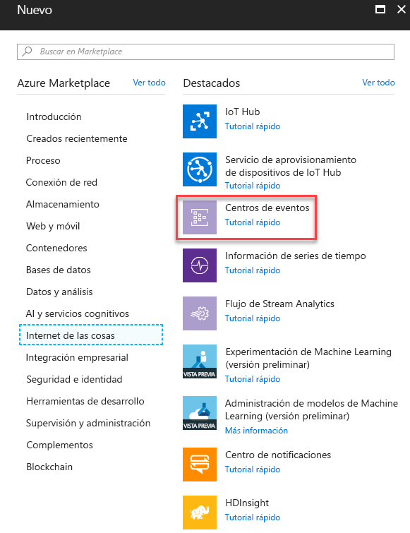

3. <span data-ttu-id="470b8-143">En **Crear espacio de nombres**, especifique un espacio de nombres.</span><span class="sxs-lookup"><span data-stu-id="470b8-143">In **Create namespace**, enter a namespace name.</span></span> <span data-ttu-id="470b8-144">Tras asegurarse de que el espacio de nombres está disponible, elija el plan de tarifa (Básico o Estándar).</span><span class="sxs-lookup"><span data-stu-id="470b8-144">After making sure the namespace name is available, choose the pricing tier (Basic or Standard).</span></span> <span data-ttu-id="470b8-145">De igual modo, elija una suscripción de Azure, un grupo de recursos y la ubicación donde quiera crear el recurso.</span><span class="sxs-lookup"><span data-stu-id="470b8-145">Also, choose an Azure subscription, resource group, and location in which to create the resource.</span></span> <span data-ttu-id="470b8-146">Seleccione **Crear** para crear el espacio de nombres.</span><span class="sxs-lookup"><span data-stu-id="470b8-146">Choose **Create** to create the namespace.</span></span> <span data-ttu-id="470b8-147">Puede que tenga que esperar unos minutos para que el sistema aprovisione completamente los recursos.</span><span class="sxs-lookup"><span data-stu-id="470b8-147">You might have to wait a few minutes for the system to fully provision the resources.</span></span>

    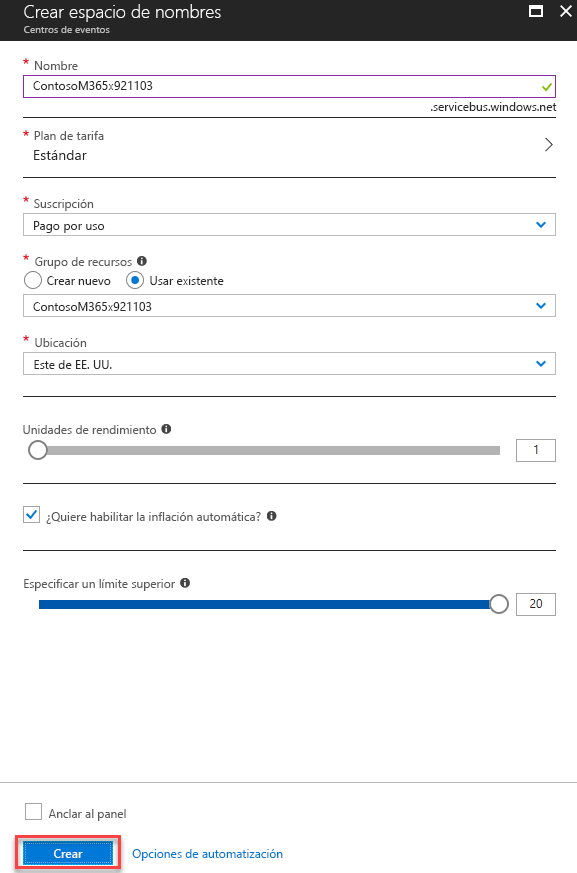

## <a name="step-2-configure-azure-monitor-to-send-security-alerts-from-your-tenant-to-the-event-hub"></a><span data-ttu-id="470b8-149">Paso 2: Configurar Azure Monitor para enviar alertas de seguridad desde el inquilino al centro del eventos</span><span class="sxs-lookup"><span data-stu-id="470b8-149">Step 2: Configure Azure Monitor to send security alerts from your tenant to the event hub</span></span>

<span data-ttu-id="470b8-150">La activación de la transmisión de alertas de seguridad de su organización a través de Azure Monitor se realiza una sola vez para todo el inquilino de Azure Active Directory (Azure AD).</span><span class="sxs-lookup"><span data-stu-id="470b8-150">Enabling the streaming of your organization’s security alerts through Azure Monitor is done one time for your entire Azure Active Directory (Azure AD) tenant.</span></span> <span data-ttu-id="470b8-151">Todos los productos habilitados y con licencia de la API de seguridad de Microsoft Graph comenzarán a enviar alertas de seguridad a Azure Monitor y transmitirán datos a las aplicaciones de consumo.</span><span class="sxs-lookup"><span data-stu-id="470b8-151">All Microsoft Graph Security API licensed and enabled products will begin sending security alerts to Azure Monitor, streaming data to consuming applications.</span></span> <span data-ttu-id="470b8-152">Cualquier producto adicional habilitado para la API de seguridad de Microsoft Graph del que se haya adquirido licencia y que la organización implemente transmitirá automáticamente las alertas de seguridad por medio de esta misma configuración de Azure Monitor.</span><span class="sxs-lookup"><span data-stu-id="470b8-152">Any additional Microsoft Graph Security API-enabled products licensed and deployed by your organization will automatically stream security alerts through this same Azure Monitor configuration.</span></span> <span data-ttu-id="470b8-153">No será necesario realizar ninguna tarea de integración extra en la organización.</span><span class="sxs-lookup"><span data-stu-id="470b8-153">No further integration work is needed from the organization.</span></span>

<span data-ttu-id="470b8-154">Las alertas de seguridad consisten en datos con privilegios elevados que suelen estar visibles únicamente para el personal de respuestas de seguridad y para los administradores globales de una organización.</span><span class="sxs-lookup"><span data-stu-id="470b8-154">Security alerts are highly privileged data typically viewable only by security response personnel and global administrators within an organization.</span></span> <span data-ttu-id="470b8-155">Por este motivo, los pasos necesarios para configurar la integración de alertas de seguridad de un inquilino con sistemas SIEM requiere una cuenta de administrador global de Azure AD.</span><span class="sxs-lookup"><span data-stu-id="470b8-155">For this reason, the steps required to configure the integration of a tenant’s security alerts with SIEM systems require an Azure AD Global Administrator account.</span></span> <span data-ttu-id="470b8-156">Esta cuenta solo se necesita una vez (durante la instalación) para solicitar que las alertas de seguridad de la organización se envíen a Azure Monitor.</span><span class="sxs-lookup"><span data-stu-id="470b8-156">This account is only needed one time, during setup, to request your organization’s security alerts be sent to Azure Monitor.</span></span>

> <span data-ttu-id="470b8-157">**Nota:** Por ahora, la hoja de configuración de diagnósticos de Azure Monitor no admite la configuración de recursos en el nivel de inquilino.</span><span class="sxs-lookup"><span data-stu-id="470b8-157">**Note:** Currently, the Azure Monitor Diagnostic settings blade does not support configuration of tenant-level resources.</span></span> <span data-ttu-id="470b8-158">Las alertas de la API de seguridad de Microsoft Graph son un recurso de nivel de inquilino, lo cual requiere el uso de la API de Azure Resource Manager para configurar Azure Monitor y así admitir el consumo de las alertas de seguridad de la organización.</span><span class="sxs-lookup"><span data-stu-id="470b8-158">Microsoft Graph Security API alerts are a tenant-level resource, which requires using the Azure Resource Manager API to configure Azure Monitor to support consumption of your organization’s security alerts.</span></span>

1. <span data-ttu-id="470b8-159">En su suscripción a Azure, registrar "microsoft.insights" (Azure Monitor) como un proveedor de recursos.</span><span class="sxs-lookup"><span data-stu-id="470b8-159">In your Azure subscription, register "microsoft.insights" (Azure Monitor) as a resource provider.</span></span>  
 > <span data-ttu-id="470b8-160">**Nota:** No registre "Microsoft.SecurityGraph" (API de seguridad de Microsoft Graph) como proveedor de recursos en su suscripción a Azure, ya que "Microsoft.SecurityGraph" es un recurso de nivel de inquilino, tal como se explicó anteriormente.</span><span class="sxs-lookup"><span data-stu-id="470b8-160">**Note:** Do not register "Microsoft.SecurityGraph" (Microsoft Graph Security API) as a resource provider in your Azure subscription, as “Microsoft.SecurityGraph” is a tenant-level resource as explained above.</span></span> <span data-ttu-id="470b8-161">La configuración de nivel de inquilino formará parte del paso 6, a continuación.</span><span class="sxs-lookup"><span data-stu-id="470b8-161">Tenant level configuration will be part of #6 below.</span></span>

2. <span data-ttu-id="470b8-162">Para configurar Azure Monitor con la API de Azure Resource Manager, obtenga la herramienta [ARMClient](https://github.com/projectkudu/ARMClient).</span><span class="sxs-lookup"><span data-stu-id="470b8-162">To configure Azure Monitor using the Azure Resource Manager API, obtain the [ARMClient](https://github.com/projectkudu/ARMClient) tool.</span></span> <span data-ttu-id="470b8-163">Esta herramienta se usará para enviar llamadas de API de REST a Azure Portal desde una línea de comandos.</span><span class="sxs-lookup"><span data-stu-id="470b8-163">This tool will be used to send REST API calls to the Azure portal from a command line.</span></span>

3. <span data-ttu-id="470b8-164">Prepare un archivo JSON de solicitud de configuración de diagnóstico del siguiente modo:</span><span class="sxs-lookup"><span data-stu-id="470b8-164">Prepare a diagnostic setting request JSON file like the following:</span></span>

<!-- {
  "blockType": "ignored"
} -->

    ``` json
    {
      "location": "",
      "properties": {
        "name": "securityApiAlerts",
        "serviceBusRuleId": "/subscriptions/SUBSCRIPTION_ID/resourceGroups/RESOURCE_GROUP/providers/Microsoft.EventHub/namespaces/EVENT_HUB_NAMESPACE/authorizationrules/RootManageSharedAccessKey",
        "logs": [
          {
            "category": "Alert",
            "enabled": true,
            "retentionPolicy": {
              "enabled": true,
              "days": 7
            }
          }
        ]
      }
    }
    ```

  <span data-ttu-id="470b8-165">Reemplace los valores en el archivo JSON, así:</span><span class="sxs-lookup"><span data-stu-id="470b8-165">Replace the values in the JSON file as follows:</span></span>

  * <span data-ttu-id="470b8-166">**SUBSCRIPTION_ID** es el identificador de suscripción de la suscripción de Azure que hospeda el grupo de recursos y el espacio de nombres del centro de eventos donde se van a enviar alertas de seguridad de la organización.</span><span class="sxs-lookup"><span data-stu-id="470b8-166">**SUBSCRIPTION_ID** is the Subscription ID of the Azure subscription hosting the resource group and event hub namespace where you will be sending security alerts from your organization.</span></span>
  * <span data-ttu-id="470b8-167">**RESOURCE_GROUP** es el grupo de recursos que contiene el espacio de nombres del centro de eventos donde se van a enviar alertas de seguridad de la organización.</span><span class="sxs-lookup"><span data-stu-id="470b8-167">**RESOURCE_GROUP** is the resource group containing the event hub namespace where you will be sending security alerts from your organization.</span></span>
  * <span data-ttu-id="470b8-168">**EVENT_HUB_NAMESPACE** es el espacio de nombres del centro de eventos donde se van a enviar alertas de seguridad de la organización.</span><span class="sxs-lookup"><span data-stu-id="470b8-168">**EVENT_HUB_NAMESPACE** is the event hub namespace where you will be sending security alerts from your organization.</span></span>
  * <span data-ttu-id="470b8-169">**“days”:** es el número de días que quiere conservar los mensajes en el centro de eventos.</span><span class="sxs-lookup"><span data-stu-id="470b8-169">**“days”:** is the number of days you want to retain messages in your event hub.</span></span>
  
&nbsp;
4. <span data-ttu-id="470b8-170">Guarde el archivo como JSON en el directorio donde vaya a invocar ARMClient.exe.</span><span class="sxs-lookup"><span data-stu-id="470b8-170">Save the file as JSON to the directory where you will invoke ARMClient.exe.</span></span> <span data-ttu-id="470b8-171">Por ejemplo, denomine el archivo **AzMonConfig.json**.</span><span class="sxs-lookup"><span data-stu-id="470b8-171">For example, name the file **AzMonConfig.json.**</span></span>

5. <span data-ttu-id="470b8-172">Ejecute el siguiente comando para iniciar sesión en la herramienta ARMClient.</span><span class="sxs-lookup"><span data-stu-id="470b8-172">Run the following command to sigh in to the ARMClient tool.</span></span> <span data-ttu-id="470b8-173">Necesitará usar credenciales de una cuenta de administrador global.</span><span class="sxs-lookup"><span data-stu-id="470b8-173">You will need to be using Global Administrator account credentials.</span></span>

    ``` shell
    ARMClient.exe login
    ```

6. <span data-ttu-id="470b8-174">Ejecute el siguiente comando para configurar Azure Monitor de modo que envíe alertas de seguridad al espacio de nombres del centro de eventos.</span><span class="sxs-lookup"><span data-stu-id="470b8-174">Run the following command to configure Azure Monitor to send security alerts to your event hub namespace.</span></span> <span data-ttu-id="470b8-175">Esto aprovisionará automáticamente un centro de eventos en el espacio de nombres e iniciará el flujo de alertas de seguridad hacia el centro de eventos.</span><span class="sxs-lookup"><span data-stu-id="470b8-175">This will automatically provision an event hub within the namespace and start the flow of security alerts into the event hub.</span></span> <span data-ttu-id="470b8-176">Asegúrese de que el nombre de la configuración (en este ejemplo, **securityApiAlerts**) coincide con el nombre de configuración especificado en el archivo JSON dentro del campo **name**.</span><span class="sxs-lookup"><span data-stu-id="470b8-176">Ensure that the setting name (in this example, **securityApiAlerts**) matches the setting name you specified in the JSON file for the **name** field.</span></span>

    ``` shell
    ARMClient.exe put https://management.azure.com/providers/Microsoft.SecurityGraph/diagnosticSettings/securityApiAlerts?api-version=2017-04-01-preview  @".\AzMonConfig.json"
    ```

7. <span data-ttu-id="470b8-177">Para confirmar que la configuración se ha aplicado correctamente, ejecute este comando y compruebe que la salida coincide con la configuración del archivo JSON.</span><span class="sxs-lookup"><span data-stu-id="470b8-177">To verify the settings were applied correctly, run this command and verify that the output matches your JSON file settings.</span></span>

    ``` shell
    ARMClient.exe get https://management.azure.com/providers/Microsoft.SecurityGraph/diagnosticSettings/securityApiAlerts?api-version=2017-04-01-preview
    ```

8. <span data-ttu-id="470b8-178">Cierre la herramienta ARMClient.</span><span class="sxs-lookup"><span data-stu-id="470b8-178">Exit the ARMClient tool.</span></span> <span data-ttu-id="470b8-179">Ya ha acabado de configurar Azure Monitor para enviar alertas de seguridad desde el inquilino al centro del eventos.</span><span class="sxs-lookup"><span data-stu-id="470b8-179">You have now completed the configuration of Azure Monitor to send security alerts from your tenant to event hub.</span></span>

## <a name="step-3-download-and-install-the-azure-monitor-add-on-for-splunk-which-will-allow-splunk-to-consume-security-alerts"></a><span data-ttu-id="470b8-180">Paso 3: Descargar e instalar el complemento de Azure Monitor para Splunk, que permitirá a Splunk consumir alertas de seguridad</span><span class="sxs-lookup"><span data-stu-id="470b8-180">Step 3: Download and install the Azure Monitor Add-on for Splunk which will allow Splunk to consume security alerts</span></span>

1. <span data-ttu-id="470b8-181">Esta integración solo admite implementaciones [Splunk Enterprise](https://splunkbase.splunk.com/).</span><span class="sxs-lookup"><span data-stu-id="470b8-181">This integration only supports [Splunk Enterprise](https://splunkbase.splunk.com/) deployments.</span></span>
2. <span data-ttu-id="470b8-182">Descargue e instale el [complemento de Azure Monitor para Splunk](https://github.com/Microsoft/AzureMonitorAddonForSplunk).</span><span class="sxs-lookup"><span data-stu-id="470b8-182">Download and install the [Azure Monitor Add-on for Splunk](https://github.com/Microsoft/AzureMonitorAddonForSplunk).</span></span> <span data-ttu-id="470b8-183">Para ver instrucciones detalladas de instalación, consulte el tema [Instalación](https://github.com/Microsoft/AzureMonitorAddonForSplunk/wiki/Installation).</span><span class="sxs-lookup"><span data-stu-id="470b8-183">For detailed installation instructions, see [Installation](https://github.com/Microsoft/AzureMonitorAddonForSplunk/wiki/Installation).</span></span> <span data-ttu-id="470b8-184">**Solo se admite la versión 1.2.9 o superior del complemento de Azure Monitor para Splunk.**</span><span class="sxs-lookup"><span data-stu-id="470b8-184">**Only Azure Monitor Add-on for Splunk version 1.2.9 or higher is supported.**</span></span>
3. <span data-ttu-id="470b8-185">Después de instalar correctamente el complemento, siga los pasos de configuración que se describen en la página [wiki de configuración del complemento de Azure Monitor](https://github.com/Microsoft/AzureMonitorAddonForSplunk/wiki/Configuration-of-Splunk ) para configurar Splunk.</span><span class="sxs-lookup"><span data-stu-id="470b8-185">After successfully installing the Add-on, follow the configuration steps described in the [Azure Monitor add-on configuration wiki](https://github.com/Microsoft/AzureMonitorAddonForSplunk/wiki/Configuration-of-Splunk ) to configure Splunk.</span></span>
4. <span data-ttu-id="470b8-186">Como se indica en las instrucciones de instalación del complemento, el complemento funcionará realizando un ciclo de activación/desactivación en la página de administración de aplicaciones del sitio web de Splunk.</span><span class="sxs-lookup"><span data-stu-id="470b8-186">As indicated in the Add-on installation instructions, the add-on will work by doing a disable/enable cycle on the Manage Apps page in Splunk Web.</span></span> <span data-ttu-id="470b8-187">También puede reiniciar Splunk.</span><span class="sxs-lookup"><span data-stu-id="470b8-187">Or, you can restart Splunk.</span></span>

## <a name="step-4-register-an-application-with-your-tenant-azure-active-directory-which-splunk-will-use-to-read-from-the-event-hub"></a><span data-ttu-id="470b8-188">Paso 4: Registrar una aplicación con Azure Active Directory del inquilino, que Splunk usará para leer desde el centro de eventos</span><span class="sxs-lookup"><span data-stu-id="470b8-188">Step 4: Register an application with your tenant Azure Active Directory which Splunk will use to read from the event hub</span></span>

<span data-ttu-id="470b8-189">Splunk necesita un registro de la aplicación en Azure Active Directory de su organización para obtener los permisos necesarios y las credenciales de la aplicación necesarias para autenticar el centro de eventos de Azure Monitor.</span><span class="sxs-lookup"><span data-stu-id="470b8-189">Splunk needs an application registration in your organization’s Azure Active Directory to be granted the required permissions and app credentials required to authenticate to the Azure Monitor event hub.</span></span>

1. <span data-ttu-id="470b8-190">En Azure Portal, vaya a **Registros de aplicaciones** y seleccione **Nuevo registro de aplicaciones**.</span><span class="sxs-lookup"><span data-stu-id="470b8-190">In the Azure portal, go to **App Registrations** and select **New application registration**.</span></span>

    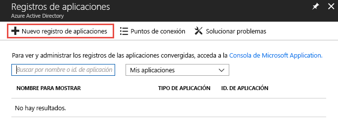

2. <span data-ttu-id="470b8-192">Seleccione un nombre de la aplicación, seleccione **Web app / API** (Aplicación web / API) como tipo y **`https://localhost`** como dirección URL de inicio de sesión.</span><span class="sxs-lookup"><span data-stu-id="470b8-192">Select a name for your application, choose **Web app / API** for the type, and **`https://localhost`** for the sign-on URL.</span></span> <span data-ttu-id="470b8-193">Luego, seleccione **Crear**.</span><span class="sxs-lookup"><span data-stu-id="470b8-193">Then select **Create**.</span></span>

    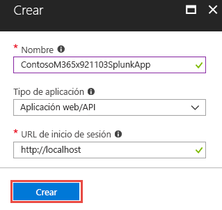

3. <span data-ttu-id="470b8-195">Tras crear la aplicación, copie el **Id. de aplicación** y guárdelo para poder usarlo posteriormente para configurar las entradas de datos de Splunk.</span><span class="sxs-lookup"><span data-stu-id="470b8-195">After the application is created, copy the **Application ID** and save for later use configuring the Splunk data inputs.</span></span> <span data-ttu-id="470b8-196">Tras hacerlo, vaya a la configuración de la aplicación y elija **Claves**.</span><span class="sxs-lookup"><span data-stu-id="470b8-196">Then go to the application settings and choose **Keys**.</span></span>

    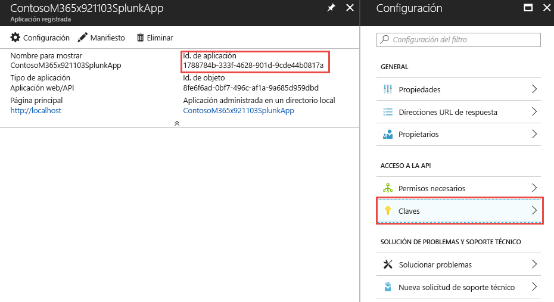

    <span data-ttu-id="470b8-198">Esto le permitirá generar una nueva clave, lo que se conoce como secreto de la aplicación.</span><span class="sxs-lookup"><span data-stu-id="470b8-198">This will allow you to generate a new key, known as an Application Secret.</span></span> <span data-ttu-id="470b8-199">Después de generarla, copie el **Secreto de la aplicación** y guárdelo para poder usarlo posteriormente para configurar las entradas de datos de Splunk.</span><span class="sxs-lookup"><span data-stu-id="470b8-199">After it's generated, copy the **Application Secret** and save for later use configuring the Splunk data inputs.</span></span>

4. <span data-ttu-id="470b8-200">Conceda a la aplicación el rol **Lector** en la suscripción de Azure que contiene el centro de eventos con las alertas de seguridad de la organización.</span><span class="sxs-lookup"><span data-stu-id="470b8-200">Grant the application the role of **Reader** in the Azure subscription containing the event hub with your organization’s security alerts.</span></span>

    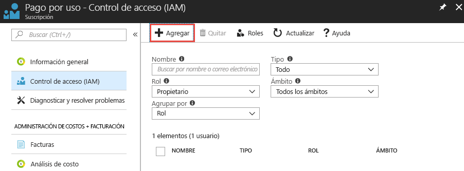

    <span data-ttu-id="470b8-202">Seleccione la suscripción y elija **Control de acceso (IAM)**.</span><span class="sxs-lookup"><span data-stu-id="470b8-202">Select your subscription, choose **Access control (IAM)**.</span></span> <span data-ttu-id="470b8-203">Seleccione **Agregar** para agregar permisos.</span><span class="sxs-lookup"><span data-stu-id="470b8-203">Select **Add** to add permissions.</span></span> <span data-ttu-id="470b8-204">Seleccione la aplicación y elija el **Rol** de **Lector** para la aplicación.</span><span class="sxs-lookup"><span data-stu-id="470b8-204">Select your application and choose the **Role** of **Reader** for your application.</span></span>

    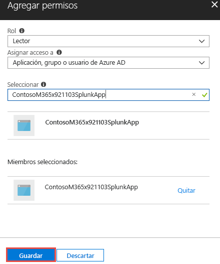

    <span data-ttu-id="470b8-206">Seleccione **Guardar** para agregar a la suscripción los permisos concedidos a la aplicación.</span><span class="sxs-lookup"><span data-stu-id="470b8-206">Select **Save** to add the permissions granted to your application to the subscription.</span></span>

## <a name="step-5-create-an-azure-key-vault-to-store-the-access-key-for-the-event-hub"></a><span data-ttu-id="470b8-207">Paso 5: Crear un almacén de claves de Azure en el que almacenar la clave de acceso del centro de eventos</span><span class="sxs-lookup"><span data-stu-id="470b8-207">Step 5: Create an Azure Key vault to store the access key for the event hub</span></span>

<span data-ttu-id="470b8-208">Los almacenes de claves de Azure sirven para almacenar secretos como identidades, contraseñas y certificados para que las aplicaciones puedan usarlos en tiempo de ejecución.</span><span class="sxs-lookup"><span data-stu-id="470b8-208">Azure key vaults are used to store secrets such as identities, passwords, and certificates for use at runtime by applications.</span></span> <span data-ttu-id="470b8-209">En este paso, creará un almacén de claves de Azure donde se almacenarán los secretos necesarios para que Splunk se conecte a los centros de eventos de Azure que contienen las alertas de seguridad de la organización para leerlos.</span><span class="sxs-lookup"><span data-stu-id="470b8-209">In this step you will create an Azure key vault to store the secrets needed for Splunk to connect and read from the Azure event hubs containing your organization’s security alerts.</span></span>

1. <span data-ttu-id="470b8-210">En Azure Portal, vaya a **Almacenes de claves** y, después, seleccione **Agregar**.</span><span class="sxs-lookup"><span data-stu-id="470b8-210">In the Azure portal, go to **Key vaults** and select **Add**.</span></span>

    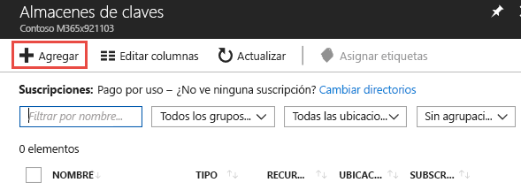

2. <span data-ttu-id="470b8-212">Cuando cree un almacén de claves, seleccione **Directivas de acceso** para agregar una nueva directiva de acceso para la aplicación que registró en el paso 4.</span><span class="sxs-lookup"><span data-stu-id="470b8-212">When creating the new key vault, select **Access policies** to add a new access policy for the application you just registered in Step 4.</span></span> <span data-ttu-id="470b8-213">Conceda a la aplicación permisos para **Obtener** secretos.</span><span class="sxs-lookup"><span data-stu-id="470b8-213">Grant the **Get** secret permissions to your application.</span></span> <span data-ttu-id="470b8-214">De este modo, Splunk, que actúa como la aplicación registrada, podrá obtener acceso a las claves (secretos) almacenadas en este almacén de claves de Azure.</span><span class="sxs-lookup"><span data-stu-id="470b8-214">This will allow Splunk, acting as the registered application, to access the keys (secrets) stored in this Azure key vault.</span></span>

    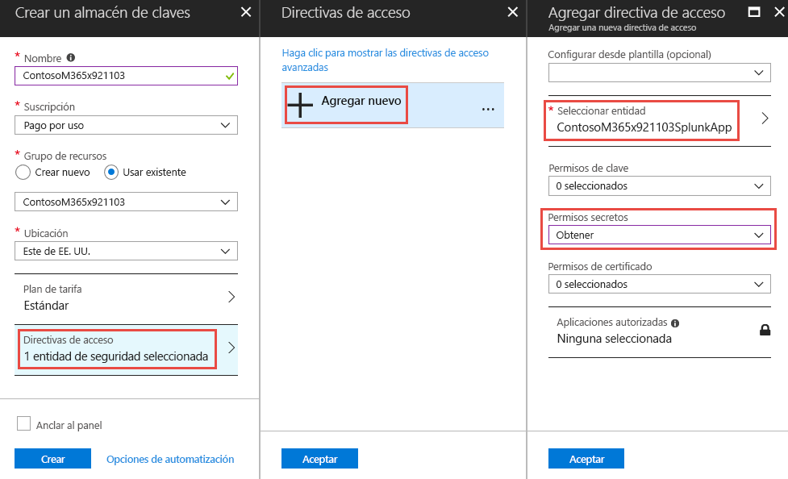

    <span data-ttu-id="470b8-216">Seleccione **Crear** para terminar de crear el nuevo almacén de claves de Azure.</span><span class="sxs-lookup"><span data-stu-id="470b8-216">Select **Create** to complete the creation of your new Azure key vault.</span></span>

3. <span data-ttu-id="470b8-217">Genere un nuevo secreto en el almacén de claves para almacenar la clave de acceso al espacio de nombres del centro de eventos.</span><span class="sxs-lookup"><span data-stu-id="470b8-217">Generate a new secret in your key vault to store the access key to your event hub namespace.</span></span> <span data-ttu-id="470b8-218">En primer lugar, hágase con la clave de acceso del espacio de nombres de Event Hubs; para ello, abra el espacio de nombres de Event Hubs y seleccione **Directivas de acceso compartido**.</span><span class="sxs-lookup"><span data-stu-id="470b8-218">First, grab the access key to your event hub namespace by opening your event hub namespace and selecting **Shared access policies**.</span></span> <span data-ttu-id="470b8-219">Seleccione la directiva **RootManageSharedAccessKey** en la lista y copie la **Clave principal** de la lista.</span><span class="sxs-lookup"><span data-stu-id="470b8-219">Select the **RootManageSharedAccessKey** policy from the list and copy the **Primary Key** from the list.</span></span>

    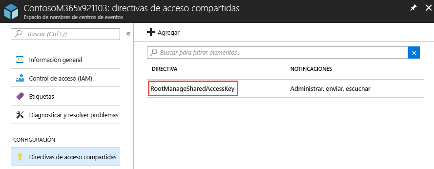

4. <span data-ttu-id="470b8-221">Abra el almacén de claves y seleccione **Secretos**.</span><span class="sxs-lookup"><span data-stu-id="470b8-221">Open your key vault and select **Secrets**.</span></span> <span data-ttu-id="470b8-222">Elija **Generar/Importar** para agregar un nuevo secreto al almacén de claves.</span><span class="sxs-lookup"><span data-stu-id="470b8-222">Choose **Generate/Import** to add a new secret to the key vault.</span></span> <span data-ttu-id="470b8-223">Pegue la **Clave principal** del espacio de nombres del centro de eventos **RootManageSharedAccessKey**.</span><span class="sxs-lookup"><span data-stu-id="470b8-223">Paste in the **Primary key** from the event hub namespace **RootManageSharedAccessKey**.</span></span>

    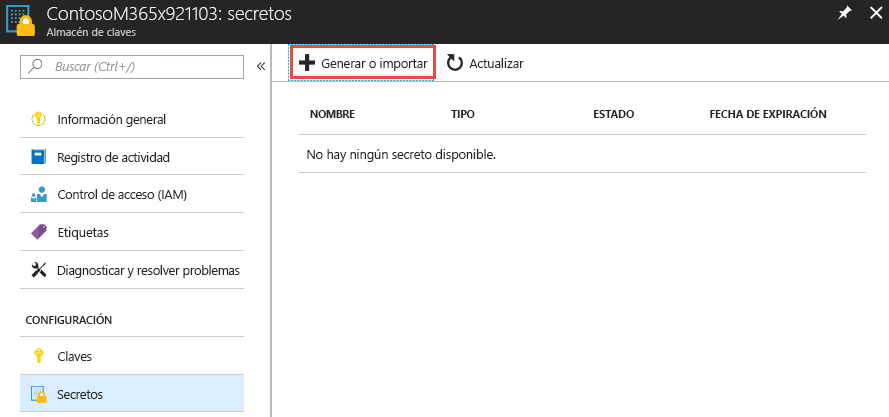

5. <span data-ttu-id="470b8-225">Tras crear el secreto, selecciónelo y copie su **Versión del secreto**.</span><span class="sxs-lookup"><span data-stu-id="470b8-225">After it's created, select the secret and copy the **Secret Version** of the secret.</span></span> <span data-ttu-id="470b8-226">Lo usaremos más adelante en el paso 6 para configurar las entradas de datos de Splunk.</span><span class="sxs-lookup"><span data-stu-id="470b8-226">This will be used later in Step 6 to configure Splunk data inputs.</span></span>

    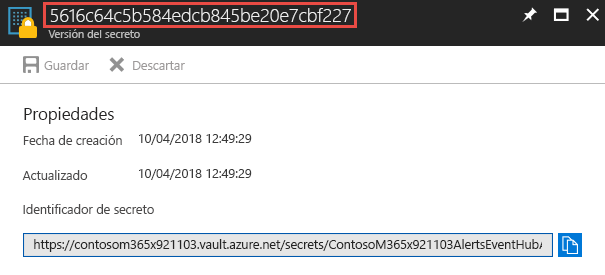

## <a name="step-6-configure-the-splunk-data-inputs-to-consume-security-alerts-stored-in-the-event-hub"></a><span data-ttu-id="470b8-228">Paso 6: Configurar las entradas de datos de Splunk para que consuman alertas de seguridad almacenadas en el centro de eventos</span><span class="sxs-lookup"><span data-stu-id="470b8-228">Step 6: Configure the Splunk data inputs to consume security alerts stored in the event hub</span></span>

<span data-ttu-id="470b8-229">El último paso para completar el proceso de configuración es configurar las entradas de datos de Splunk para que usen el centro de eventos, la aplicación y los secretos que creó en los pasos anteriores.</span><span class="sxs-lookup"><span data-stu-id="470b8-229">The last step to complete the setup process is to configure Splunk data inputs to utilize the event hub, application, and secrets you created in previous steps.</span></span>

1. <span data-ttu-id="470b8-230">Siga las instrucciones descritas en el tema de [configuración de Splunk](https://github.com/Microsoft/AzureMonitorAddonForSplunk/wiki/Configuration-of-Splunk) para abrir y configurar las entradas de datos de Splunk para el complemento de Azure Monitor.</span><span class="sxs-lookup"><span data-stu-id="470b8-230">Follow the instructions in the [Configuration of Splunk](https://github.com/Microsoft/AzureMonitorAddonForSplunk/wiki/Configuration-of-Splunk) topic to open and configure Splunk data inputs for the Azure Monitor Add-on.</span></span> <span data-ttu-id="470b8-231">Vaya a **Configuración** y, luego, a **Data Inputs** (Entradas de datos).</span><span class="sxs-lookup"><span data-stu-id="470b8-231">Go to **Settings** and **Data Inputs**.</span></span> <span data-ttu-id="470b8-232">Elija **Azure Monitor Diagnostic Logs** (Registros de diagnóstico de Azure Monitor).</span><span class="sxs-lookup"><span data-stu-id="470b8-232">Choose **Azure Monitor Diagnostic Logs**.</span></span>
2. <span data-ttu-id="470b8-233">Seleccione **Nuevo** y rellene todos los campos obligatorios con los valores obtenidos en los pasos anteriores.</span><span class="sxs-lookup"><span data-stu-id="470b8-233">Select **New** and input all the required fields using the values obtained in the previous steps.</span></span> <span data-ttu-id="470b8-234">En la siguiente imagen se muestran todos los campos obligatorios con los valores de los ejemplos anteriores de este artículo.</span><span class="sxs-lookup"><span data-stu-id="470b8-234">The following image shows all the required fields using the values from the previous examples in this article.</span></span>

    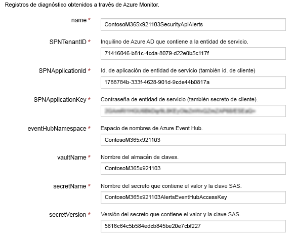

3. <span data-ttu-id="470b8-236">Seleccione **Siguiente** y empiece a buscar alertas de seguridad de la organización ingeridas desde Azure Monitor.</span><span class="sxs-lookup"><span data-stu-id="470b8-236">Select **Next** and begin searching your organization’s security alerts ingested from Azure Monitor.</span></span>

## <a name="optional-use-splunk-search-to-explore-data"></a><span data-ttu-id="470b8-237">(Opcional) Usar Splunk Search para explorar datos</span><span class="sxs-lookup"><span data-stu-id="470b8-237">(Optional) Use Splunk Search to explore data</span></span>

<span data-ttu-id="470b8-238">Después de configurar el complemento Splunk de Azure Monitor, se iniciará la instancia de Splunk y recuperará los eventos desde el centro de eventos configurado.</span><span class="sxs-lookup"><span data-stu-id="470b8-238">After you have set up the Azure Monitor Splunk plugin, your Splunk instance will start retrieving events from the configured event hub.</span></span> <span data-ttu-id="470b8-239">De manera predeterminada, Splunk indexará cada propiedad del esquema de alertas de la API de seguridad de Microsoft Graph para permitir la búsqueda.</span><span class="sxs-lookup"><span data-stu-id="470b8-239">By default, Splunk will index each property of the Microsoft Graph Security API alert schema to allow searching.</span></span>

<span data-ttu-id="470b8-240">Si desea buscar alertas de la API de seguridad de Microsoft Graph, crear paneles o establecer alertas de Splunk con la consulta de búsqueda, desplácese hasta aplicaciones -> aplicación de búsqueda e informes en Splunk.</span><span class="sxs-lookup"><span data-stu-id="470b8-240">To search for Microsoft Graph Security API alerts, to create dashboards, or to set Splunk alerts with your search query, navigate to apps -> Search & Reporting app in Splunk.</span></span>

<span data-ttu-id="470b8-241">**Ejemplos**:</span><span class="sxs-lookup"><span data-stu-id="470b8-241">**Examples**:</span></span><br/>
<span data-ttu-id="470b8-242">Busque las alertas de seguridad de Microsoft Graph:</span><span class="sxs-lookup"><span data-stu-id="470b8-242">Try searching Graph Security alerts:</span></span>

- <span data-ttu-id="470b8-243">Escriba `sourcetype="amdl:securitygraph:alert"` en la barra de búsqueda para obtener todas las alertas expuestas a través de la API de seguridad de Microsoft Graph.</span><span class="sxs-lookup"><span data-stu-id="470b8-243">Type `sourcetype="amdl:securitygraph:alert"` in the search bar to get all alerts surfaced through the Microsoft Graph Security API.</span></span> <span data-ttu-id="470b8-244">En el panel derecho, verá las propiedades de primer nivel del registro de Azure Monitor donde se puede encontrar la alerta de seguridad de Microsoft Graph bajo el campo propiedades.</span><span class="sxs-lookup"><span data-stu-id="470b8-244">On the right-hand side, you will see the top-level properties of Azure Monitor log where Graph Security alert is under properties field.</span></span><br/>
- <span data-ttu-id="470b8-245">En el panel izquierdo, verá los campos seleccionados y campos interesantes.</span><span class="sxs-lookup"><span data-stu-id="470b8-245">On the left pane, you will see selected fields and interesting fields.</span></span> <span data-ttu-id="470b8-246">Puede usar los campos seleccionados para crear paneles o alertas de Splunk, también puede agregar o quitar campos seleccionados haciendo clic con el botón derecho sobre los campos.</span><span class="sxs-lookup"><span data-stu-id="470b8-246">You can use selected fields to create dashboards or Splunk alerts, you can also add or remove selected fields by right-clicking on the fields.</span></span>  
> <span data-ttu-id="470b8-247">**Nota:** tal como se muestra en la siguiente consulta de búsqueda, puede restringir la búsqueda según sea necesario.</span><span class="sxs-lookup"><span data-stu-id="470b8-247">**Note:** As shown in the following search query, you can restrict your search as needed.</span></span> <span data-ttu-id="470b8-248">En el ejemplo, se filtran las alertas de seguridad de Microsoft Graph por alertas graves del Azure Security Center.</span><span class="sxs-lookup"><span data-stu-id="470b8-248">In the example, we filter the Graph Security Alerts by high severity alerts from Azure Security Center.</span></span> <span data-ttu-id="470b8-249">También usamos `eventDatetime`, `severity`, `status` y `provider` como campos seleccionados para mostrar.</span><span class="sxs-lookup"><span data-stu-id="470b8-249">We also used `eventDatetime`, `severity`, `status`, and `provider` as selected fields to be displayed.</span></span> <span data-ttu-id="470b8-250">Para obtener más términos de búsqueda avanzada, consulte [los tutoriales de búsqueda de Splunk](https://docs.splunk.com/Documentation/Splunk/7.1.2/SearchTutorial/WelcometotheSearchTutorial).</span><span class="sxs-lookup"><span data-stu-id="470b8-250">For more advance search terms, see [Splunk search tutorials](https://docs.splunk.com/Documentation/Splunk/7.1.2/SearchTutorial/WelcometotheSearchTutorial).</span></span>

 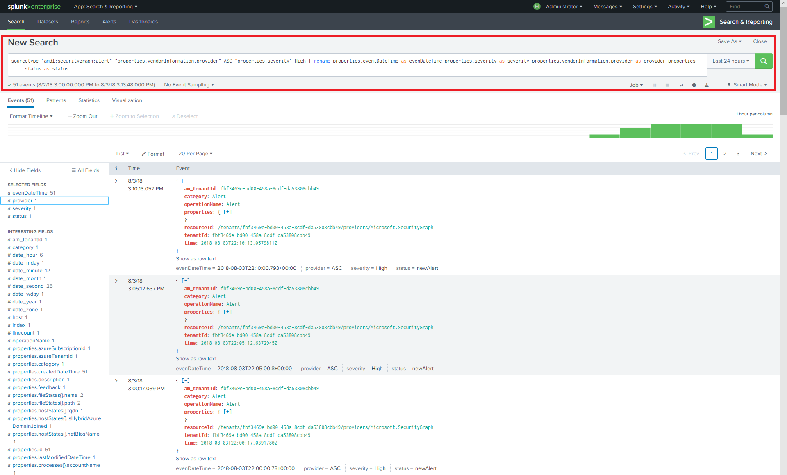
> <span data-ttu-id="470b8-252">Consulta de búsqueda: `sourcetype="amdl:securitygraph:alert" "properties.vendorInformation.provider"=ASC "properties.severity"=High | rename properties.eventDataTime as eventDateTime properties.severity as severity properties.vendorInformation.provider as provider properties.status as status`</span><span class="sxs-lookup"><span data-stu-id="470b8-252">Search query: `sourcetype="amdl:securitygraph:alert" "properties.vendorInformation.provider"=ASC "properties.severity"=High | rename properties.eventDataTime as eventDateTime properties.severity as severity properties.vendorInformation.provider as provider properties.status as status`</span></span>

<span data-ttu-id="470b8-253">Splunk también permite realizar varias acciones sobre los resultados de la búsqueda mediante la opción de menú "Guardar como" en la esquina superior derecha de la pantalla.</span><span class="sxs-lookup"><span data-stu-id="470b8-253">Splunk also allows multiple actions on search results using the "Save As" menu option in top right of the screen.</span></span> <span data-ttu-id="470b8-254">Puede crear informes, paneles o alertas según el filtro de búsqueda.</span><span class="sxs-lookup"><span data-stu-id="470b8-254">You can create Reports, Dashboard Panels, or Alerts based on your search filter.</span></span>
<span data-ttu-id="470b8-255">A continuación se muestra un ejemplo de un panel con un flujo de eventos basado en la consulta anterior: puede agregar un vínculo de obtención de detalles para cada evento para obtener acceso a los detalles en el sitio de Microsoft Graph.</span><span class="sxs-lookup"><span data-stu-id="470b8-255">Below is an example of a dashboard with an event stream based on the previous query: You can add a drilldown link to each event to further access the details on Microsoft Graph site.</span></span> <span data-ttu-id="470b8-256">Consulte la [documentación de obtención de detalles de Splunk](https://docs.splunk.com/Documentation/Splunk/7.1.2/Viz/DrilldownIntro).</span><span class="sxs-lookup"><span data-stu-id="470b8-256">See [Splunk drilldown documentation](https://docs.splunk.com/Documentation/Splunk/7.1.2/Viz/DrilldownIntro).</span></span>

 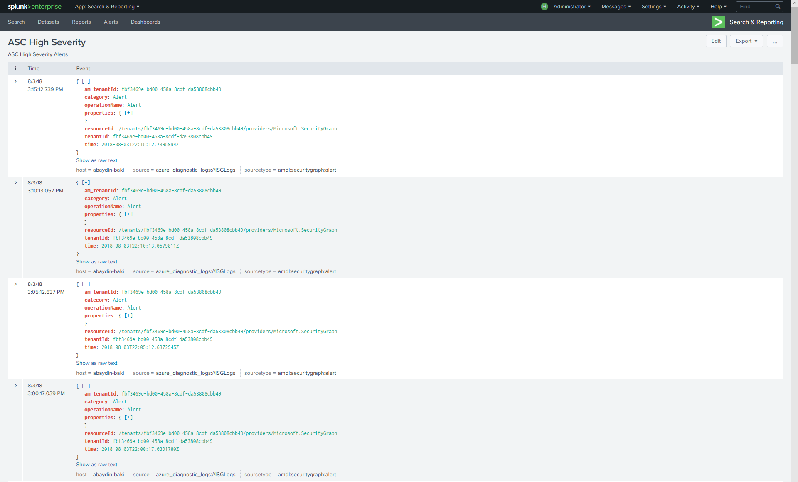

<span data-ttu-id="470b8-258">También puede crear un panel, como un gráfico de escala de tiempo:</span><span class="sxs-lookup"><span data-stu-id="470b8-258">Or you can create a dashboard as a timeline chart:</span></span>

 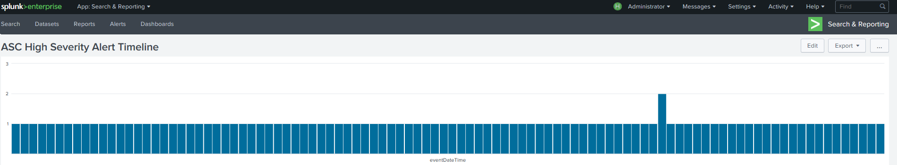

<span data-ttu-id="470b8-260">Puede seguir el [tutorial de búsqueda e informes de Splunk](https://docs.splunk.com/Documentation/Splunk/7.1.2/SearchTutorial/WelcometotheSearchTutorial) para obtener más información.</span><span class="sxs-lookup"><span data-stu-id="470b8-260">You can follow [Splunk Search & Report tutorial](https://docs.splunk.com/Documentation/Splunk/7.1.2/SearchTutorial/WelcometotheSearchTutorial) for more details.</span></span>

