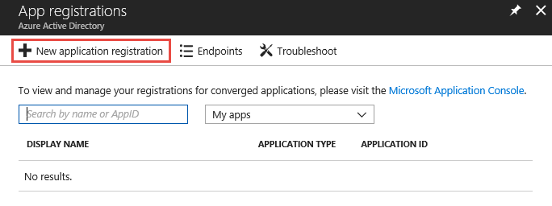
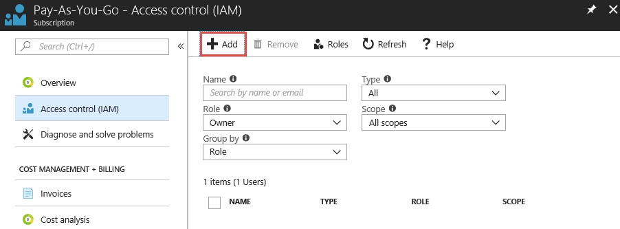
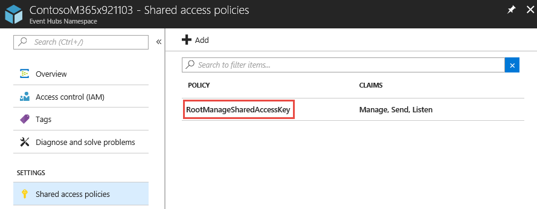

# <a name="integrate-microsoft-graph-security-api-alerts-with-your-siem-using-azure-monitor"></a>Integrar alertas de la API de seguridad de Microsoft Graph con su SIEM por medio de Azure Monitor

Los proveedores de seguridad de Microsoft Graph se pueden administrar a través de un único extremo REST. Este extremo se puede configurar en [Azure Monitor](https://docs.microsoft.com/es-ES/azure/monitoring-and-diagnostics/), el cual es compatible con conectores para varios productos SIEM. Las instrucciones de los pasos 1 y 2 de este artículo son para todos los conectores de Azure Monitor que admiten el consumo a través de centros de eventos. En este artículo se describe la integración completa del conector SIEM de [Splunk](https://splunkbase.splunk.com/).

El proceso de integración conlleva los siguientes pasos:

1. [Configurar un centro de eventos de Azure para recibir alertas de seguridad del inquilino](#step-1-set-up-an-event-hubs-namespace-in-azure-to-receive-security-alerts-for-your-tenant)
2. [Configurar Azure Monitor para enviar alertas de seguridad desde el inquilino al centro de eventos](#step-2-configure-azure-monitor-to-send-security-alerts-from-your-tenant-to-the-event-hub)
3. [Descargar e instalar el complemento de Azure Monitor para Splunk, que permitirá a Splunk consumir alertas de seguridad](#step-3-download-and-install-the-azure-monitor-add-on-for-splunk-which-will-allow-splunk-to-consume-security-alerts)
4. [Registrar una aplicación con Azure Active Directory del inquilino, que Splunk usará para leer desde el centro de eventos](#step-4-register-an-application-with-your-tenant-azure-active-directory-which-splunk-will-use-to-read-from-the-event-hub )
5. [Crear un almacén de claves de Azure en el que almacenar la clave de acceso del centro de eventos](#step-5-create-an-azure-key-vault-to-store-the-access-key-for-the-event-hub)
6. [Configurar las entradas de datos de Splunk para que consuman alertas de seguridad almacenadas en el centro de eventos](#step-6-configure-the-splunk-data-inputs-to-consume-security-alerts-stored-in-the-event-hub)

Después de completar estos pasos, su Splunk Enterprise consumirá alertas de seguridad de todos los productos de seguridad integrados de Microsoft Graph para los que su inquilino posea una licencia. Los nuevos productos de seguridad para los que adquiera una licencia también enviarán alertas a través de esta conexión, en el mismo esquema y sin necesidad de realizar más tareas de integración.

## <a name="step-1-set-up-an-event-hubs-namespace-in-azure-to-receive-security-alerts-for-your-tenant"></a>Paso 1: Configurar un espacio de nombres de Event Hubs en Azure para recibir alertas de seguridad del inquilino

Para empezar, hay que crear un espacio de nombres de [Microsoft Azure Event Hubs](https://docs.microsoft.com/es-ES/azure/event-hubs/) y un centro de eventos. Tanto el espacio de nombres como el centro de eventos serán el destino de todas las alertas de seguridad de la organización. Un espacio de nombres de Event Hubs es una agrupación lógica de centros de eventos que comparten la misma directiva de acceso. Conviene mencionar algunos detalles sobre el espacio de nombres de Event Hubs y los centros de eventos que cree:

- Se recomienda usar un espacio de nombres de Event Hubs estándar, sobre todo si va a enviar otros datos de supervisión de Azure a través de estos mismos centros de eventos.
- Normalmente, solo se necesita una unidad de procesamiento. Si necesita escalar a medida que el uso crece, siempre puede aumentar manualmente el número de unidades de procesamiento del espacio de nombres más adelante o habilitar el crecimiento automático.
- El número de unidades de procesamiento permite aumentar la escala de procesamiento de los centros de eventos. El número de particiones permite unificar el consumo entre un gran número de consumidores. Una misma partición tiene cabida para hasta 20 MBps o, aproximadamente, 20 000 mensajes por segundo. Dependiendo de la herramienta que consuma los datos, el consumo desde varias particiones puede ser posible o no. Si no está seguro de cuál el número de particiones que debe configurar, se recomienda empezar por cuatro particiones.
- Se recomienda establecer el período de retención de mensajes del centro de eventos en 7 días. Así, si la herramienta de consumo permanece inactiva durante más de un día, esta herramienta podrá seleccionar dónde se quedó (eventos con hasta 7 días de antigüedad).
- Se recomienda usar el grupo de consumidores predeterminado en el centro de eventos. No es necesario crear más grupos de consumidores ni usar un grupo de consumidores aparte, a menos que tenga previsto usar dos herramientas distintas para que consuman los mismos datos del mismo centro de eventos.
- Normalmente, es necesario tener abiertos los puertos 5671 y 5672 en el equipo que vaya a consumir datos del centro del eventos.

Vea también las [preguntas frecuentes sobre Event Hubs](https://docs.microsoft.com/es-ES/azure/event-hubs/event-hubs-faq).

1. Inicie sesión en [Azure Portal](https://portal.azure.com/) y seleccione **Create a resource** (Crear un recurso) en la parte superior izquierda de la pantalla.

    

2. Seleccione **Internet de las cosas** y **Centros de eventos**.

    

3. En **Crear espacio de nombres**, especifique un espacio de nombres. Tras asegurarse de que el espacio de nombres está disponible, elija el plan de tarifa (Básico o Estándar). De igual modo, elija una suscripción de Azure, un grupo de recursos y la ubicación donde quiera crear el recurso. Seleccione **Crear** para crear el espacio de nombres. Puede que tenga que esperar unos minutos para que el sistema aprovisione completamente los recursos.

    

## <a name="step-2-configure-azure-monitor-to-send-security-alerts-from-your-tenant-to-the-event-hub"></a>Paso 2: Configurar Azure Monitor para enviar alertas de seguridad desde el inquilino al centro del eventos

La activación de la transmisión de alertas de seguridad de su organización a través de Azure Monitor se realiza una sola vez para todo el inquilino de Azure Active Directory (Azure AD). Todos los productos habilitados y con licencia de la API de seguridad de Microsoft Graph comenzarán a enviar alertas de seguridad a Azure Monitor y transmitirán datos a las aplicaciones de consumo. Cualquier producto adicional habilitado para la API de seguridad de Microsoft Graph del que se haya adquirido licencia y que la organización implemente transmitirá automáticamente las alertas de seguridad por medio de esta misma configuración de Azure Monitor. No será necesario realizar ninguna tarea de integración extra en la organización.

Las alertas de seguridad consisten en datos con privilegios elevados que suelen estar visibles únicamente para el personal de respuestas de seguridad y para los administradores globales de una organización. Por este motivo, los pasos necesarios para configurar la integración de alertas de seguridad de un inquilino con sistemas SIEM requiere una cuenta de administrador global de Azure AD. Esta cuenta solo se necesita una vez (durante la instalación) para solicitar que las alertas de seguridad de la organización se envíen a Azure Monitor.

> **Nota:** Por ahora, la hoja de configuración de diagnósticos de Azure Monitor no admite la configuración de recursos en el nivel de inquilino. Las alertas de la API de seguridad de Microsoft Graph son un recurso de nivel de inquilino, lo cual requiere el uso de la API de Azure Resource Manager para configurar Azure Monitor y así admitir el consumo de las alertas de seguridad de la organización.

1. En su suscripción a Azure, registrar "microsoft.insights" (Azure Monitor) como un proveedor de recursos.  
 > **Nota:** No registre "Microsoft.SecurityGraph" (API de seguridad de Microsoft Graph) como proveedor de recursos en su suscripción a Azure, ya que "Microsoft.SecurityGraph" es un recurso de nivel de inquilino, tal como se explicó anteriormente. La configuración de nivel de inquilino formará parte del paso 6, a continuación.

2. Para configurar Azure Monitor con la API de Azure Resource Manager, obtenga la herramienta [ARMClient](https://github.com/projectkudu/ARMClient). Esta herramienta se usará para enviar llamadas de API de REST a Azure Portal desde una línea de comandos.

3. Prepare un archivo JSON de solicitud de configuración de diagnóstico del siguiente modo:

<!-- {
  "blockType": "ignored"
} -->

    ``` json
    {
      "location": "",
      "properties": {
        "name": "securityApiAlerts",
        "serviceBusRuleId": "/subscriptions/SUBSCRIPTION_ID/resourceGroups/RESOURCE_GROUP/providers/Microsoft.EventHub/namespaces/EVENT_HUB_NAMESPACE/authorizationrules/RootManageSharedAccessKey",
        "logs": [
          {
            "category": "Alert",
            "enabled": true,
            "retentionPolicy": {
              "enabled": true,
              "days": 7
            }
          }
        ]
      }
    }
    ```

  Reemplace los valores en el archivo JSON, así:

  * **SUBSCRIPTION_ID** es el identificador de suscripción de la suscripción de Azure que hospeda el grupo de recursos y el espacio de nombres del centro de eventos donde se van a enviar alertas de seguridad de la organización.
  * **RESOURCE_GROUP** es el grupo de recursos que contiene el espacio de nombres del centro de eventos donde se van a enviar alertas de seguridad de la organización.
  * **EVENT_HUB_NAMESPACE** es el espacio de nombres del centro de eventos donde se van a enviar alertas de seguridad de la organización.
  * **“days”:** es el número de días que quiere conservar los mensajes en el centro de eventos.
  
&nbsp;
4. Guarde el archivo como JSON en el directorio donde vaya a invocar ARMClient.exe. Por ejemplo, denomine el archivo **AzMonConfig.json**.

5. Ejecute el siguiente comando para iniciar sesión en la herramienta ARMClient. Necesitará usar credenciales de una cuenta de administrador global.

    ``` shell
    ARMClient.exe login
    ```

6. Ejecute el siguiente comando para configurar Azure Monitor de modo que envíe alertas de seguridad al espacio de nombres del centro de eventos. Esto aprovisionará automáticamente un centro de eventos en el espacio de nombres e iniciará el flujo de alertas de seguridad hacia el centro de eventos. Asegúrese de que el nombre de la configuración (en este ejemplo, **securityApiAlerts**) coincide con el nombre de configuración especificado en el archivo JSON dentro del campo **name**.

    ``` shell
    ARMClient.exe put https://management.azure.com/providers/Microsoft.SecurityGraph/diagnosticSettings/securityApiAlerts?api-version=2017-04-01-preview  @".\AzMonConfig.json"
    ```

7. Para confirmar que la configuración se ha aplicado correctamente, ejecute este comando y compruebe que la salida coincide con la configuración del archivo JSON.

    ``` shell
    ARMClient.exe get https://management.azure.com/providers/Microsoft.SecurityGraph/diagnosticSettings/securityApiAlerts?api-version=2017-04-01-preview
    ```

8. Cierre la herramienta ARMClient. Ya ha acabado de configurar Azure Monitor para enviar alertas de seguridad desde el inquilino al centro del eventos.

## <a name="step-3-download-and-install-the-azure-monitor-add-on-for-splunk-which-will-allow-splunk-to-consume-security-alerts"></a>Paso 3: Descargar e instalar el complemento de Azure Monitor para Splunk, que permitirá a Splunk consumir alertas de seguridad

1. Esta integración solo admite implementaciones [Splunk Enterprise](https://splunkbase.splunk.com/).
2. Descargue e instale el [complemento de Azure Monitor para Splunk](https://github.com/Microsoft/AzureMonitorAddonForSplunk). Para ver instrucciones detalladas de instalación, consulte el tema [Instalación](https://github.com/Microsoft/AzureMonitorAddonForSplunk/wiki/Installation). **Solo se admite la versión 1.2.9 o superior del complemento de Azure Monitor para Splunk.**
3. Después de instalar correctamente el complemento, siga los pasos de configuración que se describen en la página [wiki de configuración del complemento de Azure Monitor](https://github.com/Microsoft/AzureMonitorAddonForSplunk/wiki/Configuration-of-Splunk ) para configurar Splunk.
4. Como se indica en las instrucciones de instalación del complemento, el complemento funcionará realizando un ciclo de activación/desactivación en la página de administración de aplicaciones del sitio web de Splunk. También puede reiniciar Splunk.

## <a name="step-4-register-an-application-with-your-tenant-azure-active-directory-which-splunk-will-use-to-read-from-the-event-hub"></a>Paso 4: Registrar una aplicación con Azure Active Directory del inquilino, que Splunk usará para leer desde el centro de eventos

Splunk necesita un registro de la aplicación en Azure Active Directory de su organización para obtener los permisos necesarios y las credenciales de la aplicación necesarias para autenticar el centro de eventos de Azure Monitor.

1. En Azure Portal, vaya a **Registros de aplicaciones** y seleccione **Nuevo registro de aplicaciones**.

    

2. Seleccione un nombre de la aplicación, seleccione **Web app / API** (Aplicación web / API) como tipo y **`https://localhost`** como dirección URL de inicio de sesión. Luego, seleccione **Crear**.

    

3. Tras crear la aplicación, copie el **Id. de aplicación** y guárdelo para poder usarlo posteriormente para configurar las entradas de datos de Splunk. Tras hacerlo, vaya a la configuración de la aplicación y elija **Claves**.

    

    Esto le permitirá generar una nueva clave, lo que se conoce como secreto de la aplicación. Después de generarla, copie el **Secreto de la aplicación** y guárdelo para poder usarlo posteriormente para configurar las entradas de datos de Splunk.

4. Conceda a la aplicación el rol **Lector** en la suscripción de Azure que contiene el centro de eventos con las alertas de seguridad de la organización.

    

    Seleccione la suscripción y elija **Control de acceso (IAM)**. Seleccione **Agregar** para agregar permisos. Seleccione la aplicación y elija el **Rol** de **Lector** para la aplicación.

    

    Seleccione **Guardar** para agregar a la suscripción los permisos concedidos a la aplicación.

## <a name="step-5-create-an-azure-key-vault-to-store-the-access-key-for-the-event-hub"></a>Paso 5: Crear un almacén de claves de Azure en el que almacenar la clave de acceso del centro de eventos

Los almacenes de claves de Azure sirven para almacenar secretos como identidades, contraseñas y certificados para que las aplicaciones puedan usarlos en tiempo de ejecución. En este paso, creará un almacén de claves de Azure donde se almacenarán los secretos necesarios para que Splunk se conecte a los centros de eventos de Azure que contienen las alertas de seguridad de la organización para leerlos.

1. En Azure Portal, vaya a **Almacenes de claves** y, después, seleccione **Agregar**.

    

2. Cuando cree un almacén de claves, seleccione **Directivas de acceso** para agregar una nueva directiva de acceso para la aplicación que registró en el paso 4. Conceda a la aplicación permisos para **Obtener** secretos. De este modo, Splunk, que actúa como la aplicación registrada, podrá obtener acceso a las claves (secretos) almacenadas en este almacén de claves de Azure.

    

    Seleccione **Crear** para terminar de crear el nuevo almacén de claves de Azure.

3. Genere un nuevo secreto en el almacén de claves para almacenar la clave de acceso al espacio de nombres del centro de eventos. En primer lugar, hágase con la clave de acceso del espacio de nombres de Event Hubs; para ello, abra el espacio de nombres de Event Hubs y seleccione **Directivas de acceso compartido**. Seleccione la directiva **RootManageSharedAccessKey** en la lista y copie la **Clave principal** de la lista.

    

4. Abra el almacén de claves y seleccione **Secretos**. Elija **Generar/Importar** para agregar un nuevo secreto al almacén de claves. Pegue la **Clave principal** del espacio de nombres del centro de eventos **RootManageSharedAccessKey**.

    

5. Tras crear el secreto, selecciónelo y copie su **Versión del secreto**. Lo usaremos más adelante en el paso 6 para configurar las entradas de datos de Splunk.

    

## <a name="step-6-configure-the-splunk-data-inputs-to-consume-security-alerts-stored-in-the-event-hub"></a>Paso 6: Configurar las entradas de datos de Splunk para que consuman alertas de seguridad almacenadas en el centro de eventos

El último paso para completar el proceso de configuración es configurar las entradas de datos de Splunk para que usen el centro de eventos, la aplicación y los secretos que creó en los pasos anteriores.

1. Siga las instrucciones descritas en el tema de [configuración de Splunk](https://github.com/Microsoft/AzureMonitorAddonForSplunk/wiki/Configuration-of-Splunk) para abrir y configurar las entradas de datos de Splunk para el complemento de Azure Monitor. Vaya a **Configuración** y, luego, a **Data Inputs** (Entradas de datos). Elija **Azure Monitor Diagnostic Logs** (Registros de diagnóstico de Azure Monitor).
2. Seleccione **Nuevo** y rellene todos los campos obligatorios con los valores obtenidos en los pasos anteriores. En la siguiente imagen se muestran todos los campos obligatorios con los valores de los ejemplos anteriores de este artículo.

    

3. Seleccione **Siguiente** y empiece a buscar alertas de seguridad de la organización ingeridas desde Azure Monitor.

## <a name="optional-use-splunk-search-to-explore-data"></a>(Opcional) Usar Splunk Search para explorar datos

Después de configurar el complemento Splunk de Azure Monitor, se iniciará la instancia de Splunk y recuperará los eventos desde el centro de eventos configurado. De manera predeterminada, Splunk indexará cada propiedad del esquema de alertas de la API de seguridad de Microsoft Graph para permitir la búsqueda.

Si desea buscar alertas de la API de seguridad de Microsoft Graph, crear paneles o establecer alertas de Splunk con la consulta de búsqueda, desplácese hasta aplicaciones -> aplicación de búsqueda e informes en Splunk.

**Ejemplos**:<br/>
Busque las alertas de seguridad de Microsoft Graph:

- Escriba `sourcetype="amdl:securitygraph:alert"` en la barra de búsqueda para obtener todas las alertas expuestas a través de la API de seguridad de Microsoft Graph. En el panel derecho, verá las propiedades de primer nivel del registro de Azure Monitor donde se puede encontrar la alerta de seguridad de Microsoft Graph bajo el campo propiedades.<br/>
- En el panel izquierdo, verá los campos seleccionados y campos interesantes. Puede usar los campos seleccionados para crear paneles o alertas de Splunk, también puede agregar o quitar campos seleccionados haciendo clic con el botón derecho sobre los campos.  
> **Nota:** tal como se muestra en la siguiente consulta de búsqueda, puede restringir la búsqueda según sea necesario. En el ejemplo, se filtran las alertas de seguridad de Microsoft Graph por alertas graves del Azure Security Center. También usamos `eventDatetime`, `severity`, `status` y `provider` como campos seleccionados para mostrar. Para obtener más términos de búsqueda avanzada, consulte [los tutoriales de búsqueda de Splunk](https://docs.splunk.com/Documentation/Splunk/7.1.2/SearchTutorial/WelcometotheSearchTutorial).

 
> Consulta de búsqueda: `sourcetype="amdl:securitygraph:alert" "properties.vendorInformation.provider"=ASC "properties.severity"=High | rename properties.eventDataTime as eventDateTime properties.severity as severity properties.vendorInformation.provider as provider properties.status as status`

Splunk también permite realizar varias acciones sobre los resultados de la búsqueda mediante la opción de menú "Guardar como" en la esquina superior derecha de la pantalla. Puede crear informes, paneles o alertas según el filtro de búsqueda.
A continuación se muestra un ejemplo de un panel con un flujo de eventos basado en la consulta anterior: puede agregar un vínculo de obtención de detalles para cada evento para obtener acceso a los detalles en el sitio de Microsoft Graph. Consulte la [documentación de obtención de detalles de Splunk](https://docs.splunk.com/Documentation/Splunk/7.1.2/Viz/DrilldownIntro).

 

También puede crear un panel, como un gráfico de escala de tiempo:

 

Puede seguir el [tutorial de búsqueda e informes de Splunk](https://docs.splunk.com/Documentation/Splunk/7.1.2/SearchTutorial/WelcometotheSearchTutorial) para obtener más información.

