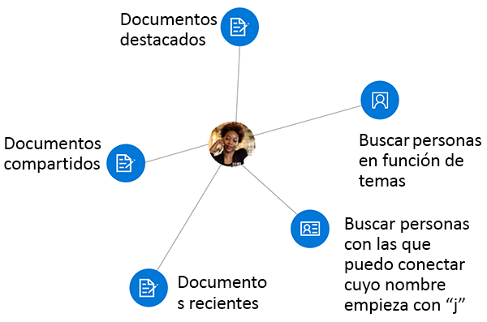
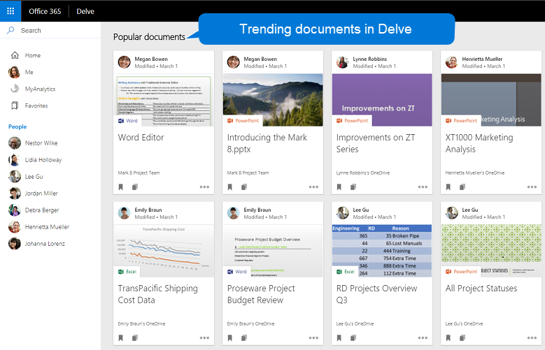

# <a name="overview-of-social-intelligence-and-analytics-in-microsoft-graph"></a><span data-ttu-id="d2fa2-105">Información general sobre análisis e inteligencia social en Microsoft Graph</span><span class="sxs-lookup"><span data-stu-id="d2fa2-105">Overview of social intelligence and analytics in Microsoft Graph</span></span>

<span data-ttu-id="d2fa2-106">Los cientos de millones de usuarios de los servicios en la nube de Microsoft 365 forman parte del núcleo de Microsoft Graph.</span><span class="sxs-lookup"><span data-stu-id="d2fa2-106">The hundreds of millions of users of Microsoft 365 cloud services form part of the core of Microsoft Graph.</span></span> <span data-ttu-id="d2fa2-107">Cuidadosamente, los datos de los usuarios se administran y protegen y, con la autorización correcta, se facilita su disponibilidad con los servicios de Microsoft Graph para impulsar la productividad y la creatividad en las empresas.</span><span class="sxs-lookup"><span data-stu-id="d2fa2-107">The users' data is carefully managed, protected, and with proper authorization, made available by Microsoft Graph services to drive productivity and creativity in businesses.</span></span> <span data-ttu-id="d2fa2-108">Como los datos de los usuarios son ubicuos en Microsoft Graph, los datos derivados de las interacciones sociales de los usuarios resultan especialmente interesantes.</span><span class="sxs-lookup"><span data-stu-id="d2fa2-108">As ubiquitous the user's data is in Microsoft Graph, data derived from the user's social interactions is particularly interesting.</span></span> <span data-ttu-id="d2fa2-109">Proporciona información inteligente que puede responder a preguntas como las siguientes:</span><span class="sxs-lookup"><span data-stu-id="d2fa2-109">It provides intelligent insights that can answer questions such as the following:</span></span>

- <span data-ttu-id="d2fa2-110">“¿Con quién tiene que ponerse en contacto este usuario para obtener información sobre este tema?”</span><span class="sxs-lookup"><span data-stu-id="d2fa2-110">"Who should this user contact for information on this topic?"</span></span>
- <span data-ttu-id="d2fa2-111">“¿Qué documentos son los más interesantes para esta persona?”</span><span class="sxs-lookup"><span data-stu-id="d2fa2-111">"Which documents are most interesting to this person?"</span></span>

<span data-ttu-id="d2fa2-112">Puede usar la API de contactos y la API de Insights en Microsoft Graph para crear aplicaciones más inteligentes que pueden, respectivamente, obtener acceso a los contactos y documentos relevantes de un usuario.</span><span class="sxs-lookup"><span data-stu-id="d2fa2-112">You can use the people API and insights API in Microsoft Graph to build smarter apps that can, respectively, access the relevant people and documents for a user.</span></span>

<span data-ttu-id="d2fa2-113">La API de contactos devuelve contactos ordenados por relevancia a un usuario, basándose en los contactos, las redes sociales, el directorio de la organización y las comunicaciones recientes por correo electrónico y Skype de ese usuario.</span><span class="sxs-lookup"><span data-stu-id="d2fa2-113">The people API returns people ordered by relevance to a user, based on that user's contacts, social networks, organization directory, and recent communications on email and Skype.</span></span> <span data-ttu-id="d2fa2-114">Esto es especialmente útil para escenarios de selección de contactos.</span><span class="sxs-lookup"><span data-stu-id="d2fa2-114">This is particularly useful for people-picking scenarios.</span></span>

<span data-ttu-id="d2fa2-115">La API de Insights usa análisis avanzado y aprendizaje automático para mostrar a los usuarios los archivos más relevantes que necesitan en su día de trabajo.</span><span class="sxs-lookup"><span data-stu-id="d2fa2-115">The insights API uses advanced analytics and machine learning to provide the most relevant files users need throughout their work day.</span></span> <span data-ttu-id="d2fa2-116">La API mejora las conocidas experiencias de Office 365, como Microsoft Delve, la página principal de SharePoint, la vista Descubrir en OneDrive para la Empresa, y Outlook en la Web.</span><span class="sxs-lookup"><span data-stu-id="d2fa2-116">The API powers familiar Office 365 experiences, including Office Delve, SharePoint Home, the Discover view in OneDrive for Business, and Outlook on the web.</span></span>



## <a name="why-integrate-with-people-data"></a><span data-ttu-id="d2fa2-118">¿Por qué integrar con los datos de contactos?</span><span class="sxs-lookup"><span data-stu-id="d2fa2-118">Why integrate with people data?</span></span>

<span data-ttu-id="d2fa2-119">La API de contactos devuelve datos de una única entidad, [person](/graph/api/resources/person?view=graph-rest-1.0), que incluye datos típicos de una persona en el mundo empresarial de hoy en día.</span><span class="sxs-lookup"><span data-stu-id="d2fa2-119">The people API returns data of a single entity, [person](/graph/api/resources/person?view=graph-rest-1.0), which includes typical data of an individual in today's business world.</span></span> <span data-ttu-id="d2fa2-120">Lo que hace que los datos de este **contacto** sean especialmente útiles es su _relevancia_ en relación con usuario de Microsoft Graph.</span><span class="sxs-lookup"><span data-stu-id="d2fa2-120">What makes this **person** data especially useful is its _relevance_ with respect to a Microsoft Graph user.</span></span> <span data-ttu-id="d2fa2-121">La relevancia se indica con una puntuación de relevancia de cada contacto, calculada basándose en los modelos de comunicación y colaboración del usuario, y en sus relaciones empresariales.</span><span class="sxs-lookup"><span data-stu-id="d2fa2-121">Relevance is noted in a relevance score of each person, calculated based on the user's communication and collaboration patterns and business relationships.</span></span> <span data-ttu-id="d2fa2-122">Existen tres tipos principales de aplicaciones para estos datos de _relevancia_.</span><span class="sxs-lookup"><span data-stu-id="d2fa2-122">There are 3 main types of application of this _relevance_ data.</span></span>

### <a name="browse-people-by-relevance"></a><span data-ttu-id="d2fa2-123">Explorar contactos por relevancia</span><span class="sxs-lookup"><span data-stu-id="d2fa2-123">Browse people by relevance</span></span>

<span data-ttu-id="d2fa2-124">Puede explorar los contactos relacionados con el usuario que inició la sesión o con algún otro usuario en la organización del usuario que inició la sesión, siempre que tenga la [autorización](people-example.md#authorization) correspondiente.</span><span class="sxs-lookup"><span data-stu-id="d2fa2-124">You can browse people who are related to the signed-in user or to some other user in the signed-in user's organization, provided you have got the appropriate [authorization](people-example.md#authorization).</span></span> <span data-ttu-id="d2fa2-125">Obtenga una colección de objetos de **contactos** ordenados por relevancia.</span><span class="sxs-lookup"><span data-stu-id="d2fa2-125">You get a collection of **person** objects that are ordered by relevance.</span></span> <span data-ttu-id="d2fa2-126">Puede [personalizar](people-example.md#browse-people) aún más la colección de objetos de **contactos** devueltos en la respuesta si especifica los parámetros de consulta `top`, `skip`, `orderby`, `select` y `filter`.</span><span class="sxs-lookup"><span data-stu-id="d2fa2-126">You can further [customize](people-example.md#browse-people) the collection of **person** objects that is returned in the response by specifying the query parameters `top`, `skip`, `orderby`, `select`, and `filter`.</span></span>

### <a name="fuzzy-searches-based-on-people-criteria"></a><span data-ttu-id="d2fa2-127">Búsquedas aproximadas basadas en criterios de contactos</span><span class="sxs-lookup"><span data-stu-id="d2fa2-127">Fuzzy searches based on people criteria</span></span>

<span data-ttu-id="d2fa2-128">La API de contactos le permite buscar contactos relevantes para el usuario que inició la sesión, siempre que la aplicación tenga permisos concedidos por el usuario.</span><span class="sxs-lookup"><span data-stu-id="d2fa2-128">The people API lets you search for people relevant to the signed-in user, provided that your app has got permissions by that user.</span></span> <span data-ttu-id="d2fa2-129">(Obtenga más información sobre los [permisos de contactos](permissions-reference.md#people-permissions)).</span><span class="sxs-lookup"><span data-stu-id="d2fa2-129">(Read more on [people permissions](permissions-reference.md#people-permissions).)</span></span>

<span data-ttu-id="d2fa2-130">Las búsquedas aproximadas devuelven resultados basados en una coincidencia exacta y también en inferencias sobre la intención de la búsqueda.</span><span class="sxs-lookup"><span data-stu-id="d2fa2-130">Fuzzy searches return results based on an exact match and also on inferences about the intent of the search.</span></span> <span data-ttu-id="d2fa2-131">Para demostrar esto, en el ejemplo siguiente se devuelven objetos de **contactos** cuyo nombre (_o dirección de correo electrónico_) contenga una palabra que empiece con “j” y sean relevantes para el usuario que inició la sesión.</span><span class="sxs-lookup"><span data-stu-id="d2fa2-131">To illustrate this, the following example returns **person** objects relevant to the signed-in user whose name, _or email address_, contains a word that starts with 'j'.</span></span>

<!-- { "blockType": "ignored" } -->
```http
GET /me/people/?$search=j
```

### <a name="fuzzy-searches-based-on-topic-criteria"></a><span data-ttu-id="d2fa2-132">Búsquedas aproximadas basadas en criterios de temas</span><span class="sxs-lookup"><span data-stu-id="d2fa2-132">Fuzzy searches based on topic criteria</span></span>

<span data-ttu-id="d2fa2-133">La API de contactos también le permite realizar búsquedas de contactos que sean relevantes para el usuario que inició la sesión y que expresaron interés en comunicarse con ese usuario sobre determinados “temas”.</span><span class="sxs-lookup"><span data-stu-id="d2fa2-133">The people API also lets you perform searches for people who are relevant to the signed-in user, and have expressed an interest in communicating with that user over certain "topics".</span></span> <span data-ttu-id="d2fa2-134">Los temas en este contexto son tan solo palabras que los usuarios usaron con mayor frecuencia en conversaciones de correo electrónico.</span><span class="sxs-lookup"><span data-stu-id="d2fa2-134">Topics are just words that have been used most by users in email conversations.</span></span> <span data-ttu-id="d2fa2-135">Microsoft extrae esas palabras, sin los contextos, y crea un índice con estos datos para facilitar las búsquedas aproximadas.</span><span class="sxs-lookup"><span data-stu-id="d2fa2-135">Microsoft extracts such words, free of their contexts, and creates an index for this data to facilitate fuzzy searches.</span></span>

<span data-ttu-id="d2fa2-136">En el ejemplo siguiente, se muestran inferencias sobre la intención de una búsqueda sobre el tema “escarabajo”:</span><span class="sxs-lookup"><span data-stu-id="d2fa2-136">The following example illustrates inferences about the intent of a search on the topic "beetle":</span></span>

<!-- { "blockType": "ignored" } -->
```http
GET /me/people/?$search="topic:beetle" 
```

<span data-ttu-id="d2fa2-137">Una búsqueda aproximada en el índice de datos del tema devolvería resultados relacionados con el insecto (“escarabajo”), el emblemático Escarabajo de Volkswagen y otras definiciones.</span><span class="sxs-lookup"><span data-stu-id="d2fa2-137">A fuzzy search in the topic data index return instances that mean the beetle insect, the iconic Volkswagen Beetle car, the Beatles band, and other definitions.</span></span>


## <a name="why-integrate-with-document-based-insights-preview"></a><span data-ttu-id="d2fa2-138">¿Por qué integrar con la información basada en documentos (vista previa)?</span><span class="sxs-lookup"><span data-stu-id="d2fa2-138">Why integrate with document-based insights (preview)?</span></span>

### <a name="use-intelligence-to-improve-collaboration"></a><span data-ttu-id="d2fa2-139">Usar inteligencia para mejorar la colaboración</span><span class="sxs-lookup"><span data-stu-id="d2fa2-139">Use intelligence to improve collaboration</span></span>

<span data-ttu-id="d2fa2-140">Durante un día de trabajo típico, los usuarios suelen interactuar con grandes cantidades de información almacenada en distintos documentos y colaboran con otros usuarios de formas muy distintas.</span><span class="sxs-lookup"><span data-stu-id="d2fa2-140">During a typical work day, users often interact with large amounts of information stored across many documents and collaborate with other users in many different ways.</span></span> <span data-ttu-id="d2fa2-141">Es importante que siempre puedan encontrar lo que necesiten y cuando lo necesiten.</span><span class="sxs-lookup"><span data-stu-id="d2fa2-141">It's important that they can always can find what they need, when they need it.</span></span>

<span data-ttu-id="d2fa2-142">Puede usar la API de Insights, que incluye las API de [tendencias](/graph/api/resources/insights-trending?view=graph-rest-beta), [compartidos](/graph/api/resources/insights-shared?view=graph-rest-beta) y [usados](/graph/api/resources/insights-used?view=graph-rest-beta), para mostrar archivos de Office 365 basándose en el contexto actual y las necesidades del usuario, lo que permite a los usuarios ser más productivos y mejorar la colaboración en la organización.</span><span class="sxs-lookup"><span data-stu-id="d2fa2-142">You can use the insights API, which includes the [trending](/graph/api/resources/insights-trending?view=graph-rest-beta), [shared](/graph/api/resources/insights-shared?view=graph-rest-beta), and [used](/graph/api/resources/insights-used?view=graph-rest-beta) APIs, to surface files from across Office 365 based on your users' current context and needs, making users more productive and improving collaboration in your organization.</span></span>

<span data-ttu-id="d2fa2-143">Es fácil mostrar los resultados de la API de Insights en una aplicación.</span><span class="sxs-lookup"><span data-stu-id="d2fa2-143">It is easy to render the results from the insights API in your app.</span></span> <span data-ttu-id="d2fa2-144">Con cada resultado, se incluye un conjunto de propiedades de visualización comunes, como una URL de imagen de vista previa o texto de vista previa.</span><span class="sxs-lookup"><span data-stu-id="d2fa2-144">Every result comes with a set of common visualization properties, like a preview image URL or preview text.</span></span>

### <a name="make-relevant-content-visible"></a><span data-ttu-id="d2fa2-145">Hacer visible el contenido relevante</span><span class="sxs-lookup"><span data-stu-id="d2fa2-145">Make relevant content visible</span></span>

<span data-ttu-id="d2fa2-146">En Office 365, Delve usa la información de _tendencias_ para ayudar a los usuarios a descubrir los documentos que les resulten más interesantes en ese momento.</span><span class="sxs-lookup"><span data-stu-id="d2fa2-146">In Office 365, Delve uses the _trending_ insight to help users discover the documents that are most interesting to them right now.</span></span> <span data-ttu-id="d2fa2-147">Vea la ilustración 1.</span><span class="sxs-lookup"><span data-stu-id="d2fa2-147">See figure 1.</span></span>

<span data-ttu-id="d2fa2-148">Con programación, puede usar la entidad [trending](/graph/api/resources/insights-trending?view=graph-rest-beta) de la API de Insights para ofrecer una experiencia similar a los clientes de la aplicación.</span><span class="sxs-lookup"><span data-stu-id="d2fa2-148">Programmatically, you can use the [trending](/graph/api/resources/insights-trending?view=graph-rest-beta) entity in the insights API to provide your app customers a similar experience.</span></span> <span data-ttu-id="d2fa2-149">Use la entidad **trending** para conectarse a los documentos más consultados y relevantes para el usuario.</span><span class="sxs-lookup"><span data-stu-id="d2fa2-149">Use the **trending** entity to connect to documents that are trending around and relevant to the user.</span></span> <span data-ttu-id="d2fa2-150">Al [mostrar una lista de documentos con más actividad](/graph/api/insights-list-trending?view=graph-rest-beta), se devuelven los archivos almacenados en OneDrive o en los sitios de grupo de SharePoint, ordenados por relevancia, mostrándose los más importantes primero.</span><span class="sxs-lookup"><span data-stu-id="d2fa2-150">[Listing trending documents](/graph/api/insights-list-trending?view=graph-rest-beta) returns those files stored on OneDrive or SharePoint team sites, sorted by relevance with the most important ones first.</span></span> 

<span data-ttu-id="d2fa2-151">**Ilustración 1. Delve en Office 365 donde se muestran los documentos populares para un usuario**</span><span class="sxs-lookup"><span data-stu-id="d2fa2-151">**Figure 1. Delve in Office 365 showing popular documents for a user**</span></span>



### <a name="allow-users-to-collaborate-and-get-back-to-work"></a><span data-ttu-id="d2fa2-153">Permitir que los usuarios colaboren y vuelvan al trabajo</span><span class="sxs-lookup"><span data-stu-id="d2fa2-153">Allow users to collaborate and get back to work</span></span>

<span data-ttu-id="d2fa2-154">Las nuevas tarjetas de contactos de Office 365 aprovechan la información _usada_ y _compartida_ para establecer una relación entre los contactos y las unidades de conocimiento.</span><span class="sxs-lookup"><span data-stu-id="d2fa2-154">The new Office 365 people cards tap into the _used_ and _shared_ insights to connect the dots between people and units of knowledge.</span></span> <span data-ttu-id="d2fa2-155">La tarjeta de contactos identifica y muestra documentos relevantes sobre una persona.</span><span class="sxs-lookup"><span data-stu-id="d2fa2-155">The people card identifies and displays relevant documents about a person.</span></span> <span data-ttu-id="d2fa2-156">Los usuarios pueden ver tarjetas de contactos en todo el conjunto de aplicaciones (por ejemplo, en Outlook en la Web).</span><span class="sxs-lookup"><span data-stu-id="d2fa2-156">Users can see people cards across the suite, for example, in Outlook on the web.</span></span> <span data-ttu-id="d2fa2-157">Vea la ilustración 2.</span><span class="sxs-lookup"><span data-stu-id="d2fa2-157">See figure 2.</span></span>

<span data-ttu-id="d2fa2-158">La API de Insights proporciona una función similar con las entidades [used](/graph/api/resources/insights-used?view=graph-rest-beta) y [shared](/graph/api/resources/insights-shared?view=graph-rest-beta).</span><span class="sxs-lookup"><span data-stu-id="d2fa2-158">The insights API provides a similar functionality with the [used](/graph/api/resources/insights-used?view=graph-rest-beta) and [shared](/graph/api/resources/insights-shared?view=graph-rest-beta) entities.</span></span> <span data-ttu-id="d2fa2-159">Muestran lo que un usuario vio o en lo que trabajó recientemente, o lo que compartieron recientemente sus compañeros con el usuario en Office 365.</span><span class="sxs-lookup"><span data-stu-id="d2fa2-159">They return what a user has been viewing or working on most recently, or what colleagues have shared with the user most recently in Office 365.</span></span>

<span data-ttu-id="d2fa2-160">**Ilustración 2. Outlook en la Web, donde se muestra una tarjeta de contactos de usuario**</span><span class="sxs-lookup"><span data-stu-id="d2fa2-160">**Figure 2. Outlook on the web showing a people card for a user**</span></span>


## <a name="api-reference"></a><span data-ttu-id="d2fa2-162">Referencia de la API</span><span class="sxs-lookup"><span data-stu-id="d2fa2-162">API reference</span></span>
<span data-ttu-id="d2fa2-163">¿Busca la referencia de la API para estos servicios?</span><span class="sxs-lookup"><span data-stu-id="d2fa2-163">Looking for the API reference for these services?</span></span>

- [<span data-ttu-id="d2fa2-164">API de contactos en Microsoft Graph v1.0</span><span class="sxs-lookup"><span data-stu-id="d2fa2-164">People API in Microsoft Graph v1.0</span></span>](/graph/api/resources/social-overview?view=graph-rest-1.0)
- [<span data-ttu-id="d2fa2-165">API para el análisis y la inteligencia social en Microsoft Graph beta</span><span class="sxs-lookup"><span data-stu-id="d2fa2-165">API for social intelligence and analytics in Microsoft Graph beta</span></span>](/graph/api/resources/social-overview?view=graph-rest-beta)

## <a name="next-steps"></a><span data-ttu-id="d2fa2-166">Pasos siguientes</span><span class="sxs-lookup"><span data-stu-id="d2fa2-166">Next steps</span></span>

* <span data-ttu-id="d2fa2-167">Use el [Probador de Graph](https://developer.microsoft.com/graph/graph-explorer) para probar las API de Insights y contactos con sus propios archivos.</span><span class="sxs-lookup"><span data-stu-id="d2fa2-167">Use the [Graph Explorer](https://developer.microsoft.com/graph/graph-explorer) to try out the people and insight APIs with your own files.</span></span> <span data-ttu-id="d2fa2-168">Inicie sesión y, en la columna de la izquierda, seleccione **Mostrar más ejemplos**.</span><span class="sxs-lookup"><span data-stu-id="d2fa2-168">Sign in, and choose **Show more samples** in the column on the left.</span></span> <span data-ttu-id="d2fa2-169">Use el menú para activar **Contactos** e **Insights** (beta).</span><span class="sxs-lookup"><span data-stu-id="d2fa2-169">Use the menu to turn on **People** and **Insights (beta)**.</span></span>
* <span data-ttu-id="d2fa2-170">Obtenga más información sobre la [API de contactos](people-example.md) y la entidad [person](/graph/api/resources/person?view=graph-rest-1.0).</span><span class="sxs-lookup"><span data-stu-id="d2fa2-170">Find more about the [people API](people-example.md) and the [person](/graph/api/resources/person?view=graph-rest-1.0) entity.</span></span>
* <span data-ttu-id="d2fa2-171">Para empezar a usar la API de Insights, vea [Usar la API de Insights](/graph/api/resources/insights?view=graph-rest-beta).</span><span class="sxs-lookup"><span data-stu-id="d2fa2-171">To get started with insights API, see [Use the insights API](/graph/api/resources/insights?view=graph-rest-beta).</span></span>
