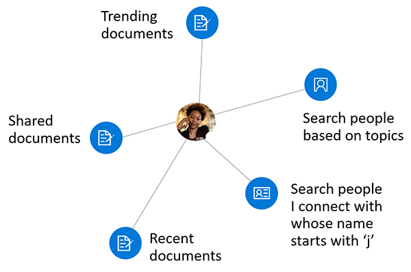

# <a name="overview-of-social-intelligence-and-analytics-in-microsoft-graph"></a>Información general sobre análisis e inteligencia social en Microsoft Graph

Los cientos de millones de usuarios de los servicios en la nube de Microsoft 365 forman parte del núcleo de Microsoft Graph. Cuidadosamente, los datos de los usuarios se administran y protegen y, con la autorización correcta, se facilita su disponibilidad con los servicios de Microsoft Graph para impulsar la productividad y la creatividad en las empresas. Como los datos de los usuarios son ubicuos en Microsoft Graph, los datos derivados de las interacciones sociales de los usuarios resultan especialmente interesantes. Proporciona información inteligente que puede responder a preguntas como las siguientes:

- “¿Con quién tiene que ponerse en contacto este usuario para obtener información sobre este tema?”
- “¿Qué documentos son los más interesantes para esta persona?”

Puede usar la API de contactos y la API de Insights en Microsoft Graph para crear aplicaciones más inteligentes que pueden, respectivamente, obtener acceso a los contactos y documentos relevantes de un usuario.

La API de contactos devuelve contactos ordenados por relevancia a un usuario, basándose en los contactos, las redes sociales, el directorio de la organización y las comunicaciones recientes por correo electrónico y Skype de ese usuario. Esto es especialmente útil para escenarios de selección de contactos.

La API de Insights usa análisis avanzado y aprendizaje automático para mostrar a los usuarios los archivos más relevantes que necesitan en su día de trabajo. La API mejora las conocidas experiencias de Office 365, como Microsoft Delve, la página principal de SharePoint, la vista Descubrir en OneDrive para la Empresa, y Outlook en la Web.



## <a name="why-integrate-with-people-data"></a>¿Por qué integrar con los datos de contactos?

La API de contactos devuelve datos de una única entidad, [person](/graph/api/resources/person?view=graph-rest-1.0), que incluye datos típicos de una persona en el mundo empresarial de hoy en día. Lo que hace que los datos de este **contacto** sean especialmente útiles es su _relevancia_ en relación con usuario de Microsoft Graph. La relevancia se indica con una puntuación de relevancia de cada contacto, calculada basándose en los modelos de comunicación y colaboración del usuario, y en sus relaciones empresariales. Existen tres tipos principales de aplicaciones para estos datos de _relevancia_.

### <a name="browse-people-by-relevance"></a>Explorar contactos por relevancia

Puede explorar los contactos relacionados con el usuario que inició la sesión o con algún otro usuario en la organización del usuario que inició la sesión, siempre que tenga la [autorización](people-example.md#authorization) correspondiente. Obtenga una colección de objetos de **contactos** ordenados por relevancia. Puede [personalizar](people-example.md#browse-people) aún más la colección de objetos de **contactos** devueltos en la respuesta si especifica los parámetros de consulta `top`, `skip`, `orderby`, `select` y `filter`.

### <a name="fuzzy-searches-based-on-people-criteria"></a>Búsquedas aproximadas basadas en criterios de contactos

La API de contactos le permite buscar contactos relevantes para el usuario que inició la sesión, siempre que la aplicación tenga permisos concedidos por el usuario. (Obtenga más información sobre los [permisos de contactos](permissions-reference.md#people-permissions)).

Las búsquedas aproximadas devuelven resultados basados en una coincidencia exacta y también en inferencias sobre la intención de la búsqueda. Para demostrar esto, en el ejemplo siguiente se devuelven objetos de **contactos** cuyo nombre (_o dirección de correo electrónico_) contenga una palabra que empiece con “j” y sean relevantes para el usuario que inició la sesión.

<!-- { "blockType": "ignored" } -->
```http
GET /me/people/?$search=j
```

### <a name="fuzzy-searches-based-on-topic-criteria"></a>Búsquedas aproximadas basadas en criterios de temas

La API de contactos también le permite realizar búsquedas de contactos que sean relevantes para el usuario que inició la sesión y que expresaron interés en comunicarse con ese usuario sobre determinados “temas”. Los temas en este contexto son tan solo palabras que los usuarios usaron con mayor frecuencia en conversaciones de correo electrónico. Microsoft extrae esas palabras, sin los contextos, y crea un índice con estos datos para facilitar las búsquedas aproximadas.

En el ejemplo siguiente, se muestran inferencias sobre la intención de una búsqueda sobre el tema “escarabajo”:

<!-- { "blockType": "ignored" } -->
```http
GET /me/people/?$search="topic:beetle" 
```

Una búsqueda aproximada en el índice de datos del tema devolvería resultados relacionados con el insecto (“escarabajo”), el emblemático Escarabajo de Volkswagen y otras definiciones.


## <a name="why-integrate-with-document-based-insights-preview"></a>¿Por qué integrar con la información basada en documentos (vista previa)?

### <a name="use-intelligence-to-improve-collaboration"></a>Usar inteligencia para mejorar la colaboración

Durante un día de trabajo típico, los usuarios suelen interactuar con grandes cantidades de información almacenada en distintos documentos y colaboran con otros usuarios de formas muy distintas. Es importante que siempre puedan encontrar lo que necesiten y cuando lo necesiten.

Puede usar la API de Insights, que incluye las API de [tendencias](/graph/api/resources/insights-trending?view=graph-rest-beta), [compartidos](/graph/api/resources/insights-shared?view=graph-rest-beta) y [usados](/graph/api/resources/insights-used?view=graph-rest-beta), para mostrar archivos de Office 365 basándose en el contexto actual y las necesidades del usuario, lo que permite a los usuarios ser más productivos y mejorar la colaboración en la organización.

Es fácil mostrar los resultados de la API de Insights en una aplicación. Con cada resultado, se incluye un conjunto de propiedades de visualización comunes, como una URL de imagen de vista previa o texto de vista previa.

### <a name="make-relevant-content-visible"></a>Hacer visible el contenido relevante

En Office 365, Delve usa la información de _tendencias_ para ayudar a los usuarios a descubrir los documentos que les resulten más interesantes en ese momento. Vea la ilustración 1.

Con programación, puede usar la entidad [trending](/graph/api/resources/insights-trending?view=graph-rest-beta) de la API de Insights para ofrecer una experiencia similar a los clientes de la aplicación. Use la entidad **trending** para conectarse a los documentos más consultados y relevantes para el usuario. Al [mostrar una lista de documentos con más actividad](/graph/api/insights-list-trending?view=graph-rest-beta), se devuelven los archivos almacenados en OneDrive o en los sitios de grupo de SharePoint, ordenados por relevancia, mostrándose los más importantes primero. 

**Ilustración 1. Delve en Office 365 donde se muestran los documentos populares para un usuario**


### <a name="allow-users-to-collaborate-and-get-back-to-work"></a>Permitir que los usuarios colaboren y vuelvan al trabajo

Las nuevas tarjetas de contactos de Office 365 aprovechan la información _usada_ y _compartida_ para establecer una relación entre los contactos y las unidades de conocimiento. La tarjeta de contactos identifica y muestra documentos relevantes sobre una persona. Los usuarios pueden ver tarjetas de contactos en todo el conjunto de aplicaciones (por ejemplo, en Outlook en la Web). Vea la ilustración 2.

La API de Insights proporciona una función similar con las entidades [used](/graph/api/resources/insights-used?view=graph-rest-beta) y [shared](/graph/api/resources/insights-shared?view=graph-rest-beta). Muestran lo que un usuario vio o en lo que trabajó recientemente, o lo que compartieron recientemente sus compañeros con el usuario en Office 365.

**Ilustración 2. Outlook en la Web, donde se muestra una tarjeta de contactos de usuario**


## <a name="api-reference"></a>Referencia de la API
¿Busca la referencia de la API para estos servicios?

- [API de contactos en Microsoft Graph v1.0](/graph/api/resources/social-overview?view=graph-rest-1.0)
- [API para el análisis y la inteligencia social en Microsoft Graph beta](/graph/api/resources/social-overview?view=graph-rest-beta)

## <a name="next-steps"></a>Pasos siguientes

* Use el [Probador de Graph](https://developer.microsoft.com/graph/graph-explorer) para probar las API de Insights y contactos con sus propios archivos. Inicie sesión y, en la columna de la izquierda, seleccione **Mostrar más ejemplos**. Use el menú para activar **Contactos** e **Insights** (beta).
* Obtenga más información sobre la [API de contactos](people-example.md) y la entidad [person](/graph/api/resources/person?view=graph-rest-1.0).
* Para empezar a usar la API de Insights, vea [Usar la API de Insights](/graph/api/resources/insights?view=graph-rest-beta).
