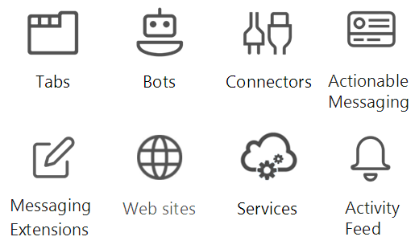

# Introducción a la API de Microsoft Teams (vista previa)

Microsoft Teams es el centro definitivo para el trabajo en equipo y las comunicaciones inteligentes. Basado en la escala y la solidez de Office 365 con más de 120 millones de usuarios, Microsoft Teams ofrece colaboración basada en chat, reuniones, llamadas y características de telefonía IP empresarial.

## ¿Por qué integrar con Microsoft Teams?

La integración con Microsoft Teams le permite crear fácilmente sus propios servicios y aplicaciones para llegar a millones de usuarios empresariales y facilitar la colaboración de los usuarios. Puede usar Microsoft Graph para crear y administrar equipos, canales, mensajes y más.

### Usar Microsoft Graph en cualquier tipo de aplicación

Las aplicaciones de Microsoft Teams basadas en Microsoft Graph ofrecen a los grupos de trabajo una nueva herramienta para conseguir que la colaboración sea una experiencia más productiva e interesante. Con Microsoft Teams, los usuarios de grupos de trabajo comparten activos, interactúan con chat y programan eventos en el calendario de equipo. Para mejorar el valor de Microsoft Teams, agregue la automatización de conversaciones, canales y equipos con aplicaciones basadas en la API de Microsoft Teams.

Los sitios web, los servicios y las aplicaciones de la plataforma nativa no se ejecutan dentro de la experiencia del usuario de Microsoft Teams, pero pueden usarse para realizar llamadas a las API de Microsoft Teams que facilitan los escenarios de automatización de Microsoft Teams.

**Tipos de aplicaciones habilitadas para Microsoft Teams**

Entre estas herramientas de colaboración, se incluyen las aplicaciones de bots o pestañas habilitadas para Microsoft Graph que se ejecutan dentro de Microsoft Teams. También puede realizar llamadas a Microsoft Graph desde fuera de una aplicación de Microsoft Teams (por ejemplo, desde un sitio web o un servicio web). Si ya habilitó su sitio web para Microsoft Graph, puede usar ese trabajo para Microsoft Teams con la [plataforma para desarrolladores de Microsoft Teams](https://docs.microsoft.com/en-us/microsoftteams/platform/#pivot=home&panel=home-all) para crear una aplicación de pestaña que use el código del sitio web existente.

Si una aplicación de bot o pestaña de Microsoft Teams no es la forma ideal de completar el escenario, seleccione uno de los tipos de aplicación siguiente.

|Tipo de aplicación|Descripción del escenario|
|:-------|:-------------------|
|Pestañas|Permite mostrar contenido mejorado dentro de Microsoft Teams.|
|Conectores|Permite publicar actualizaciones mejoradas en canales.|
|Mensajes que requieren acción|Permite agregar interacción mejorara a las tarjetas del conector.|
|Sitios web|Permite mostrar contenido mejorado en las páginas web.|
|Bots|Ayuda a los usuarios a completar tareas en conversaciones.|
|Fuente de actividades|Permite interactuar con los usuarios con notificaciones de fuentes.|
|Extensiones de mensajería|Permite a los usuarios consultar y compartir tarjetas mejoradas en conversaciones.|
|Servicios|Mejora las aplicaciones cliente con datos de Microsoft Graph con un servicio web.|

### Crear varios equipos y canales

Permita a sus clientes crear [equipos](../api-reference/beta/resources/team.md) y [canales](../api-reference/beta/resources/channel.md) vinculados a la aplicación. Permita fácilmente crear un gran número de equipos y rellenarlos con usuarios y canales con la API de Microsoft Teams.

### Automatizar los ciclos de vida del equipo

Use Microsoft Graph para crear un equipo virtual cuando se produzca un nuevo problema empresarial, [rellene el equipo](../api-reference/v1.0/api/group_post_members.md) con las personas adecuadas y configure el equipo con canales. Para iniciar una discusión de canal de equipo sobre el nuevo problema empresarial, puede inicializar el canal con un nuevo hilo de conversación para publicar un mensaje de bienvenida a los nuevos miembros del equipo. Para reunir al nuevo equipo para discutir sobre el problema empresarial, agregue un nuevo evento al calendario de equipo y, después, invite a los miembros del equipo al evento.

Cuando se solucione el problema empresarial y ya no necesite el equipo virtual, use la API de Microsoft Teams para deshacer el equipo. Si conoce la duración máxima del equipo virtual al crearlo, establezca una [directiva de expiración de grupo de Office 365](https://support.office.com/en-us/article/office-365-group-expiration-policy-8d253fe5-0e09-4b3c-8b5e-f48def064733?ui=en-US&rs=en-US&ad=US) para el equipo para quitar automáticamente el equipo según la directiva.

## Pasos siguientes

- Obtenga información sobre cómo [usar la API de Microsoft Teams](../api-reference/beta/resources/teams_api_overview.md).
- Explore en profundidad los métodos, propiedades y relaciones de los recursos de [equipo](../api-reference/beta/resources/team.md), [canal](../api-reference/beta/resources/channel.md) y [grupo](../api-reference/v1.0/resources/group.md).
- Pruebe la API en el [Probador de Graph](https://developer.microsoft.com/en-us/graph/graph-explorer).
- Obtenga más información sobre el [modelo de programación de Microsoft Teams](https://docs.microsoft.com/en-us/microsoftteams/platform/concepts/concepts-overview).
- Empiece rápidamente con [código de ejemplo](https://github.com/OfficeDev/microsoft-teams-sample-graph).
