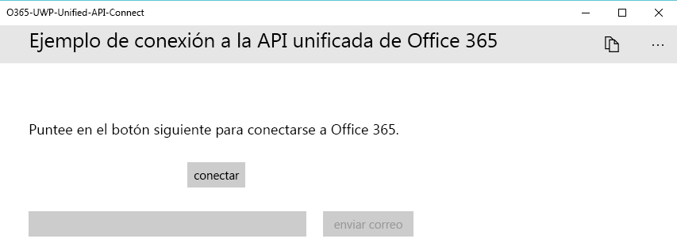
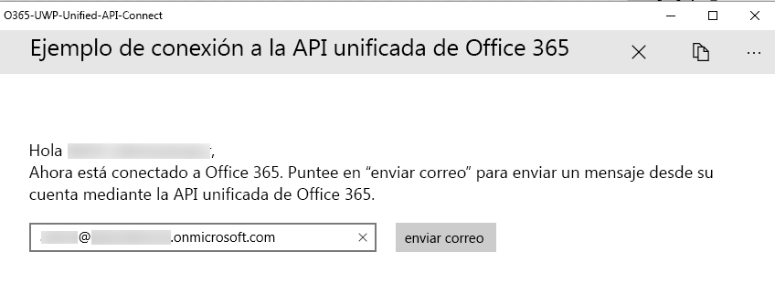

# <a name="get-started-with-microsoft-graph-in-a-universal-windows-10-app"></a>Introducción a Microsoft Graph en una aplicación de Windows 10 universal

> **¿Desea compilar aplicaciones para clientes empresariales?** Es posible que la aplicación no funcione si su cliente empresarial activa características de seguridad de movilidad empresarial como el <a href="https://azure.microsoft.com/en-us/documentation/articles/active-directory-conditional-access-device-policies/" target="_newtab">acceso condicional al dispositivo</a>. En casos así, es posible que no tenga constancia de esta activación y que sus clientes obtengan errores. 

> Para ser compatible con **todos los clientes empresariales** en **todos los escenarios de empresa**, tiene que usar el punto de conexión de AD de Azure y administrar las aplicaciones mediante [Azure Portal](https://aka.ms/aadapplist). Para más información, vea [Decidir entre los puntos de conexión de Azure AD y Azure AD v2.0](../concepts/auth_overview.md#deciding-between-the-azure-ad-and-azure-ad-v20-endpoints).

En este artículo, se describen las tareas necesarias para obtener un token de acceso desde el [punto de conexión v2.0 de Azure AD](https://developer.microsoft.com/es-ES/graph/docs/concepts/converged_auth) y llamar a Microsoft Graph. Le guiará por el código del [Ejemplo Connect de Microsoft Graph para UWP (biblioteca)](https://github.com/microsoftgraph/uwp-csharp-connect-sample) para explicar los conceptos principales que se deben implementar en una aplicación que use Microsoft Graph.

**¿No desea compilar una aplicación?** Use el [inicio rápido de Microsoft Graph](https://developer.microsoft.com/graph/quick-start) para ponerlo todo en funcionamiento de manera rápida o descargue el [Ejemplo Connect de Microsoft Graph para UWP (biblioteca)](https://github.com/microsoftgraph/uwp-csharp-connect-sample) en el que se basa este artículo. Tenga en cuenta también que tenemos una [versión de REST de esta muestra](https://github.com/microsoftgraph/uwp-csharp-connect-rest-sample).

## <a name="sample-user-interface"></a>Interfaz de usuario de ejemplo

El ejemplo contiene una interfaz de usuario muy sencilla, que consta de una barra de comandos superior, el **botón Conectar**, el botón **Enviar correo** y un cuadro de texto que se rellena automáticamente con la dirección de correo electrónico del usuario que ha iniciado sesión pero puede modificarse.

El botón **Enviar correo** está deshabilitado cuando el usuario no está conectado:



En la barra de comandos superior, aparece un botón de desconexión cuando el usuario está conectado:



Todas las cadenas de la interfaz de usuario del ejemplo se almacenan en el archivo Resources.resw dentro de la carpeta Assets.

## <a name="prerequisites"></a>Requisitos previos

Para comenzar, necesitará: 

- Una [cuenta Microsoft](https://www.outlook.com/) o una [cuenta profesional o educativa](https://docs.microsoft.com/es-ES/office/developer-program/office-365-developer-program-faq#account-types)
- Visual Studio 2017 
- [Proyecto inicial de Microsoft Graph para UWP (biblioteca)](https://github.com/microsoftgraph/uwp-csharp-connect-sample/tree/master/starter). Ambas plantillas contienen clases a las que agregará código. También contienen cadenas de recursos. Para obtener este proyecto, clone o descargue el [Ejemplo Connect de Microsoft Graph UWP (biblioteca)](https://github.com/microsoftgraph/uwp-csharp-connect-sample) y abra la solución dentro de la carpeta **starter**.


## <a name="register-the-app"></a>Registrar la aplicación
 
1. Inicie sesión en el [Portal de registro de aplicaciones](https://apps.dev.microsoft.com/) mediante su cuenta personal, profesional o educativa.
2. Seleccione **Agregar una aplicación**.
3. Escriba un nombre para la aplicación y seleccione **Crear aplicación**.
    
    Se muestra la página de registro, indicando las propiedades de la aplicación.
 
4. En **Plataformas**, seleccione **Agregar plataforma**.
5. Seleccione **Aplicación nativa**.
6. Copie tanto el identificador de cliente (identificador de la aplicación) como los valores del URI de redireccionamiento al Portapapeles. Deberá escribir estos valores en la aplicación de ejemplo.

    El identificador de la aplicación es un identificador único para su aplicación. El URI de redireccionamiento es un URI único que proporciona Windows 10 para cada aplicación con el fin de garantizar que los mensajes enviados a ese URI solo se envían a esa aplicación. 

7. Seleccione **Guardar**.

## <a name="configure-the-project"></a>Configurar el proyecto

1. Abra el archivo de la solución para el proyecto inicial en Visual Studio.
2. Abra el archivo **App.xaml** del proyecto y busque el nodo `Application.Resources`. Reemplace los marcadores de posición identificador de la aplicación y URI de redireccionamiento por los valores correspondientes de la aplicación que haya registrado.


```xml
    <Application.Resources>
        <!-- Add your Client Id here. -->
        <x:String x:Key="ida:ClientID">ENTER_YOUR_CLIENT_ID</x:String>
        <!-- Add your Redirect URI here. -->
        <x:String x:Key="ida:ReturnUrl">ENTER_YOUR_REDIRECT_URI</x:String>
    </Application.Resources>
```

## <a name="send-an-email-with-microsoft-graph"></a>Enviar un correo electrónico con Microsoft Graph

Abra el archivo MailHelper.cs en su proyecto inicial. Este archivo contiene código que crea y envía correos electrónicos. Consiste en un único método (``ComposeAndSendMailAsync``) que crea y envía una solicitud POST al punto de conexión **https://graph.microsoft.com/v1.0/me/microsoft.graph.SendMail**. 

El método ``ComposeAndSendMailAsync`` adquiere tres valores de cadena (``subject``, ``bodyContent`` y ``recipients``) que le pasa el archivo MainPage.xaml.cs. Las cadenas ``subject`` y ``bodyContent`` se almacenan, junto con todas las demás cadenas de la interfaz de usuario, en el archivo Resources.resw. La cadena ``recipients`` proviene del cuadro de dirección en la interfaz de la aplicación. 

La primera tarea dentro del método ``ComposeAndSendMailAsync`` consiste en obtener la fotografía del usuario actual de Microsoft Graph. Esta línea llama al método `GetCurrentUserPhotoStreamAsync`:

```
            // Get current user photo
            Stream photoStream = await GetCurrentUserPhotoStreamAsync();
```

El método `GetCurrentUserPhotoStreamAsync` completo tiene un aspecto similar a este:

```
        // Gets the stream content of the signed-in user's photo. 
        // This snippet doesn't work with consumer accounts.
        public async Task<Stream> GetCurrentUserPhotoStreamAsync()
        {
            Stream currentUserPhotoStream = null;

            try
            {
                var graphClient = AuthenticationHelper.GetAuthenticatedClient();
                currentUserPhotoStream = await graphClient.Me.Photo.Content.Request().GetAsync();

            }

            // If the user account is MSA (not work or school), the service will throw an exception.
            catch (ServiceException)
            {
                return null;
            }

            return currentUserPhotoStream;

        }
```

Si el usuario no tiene ninguna foto, esta lógica obtiene otro archivo de imagen que se haya incluido en el proyecto:

```
            // If the user doesn't have a photo, or if the user account is MSA, we use a default photo

            if (photoStream == null)
            {
                StorageFile file = await Windows.ApplicationModel.Package.Current.InstalledLocation.GetFileAsync("test.jpg");
                photoStream = (await file.OpenReadAsync()).AsStreamForRead();
            }
```

Ahora que tenemos una secuencia de imagen, podemos cargar el archivo a OneDrive llamando al método `UploadFileToOneDriveAsync`:

```
            MemoryStream photoStreamMS = new MemoryStream();
            // Copy stream to MemoryStream object so that it can be converted to byte array.
            photoStream.CopyTo(photoStreamMS);

            DriveItem photoFile = await UploadFileToOneDriveAsync(photoStreamMS.ToArray());
```

El método `UploadFileToOneDriveAsync` completo tiene un aspecto similar a este:

```
        // Uploads the specified file to the user's root OneDrive directory.
        public async Task<DriveItem> UploadFileToOneDriveAsync(byte[] file)
        {
            DriveItem uploadedFile = null;

            try
            {
                var graphClient = AuthenticationHelper.GetAuthenticatedClient();
                MemoryStream fileStream = new MemoryStream(file);
                uploadedFile = await graphClient.Me.Drive.Root.ItemWithPath("me.png").Content.Request().PutAsync<DriveItem>(fileStream);

            }


            catch (ServiceException)
            {
                return null;
            }

            return uploadedFile;
        }
```

También podemos usar esta secuencia para crear un objeto `MessageAttachmentsCollectionPage` que se pueda pasar junto al mensaje:

```
            MessageAttachmentsCollectionPage attachments = new MessageAttachmentsCollectionPage();
            attachments.Add(new FileAttachment
            {
                ODataType = "#microsoft.graph.fileAttachment",
                ContentBytes = photoStreamMS.ToArray(),
                ContentType = "image/png",
                Name = "me.png"
            });
```

Podemos obtener un vínculo para compartir para el archivo recién cargado en OneDrive llamando al método `GetSharingLinkAsync`. La cadena `bodyContent` contiene un marcador de posición para el vínculo para compartir:

```
            // Get the sharing link and insert it into the message body.
            Permission sharingLink = await GetSharingLinkAsync(photoFile.Id);
            string bodyContentWithSharingLink = String.Format(bodyContent, sharingLink.Link.WebUrl);
```

El método `GetSharingLinkAsync` completo tiene un aspecto similar a este:

```
        public static async Task<Permission> GetSharingLinkAsync(string Id)
        {
            Permission permission = null;

            try
            {
                var graphClient = AuthenticationHelper.GetAuthenticatedClient();
                permission = await graphClient.Me.Drive.Items[Id].CreateLink("view").Request().PostAsync();
            }

            catch (ServiceException)
            {
                return null;
            }

            return permission;
        }
```

Ya que el usuario puede pasar potencialmente más de una dirección, la siguiente tarea es dividir la cadena ``recipients`` en un conjunto de objetos `EmailAddress` que pueden usarse a continuación para crear la lista de objetos `Recipients` que se pasará en el cuerpo POST de la solicitud:

```
            // Prepare the recipient list
            string[] splitter = { ";" };
            var splitRecipientsString = recipients.Split(splitter, StringSplitOptions.RemoveEmptyEntries);
            List<Recipient> recipientList = new List<Recipient>();

            foreach (string recipient in splitRecipientsString)
            {
                recipientList.Add(new Recipient { EmailAddress = new EmailAddress { Address = recipient.Trim() } });
            }
```

La última tarea consiste en crear un objeto `Message` y enviarlo al punto de conexión **me/microsoft.graph.SendMail** a través del `GraphServiceClient`. Ya que la cadena ``bodyContent`` es un documento HTML, la solicitud establece el valor **ContentType** a HTML.

```
            try
            {
                var graphClient = AuthenticationHelper.GetAuthenticatedClient();

                var email = new Message
                {
                    Body = new ItemBody
                    {
                        Content = bodyContentWithSharingLink,
                        ContentType = BodyType.Html,
                    },
                    Subject = subject,
                    ToRecipients = recipientList,
                    Attachments = attachments
                };

                try
                {
                    await graphClient.Me.SendMail(email, true).Request().PostAsync();
                }
                catch (ServiceException exception)
                {
                    throw new Exception("We could not send the message: " + exception.Error == null ? "No error message returned." : exception.Error.Message);
                }


            }

            catch (Exception e)
            {
                throw new Exception("We could not send the message: " + e.Message);
            }
```

La clase completa tendrá este aspecto:

```
    public class MailHelper
    {
        /// <summary>
        /// Compose and send a new email.
        /// </summary>
        /// <param name="subject">The subject line of the email.</param>
        /// <param name="bodyContent">The body of the email.</param>
        /// <param name="recipients">A semicolon-separated list of email addresses.</param>
        /// <returns></returns>
        public async Task ComposeAndSendMailAsync(string subject,
                                                            string bodyContent,
                                                            string recipients)
        {

            // Get current user photo
            Stream photoStream = await GetCurrentUserPhotoStreamAsync();


            // If the user doesn't have a photo, or if the user account is MSA, we use a default photo

            if (photoStream == null)
            {
                StorageFile file = await Windows.ApplicationModel.Package.Current.InstalledLocation.GetFileAsync("test.jpg");
                photoStream = (await file.OpenReadAsync()).AsStreamForRead();
            }

            MemoryStream photoStreamMS = new MemoryStream();
            // Copy stream to MemoryStream object so that it can be converted to byte array.
            photoStream.CopyTo(photoStreamMS);

            DriveItem photoFile = await UploadFileToOneDriveAsync(photoStreamMS.ToArray());

            MessageAttachmentsCollectionPage attachments = new MessageAttachmentsCollectionPage();
            attachments.Add(new FileAttachment
            {
                ODataType = "#microsoft.graph.fileAttachment",
                ContentBytes = photoStreamMS.ToArray(),
                ContentType = "image/png",
                Name = "me.png"
            });

            // Get the sharing link and insert it into the message body.
            Permission sharingLink = await GetSharingLinkAsync(photoFile.Id);
            string bodyContentWithSharingLink = String.Format(bodyContent, sharingLink.Link.WebUrl);

            // Prepare the recipient list
            string[] splitter = { ";" };
            var splitRecipientsString = recipients.Split(splitter, StringSplitOptions.RemoveEmptyEntries);
            List<Recipient> recipientList = new List<Recipient>();

            foreach (string recipient in splitRecipientsString)
            {
                recipientList.Add(new Recipient { EmailAddress = new EmailAddress { Address = recipient.Trim() } });
            }

            try
            {
                var graphClient = AuthenticationHelper.GetAuthenticatedClient();

                var email = new Message
                {
                    Body = new ItemBody
                    {
                        Content = bodyContentWithSharingLink,
                        ContentType = BodyType.Html,
                    },
                    Subject = subject,
                    ToRecipients = recipientList,
                    Attachments = attachments
                };

                try
                {
                    await graphClient.Me.SendMail(email, true).Request().PostAsync();
                }
                catch (ServiceException exception)
                {
                    throw new Exception("We could not send the message: " + exception.Error == null ? "No error message returned." : exception.Error.Message);
                }


            }

            catch (Exception e)
            {
                throw new Exception("We could not send the message: " + e.Message);
            }
        }


        // Gets the stream content of the signed-in user's photo. 
        // This snippet doesn't work with consumer accounts.
        public async Task<Stream> GetCurrentUserPhotoStreamAsync()
        {
            Stream currentUserPhotoStream = null;

            try
            {
                var graphClient = AuthenticationHelper.GetAuthenticatedClient();
                currentUserPhotoStream = await graphClient.Me.Photo.Content.Request().GetAsync();

            }

            // If the user account is MSA (not work or school), the service will throw an exception.
            catch (ServiceException)
            {
                return null;
            }

            return currentUserPhotoStream;

        }

        // Uploads the specified file to the user's root OneDrive directory.
        public async Task<DriveItem> UploadFileToOneDriveAsync(byte[] file)
        {
            DriveItem uploadedFile = null;

            try
            {
                var graphClient = AuthenticationHelper.GetAuthenticatedClient();
                MemoryStream fileStream = new MemoryStream(file);
                uploadedFile = await graphClient.Me.Drive.Root.ItemWithPath("me.png").Content.Request().PutAsync<DriveItem>(fileStream);

            }


            catch (ServiceException)
            {
                return null;
            }

            return uploadedFile;
        }

        public static async Task<Permission> GetSharingLinkAsync(string Id)
        {
            Permission permission = null;

            try
            {
                var graphClient = AuthenticationHelper.GetAuthenticatedClient();
                permission = await graphClient.Me.Drive.Items[Id].CreateLink("view").Request().PostAsync();
            }

            catch (ServiceException)
            {
                return null;
            }

            return permission;
        }

    }
``` 

 
Ya ha realizado los pasos necesarios para interactuar con Microsoft Graph: el registro de la aplicación, la autenticación del usuario y la creación de las solicitudes. 

## <a name="run-the-app"></a>Ejecutar la aplicación
1. Pulse F5 para compilar y ejecutar la aplicación. 

2. Inicie sesión con su cuenta personal, profesional o educativa y conceda los permisos solicitados.

3. Elija el botón **Enviar correo electrónico**. Al enviar el correo, se muestra un mensaje de operación correcta debajo del botón. El mensaje del correo incluye la foto como un archivo adjunto y proporciona un vínculo para compartir al archivo cargado en OneDrive.

## <a name="next-steps"></a>Siguientes pasos
- Pruebe la API de REST mediante el [Probador de Graph](https://developer.microsoft.com/es-ES/graph/graph-explorer).
- Busque ejemplos de operaciones comunes tanto para REST como para SDK en el [Ejemplo de fragmentos de código de UWP para Microsoft Graph (SDK)](https://github.com/microsoftgraph/uwp-csharp-snippets-sample) y en el [Ejemplo de fragmentos de código de UWP para Microsoft Graph (REST)](https://github.com/microsoftgraph/uwp-csharp-snippets-rest-sample) o explore el resto de nuestros [ejemplos de UWP](https://github.com/microsoftgraph?utf8=%E2%9C%93&query=uwp) en GitHub.

## <a name="see-also"></a>Recursos adicionales
- [Biblioteca cliente .NET de Microsoft Graph](https://github.com/microsoftgraph/msgraph-sdk-dotnet)
- [Protocolos de Azure AD v2.0](https://azure.microsoft.com/es-ES/documentation/articles/active-directory-v2-protocols/)
- [Tokens de Azure AD v2.0](https://azure.microsoft.com/es-ES/documentation/articles/active-directory-v2-tokens/)

