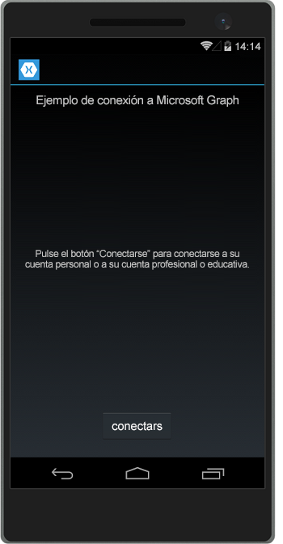
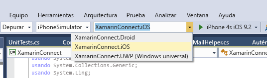

# <a name="get-started-with-microsoft-graph-in-a-xamarin-forms-app"></a><span data-ttu-id="a1753-101">Introducción a Microsoft Graph en una aplicación de Xamarin Forms</span><span class="sxs-lookup"><span data-stu-id="a1753-101">Get started with Microsoft Graph in a Xamarin Forms app</span></span>

> <span data-ttu-id="a1753-p101">**¿Desea compilar aplicaciones para clientes empresariales?** Es posible que la aplicación no funcione si su cliente empresarial activa características de seguridad de movilidad empresarial como el <a href="https://azure.microsoft.com/documentation/articles/active-directory-conditional-access-device-policies/" target="_newtab">acceso condicional al dispositivo</a>. En casos así, es posible que no tenga constancia de esta activación y que sus clientes obtengan errores.</span><span class="sxs-lookup"><span data-stu-id="a1753-p101">**Building apps for enterprise customers?** Your app may not work if your enterprise customer turns on enterprise mobility security features like <a href="https://azure.microsoft.com/documentation/articles/active-directory-conditional-access-device-policies/" target="_newtab">conditional device access</a>. In this case, you may not know and your customers may experience errors.</span></span> 

<span data-ttu-id="a1753-p102">En este artículo se describen las tareas necesarias para obtener un token de acceso desde el punto de conexión de [Azure AD v2.0](https://developer.microsoft.com/graph/docs/concepts/converged_auth) y llamar a Microsoft Graph. Le guiará por el código del [Ejemplo Connect de Microsoft Graph para Xamarin Forms](https://github.com/microsoftgraph/xamarin-csharp-connect-sample) para explicar los conceptos principales que se deben implementar en una aplicación que use Microsoft Graph. El artículo también describe cómo obtener acceso a Microsoft Graph mediante la [Biblioteca cliente de Microsoft Graph](http://www.nuget.org/packages/Microsoft.Graph/).</span><span class="sxs-lookup"><span data-stu-id="a1753-p102">This article describes the tasks required to get an access token from the [Azure AD v2.0 endpoint](https://developer.microsoft.com/graph/docs/concepts/converged_auth) and call Microsoft Graph. It walks you through the code inside the [Microsoft Graph Connect Sample for Xamarin Forms](https://github.com/microsoftgraph/xamarin-csharp-connect-sample) sample to explain the main concepts that you have to implement in an app that uses Microsoft Graph. The article also describes how to access Microsoft Graph by using the [Microsoft Graph Client Library](http://www.nuget.org/packages/Microsoft.Graph/).</span></span>

<span data-ttu-id="a1753-108">Esta es la aplicación que va a crear.</span><span class="sxs-lookup"><span data-stu-id="a1753-108">This is the app you'll create.</span></span>

| <span data-ttu-id="a1753-109">UWP</span><span class="sxs-lookup"><span data-stu-id="a1753-109">UWP</span></span> | <span data-ttu-id="a1753-110">Android</span><span class="sxs-lookup"><span data-stu-id="a1753-110">Android</span></span> | <span data-ttu-id="a1753-111">iOS</span><span class="sxs-lookup"><span data-stu-id="a1753-111">iOS</span></span> |
| --- | ------- | ----|
|  |  |  |

<span data-ttu-id="a1753-p103">**¿No desea compilar una aplicación?** Use el [inicio rápido de Microsoft Graph](https://developer.microsoft.com/graph/quick-start) para ponerlo todo en funcionamiento de manera rápida o descargue el [Ejemplo Connect de Microsoft Graph para Xamarin Forms](https://github.com/microsoftgraph/xamarin-csharp-connect-sample) en el que se basa este artículo.</span><span class="sxs-lookup"><span data-stu-id="a1753-p103">**Don't feel like building an app?** Use the [Microsoft Graph quick start](https://developer.microsoft.com/graph/quick-start) to get up and running fast, or download the [Microsoft Graph Connect Sample for Xamarin Forms](https://github.com/microsoftgraph/xamarin-csharp-connect-sample) that this article is based on.</span></span>

## <a name="prerequisites"></a><span data-ttu-id="a1753-114">Requisitos previos</span><span class="sxs-lookup"><span data-stu-id="a1753-114">Prerequisites</span></span>

<span data-ttu-id="a1753-115">Para comenzar, necesitará:</span><span class="sxs-lookup"><span data-stu-id="a1753-115">To get started, you'll need:</span></span> 

- <span data-ttu-id="a1753-116">Una [cuenta Microsoft](https://www.outlook.com/) o una [cuenta profesional o educativa](https://docs.microsoft.com/es-ES/office/developer-program/office-365-developer-program-faq#account-types)</span><span class="sxs-lookup"><span data-stu-id="a1753-116">A [Microsoft account](https://www.outlook.com/) or a [work or school account](https://docs.microsoft.com/es-ES/office/developer-program/office-365-developer-program-faq#account-types)</span></span>
- <span data-ttu-id="a1753-117">Visual Studio 2015</span><span class="sxs-lookup"><span data-stu-id="a1753-117">Visual Studio 2015</span></span> 
- [<span data-ttu-id="a1753-118">Xamarin para Visual Studio</span><span class="sxs-lookup"><span data-stu-id="a1753-118">Xamarin for Visual Studio</span></span>](https://www.xamarin.com/visual-studio)
- <span data-ttu-id="a1753-119">Windows 10 ([modo de desarrollo habilitado](https://msdn.microsoft.com/library/windows/apps/xaml/dn706236.aspx))</span><span class="sxs-lookup"><span data-stu-id="a1753-119">Windows 10 ([development mode enabled](https://msdn.microsoft.com/library/windows/apps/xaml/dn706236.aspx))</span></span>
- <span data-ttu-id="a1753-p104">[Proyecto inicial de conexión de Microsoft Graph para Xamarin Forms](https://github.com/microsoftgraph/xamarin-csharp-connect-sample/tree/master/starter). Esta plantilla contiene varias clases a las que agregará código. También contiene vistas completas y cadenas de recursos. Para obtener este proyecto, clone o descargue el [Ejemplo Connect de Microsoft Graph para Xamarin Forms](https://github.com/microsoftgraph/xamarin-csharp-connect-sample) y abra la solución **XamarinConnect** de la carpeta **starter**.</span><span class="sxs-lookup"><span data-stu-id="a1753-p104">The [Microsoft Graph Connect Starter Project for Xamarin Forms](https://github.com/microsoftgraph/xamarin-csharp-connect-sample/tree/master/starter). This template contains several classes that you'll add code to. It also contains complete views and resource strings. To get this project, clone or download the [Microsoft Graph Connect Sample for Xamarin Forms](https://github.com/microsoftgraph/xamarin-csharp-connect-sample) and open the **XamarinConnect** solution inside the **starter** folder.</span></span> 

<span data-ttu-id="a1753-124">Si desea ejecutar el proyecto de iOS en este ejemplo, necesitará lo siguiente:</span><span class="sxs-lookup"><span data-stu-id="a1753-124">If you want to run the iOS project in this sample, you'll need the following:</span></span>

- <span data-ttu-id="a1753-125">El SDK de iOS más reciente</span><span class="sxs-lookup"><span data-stu-id="a1753-125">The latest iOS SDK</span></span>
- <span data-ttu-id="a1753-126">La versión de Xcode más reciente</span><span class="sxs-lookup"><span data-stu-id="a1753-126">The latest version of Xcode</span></span>
- <span data-ttu-id="a1753-127">Mac OS X Sierra (10.12) y versiones posteriores</span><span class="sxs-lookup"><span data-stu-id="a1753-127">Mac OS X Sierra(10.12) & above</span></span> 
- [<span data-ttu-id="a1753-128">Xamarin.iOS</span><span class="sxs-lookup"><span data-stu-id="a1753-128">Xamarin.iOS</span></span>](https://docs.microsoft.com/visualstudio/mac/installation)
- <span data-ttu-id="a1753-129">Un [agente Xamarin Mac conectado a Visual Studio](https://developer.xamarin.com/guides/ios/getting_started/installation/windows/connecting-to-mac/)</span><span class="sxs-lookup"><span data-stu-id="a1753-129">A [Xamarin Mac agent connected to Visual Studio](https://developer.xamarin.com/guides/ios/getting_started/installation/windows/connecting-to-mac/)</span></span>


## <a name="register-the-app"></a><span data-ttu-id="a1753-130">Registrar la aplicación</span><span class="sxs-lookup"><span data-stu-id="a1753-130">Register the app</span></span>
 
1. <span data-ttu-id="a1753-131">Inicie sesión en el [Portal de registro de aplicaciones](https://apps.dev.microsoft.com/) mediante su cuenta personal, profesional o educativa.</span><span class="sxs-lookup"><span data-stu-id="a1753-131">Sign into the [App Registration Portal](https://apps.dev.microsoft.com/) using either your personal or work or school account.</span></span>
2. <span data-ttu-id="a1753-132">Seleccione **Agregar una aplicación**.</span><span class="sxs-lookup"><span data-stu-id="a1753-132">Select **Add an app**.</span></span>
3. <span data-ttu-id="a1753-133">Escriba un nombre para la aplicación y seleccione **Crear**.</span><span class="sxs-lookup"><span data-stu-id="a1753-133">Enter a name for the app, and select **Create**.</span></span>
    
    <span data-ttu-id="a1753-134">Se muestra la página de registro, indicando las propiedades de la aplicación.</span><span class="sxs-lookup"><span data-stu-id="a1753-134">The registration page displays, listing the properties of your app.</span></span>
 
4. <span data-ttu-id="a1753-135">En **Plataformas**, seleccione **Agregar plataforma**.</span><span class="sxs-lookup"><span data-stu-id="a1753-135">Under **Platforms**, select **Add platform**.</span></span>
5. <span data-ttu-id="a1753-136">Seleccione **Aplicación nativa**.</span><span class="sxs-lookup"><span data-stu-id="a1753-136">Select **Native Application**.</span></span>
6. <span data-ttu-id="a1753-p105">Copie el valor del identificador de la aplicación y el valor personalizado redirección URI (en el encabezado **Aplicación nativa** encabezado) que se crea automáticamente cuando agrega la plataforma de **Aplicación nativa**. Este identificador URI debe contener el valor de identificador de la aplicación y estar en este formulario: `msal[Application Id]://auth` Deberá escribir estos valores en la aplicación de ejemplo.</span><span class="sxs-lookup"><span data-stu-id="a1753-p105">Copy the Application Id value and the Custom Redirect URI value (under the **Native Application** header) that was created for you when you added the **Native Application** platform. This URI should contain your Application Id value and be in this form: `msal[Application Id]://auth` You'll need to enter these values into the sample app.</span></span>

    <span data-ttu-id="a1753-139">El id. de la aplicación es un identificador único para su aplicación.</span><span class="sxs-lookup"><span data-stu-id="a1753-139">The app id is a unique identifier for your app.</span></span> 

7. <span data-ttu-id="a1753-140">Seleccione **Guardar**.</span><span class="sxs-lookup"><span data-stu-id="a1753-140">Select **Save**.</span></span>

## <a name="configure-the-project"></a><span data-ttu-id="a1753-141">Configurar el proyecto</span><span class="sxs-lookup"><span data-stu-id="a1753-141">Configure the project</span></span>

1. <span data-ttu-id="a1753-142">Abra el archivo de la solución para el proyecto inicial en Visual Studio.</span><span class="sxs-lookup"><span data-stu-id="a1753-142">Open the solution file for the starter project in Visual Studio.</span></span>
2. <span data-ttu-id="a1753-p106">Abra el archivo **App.cs** del proyecto **XamarinConnect (Portable)** y localice el campo `ClientId`. Reemplace el marcador de posición identificador de la aplicación por el identificador de la aplicación que haya registrado.</span><span class="sxs-lookup"><span data-stu-id="a1753-p106">Open the **App.cs** file inside the **XamarinConnect (Portable)** project and locate the `ClientId` field. Replace the application ID placeholder with the application id of the app you registered.</span></span>

    ```
    public static string ClientID = "ENTER_YOUR_CLIENT_ID";
    public static string RedirectUri = "msal" + ClientID + "://auth";
    public static string[] Scopes = { "User.Read", "Mail.Send", "Files.ReadWrite" };
    ```
    <span data-ttu-id="a1753-p107">El valor `Scopes` almacena los ámbitos de permisos de Microsoft Graph que la aplicación deberá solicitar cuando el usuario se autentique. Tenga en cuenta que el constructor de clases `App` usa el valor ClientID para crear una instancia de la clase `PublicClientApplication` de MSAL. Más adelante, usará esta clase para autenticar el usuario.</span><span class="sxs-lookup"><span data-stu-id="a1753-p107">The `Scopes` value stores the Microsoft Graph permission scopes that the app will need to request when the user authenticates. Note that the `App` class constructor uses the ClientID value to instantiate an instance of the MSAL `PublicClientApplication` class. You'll use this class later to authenticate the user.</span></span>
    
    ```
    IdentityClientApp = new PublicClientApplication(ClientID);
    ```

3. <span data-ttu-id="a1753-p108">Abra el archivo UserDetailsClient.iOS\info.plist en un editor de texto. Lamentablemente no puede editar este archivo en Visual Studio. Busque el elemento `<string>msalENTER_YOUR_CLIENT_ID</string>` en `CFBundleURLSchemes` clave.</span><span class="sxs-lookup"><span data-stu-id="a1753-p108">Open the UserDetailsClient.iOS\info.plist file in a text editor. Unfortunately you can't edit this file in Visual Studio. Locate the `<string>msalENTER_YOUR_CLIENT_ID</string>` element under `CFBundleURLSchemes` key.</span></span>

4. <span data-ttu-id="a1753-p109">Reemplace `ENTER_YOUR_CLIENT_ID` por el valor del id. de aplicación que ha obtenido al registrar la aplicación. Asegúrese de conservar `msal` antes del identificador de aplicación. El valor de cadena resultante debe parecerse al siguiente: `<string>msal[application id]</string>`.</span><span class="sxs-lookup"><span data-stu-id="a1753-p109">Replace `ENTER_YOUR_CLIENT_ID` with the application id value that you got when you registered your app. Be sure to retain `msal` before the application id. The resulting string value should look like this: `<string>msal[application id]</string>`.</span></span>

5. <span data-ttu-id="a1753-p110">Abra el archivo UserDetailsClient.Droid\Properties\AndroidManifest.xml. Busque este elemento: `<data android:scheme="msalENTER_YOUR_CLIENT_ID" android:host="auth" />`.</span><span class="sxs-lookup"><span data-stu-id="a1753-p110">Open the UserDetailsClient.Droid\Properties\AndroidManifest.xml file. Locate this element: `<data android:scheme="msalENTER_YOUR_CLIENT_ID" android:host="auth" />`.</span></span>

6. <span data-ttu-id="a1753-p111">Reemplace `ENTER_YOUR_CLIENT_ID` por el valor del id. de aplicación que ha obtenido al registrar la aplicación. Asegúrese de conservar `msal` antes del identificador de aplicación. El valor de cadena resultante debe parecerse al siguiente: `<data android:scheme="msal[application id]" android:host="auth" />`.</span><span class="sxs-lookup"><span data-stu-id="a1753-p111">Replace `ENTER_YOUR_CLIENT_ID` with the application id value that you got when you registered your app. Be sure to retain `msal` before the application id. The resulting string value should look like this: `<data android:scheme="msal[application id]" android:host="auth" />`.</span></span>

## <a name="send-an-email-with-microsoft-graph"></a><span data-ttu-id="a1753-157">Enviar un correo electrónico con Microsoft Graph</span><span class="sxs-lookup"><span data-stu-id="a1753-157">Send an email with Microsoft Graph</span></span>

<span data-ttu-id="a1753-158">Abra el archivo MailHelper.cs en su proyecto inicial.</span><span class="sxs-lookup"><span data-stu-id="a1753-158">Open the MailHelper.cs file in your starter project.</span></span> <span data-ttu-id="a1753-159">Este archivo contiene código que crea y envía correos electrónicos.</span><span class="sxs-lookup"><span data-stu-id="a1753-159">This file contains the code that constructs and sends an email.</span></span> <span data-ttu-id="a1753-160">Consiste en un único método (``ComposeAndSendMailAsync``) que crea y envía una solicitud POST al punto de conexión **https://graph.microsoft.com/v1.0/me/microsoft.graph.SendMail**.</span><span class="sxs-lookup"><span data-stu-id="a1753-160">The MailHelper.cs file contains the code that constructs and sends an email. It consists of a single method --  -- that constructs and sends a POST request to the https://graph.microsoft.com/v1.0/me/microsoft.graph.SendMail endpoint.</span></span> 

<span data-ttu-id="a1753-p113">El método ``ComposeAndSendMailAsync`` toma tres valores de cadena (``subject``, ``bodyContent`` y ``recipients``) que se le pasan mediante el archivo MainPage.xaml.cs. Las cadenas ``subject`` y ``bodyContent`` se almacenan, junto con todas las demás cadenas de la interfaz de usuario, en el archivo AppResources.resx. La cadena ``recipients`` proviene del cuadro de dirección en la interfaz de la aplicación.</span><span class="sxs-lookup"><span data-stu-id="a1753-p113">The ``ComposeAndSendMailAsync`` method takes three string values -- ``subject``, ``bodyContent``, and ``recipients`` -- that are passed to it by the MainPage.xaml.cs file. The ``subject`` and ``bodyContent`` strings are stored, along with all other UI strings, in the AppResources.resx file. The ``recipients`` string comes from the address box in the app's interface.</span></span> 

<span data-ttu-id="a1753-164">**Usar declaraciones**</span><span class="sxs-lookup"><span data-stu-id="a1753-164">**Using declarations**</span></span>

<span data-ttu-id="a1753-165">Asegúrese de que tiene estas declaraciones al principio del archivo:</span><span class="sxs-lookup"><span data-stu-id="a1753-165">Make sure you have these declarations at the top of the file:</span></span>

```
using System;
using System.Collections.Generic;
using System.Linq;
using System.Reflection;
using System.Threading.Tasks;
using Microsoft.Graph;
```

<span data-ttu-id="a1753-p114">La primera tarea dentro del método ``ComposeAndSendMailAsync`` consiste en obtener la fotografía del usuario actual de Microsoft Graph. Esta línea llama al método sin stub `GetCurrentUserPhotoStreamAsync`:</span><span class="sxs-lookup"><span data-stu-id="a1753-p114">The first task inside the ``ComposeAndSendMailAsync`` method is to get the current user's photo from Microsoft Graph. This line calls the stubbed-out `GetCurrentUserPhotoStreamAsync` method:</span></span>

```
            // Get current user photo
            Stream photoStream = await GetCurrentUserPhotoStreamAsync();
```

<span data-ttu-id="a1753-168">El método `GetCurrentUserPhotoStreamAsync` completo tiene un aspecto similar a este:</span><span class="sxs-lookup"><span data-stu-id="a1753-168">This is what the complete `GetCurrentUserPhotoStreamAsync` method looks like:</span></span>

```
        // Gets the stream content of the signed-in user's photo. 
        // This snippet doesn't work with consumer accounts.
        public async Task<Stream> GetCurrentUserPhotoStreamAsync()
        {
            Stream currentUserPhotoStream = null;

            try
            {
                var graphClient = AuthenticationHelper.GetAuthenticatedClient();
                currentUserPhotoStream = await graphClient.Me.Photo.Content.Request().GetAsync();

            }

            // If the user account is MSA (not work or school), the service will throw an exception.
            catch (ServiceException)
            {
                return null;
            }

            return currentUserPhotoStream;

        }
```

<span data-ttu-id="a1753-169">Si el usuario no tiene ninguna foto, esta lógica obtiene otro archivo de imagen que se haya incluido en el proyecto:</span><span class="sxs-lookup"><span data-stu-id="a1753-169">If the user doesn't have a photo, this logic gets another image file that has been included with the project:</span></span>

```
            // If the user doesn't have a photo, or if the user account is MSA, we use a default photo

            if (photoStream == null)
            {
                var assembly = typeof(MailHelper).GetTypeInfo().Assembly;
                photoStream = assembly.GetManifestResourceStream("XamarinConnect.test.jpg");
            }
```

<span data-ttu-id="a1753-170">Ahora que tenemos una secuencia de imagen, podemos cargar el archivo en OneDrive llamando al método sin stub `UploadFileToOneDriveAsync`:</span><span class="sxs-lookup"><span data-stu-id="a1753-170">Now that we have an image stream, we can upload the file to OneDrive by calling the stubbed-out `UploadFileToOneDriveAsync` method:</span></span>

```
            MemoryStream photoStreamMS = new MemoryStream();
            // Copy stream to MemoryStream object so that it can be converted to byte array.
            photoStream.CopyTo(photoStreamMS);

            DriveItem photoFile = await UploadFileToOneDriveAsync(photoStreamMS.ToArray());
```

<span data-ttu-id="a1753-171">El método `UploadFileToOneDriveAsync` completo tiene un aspecto similar a este:</span><span class="sxs-lookup"><span data-stu-id="a1753-171">This is what the complete `UploadFileToOneDriveAsync` method looks like:</span></span>

```
        // Uploads the specified file to the user's root OneDrive directory.
        public async Task<DriveItem> UploadFileToOneDriveAsync(byte[] file)
        {
            DriveItem uploadedFile = null;

            try
            {
                var graphClient = AuthenticationHelper.GetAuthenticatedClient();
                MemoryStream fileStream = new MemoryStream(file);
                uploadedFile = await graphClient.Me.Drive.Root.ItemWithPath("me.png").Content.Request().PutAsync<DriveItem>(fileStream);

            }


            catch (ServiceException)
            {
                return null;
            }

            return uploadedFile;
        }
```

<span data-ttu-id="a1753-172">También podemos usar esta secuencia para crear un objeto `MessageAttachmentsCollectionPage` que se pueda pasar junto al mensaje:</span><span class="sxs-lookup"><span data-stu-id="a1753-172">We can also use this stream to create a `MessageAttachmentsCollectionPage` object that we can pass along with the message:</span></span>

```
            MessageAttachmentsCollectionPage attachments = new MessageAttachmentsCollectionPage();
            attachments.Add(new FileAttachment
            {
                ODataType = "#microsoft.graph.fileAttachment",
                ContentBytes = photoStreamMS.ToArray(),
                ContentType = "image/png",
                Name = "me.png"
            });
```

<span data-ttu-id="a1753-p115">Podemos obtener un vínculo para compartir para el archivo recién cargado en OneDrive llamando al método sin stub `GetSharingLinkAsync`. La cadena `bodyContent` contiene un marcador de posición para el vínculo para compartir:</span><span class="sxs-lookup"><span data-stu-id="a1753-p115">We can get a sharing link for the newly uploaded OneDrive file by calling the stubbed-out `GetSharingLinkAsync` method. The `bodyContent` string contains a placeholder for the sharing link:</span></span>

```
            // Get the sharing link and insert it into the message body.
            Permission sharingLink = await GetSharingLinkAsync(photoFile.Id);
            string bodyContentWithSharingLink = String.Format(bodyContent, sharingLink.Link.WebUrl);
```

<span data-ttu-id="a1753-175">El método `GetSharingLinkAsync` completo tiene un aspecto similar a este:</span><span class="sxs-lookup"><span data-stu-id="a1753-175">This is what the complete `GetSharingLinkAsync` method looks like:</span></span>

```
        public static async Task<Permission> GetSharingLinkAsync(string Id)
        {
            Permission permission = null;

            try
            {
                var graphClient = AuthenticationHelper.GetAuthenticatedClient();
                permission = await graphClient.Me.Drive.Items[Id].CreateLink("view").Request().PostAsync();
            }

            catch (ServiceException)
            {
                return null;
            }

            return permission;
        }
```

<span data-ttu-id="a1753-176">Ya que el usuario puede pasar potencialmente más de una dirección, la siguiente tarea es dividir la cadena ``recipients`` en un conjunto de objetos `EmailAddress` que pueden usarse a continuación para crear la lista de objetos `Recipients` que se pasará en el cuerpo POST de la solicitud:</span><span class="sxs-lookup"><span data-stu-id="a1753-176">Since the user can potentially pass more than one address, the next task is to split the ``recipients`` string into a set of `EmailAddress` objects that can then be used to construct the list of `Recipients` objects that will be passed in the POST body of the request:</span></span>

```
            // Prepare the recipient list
            string[] splitter = { ";" };
            var splitRecipientsString = recipients.Split(splitter, StringSplitOptions.RemoveEmptyEntries);
            List<Recipient> recipientList = new List<Recipient>();

            foreach (string recipient in splitRecipientsString)
            {
                recipientList.Add(new Recipient { EmailAddress = new EmailAddress { Address = recipient.Trim() } });
            }
```

<span data-ttu-id="a1753-p116">La última tarea consiste en crear un objeto `Message` y enviarlo al punto de conexión **me/microsoft.graph.SendMail** a través del `GraphServiceClient`. Ya que la cadena ``bodyContent`` es un documento HTML, la solicitud establece el valor **ContentType** a HTML.</span><span class="sxs-lookup"><span data-stu-id="a1753-p116">The last task is to construct a `Message` object and send it to the **me/microsoft.graph.SendMail** endpoint through the `GraphServiceClient`. Since the ``bodyContent`` string is an HTML document, the request sets the **ContentType** value to HTML.</span></span>

```
            try
            {
                var graphClient = AuthenticationHelper.GetAuthenticatedClient();

                var email = new Message
                {
                    Body = new ItemBody
                    {
                        Content = bodyContentWithSharingLink,
                        ContentType = BodyType.Html,
                    },
                    Subject = subject,
                    ToRecipients = recipientList,
                    Attachments = attachments
                };

                try
                {
                    await graphClient.Me.SendMail(email, true).Request().PostAsync();
                }
                catch (ServiceException exception)
                {
                    throw new Exception("We could not send the message: " + exception.Error == null ? "No error message returned." : exception.Error.Message);
                }


            }

            catch (Exception e)
            {
                throw new Exception("We could not send the message: " + e.Message);
            }
```

<span data-ttu-id="a1753-179">La clase completa tendrá este aspecto:</span><span class="sxs-lookup"><span data-stu-id="a1753-179">The complete class will look like this:</span></span>

```
    public class MailHelper
    {
        /// <summary>
        /// Compose and send a new email.
        /// </summary>
        /// <param name="subject">The subject line of the email.</param>
        /// <param name="bodyContent">The body of the email.</param>
        /// <param name="recipients">A semicolon-separated list of email addresses.</param>
        /// <returns></returns>
        public async Task ComposeAndSendMailAsync(string subject,
                                                            string bodyContent,
                                                            string recipients)
        {

            // Get current user photo
            Stream photoStream = await GetCurrentUserPhotoStreamAsync();


            // If the user doesn't have a photo, or if the user account is MSA, we use a default photo

            if (photoStream == null)
            {
                var assembly = typeof(MailHelper).GetTypeInfo().Assembly;
                photoStream = assembly.GetManifestResourceStream("XamarinConnect.test.jpg");
            }

            MemoryStream photoStreamMS = new MemoryStream();
            // Copy stream to MemoryStream object so that it can be converted to byte array.
            photoStream.CopyTo(photoStreamMS);

            DriveItem photoFile = await UploadFileToOneDriveAsync(photoStreamMS.ToArray());

            MessageAttachmentsCollectionPage attachments = new MessageAttachmentsCollectionPage();
            attachments.Add(new FileAttachment
            {
                ODataType = "#microsoft.graph.fileAttachment",
                ContentBytes = photoStreamMS.ToArray(),
                ContentType = "image/png",
                Name = "me.png"
            });

            // Get the sharing link and insert it into the message body.
            Permission sharingLink = await GetSharingLinkAsync(photoFile.Id);
            string bodyContentWithSharingLink = String.Format(bodyContent, sharingLink.Link.WebUrl);


            // Prepare the recipient list
            string[] splitter = { ";" };
            var splitRecipientsString = recipients.Split(splitter, StringSplitOptions.RemoveEmptyEntries);
            List<Recipient> recipientList = new List<Recipient>();

            foreach (string recipient in splitRecipientsString)
            {
                recipientList.Add(new Recipient { EmailAddress = new EmailAddress { Address = recipient.Trim() } });
            }

            try
            {
                var graphClient = AuthenticationHelper.GetAuthenticatedClient();

                var email = new Message
                {
                    Body = new ItemBody
                    {
                        Content = bodyContentWithSharingLink,
                        ContentType = BodyType.Html,
                    },
                    Subject = subject,
                    ToRecipients = recipientList,
                    Attachments = attachments
                };

                try
                {
                    await graphClient.Me.SendMail(email, true).Request().PostAsync();
                }
                catch (ServiceException exception)
                {
                    throw new Exception("We could not send the message: " + exception.Error == null ? "No error message returned." : exception.Error.Message);
                }


            }

            catch (Exception e)
            {
                throw new Exception("We could not send the message: " + e.Message);
            }
        }

        // Gets the stream content of the signed-in user's photo. 
        // This snippet doesn't work with consumer accounts.
        public async Task<Stream> GetCurrentUserPhotoStreamAsync()
        {
            Stream currentUserPhotoStream = null;

            try
            {
                var graphClient = AuthenticationHelper.GetAuthenticatedClient();
                currentUserPhotoStream = await graphClient.Me.Photo.Content.Request().GetAsync();

            }

            // If the user account is MSA (not work or school), the service will throw an exception.
            catch (ServiceException)
            {
                return null;
            }

            return currentUserPhotoStream;

        }

        // Uploads the specified file to the user's root OneDrive directory.
        public async Task<DriveItem> UploadFileToOneDriveAsync(byte[] file)
        {
            DriveItem uploadedFile = null;

            try
            {
                var graphClient = AuthenticationHelper.GetAuthenticatedClient();
                MemoryStream fileStream = new MemoryStream(file);
                uploadedFile = await graphClient.Me.Drive.Root.ItemWithPath("me.png").Content.Request().PutAsync<DriveItem>(fileStream);

            }


            catch (ServiceException)
            {
                return null;
            }

            return uploadedFile;
        }

        public static async Task<Permission> GetSharingLinkAsync(string Id)
        {
            Permission permission = null;

            try
            {
                var graphClient = AuthenticationHelper.GetAuthenticatedClient();
                permission = await graphClient.Me.Drive.Items[Id].CreateLink("view").Request().PostAsync();
            }

            catch (ServiceException)
            {
                return null;
            }

            return permission;
        }


    }
``` 

<span data-ttu-id="a1753-180">Ya ha llevado a cabo los tres pasos requeridos para interactuar con Microsoft Graph: el registro de la aplicación, la autenticación del usuario y la creación de una solicitud.</span><span class="sxs-lookup"><span data-stu-id="a1753-180">You've now performed the three steps required for interacting with Microsoft Graph: app registration, user authentication, and making a request.</span></span> 

## <a name="run-the-app"></a><span data-ttu-id="a1753-181">Ejecutar la aplicación</span><span class="sxs-lookup"><span data-stu-id="a1753-181">Run the app</span></span>
1. <span data-ttu-id="a1753-p117">Seleccione el proyecto que desee ejecutar. Si selecciona la opción de plataforma universal de Windows, puede ejecutar el ejemplo en el equipo local. Si desea ejecutar el proyecto iOS, necesitará conectarse a un [Mac que tenga las herramientas Xamarin](https://developer.xamarin.com/guides/ios/getting_started/installation/windows/connecting-to-mac/) instaladas. (También puede abrir esta solución en Xamarin Studio en un Mac y ejecutar el ejemplo directamente desde allí). Puede usar el [Emulador de Visual Studio para Android](https://www.visualstudio.com/features/msft-android-emulator-vs.aspx) si desea ejecutar el proyecto de Android.</span><span class="sxs-lookup"><span data-stu-id="a1753-p117">Select the project that you want to run. If you select the Universal Windows Platform option, you can run the sample on the local machine. If you want to run the iOS project, you'll need to connect to a [Mac that has the Xamarin tools](https://developer.xamarin.com/guides/ios/getting_started/installation/windows/connecting-to-mac/) installed on it. (You can also open this solution in Xamarin Studio on a Mac and run the sample directly from there.) You can use the [Visual Studio Emulator for Android](https://www.visualstudio.com/features/msft-android-emulator-vs.aspx) if you want to run the Android project.</span></span> 

    <span data-ttu-id="a1753-186"></span><span class="sxs-lookup"><span data-stu-id="a1753-186"></span></span>

2. <span data-ttu-id="a1753-p118">Pulse F5 para compilar y depurar. Ejecute la solución e inicie sesión con su cuenta personal, profesional o educativa.</span><span class="sxs-lookup"><span data-stu-id="a1753-p118">Press F5 to build and debug. Run the solution and sign in with either your personal or work or school account.</span></span>
    > <span data-ttu-id="a1753-189">**Nota** Es posible que tenga que abrir el administrador de configuración de compilación para asegurarse de que los pasos de compilación e implementación están seleccionados para el proyecto UWP.</span><span class="sxs-lookup"><span data-stu-id="a1753-189">**Note** You might have to open the Build Configuration Manager to make sure that the Build and Deploy steps are selected for the UWP project.</span></span> 

3. <span data-ttu-id="a1753-190">Inicie sesión con su cuenta personal, profesional o educativa y conceda los permisos solicitados.</span><span class="sxs-lookup"><span data-stu-id="a1753-190">Sign in with your personal or work or school account and grant the requested permissions.</span></span>

4. <span data-ttu-id="a1753-p119">Elija el botón **Enviar correo**. Cuando se envía el correo, se muestra un mensaje de Operación correcta. Este correo incluye la foto como un archivo adjunto y proporciona un vínculo para compartir al archivo cargado en OneDrive.</span><span class="sxs-lookup"><span data-stu-id="a1753-p119">Choose the **Send mail** button. When the mail is sent, a Success message is displayed. This mail message includes the photo as an attachment and also provides a sharing link to the uploaded file in OneDrive.</span></span>

## <a name="next-steps"></a><span data-ttu-id="a1753-194">Siguientes pasos</span><span class="sxs-lookup"><span data-stu-id="a1753-194">Next steps</span></span>
- <span data-ttu-id="a1753-195">Pruebe la API de REST mediante el [Probador de Graph](https://developer.microsoft.com/graph/graph-explorer).</span><span class="sxs-lookup"><span data-stu-id="a1753-195">Try out the REST API using the [Graph explorer](https://developer.microsoft.com/graph/graph-explorer).</span></span>
- <span data-ttu-id="a1753-196">Busque ejemplos de operaciones comunes en la [Biblioteca de fragmentos de código del SDK de Microsoft Graph para Xamarin.Forms](https://github.com/microsoftgraph/xamarin-csharp-snippets-sample) o explore el resto de nuestros [ejemplos de Xamarin](https://github.com/microsoftgraph?utf8=%E2%9C%93&query=xamarin) en GitHub.</span><span class="sxs-lookup"><span data-stu-id="a1753-196">Find examples of common operations in the [Microsoft Graph SDK Snippets Library for Xamarin.Forms](https://github.com/microsoftgraph/xamarin-csharp-snippets-sample), or explore our other [Xamarin samples](https://github.com/microsoftgraph?utf8=%E2%9C%93&query=xamarin) on GitHub.</span></span>

## <a name="see-also"></a><span data-ttu-id="a1753-197">Recursos adicionales</span><span class="sxs-lookup"><span data-stu-id="a1753-197">See also</span></span>
- [<span data-ttu-id="a1753-198">Biblioteca cliente .NET de Microsoft Graph</span><span class="sxs-lookup"><span data-stu-id="a1753-198">Microsoft Graph .NET Client Library</span></span>](https://github.com/microsoftgraph/msgraph-sdk-dotnet)
- [<span data-ttu-id="a1753-199">Protocolos de Azure AD v2.0</span><span class="sxs-lookup"><span data-stu-id="a1753-199">Azure AD v2.0 protocols</span></span>](https://azure.microsoft.com/documentation/articles/active-directory-v2-protocols/)
- [<span data-ttu-id="a1753-200">Tokens de Azure AD v2.0</span><span class="sxs-lookup"><span data-stu-id="a1753-200">Azure AD v2.0 tokens</span></span>](https://azure.microsoft.com/documentation/articles/active-directory-v2-tokens/)
