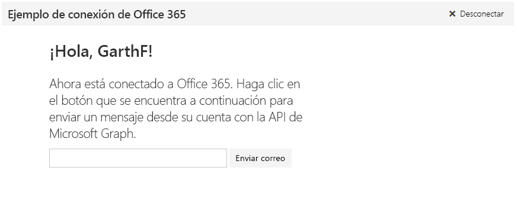

# <a name="get-started-with-microsoft-graph-in-a-python-app"></a>Introducción a Microsoft Graph en una aplicación de Python 

En este artículo, se describen las tareas necesarias para obtener un token de acceso desde Azure AD y llamar a Microsoft Graph. Le muestra los pasos para la compilación del [Ejemplo Connect de Microsoft Graph para Python](https://github.com/microsoftgraph/python3-connect-rest-sample) y explica los conceptos principales que implementará para usar la API de Microsoft Graph. El artículo describe cómo obtener acceso a Microsoft Graph mediante llamadas de REST directas.



##  <a name="prerequisites"></a>Requisitos previos

* [Python 3.5.2](https://www.python.org/downloads/)
* [Flask-OAuthlib](https://github.com/lepture/flask-oauthlib)
* [Flask-Script 0.4](http://flask-script.readthedocs.io/en/latest/)
* Una [cuenta de Microsoft](https://www.outlook.com/) o una [cuenta de Office 365 para empresas](https://msdn.microsoft.com/en-us/office/office365/howto/setup-development-environment#bk_Office365Account)
* [Ejemplo Connect de Microsoft Graph para Python](https://github.com/microsoftgraph/python3-connect-rest-sample)

## <a name="register-the-application-in-azure-active-directory"></a>Registrar la aplicación en Azure Active Directory

En primer lugar, deberá registrar la aplicación y establecer los permisos para usar Microsoft Graph. Esto permite a los usuarios iniciar sesión en la aplicación con cuentas profesionales o educativas.

## <a name="register-the-application"></a>Registrar la aplicación

Registre una aplicación en el Portal de registro de aplicaciones de Microsoft. Esta acción generará el ID y la contraseña de aplicación que usará para configurar la aplicación para la autenticación.

1. Inicie sesión en el [Portal de registro de aplicaciones de Microsoft](https://apps.dev.microsoft.com/) mediante su cuenta personal, profesional o educativa.

2. Seleccione **Agregar una aplicación**.

3. Escriba un nombre para la aplicación y seleccione **Crear aplicación**.

    Se muestra la página de registro, indicando las propiedades de la aplicación.

4. Copie el identificador de la aplicación. Se trata del identificador único para su aplicación.

5. En **Secretos de aplicación**, seleccione **Generar nueva contraseña**. Copie el secreto de aplicación del cuadro de diálogo **Nueva contraseña generada**.

    Deberá usar el ID y el secreto de aplicación para configurar la aplicación.

6. En **Plataformas**, elija **Agregar plataforma** > **Web**.

7. Asegúrese de que la casilla **Permitir flujo implícito** está seleccionada y escriba *http://localhost:5000/login/authorized* como URI de redireccionamiento.

    La opción **Permitir flujo implícito**habilita el flujo híbrido de OpenID Connect. Durante la autenticación, esto permite que la aplicación reciba tanto la información de inicio de sesión (el **id_token**) como los artefactos (en este caso, un código de autorización) que la aplicación usa para obtener un token de acceso.

    El URI de redireccionamiento *http://localhost:5000/login/authorized* es el valor con el que el middleware de OmniAuth se ha configurado para usar una vez que haya procesado la solicitud de autenticación.

8. Elija **Guardar**.

## <a name="create-oauth-client"></a>Crear el cliente de OAuth

La aplicación debe registrar una instancia del cliente de Flask OAuth que utilizará para iniciar el flujo de OAuth y obtener un token de acceso. 

En el ejemplo Connect, el siguiente código (ubicado en [*connect/__init__.py*](https://github.com/microsoftgraph/python3-connect-rest-sample/blob/master/connect/__init__.py)) registra el cliente con todos los valores necesarios, incluidos el identificador de aplicación (client_id), el secreto de aplicación (client_secret) y la dirección URL de autorización usada para autenticar al usuario.

```python
    # Put your consumer key and consumer secret into a config file
    # and don't check it into github!!
    microsoft = oauth.remote_app(
        'microsoft',
        consumer_key=client_id,
        consumer_secret=client_secret,
        request_token_params={'scope': 'User.Read Mail.Send'},
        base_url='https://graph.microsoft.com/v1.0/',
        request_token_url=None,
        access_token_method='POST',
        access_token_url='https://login.microsoftonline.com/common/oauth2/v2.0/token',
        authorize_url='https://login.microsoftonline.com/common/oauth2/v2.0/authorize'
    )
```

<!--<a name="authCode"></a>-->
## <a name="receive-an-authorization-code-in-your-reply-url-page"></a>Recibir un código de autorización en la página de la dirección URL de respuesta

Después de que el usuario inicie sesión, el explorador le redirige a la dirección URL de respuesta, la ruta ```login/authorized``` en [*connect/__init__.py*](https://github.com/microsoftgraph/python3-connect-rest-sample/blob/master/connect/__init__.py), con un token de acceso en la respuesta. En el ejemplo se almacena el token como una variable de sesión.

```python
    @app.route('/login/authorized')
    def authorized():
        response = microsoft.authorized_response()
    
        if response is None:
            return "Access Denied: Reason=%s\nError=%s" % (
                request.args['error'], 
                request.args['error_description']
            )
    
        # Check response for state
        if str(session['state']) != str(request.args['state']):
            raise Exception('State has been messed with, end authentication')
        # Remove state session variable to prevent reuse.
        session['state'] = ""
            
        # Okay to store this in a local variable, encrypt if it's going to client
        # machine or database. Treat as a password. 
        session['microsoft_token'] = (response['access_token'], '')
        # Store the token in another session variable for easy access
        session['access_token'] = response['access_token']
        meResponse = microsoft.get('me')
        meData = json.dumps(meResponse.data)
        me = json.loads(meData)
        userName = me['displayName']
        userEmailAddress = me['userPrincipalName']
        session['alias'] = userName
        session['userEmailAddress'] = userEmailAddress
        return redirect('main')
```

<!--<a name="request"></a>-->
## <a name="use-the-access-token-in-a-request-to-the-microsoft-graph-api"></a>Usar el token de acceso en una solicitud a la API de Microsoft Graph

El token de acceso permite que su aplicación cree solicitudes autenticadas en la API de Microsoft Graph. Su aplicación debe anexar el token de acceso al encabezado de **autorización** de cada solicitud.

En el ejemplo Connect, se envía un correo electrónico usando el punto de conexión ```me/microsoft.graph.sendMail``` en la API de Microsoft Graph. El código está en la función ```call_sendMail_endpoint``` del archivo [*connect/graph_service.py*](https://github.com/microsoftgraph/python3-connect-rest-sample/blob/master/connect/graph_service.py). Este es el código que muestra cómo anexar el código de acceso al encabezado de autorización.

```python
    # Set request headers.
    headers = { 
      'User-Agent' : 'python_tutorial/1.0',
      'Authorization' : 'Bearer {0}'.format(access_token),
      'Accept' : 'application/json',
      'Content-Type' : 'application/json'
    }
```

> **Nota**: La solicitud también debe enviar un encabezado **Content-Type** con un valor que acepte la API de Graph. Por ejemplo, `application/json`.

La API de Microsoft Graph es una interfaz unificadora y muy avanzada que permite trabajar con todos los tipos de datos de Microsoft. Consulte la referencia de la API para ver todas las posibilidades que ofrece Microsoft Graph.